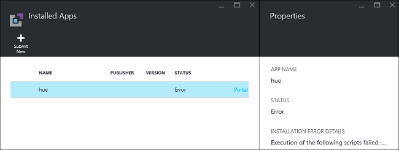
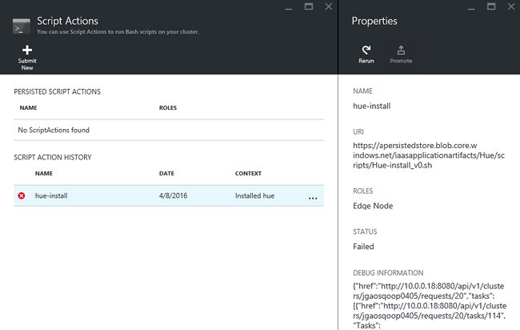

<properties
   	pageTitle="Install Hadoop applications on HDInsight | Microsoft Azure"
   	description="Learn how to install HDInsight applications on HDInsight applications."
   	services="hdinsight"
   	documentationCenter=""
   	authors="mumian"
   	manager="paulettm"
   	editor="cgronlun"
	tags="azure-portal"/>

<tags
   	ms.service="hdinsight"
   	ms.devlang="na"
   	ms.topic="hero-article"
   	ms.tgt_pltfrm="na"
   	ms.workload="big-data"
   	ms.date="06/29/2016"
   	ms.author="jgao"/>

# Install custom HDInsight applications

An HDInsight application is an application that users can install on a Linux-based HDInsight cluster.  These applications can be developed by Microsoft, independent software vendors (ISV) or by yourself. In this article, you will learn how to install an HDInsight application that has not been published to the Azure portal on HDInsight. The application you will install is [Hue](http://gethue.com/). 

Other related articles:

- [Install HDInsight applications](hdinsight-apps-install-applications.md): Learn how to install an HDInsight application to your clusters.
- [Publish HDInsight applications](hdinsight-apps-publish-applications.md): Learn how to publish your custom HDInsight applications to Azure Marketplace.
- [MSDN: Install an HDInsight application](https://msdn.microsoft.com/library/mt706515.aspx): Learn how to define HDInsight applications.

 
## Prerequisites

If you want to install HDInsight applications on an existing HDInsight cluster, you must have an HDInsight cluster. To create one, see [Create clusters](hdinsight-hadoop-linux-tutorial-get-started.md#create-cluster). You can also install HDInsight applications when you create an HDInsight cluster.

## Install HDInsight applications

HDInsight applications can be installed when you create a cluster or to an existing HDInsight cluster. For defining Azure Resource Manager templates, see [MSDN: Install an HDInsight application](https://msdn.microsoft.com/library/mt706515.aspx).

The files needed for deploying this application (Hue):

- [azuredeploy.json](https://github.com/hdinsight/Iaas-Applications/blob/master/Hue/azuredeploy.json): The Resource Manager template for installing HDInsight application. See [MSDN: Install an HDInsight application](https://msdn.microsoft.com/library/mt706515.aspx) for developing your own Resource Manager template.
- [hue-install_v0.sh](https://github.com/hdinsight/Iaas-Applications/blob/master/Hue/scripts/Hue-install_v0.sh): The Script action being called by the Resource Manager template for configuring the edge node. 
- [hue-binaries.tgz](https://hdiconfigactions.blob.core.windows.net/linuxhueconfigactionv01/hue-binaries-14-04.tgz): The hue binary file being called from hui-install_v0.sh. 
- [hue-binaries-14-04.tgz](https://hdiconfigactions.blob.core.windows.net/linuxhueconfigactionv01/hue-binaries-14-04.tgz): The hue binary file being called from hui-install_v0.sh. 
- [webwasb-tomcat.tar.gz](https://hdiconfigactions.blob.core.windows.net/linuxhueconfigactionv01/webwasb-tomcat.tar.gz): A sample web application (Tomcat) being called from hui-install_v0.sh.

**To install Hue to an existing HDInsight cluster**

1. Click the following image to sign in to Azure and open the Resource Manager template in the Azure Portal. 

    

    This button opens a Resource Manager template on the Azure portal.  The Resource Manager template is located at [https://github.com/hdinsight/Iaas-Applications/tree/master/Hue](https://github.com/hdinsight/Iaas-Applications/tree/master/Hue).  To learn how to write this Resource Manager template, see [MSDN: Install an HDInsight application](https://msdn.microsoft.com/library/mt706515.aspx).
    
2. From the **Parameters** blade, enter the following:

    - **ClusterName**: Enter the name of the cluster where you want to install the application. This cluster must be an existing cluster.
    
3. Click **OK** to save the parameters.
4. From the **Custom deployment** blade, enter **Resource group**.  The resource group is a container that groups the cluster, the dependent storage account and other resources. It is required to use the same resource group as the cluster.
5. Click **Legal terms**, and then click **Create**.
6. Verify the **Pin to dashboard** checkbox is selected, and then click **Create**. You can see the installation status from the tile pinned to the portal dashboard and the portal notification (click the bell icon on the top of the portal).  It takes about 10 minutes to install the application.

**To install Hue while creating a cluster**

1. Click the following image to sign in to Azure and open the Resource Manager template in the Azure Portal. 

    

    This button opens a Resource Manager template on the Azure portal.  The Resource Manager template is located at [https://hditutorialdata.blob.core.windows.net/hdinsightapps/create-linux-based-hadoop-cluster-in-hdinsight.json](https://hditutorialdata.blob.core.windows.net/hdinsightapps/create-linux-based-hadoop-cluster-in-hdinsight.json).  To learn how to write this Resource Manager template, see [MSDN: Install an HDInsight application](https://msdn.microsoft.com/library/mt706515.aspx).

2. Follow the instruction to create cluster and install Hue. For more information on creating HDInsight clusters, see [Create Linux-based Hadoop clusters in HDInsight](hdinsight-hadoop-provision-linux-clusters.md).

In addition to the Azure portal, you can also use [Azure PowerShell](hdinsight-hadoop-create-linux-clusters-arm-templates.md#deploy-with-powershell) and [Azure CLI](hdinsight-hadoop-create-linux-clusters-arm-templates.md#deploy-with-azure-cli) to call Resource Manager templates.

## Validate the installation

You can check the application status on the Azure portal to validate the application installation. In addition, you can also validate all HTTP endpoints came up as expected and the webpage if there is one:

**To open the Hue portal**

1. Sign in to the [Azure portal](https://portal.azure.com).
2. Click **HDInsight Clusters** in the left menu.  If you don't see it, click **Browse**, and then click **HDInsight Clusters**.
3. Click the cluster where you installed the application.
4. From the **Settings** blade, click **Applications** under the **General** category. You shall see **hue** listed in the **Installed Apps** blade.
5. Click **hue** from the list to list the properties.  
6. Click the Webpage link to validate the website; open the HTTP endpoint in a browser to validate the Hue web UI, open the SSH endpoint using [PuTTY](hdinsight-hadoop-linux-use-ssh-windows.md) or other [SSH clients](hdinsight-hadoop-linux-use-ssh-unix.md).
 
## Troubleshoot the installation

You can check the application installation status from the portal notification (Click the bell icon on the top of the portal). 

If an application installation failed, you can see the error messages and debug information from 3 places:

- HDInsight Applications: general error information.

    Open the cluster from the portal, and click Applications from the Settings blade:

    

- HDInsight script action: If the HDInsight Applications' error message indicates a script action failure, more details about the script failure will be presented in the script actions pane.

    Click Script Action from the Settings blade. Script action history shows the error messages

    
    
- Ambari Web UI: If the install script was the cause of the failure, use Ambari Web UI to check full logs about the install scripts.

    For more information, see [Troubleshooting](hdinsight-hadoop-customize-cluster-linux.md#troubleshooting).

## Remove HDInsight applications

There are several ways to delete HDInsight applications.

### Use portal

**To remove an application using the portal**

1. Sign in to the [Azure portal](https://portal.azure.com).
2. Click **HDInsight Clusters** in the left menu.  If you don't see it, click **Browse**, and then click **HDInsight Clusters**.
3. Click the cluster where you installed the application.
4. From the **Settings** blade, click **Applications** under the **General** category. You shall see a list of installed application. For this tutorial, **hue** listed in the **Installed Apps** blade.
5. Right-click the application you want to remove, and then click **Delete**.
6. Click **Yes** to confirm.

From the portal, you can also delete the cluster or delete the resource group which contains the application.

### Use Azure PowerShell

Using Azure PowerShell, you can delete the cluster or delete the resource group. See [Delete clusters by using Azure PowerShell](hdinsight-administer-use-powershell.md#delete-clusters).

### Use Azure CLI

Using Azure CLI, you can delete the cluster or delete the resource group. See [Delete clusters by using Azure CLI](hdinsight-administer-use-command-line.md#delete-clusters).

## Next steps

- [MSDN: Install an HDInsight application](https://msdn.microsoft.com/library/mt706515.aspx): learn how to develop Resource Manager templates for deploying HDInsight applications.
- [Install HDInsight applications](hdinsight-apps-install-applications.md): Learn how to install an HDInsight application to your clusters.
- [Publish HDInsight applications](hdinsight-apps-publish-applications.md): Learn how to publish your custom HDInsight applications to Azure Marketplace.
- [Customize Linux-based HDInsight clusters using Script Action](hdinsight-hadoop-customize-cluster-linux.md): learn how to use Script Action to install additional applications.
- [Create Linux-based Hadoop clusters in HDInsight using Resource Manager templates](hdinsight-hadoop-create-linux-clusters-arm-templates.md): learn how to call Resource Manager templates to create HDInsight clusters.