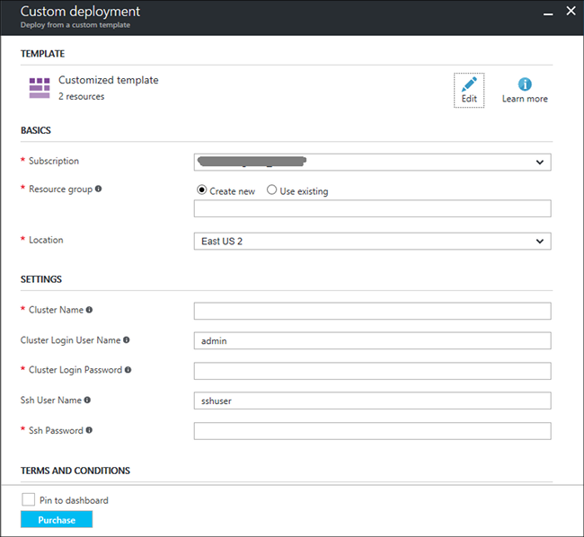

<properties
   	pageTitle="Install Hadoop applications on HDInsight | Microsoft Azure"
   	description="Learn how to install HDInsight applications on HDInsight applications."
   	services="hdinsight"
   	documentationCenter=""
   	authors="mumian"
   	manager="paulettm"
   	editor="cgronlun"
	tags="azure-portal"/>

<tags
   	ms.service="hdinsight"
   	ms.devlang="na"
   	ms.topic="hero-article"
   	ms.tgt_pltfrm="na"
   	ms.workload="big-data"
   	ms.date="04/25/2016"
   	ms.author="jgao"/>

# Install custom HDInsight applications

An HDInsight application is an application that users can install on an Linux-based HDInsight cluster. HDInsight applications can be installed on Linux-based HDInsight clusters. These applications can be developed by Microsoft, independent software vendors (ISV) or by yourself. In this article, you will learn how to install an HDInsight application that has not been published to the Azure portal on HDInsight. The application you will install is [Hue](http://gethue.com/). 

Other related articles:

- [Install HDInsight application](hdinsight-apps-install-applications.md): General information on install published HDInsight applications.
- [Deploy HDInsight applications](hdinsight-apps-deploy.md): Learn how to create ARM template to deploy HDInsight applications.
- [Install and use Hue on HDInsight Hadoop clusters](hdinsight-hadoop-hue-linux.md): The installation process described in this tutorial adds an edge node virtual machine in the same virtual network as the cluster, and install Hue on the edge node. To install Hue on the Hadoop worker node directly using script action, see 
 
### Prerequisites

Before you begin this tutorial, you must have:

- **An HDInsight cluster**: To create one, see [Create cluster](hdinsight-hadoop-linux-tutorial-get-started.md#create-cluster).

## Install HDInsight application

The files needed for deploying this application can be found in a public Azure blob container:

- [azuredeploym.json](https://github.com/hdinsight/Iaas-Applications/blob/master/Hue/azuredeploy.json): The ARM template for installing HDInsight application. See [Deploy HDInsight applications](hdinsight-apps-deploy.md) for developing your own ARM template.
- [hue-install_v0.sh](https://github.com/hdinsight/Iaas-Applications/blob/master/Hue/scripts/Hue-install_v0.sh): The Script action being called by the ARM template for configuring the edge node. 
- [hue-binaries.tgz](https://hdiconfigactions.blob.core.windows.net/linuxhueconfigactionv01/hue-binaries-14-04.tgz): The hue binary file being called from hui-install_v0.sh. 
- [hue-binaries-14-04.tgz](https://hdiconfigactions.blob.core.windows.net/linuxhueconfigactionv01/hue-binaries-14-04.tgz): The hue binary file being called from hui-install_v0.sh. 
- [webwasb-tomcat.tar.gz](https://hdiconfigactions.blob.core.windows.net/linuxhueconfigactionv01/webwasb-tomcat.tar.gz): A sample web application (Tomcat) being called from hui-install_v0.sh.

**To install Hue to an existing HDInsight cluster**

1. Click the following image to sign in to Azure and open the ARM template in the Azure Portal. 

    

    This button opens an ARM template on the Azure portal.  The ARM template is located at [https://github.com/hdinsight/Iaas-Applications/tree/master/Hue](https://github.com/hdinsight/Iaas-Applications/tree/master/Hue).  To learn how to write this ARM template, see [Package and deploy HDInsight applications](hdinsight-apps-deploy.md).
    
2. From the **Parameters** blade, enter the following:

    - **ClusterName**: Enter the name of the cluster where you want to install the application. This cluster must be an existing cluster.
    
3. Click **OK** to save the parameters.
4. From the **Custom deployment** blade, enter **Resource group**.  The resource group is a container that groups the cluster, the dependent storage account and other resources. It is required to use the same resource group as the cluster.
5. Click **Legal terms**, and then click **Create**.
6. Verify the **Pin to dashboard** checkbox is selected, and then click **Create**. You can see the installation status from the tile pinned to the portal dashboard and the portal notification (click the bell icon on the top of the portal).  It takes about 10 minutes to install the application.

**To install Hue while creating a cluster**

1. Click the following image to sign in to Azure and open the ARM template in the Azure Portal. 

    

    This button opens an ARM template on the Azure portal.  The ARM template is located at [https://hditutorialdata.blob.core.windows.net/hdinsightapps/create-linux-based-hadoop-cluster-in-hdinsight.json](https://hditutorialdata.blob.core.windows.net/hdinsightapps/create-linux-based-hadoop-cluster-in-hdinsight.json).  To learn how to write this ARM template, see [Package and deploy HDInsight applications](hdinsight-apps-deploy.md).

2. From the **Parameters** blade, enter the following:

    .

    - **ClusterName**: Enter a name for the Hadoop cluster that you will create.
    - **Cluster login name and password**: The default login name is **admin**.
    - **SSH username and password**: The default username is **sshuser**.  You can rename it. 
    
    Other parameters are optional for following this tutorial. You can leave them as they are. 
    
    Each cluster has an Azure Blob storage account dependency. It is usually referred as the default storage account. HDInsight cluster and its default storage account must be co-located in the same Azure region. Deleting clusters will not delete the storage account. In the template, the default storage account name is defined as the cluster name with "store" appended. 
    
3. Click **OK** to save the parameters.
4. From the **Custom deployment** blade, enter **New resource group name** to create a new resource group.  The resource group is a container that groups the cluster, the dependent storage account and other s. The resource group location can be different from the cluster location.
5. Click **Legal terms**, and then click **Create**.
6. Verify the **Pin to dashboard** checkbox is selected, and then click **Create**. You will see a new tile titled **Deploying Template deployment**. It takes about around 40 minutes to create the cluster.

For more information on creating HDInsight clusters, see [Create Linux-based Hadoop clusters in HDInsight](hdinsight-hadoop-provision-linux-clusters.md).

## Connect to the application

**To open the Hue portal**

1. Sign in to the [Azure portal](https://portal.azure.com).
2. Click **HDInsight Clusters** in the left menu.  If you don't see it, click **Browse**, and then click **HDInsight Clusters**.
3. Click the cluster where you installed the application.
4. From the **Settings** blade, click **Applications** under the **General** category. You shall see **hue** listed in the **Installed** Apps blade.
5. Click **hue** from the list to list the properties.  
6. Click the Webpage link. 
7. Use the HDInsight cluster HTTP user credentials to login.

 
## Next steps

- [Install HDInsight applications](hdinsight-apps-install-applications.md): learn how to deploy a published HDInsight application from the Azure portal.
- [Package and deploy HDInsight applications](hdinsight-apps-deploy.md): learn how to develop ARM templates for deploying HDInsight applications.
