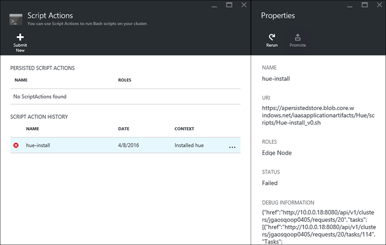

# Install custom Apache Hadoop applications on Azure HDInsight

In this article, you'll learn how to install an [Apache Hadoop](https://hadoop.apache.org/) application on Azure HDInsight, which hasn't been published to the Azure portal. The application you'll install in this article is [Hue](https://gethue.com/).

An HDInsight application is an application that users can install on an HDInsight cluster.  These applications can be developed by Microsoft, independent software vendors (ISV) or by yourself.  

## Prerequisites

If you want to install HDInsight applications on an existing HDInsight cluster, you must have an HDInsight cluster. To create one, see [Create clusters](hadoop/apache-hadoop-linux-tutorial-get-started.md). You can also install HDInsight applications when you create an HDInsight cluster.

## Install HDInsight applications

HDInsight applications can be installed when you create a cluster or to an existing HDInsight cluster. For defining Azure Resource Manager templates, see [MSDN: Install an HDInsight application](https://msdn.microsoft.com/library/mt706515.aspx).

The files needed for deploying this application (Hue):

* [azuredeploy.json](https://github.com/hdinsight/Iaas-Applications/blob/master/Hue/azuredeploy.json): The Resource Manager template for installing HDInsight application. See [MSDN: Install an HDInsight application](https://msdn.microsoft.com/library/mt706515.aspx) for developing your own Resource Manager template.
* [hue-install_v0.sh](https://github.com/hdinsight/Iaas-Applications/blob/master/Hue/scripts/Hue-install_v0.sh): The Script action being called by the Resource Manager template for configuring the edge node.
* [hue-binaries.tgz](https://hdiconfigactions.blob.core.windows.net/linuxhueconfigactionv01/hue-binaries-14-04.tgz): The hue binary file being called from hui-install_v0.sh.
* [hue-binaries-14-04.tgz](https://hdiconfigactions.blob.core.windows.net/linuxhueconfigactionv01/hue-binaries-14-04.tgz): The hue binary file being called from hui-install_v0.sh.
* [webwasb-tomcat.tar.gz](https://hdiconfigactions.blob.core.windows.net/linuxhueconfigactionv01/webwasb-tomcat.tar.gz): A sample web application (Tomcat) being called from hui-install_v0.sh.

### To install Hue to an existing HDInsight cluster

1. Select the following image to sign in to Azure and open the Resource Manager template in the Azure portal.

    <a href="https://portal.azure.com/#create/Microsoft.Template/uri/https%3A%2F%2Fraw.githubusercontent.com%2Fhdinsight%2FIaas-Applications%2Fmaster%2FHue%2Fazuredeploy.json" target="_blank"></a>

    The Resource Manager template is located at [https://github.com/hdinsight/Iaas-Applications/tree/master/Hue](https://github.com/hdinsight/Iaas-Applications/tree/master/Hue).  To learn how to write this Resource Manager template, see [MSDN: Install an HDInsight application](https://msdn.microsoft.com/library/mt706515.aspx).

1. Select the existing **Resource group** that contains your cluster from the drop-down list. It's required to use the same resource group as the cluster.

1. Enter the name of the cluster where you want to install the application. This cluster must be an existing cluster.

1. Select the checkbox for **I agree to the terms and conditions stated above**.

1. Select **Purchase**.

You can see the installation status from the tile pinned to the portal dashboard and the portal notification (click the bell icon on the top of the portal).  It takes about 10 minutes to install the application.

### To install Hue while creating a cluster

1. Select the following image to sign in to Azure and open the Resource Manager template in the Azure portal.

    <a href="https://portal.azure.com/#create/Microsoft.Template/uri/https%3A%2F%2Fhditutorialdata.blob.core.windows.net%2Fhdinsightapps%2Fcreate-linux-based-hadoop-cluster-in-hdinsight.json" target="_blank"></a>

    The Resource Manager template is located at [https://hditutorialdata.blob.core.windows.net/hdinsightapps/create-linux-based-hadoop-cluster-in-hdinsight.json](https://hditutorialdata.blob.core.windows.net/hdinsightapps/create-linux-based-hadoop-cluster-in-hdinsight.json).  To learn how to write this Resource Manager template, see [MSDN: Install an HDInsight application](https://msdn.microsoft.com/library/mt706515.aspx).

2. Follow the instruction to create cluster and install Hue. For more information on creating HDInsight clusters, see [Create Linux-based Hadoop clusters in HDInsight](hdinsight-hadoop-provision-linux-clusters.md).

### Other installation methods

In addition to the Azure portal, you can also use [Azure PowerShell](hdinsight-hadoop-create-linux-clusters-arm-templates.md#deploy-using-powershell) and [Azure CLI](hdinsight-hadoop-create-linux-clusters-arm-templates.md#deploy-using-azure-cli) to call Resource Manager templates.

## Validate the installation

You can check the application status on the Azure portal to validate the application installation. In addition, you can also validate all HTTP endpoints came up as expected and the webpage if there's one.

For **Hue**, you can use the following steps:

### Azure portal

1. Sign in to the [Azure portal](https://portal.azure.com).
1. Select the cluster where you installed the application.
1. From the **Settings** menu, select **Applications**.
1. Select **hue** from the list to view the properties.  
1. Select the Webpage link to validate the website.

### Azure CLI

Replace `CLUSTERNAME`, and `RESOURCEGROUP` with the relevant values and then enter the commands below:

* To lists all of the applications for the HDInsight cluster.

    ```azurecli
    az hdinsight application list --cluster-name CLUSTERNAME --resource-group RESOURCEGROUP
    ```

* To retrieve properties of the specified application.

    ```azurecli
    az hdinsight application show --name hue --cluster-name CLUSTERNAME --resource-group RESOURCEGROUP
    ```

## Troubleshoot the installation

You can check the application installation status from the portal notification (Click the bell icon on the top of the portal).

If an application installation failed, you can see the error messages and debug information from three places:

* HDInsight Applications: general error information.

    Open the cluster from the portal, and select Applications from Settings:

    

* HDInsight script action: If the HDInsight Applications' error message indicates a script action failure, more details about the script failure will be presented in the script actions pane.

    Select Script Action from Settings. Script action history shows the error messages

    

* Apache Ambari Web UI: If the install script was the cause of the failure, use Ambari Web UI to check full logs about the install scripts.

    For more information, see [Troubleshoot script actions](./troubleshoot-script-action.md).

## Remove HDInsight applications

### Azure portal

1. Sign in to the [Azure portal](https://portal.azure.com).
1. Select the cluster where you installed the application.
1. From the **Settings** menu, select **Applications**.
1. Right-click the application you want to remove, and then select **Delete**.
1. Select **Yes** to confirm.

### Azure CLI

Replace `NAME`, `CLUSTERNAME`, and `RESOURCEGROUP` with the relevant values and then enter the command below:

```azurecli
az hdinsight application delete --name NAME --cluster-name CLUSTERNAME --resource-group RESOURCEGROUP
```

## Next steps

* [MSDN: Install an HDInsight application](https://msdn.microsoft.com/library/mt706515.aspx): learn how to develop Resource Manager templates for deploying HDInsight applications.
* [Install HDInsight applications](hdinsight-apps-install-applications.md): Learn how to install an HDInsight application to your clusters.
* [Publish HDInsight applications](hdinsight-apps-publish-applications.md): Learn how to publish your custom HDInsight applications to Azure Marketplace.
* [Customize Linux-based HDInsight clusters using Script Action](hdinsight-hadoop-customize-cluster-linux.md): learn how to use Script Action to install additional applications.
* [Create Linux-based Apache Hadoop clusters in HDInsight using Resource Manager templates](hdinsight-hadoop-create-linux-clusters-arm-templates.md): learn how to call Resource Manager templates to create HDInsight clusters.
* [Use empty edge nodes in HDInsight](hdinsight-apps-use-edge-node.md): learn how to use an empty edge node for accessing HDInsight cluster, testing HDInsight applications, and hosting HDInsight applications.
