# Install published application - Dataiku DDS

This article describes how to install and run the [Dataiku DDS](https://www.dataiku.com/) published Hadoop application on Azure HDInsight. For an overview of the HDInsight application platform, and a list of available Independent Software Vendor (ISV) published applications, see [Install third-party Hadoop applications](hdinsight-apps-install-applications.md). For instructions on installing your own application, see [Install custom HDInsight applications](hdinsight-apps-install-custom-applications.md).

## About Dataiku DSS

The Dataiku [Data Science Studio (DSS)](https://www.dataiku.com/dss/features/connectivity/), is a collaborative data science platform that enables data scientists to build and deliver analytical solutions. Offering DSS as an HDInsight application lets you use data science to build Big Data solutions and run them at enterprise grade and scale.

You can use DSS to implement a complete analytical solution, beginning with data ingestion, preparation, and processing. A DSS solution can also include training and applying machine learning models, visualization, and then operationalizing.

You can install DSS on HDInsight using Hadoop or Spark clusters. You can install DSS on existing running clusters, or when creating new clusters. DSS also supports using Azure Blob storage as a connector for reading data.

You can use DSS to build projects, which then can generate MapReduce or Spark jobs. These jobs are executed as regular MapReduce or Spark jobs on HDInsight, so you can scale the cluster on demand.

## Prerequisites

To install this app on a new HDInsight cluster, or an existing cluster, you must have the following configuration:

* Cluster tier(s): Standard, Premium
* Cluster type(s): Hadoop, Spark
* Cluster version(s): 3.4, 3.5

## Install the Dataiku DSS published application

For step-by-step instructions on installing this and other available ISV applications, read [Install third-party Hadoop applications](hdinsight-apps-install-applications.md).

## Launch Dataiku DSS

1. After installation, you can launch DSS from your cluster in Azure portal by going to the **Settings** pane, then clicking **Applications** under the **General** category. The Installed Apps pane lists the installed applications.

    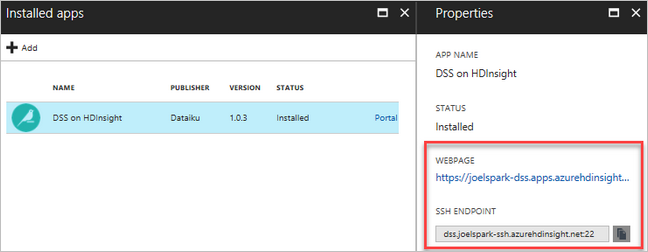

2. When you select DSS on HDInsight, you see a link to the web page, and the SSH endpoint path. Select the WEBPAGE link.

3. On first launch, you are presented with a form to create a new Dataiku account for free, or to sign in to an existing account. You also have the option to start a free 2-week trial of [Enterprise Edition](https://www.dataiku.com/dss/editions/). From this point, you have the option of continuing with entering a license key for Enterprise Edition, or using the Community Edition.

4. After completing your selected license option, you are presented with a login form. Enter the default credentials displayed prior to the login form.

The following steps provide a simple demonstration.

1. [Download the sample orders CSV](https://doc.dataiku.com/tutorials/data/101/haiku_shirt_sales.csv).

2. From the DSS dashboard, select the **+** (New project) link on the left-hand menu to create a new project.

    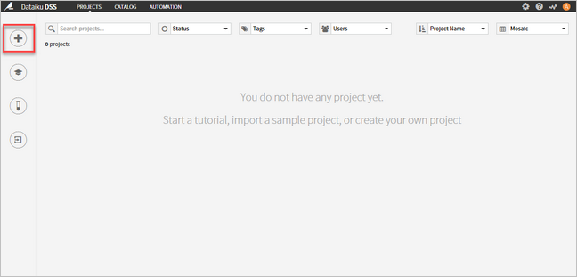

3. In the New project form, type in a **Name**. The **Project Key** is automatically filled with a suggested value. In this case, enter "Orders". Click **CREATE**.

    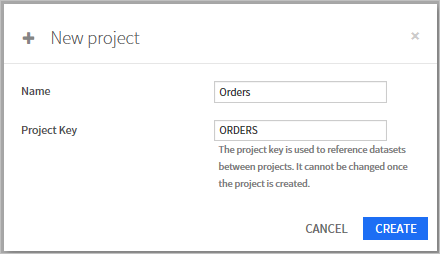

4. Select **+ IMPORT YOUR FIRST DATASET** in your new project page.

    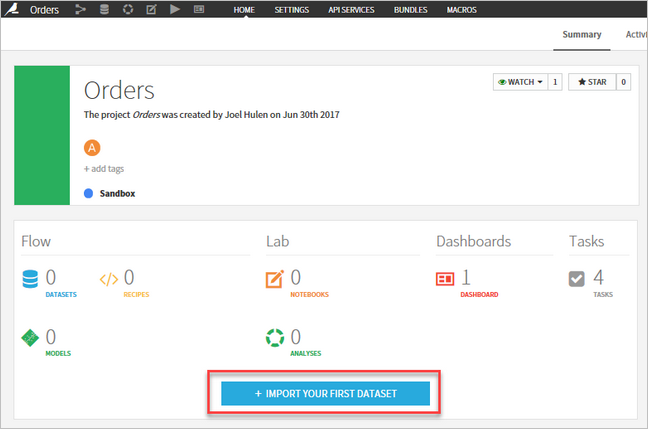

5. Select **Upload your files** under the **Files** dataset list. You are presented with the Upload dialog. Click on Add a file, select the `haiku_shirt_sales.csv` file you downloaded, and validate.

6. The file is uploaded to DSS. Check if DSS detected the CSV format correctly by clicking on the Preview button.

    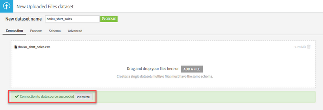

7. The import is almost perfect. The CSV file is using a Tab separator. You can see the data is in a tabular format, with columns called features, and lines that represent observations. The one error is that apparently the file contained a blank line between the header and the data. To fix this error, enter `1` in the **Skip next lines** field.

    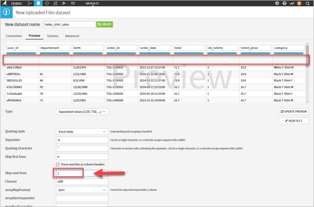

8. Give the new dataset a name. Enter **haiku_shirt_sales** in the field on top of the screen, then select the **Create** button.

9. You see a tabular view of your data where you can start exploring it. For each column, you should see that Dataiku Science Studio has detected a data type, in _blue_ - in this case, Text, Number, or Date (unparsed). A gauge indicates the ratio of the column for which the values do not seem to match the type (in red) or are missing (blank). In this example dataset, the department has both empty values and invalid data.

    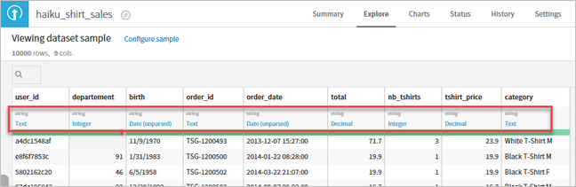

## Data manipulation

Real-world data is almost always messy, and rarely is it neatly packaged. Cleaning up data typically requires a chain of scripts and associated business logic. Dataiku DSS provides a dedicated **Lab** tool to make this task more user-friendly.

1. Click on **Lab** in the upper-right corner.

    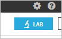

2. The Lab window opens. The lab is where you iteratively work on your dataset to get further into it. This tutorial demonstrates the Visual analysis aspect. Select the **New** button below Visual analysis. You are prompted to specify a name for your analysis. Leave the default name for now, then click **CREATE**.

    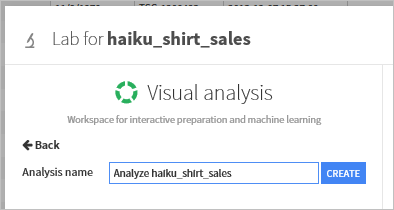

3. Select the **Quick columns stats** button on the upper-right corner of the page.

    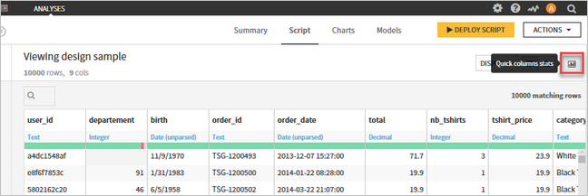

4. You see statistics for data types and values displayed in timeline-based graphs under the **Columns quick view** pane.

    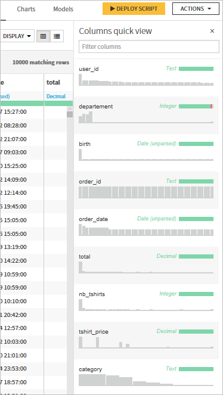

You can now explore DSS using the sample data. You can clean up and work with the data, and create new visualizations.

For in-depth tutorials, read [Learn Dataiku DSS](https://www.dataiku.com/learn/).

## Next steps

* [Dataiku DSS documentation](https://doc.dataiku.com/dss/latest/).
* [Install custom HDInsight applications](hdinsight-apps-install-custom-applications.md): Learn how to deploy an unpublished HDInsight application to HDInsight.
* [Publish HDInsight applications](hdinsight-apps-publish-applications.md): Learn how to publish your custom HDInsight applications to Azure Marketplace.
* [MSDN: Install an HDInsight application](https://msdn.microsoft.com/library/mt706515.aspx): Learn how to define HDInsight applications.
* [Customize Linux-based HDInsight clusters using Script Action](hdinsight-hadoop-customize-cluster-linux.md): Learn how to use Script Action to install additional applications.
* [Use empty edge nodes in HDInsight](hdinsight-apps-use-edge-node.md): Learn how to use an empty edge node for accessing HDInsight clusters, and for testing and hosting HDInsight applications.
