# Install published application - Datameer

This article describes how to install and run the [Datameer](https://www.datameer.com/) published Hadoop application on Azure HDInsight. For an overview of the HDInsight application platform, and a list of available Independent Software Vendor (ISV) published applications, see [Install third-party Hadoop applications](hdinsight-apps-install-applications.md). For instructions on installing your own application, see [Install custom HDInsight applications](hdinsight-apps-install-custom-applications.md).

## About Datameer

Datameer is a native application for the Hadoop platform, extending existing Azure HDInsight capabilities and providing quick integration, preparation, and analysis of structured and unstructured data. Datameer can access more than 70 sources and formats: structured, semi-structured, and unstructured. You can directly upload data, or use their unique data links to pull data on demand. Datameer’s self-service functionality and familiar spreadsheet interface reduces the complexity of Big Data technology and accelerates time to insight. The spreadsheet interface provides a simple mechanism for entering declarative formulas that are then translated to optimized Hadoop jobs. With Datameer and your business intelligence (BI) and Excel skills, you can use Hadoop in the cloud quickly. For more information, see the [Datameer documentation](http://www.datameer.com/documentation/display/DAS50/Home?ls=Partners&lsd=Microsoft&c=Partners&cd=Microsoft).

## Prerequisites

To install this app on a new HDInsight cluster, or an existing cluster, you must have the following configuration:

* Cluster tier: Standard
* Cluster type: Hadoop
* Cluster version: 3.4

## Install the Datameer published application

For step-by-step instructions on installing this and other available ISV applications, read [Install third-party Hadoop applications](hdinsight-apps-install-applications.md).

## Launch Datameer

1. After installation, you can launch Datameer from your cluster in Azure portal by going to the **Settings** pane, then clicking **Applications** under the **General** category. The Installed Apps pane lists the installed applications.

    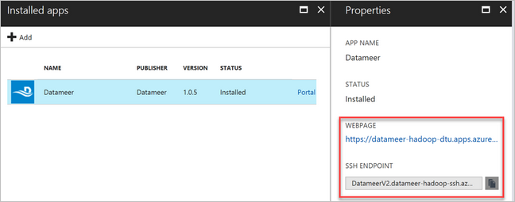

2. When you select Datameer, you see a link to the web page and the SSH endpoint path. Select the WEBPAGE link.

3. On first launch, there are two license options: either a free 14-day trial, or activate an existing license.

    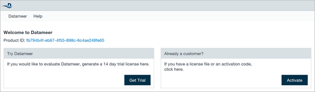

4. After completing your selected license option, you'll be presented with a login form. Enter the default credentials displayed prior to the login form. After logging in, accept the software agreement to continue.

    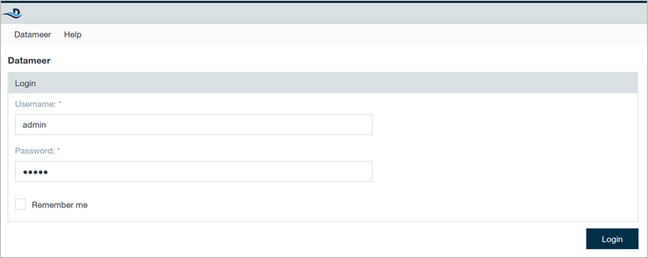

The following steps show a "Hello World" demonstration.

1. [Download the sample CSV](https://datameer.box.com/s/wzzw27za3agic4yjj8zrn6vfrph0ppnf).

2. Click the **+** sign on top of the Datameer dashboard, and click **File Upload**.

    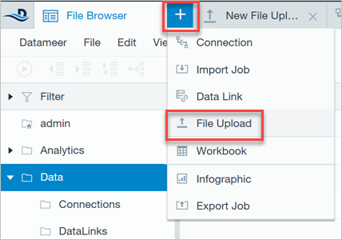

3. In the upload dialog, browse and select the **Hello World.csv** file you downloaded. Make sure the **File Type** is set to CSV / TSV. Select **Next**. Keep clicking **Next** until you reach the end of the wizard.

    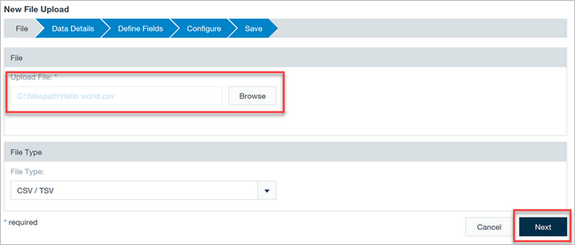

4. Name the file **Hello World** underneath a New Folder. Rename the new folder as "Demo". Select **Save**.

    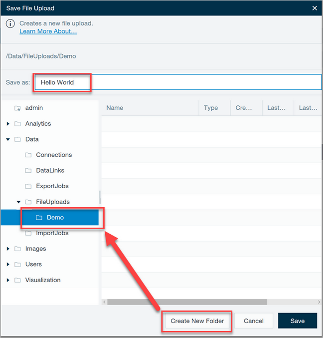

5. Click the **+** sign once more and select **Workbook** to create a new Workbook for the data.

    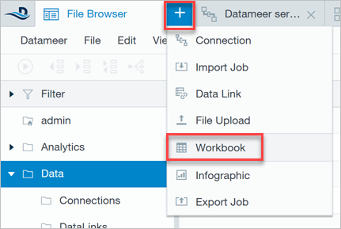

6. Expand the **Data** folder, **FileUploads**, then the **Demo** folder you created when saving the "Hello World" file. Select **Hello World** form the list of files, then click **Add Data**.

    

7. You see the data loaded in a spreadsheet interface. To select a subset of the data, select the **Filter** button in the toolbar.

    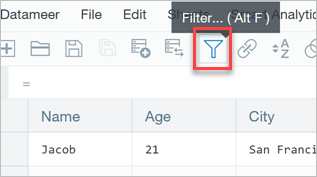

8. In the Apply Filter dialog, select the **City** column, **equals** operator, and type **Chicago** in the filter text box. Check the **Create filter in new sheet** checkbox, then select **Create Filter**.

    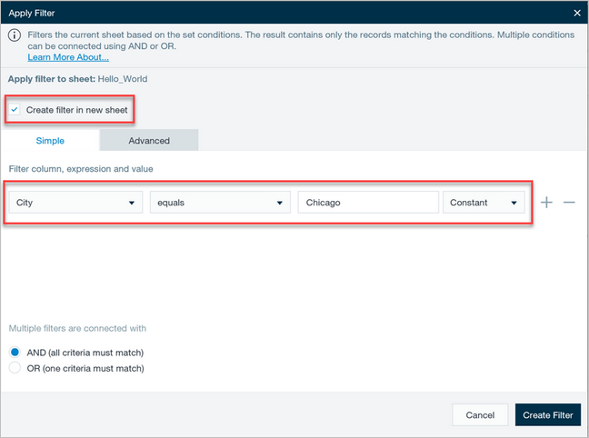

9. Save the Workbook by clicking **File**, then **Save**. Supply a name, such as "Hello World Workbook".

10. You are presented with options for how and when to run the Workbook. For now, leave all of the options at their default values, then check the **Start calculation process immediately after save**, and select **Save**.

    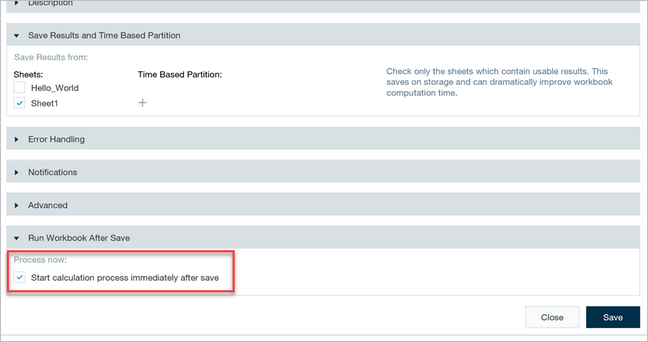

11. Datameer provides powerful visualization tools. To display the data, create an Infographic. Select the **+** sign on top of the dashboard, then select **Infographic**.

    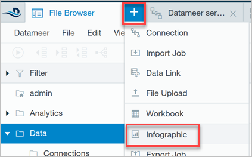

12. Drag a Bar Chart widget from the list of widgets on the left, as shown in step 1 in the following diagram. Next, navigate through the Data folder under the data browser on the right, expand your Workbook, then the worksheet you added with the filter (step 2). Drag the **Name** column over the top of the bar chart and drop into the **Label** target to set the Workbook's Name column as the chart's label field (step 3).

    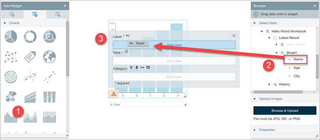

13. To set Age as the chart's Y axis, drag the **Age** column into the chart's **Data** field.

    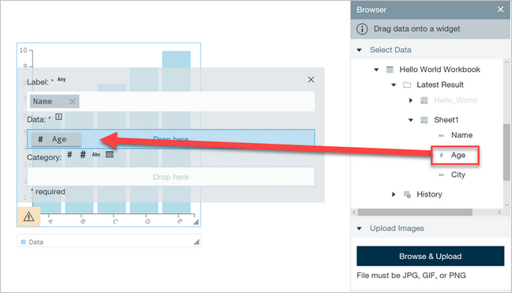

Congratulations! You've created a visualization of your data without writing any code. You can now explore variations and additional visualizations.

## Next steps

* [Datameer documentation](http://www.datameer.com/documentation/display/DAS50/Home?ls=Partners&lsd=Microsoft&c=Partners&cd=Microsoft).
* [Install custom HDInsight applications](hdinsight-apps-install-custom-applications.md): Learn how to deploy an unpublished HDInsight application to HDInsight.
* [Publish HDInsight applications](hdinsight-apps-publish-applications.md): Learn how to publish your custom HDInsight applications to Azure Marketplace.
* [MSDN: Install an HDInsight application](https://msdn.microsoft.com/library/mt706515.aspx): Learn how to define HDInsight applications.
* [Customize Linux-based HDInsight clusters using Script Action](hdinsight-hadoop-customize-cluster-linux.md): Learn how to use Script Action to install additional applications.
* [Use empty edge nodes in HDInsight](hdinsight-apps-use-edge-node.md): Learn how to use an empty edge node for accessing HDInsight clusters, and for testing and hosting HDInsight applications.
