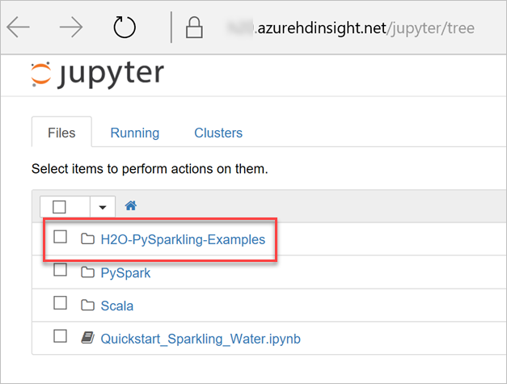
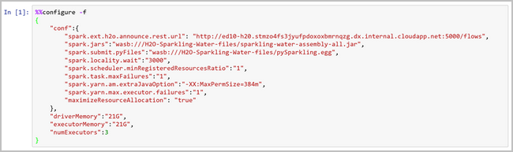
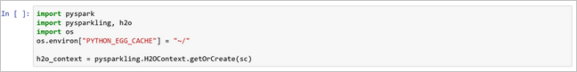
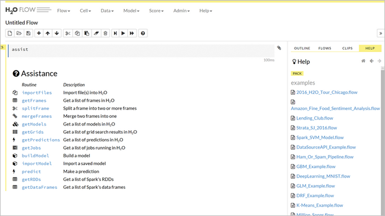
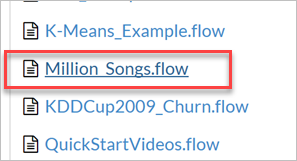
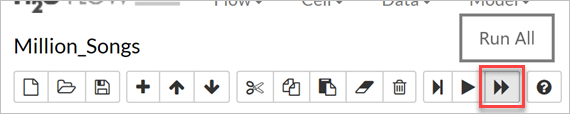
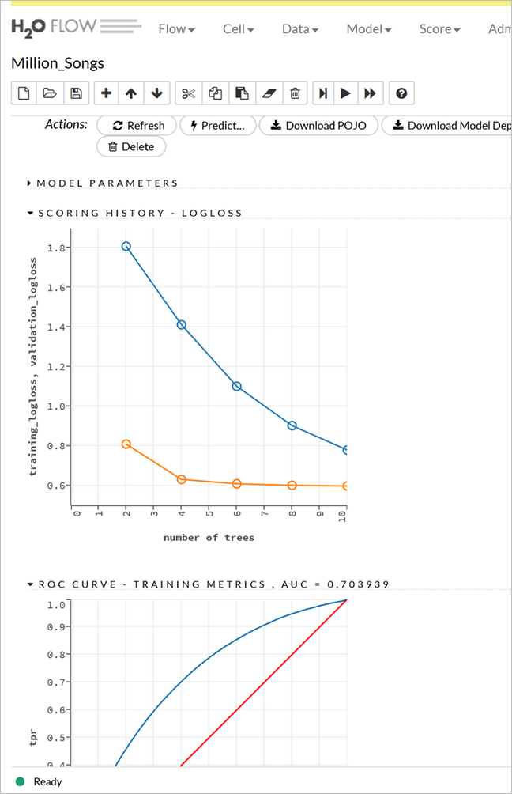

# Install published application - H2O Sparkling Water

This article describes how to install and run the [H20 Sparkling Water](http://www.h2o.ai/) published Hadoop application on Azure HDInsight. For an overview of the HDInsight application platform, and a list of available Independent Software Vendor (ISV) published applications, see [Install third-party Hadoop applications](hdinsight-apps-install-applications.md). For instructions on installing your own application, see [Install custom HDInsight applications](hdinsight-apps-install-custom-applications.md).

## About H2O Sparkling Water

H2O Sparkling Water is an open source, fully distributed in-memory machine learning platform with linear scalability. H2O Sparkling Water let you combine the fast, scalable machine learning algorithms of H2O with the capabilities of Spark. With Sparkling Water, users can drive computation from Scala, R, and Python using the H2O Flow UI.

H2O Sparkling Water provides:

* **Easy-to-use WebUI and familiar interfaces** – Set up and get started quickly using either H2O’s intuitive web-based Flow GUI or programming environments such as R, Python, Java, Scala, JSON, and the H2O APIs.
* **Data-agnostic support for all common database and file types** – Easily explore and model Big Data from within Microsoft Excel, R Studio, Tableau, and more. Connect to data from HDFS, S3, SQL, and NoSQL data sources.
* **Massively scalable Big Data munging and analysis** – H2O Big Joins can perform 7x faster than R data.table operations, and linearly scale to 10 billion x 10 billion row joins.
* **Real-time data scoring** – Rapidly deploy models to production using plain-old Java objects (POJO), model-optimized Java objects (MOJO), or the H2O REST API.

### Resource links

* [H2O.ai Engineering Roadmap](http://jira.h2o.ai/)
* [H2O.ai Home](http://www.h2o.ai/)
* [H2O.ai Documentation](http://docs.h2o.ai/)
* [H2O.ai Support](https://support.h2o.ai/)
* [H2O.ai Open Source Codebase](https://github.com/h2oai/)

## Prerequisites

To install this app on a new HDInsight cluster, or an existing cluster, you must have the following configuration:

* Cluster tier(s): Standard or Premium
* Cluster type: Spark
* Cluster version(s): 3.5 or 3.6

## Install the H2O Sparkling Water published application

For step-by-step instructions on installing this and other available ISV applications, read [Install third-party Hadoop applications](hdinsight-apps-install-applications.md).

## Launch H2O Sparkling Water

1. After installation, you can start using H2O Sparkling Water (h2o-sparklingwater) from your cluster in Azure portal by opening Jupyter Notebooks (`https://<ClusterName>.azurehdinsight.net/jupyter`). You can also get to Jupyter by selecting **Cluster dashboard** from your cluster pane in the portal, then selecting **Jupyter Notebook**. You are prompted to enter your credentials. Enter the cluster's Hadoop credentials as specified on cluster creation.

2. In Jupyter, you see three folders: H2O-PySparkling-Examples, PySpark Examples, and Scala Examples. Select the **H2O-PySparkling-Examples** folder.

    

3. The first step when creating a new notebook is to configure the Spark environment. This information is included in the **Sentiment_analysis_with_Sparkling_Water** example. When configuring the Spark environment, be sure to use the correct jar, and specify the IP address provided by the output of the first cell.

    

4. Start the H2O Cluster.

    

5. After the H2O Cluster is up and running, open H2O Flow by going to **`https://<ClusterName>-h2o.apps.azurehdinsight.net:443`**.

    > [!NOTE]
    > If you are unable to open H2O Flow, try clearing your browser cache. If you still unable to reach it, you probably do not have enough resources on your cluster. Try increasing the number of Worker nodes under the **Scale cluster** option in your cluster pane.

    

6. Select the **Million_Songs.flow** example from the menu on the right. When prompted with a warning, click **Load Notebook**. This demo is designed to run in a few minutes using real data. The goal is to predict from the data whether the song was released before or after 2004 using binary classification.

    

7. Find the path containing **milsongs-cls-train.csv.gz**, and replace the entire path with **https://h2o-public-test-data.s3.amazonaws.com/bigdata/laptop/milsongs/milsongs-cls-train.csv.gz**.

8. Find the path containing **milsongs-cls-test.csv.gz** and replace it with **https://h2o-public-test-data.s3.amazonaws.com/bigdata/laptop/milsongs/milsongs-cls-test.csv.gz**.

9. To execute all statements within the notebook cells, select the **Run All** button on the toolbar.

    

10. After a few minutes, you should see an output similar to the following.

    

That's it! You've harnessed artificial intelligence in Spark within a matter of minutes. You can now explore more examples in H2O Flow that demonstrate different types of machine learning algorithms.

## Next steps

* [H2O documentation](http://docs.h2o.ai/h2o/latest-stable/h2o-docs/index.html)
* [Install custom HDInsight applications](hdinsight-apps-install-custom-applications.md): Learn how to deploy an unpublished HDInsight application to HDInsight.
* [Publish HDInsight applications](hdinsight-apps-publish-applications.md): Learn how to publish your custom HDInsight applications to Azure Marketplace.
* [MSDN: Install an HDInsight application](https://msdn.microsoft.com/library/mt706515.aspx): Learn how to define HDInsight applications.
* [Customize Linux-based HDInsight clusters using Script Action](hdinsight-hadoop-customize-cluster-linux.md): Learn how to use Script Action to install additional applications.
* [Use empty edge nodes in HDInsight](hdinsight-apps-use-edge-node.md): Learn how to use an empty edge node for accessing HDInsight clusters, and for testing and hosting HDInsight applications.
