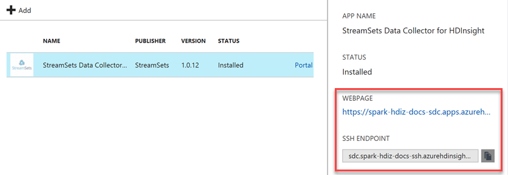
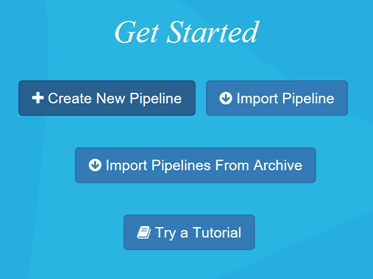

# Install published application - StreamSets Data Collector

This article describes how to install the [StreamSets Data Collector for HDInsight](https://streamsets.com/) published Hadoop application on Azure HDInsight. For an overview of the HDInsight application platform, and a list of available Independent Software Vendor (ISV) published applications, see [Install third-party Hadoop applications](hdinsight-apps-install-applications.md). For instructions on installing your own application, see [Install custom HDInsight applications](hdinsight-apps-install-custom-applications.md).

## About StreamSets Data Collector

StreamSets Data Collector deploys on top of Azure HDInsight application. It provides a full-featured integrated development environment (IDE) that lets you design, test, deploy, and manage any-to-any ingest pipelines that mesh stream and batch data, and include a variety of in-stream transformations—all without having to write custom code. 

StreamSets Data Collector lets you build data flows, including numerous Big Data components such as HDFS, Kafka, Solr, Hive, HBASE, and Kudu. Once StreamSets Data Collector is running on edge or in your Hadoop cluster, you get real-time monitoring for both data anomalies and data flow operations, including threshold-based alerting, anomaly detection, and automatic remediation of error records.

Because it is architected to logically isolate each stage in a pipeline, you can meet new business requirements by dropping in new processors and connectors without code and with minimal downtime.

### Resource links

* [StreamSets Docs](https://streamsets.com/documentation/datacollector/latest/help/#Getting_Started/GettingStarted_Title.html)
* [Blog](https://streamsets.com/blog/)
* [Tutorials](https://github.com/streamsets/tutorials)
* [Developer Support Forum](https://groups.google.com/a/streamsets.com/forum/#!forum/sdc-user)
* [Slack Public StreamSets Channel](https://streamsetters.slack.com/)
* [Source Code](https://github.com/streamsets)

## Installing the StreamSets Data Collector published application

For step-by-step instructions on installing this and other available ISV applications, please read [Install third-party Hadoop applications](hdinsight-apps-install-applications.md#how-to-install-a-published-application).

## Prerequisites

When creating a new HDInsight cluster, or to install on an existing one, you must have the following configuration to install this app:

* Cluster tier(s): Standard or Premium
* Cluster version(s): 3.5 and above

## Launching StreamSets Data Collector for the first time

After installation, you can launch StreamSets from your cluster in Azure Portal by going to the the **Settings** blade, then clicking **Applications** under the **General** category. The Installed Apps blade lists all the installed applications.

When you select StreamSets Data Collector, you'll see a link to the web page, as well as the SSH endpoint path. Select the WEBPAGE link.

In the Login dialog box, use the following credentials to log in: admin / admin.

* On the Get Started page, click **Create New Pipeline**.

    

* In the New Pipeline window, enter a name for the pipeline ("Hello World"), optionally enter a description, and click **Save**. 

* The Data Collector console will appear. The Properties panel displays pipeline properties.
 
    

* You are now ready to [follow the official StreamSets tutorial](https://streamsets.com/documentation/datacollector/latest/help/#Tutorial/Tutorial-title.html). This will provide you with detailed step-by-step directions to create your first pipeline.

## Next steps
* Read the StreamSets Data Collector [documentation](https://streamsets.com/documentation/datacollector/latest/help/#Getting_Started/GettingStarted_Title.html#concept_htw_ghg_jq)
* [Install custom HDInsight applications](../hdinsight-apps-install-custom-applications.md): learn how to deploy an un-published HDInsight application to HDInsight.
* [Publish HDInsight applications](../hdinsight-apps-publish-applications.md): Learn how to publish your custom HDInsight applications to Azure Marketplace.
* [MSDN: Install an HDInsight application](https://msdn.microsoft.com/library/mt706515.aspx): Learn how to define HDInsight applications.
* [Customize Linux-based HDInsight clusters using Script Action](hdinsight-hadoop-customize-cluster-linux.md): learn how to use Script Action to install additional applications.
* [Use empty edge nodes in HDInsight](../hdinsight-apps-use-edge-node.md): learn how to use an empty edge node for accessing HDInsight cluster, testing HDInsight applications, and hosting HDInsight applications.

