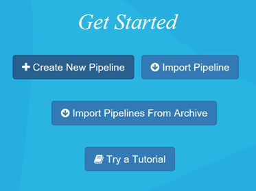
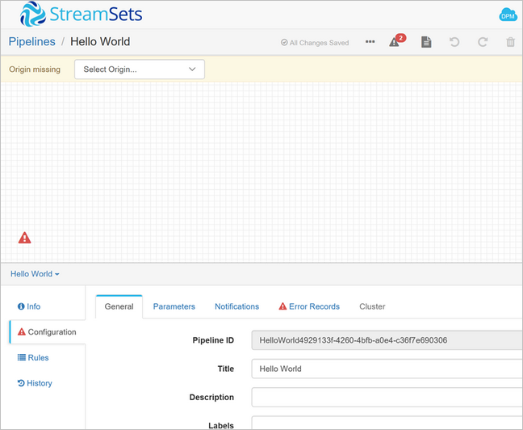

# Install published application - StreamSets Data Collector

This article describes how to install and run the [StreamSets Data Collector for HDInsight](https://streamsets.com/) published Hadoop application on Azure HDInsight. For an overview of the HDInsight application platform, and a list of available Independent Software Vendor (ISV) published applications, see [Install third-party Hadoop applications](hdinsight-apps-install-applications.md). For instructions on installing your own application, see [Install custom HDInsight applications](hdinsight-apps-install-custom-applications.md).

## About StreamSets Data Collector

The StreamSets Data Collector deploys on top of an Azure HDInsight application. StreamSets Data Collector provides a full-featured integrated development environment (IDE) that lets you design, test, deploy, and manage any-to-any ingest pipelines. These pipelines can mesh stream and batch data, and include a variety of in-stream transformations, all without having to write custom code.

StreamSets Data Collector lets you build data flows using numerous Big Data components such as HDFS, Kafka, Solr, Hive, HBASE, and Kudu. Once StreamSets Data Collector is running on an edge server, or in your Hadoop cluster, you get real-time monitoring for both data anomalies and data flow operations. This monitoring includes threshold-based alerting, anomaly detection, and automatic remediation of error records.

StreamSets Data Collector is designed to logically isolate each stage in a pipeline, so you can meet new business requirements by dropping in new processors and connectors without coding and with minimal downtime.

### StreamSets resource links

* [Documentation](https://streamsets.com/documentation/datacollector/latest/help/#Getting_Started/GettingStarted_Title.html)
* [Blog](https://streamsets.com/blog/)
* [Tutorials](https://github.com/streamsets/tutorials)
* [Developer Support Forum](https://groups.google.com/a/streamsets.com/forum/#!forum/sdc-user)
* [Slack Public StreamSets Channel](https://streamsetters.slack.com/)
* [Source Code](https://github.com/streamsets)

## Prerequisites

To install this app on a new HDInsight cluster, or an existing cluster, you must have the following configuration:

* Cluster tier(s): Standard or Premium
* Cluster version(s): 3.5 and above

## Install the StreamSets Data Collector published application

For step-by-step instructions on installing this and other available ISV applications, read [Install third-party Hadoop applications](hdinsight-apps-install-applications.md).

## Launch StreamSets Data Collector

1. After installation, you can launch StreamSets from your cluster in Azure portal by going to the **Settings** pane, then selecting **Applications** under the **General** category. The Installed Apps pane lists the installed applications.

    

2. When you select StreamSets Data Collector, you see a link to the web page, and the SSH endpoint path. Select the WEBPAGE link.

3. In the Login dialog box, use the following credentials to log in: `admin` and `admin`.

4. On the Get Started page, click **Create New Pipeline**.

    

5. In the New Pipeline window, enter a name for the pipeline ("Hello World"), optionally enter a description, and select **Save**.

6. The Data Collector console is shown. The Properties panel displays pipeline properties.
 
    

7. You are now ready to follow the [StreamSets tutorial](https://streamsets.com/documentation/datacollector/latest/help/#Tutorial/Tutorial-title.html). The tutorial provides step-by-step directions for creating your first pipeline.

## Next steps

* [StreamSets Data Collector documentation](https://streamsets.com/documentation/datacollector/latest/help/#Getting_Started/GettingStarted_Title.html#concept_htw_ghg_jq).
* [Install custom HDInsight applications](hdinsight-apps-install-custom-applications.md): Learn how to deploy an unpublished HDInsight application to HDInsight.
* [Publish HDInsight applications](hdinsight-apps-publish-applications.md): Learn how to publish your custom HDInsight applications to Azure Marketplace.
* [MSDN: Install an HDInsight application](https://msdn.microsoft.com/library/mt706515.aspx): Learn how to define HDInsight applications.
* [Customize Linux-based HDInsight clusters using Script Action](hdinsight-hadoop-customize-cluster-linux.md): Learn how to use Script Action to install additional applications.
* [Use empty edge nodes in HDInsight](hdinsight-apps-use-edge-node.md): Learn how to use an empty edge node for accessing HDInsight clusters, and for testing and hosting HDInsight applications.
