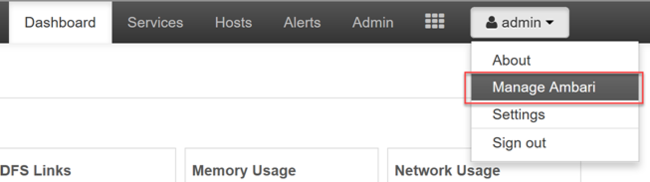
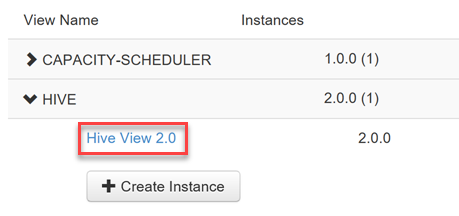
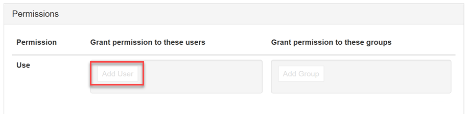
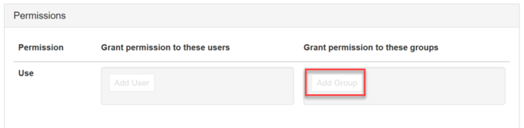
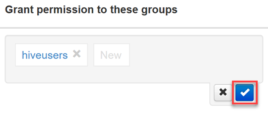
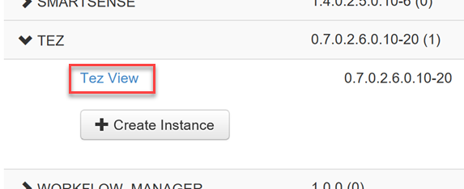
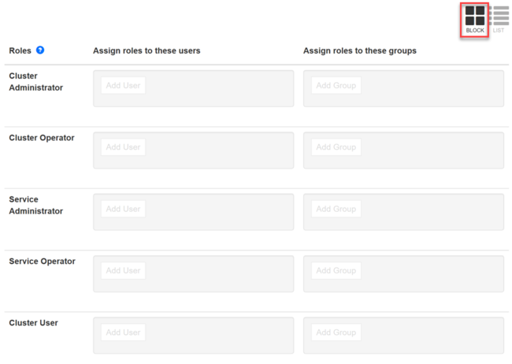
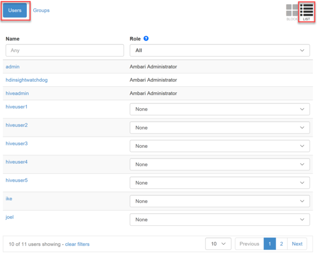
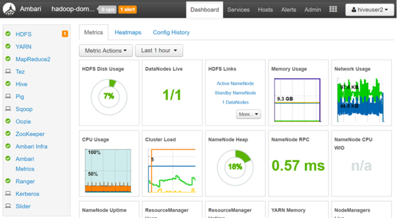

# Authorize users for Ambari Views

[Enterprise Security Package (ESP) enabled HDInsight clusters](./domain-joined/apache-domain-joined-introduction.md) provide enterprise-grade capabilities, including Azure Active Directory-based authentication. You can [synchronize new users](hdinsight-sync-aad-users-to-cluster.md) added to Azure AD groups that have been provided access to the cluster, allowing those specific users to perform certain actions. Working with users, groups, and permissions in Ambari is supported for both ESP HDInsight clusters and standard HDInsight clusters.

Active Directory users can log on to the cluster nodes using their domain credentials. They can also use their domain credentials to authenticate cluster interactions with other approved endpoints like Hue, Ambari Views, ODBC, JDBC, PowerShell, and REST APIs.

> [!WARNING]
> Do not change the password of the Ambari watchdog (hdinsightwatchdog) on your Linux-based HDInsight cluster. Changing the password breaks the ability to use script actions or perform scaling operations with your cluster.

If you have not already done so, follow [these instructions](./domain-joined/apache-domain-joined-configure.md) to provision a new ESP cluster.

## Access the Ambari management page

To get to the **Ambari management page** on the [Ambari Web UI](hdinsight-hadoop-manage-ambari.md), browse to **`https://<YOUR CLUSTER NAME>.azurehdinsight.net`**. Enter the cluster administrator username and password that you defined when creating the cluster. Next, from the Ambari dashboard, select **Manage Ambari** underneath the **admin** menu:

## Grant permissions to Hive views

Ambari comes with view instances for Hive and Tez, among others. To grant access to one or more Hive view instances, go to the **Ambari management page**.

1. From the management page, select the **Views** link under the **Views** menu heading on the left.

    

2. On the Views page, expand the **HIVE** row. There is one default Hive view that is created when the Hive service is added to the cluster. You can also create more Hive view instances as needed. Select a Hive view:

    

3. Scroll toward the bottom of the View page. Under the *Permissions* section, you have two options for granting domain users their permissions to the view:

**Grant permission to these users**
    

**Grant permission to these groups**
    

4. To add a user, select the **Add User** button.

    * Start typing the user name and you will see a dropdown list of previously defined names.

    

    * Select, or finish typing, the user name. To add this user name as a new user, select the **New** button.

    * To save your changes, select the **blue checkbox**.

    

5. To add a group, select the **Add Group** button.

    * Start typing the group name. The process of selecting an existing group name, or adding a new group, is the same as for adding users.
    * To save your changes, select the **blue checkbox**.

    

Adding users directly to a view is useful when you want to assign permissions to a user to use that view, but do not want them to be a member of a group that has additional permissions. To reduce the amount of administrative overhead, it may be simpler to assign permissions to groups.

## Grant permissions to Tez views

The Tez view instances allow the users to monitor and debug all Tez jobs, submitted by Hive queries and Pig scripts. There is one default Tez view instance that is created when the cluster is provisioned.

To assign users and groups to a Tez view instance, expand the **TEZ** row on the Views page, as described previously.

To add users or groups, repeat steps 3 - 5 in the previous section.

## Assign users to roles

There are five security roles for users and groups, listed in order of decreasing access permissions:

* Cluster Administrator
* Cluster Operator
* Service Administrator
* Service Operator
* Cluster User

To manage roles, go to the **Ambari management page**, then select the **Roles** link within the *Clusters* menu group on the left.

To see the list of permissions given to each role, click on the blue question mark next to the **Roles** table header on the Roles page.

On this page, there are two different views you can use to manage roles for users and groups: Block and List.

### Block view

The Block view displays each role in its own row, and provides the **Assign roles to these users** and **Assign roles to these groups** options as described previously.

### List view

The List view provides quick editing capabilities in two categories: Users and Groups.

* The Users category of the List view displays a list of all users, allowing you to select a role for each user in the dropdown list.

    

*  The Groups category of the List view displays all groups, and the role assigned to each group. In our example, the list of groups is synchronized from the Azure AD groups specified in the **Access user group** property of the cluster's Domain settings. See [Create a HDInsight cluster with ESP enabled](./domain-joined/apache-domain-joined-configure-using-azure-adds.md#create-a-hdinsight-cluster-with-esp).

    

    In the image above, the "hiveusers" group is assigned the *Cluster User* role. This is a read-only role that allows the users of that group to view but not change service configurations and cluster metrics.

## Log in to Ambari as a view-only user

We have assigned our Azure AD domain user "hiveuser1" permissions to Hive and Tez views. When we launch the Ambari Web UI and enter this user's domain credentials (Azure AD user name in e-mail format, and password), the user is redirected to the Ambari Views page. From here, the user can select any accessible view. The user cannot visit any other part of the site, including the dashboard, services, hosts, alerts, or admin pages.

## Log in to Ambari as a cluster user

We have assigned our Azure AD domain user "hiveuser2" to the *Cluster User* role. This role is able to access the dashboard and all of the menu items. A cluster user has fewer permitted options than an administrator. For example, hiveuser2 can view configurations for each of the services, but cannot edit them.

## Next steps

* [Configure Hive policies in HDInsight with ESP](./domain-joined/apache-domain-joined-run-hive.md)
* [Manage ESP HDInsight clusters](./domain-joined/apache-domain-joined-manage.md)
* [Use the Hive View with Hadoop in HDInsight](hadoop/apache-hadoop-use-hive-ambari-view.md)
* [Synchronize Azure AD users to the cluster](hdinsight-sync-aad-users-to-cluster.md)
