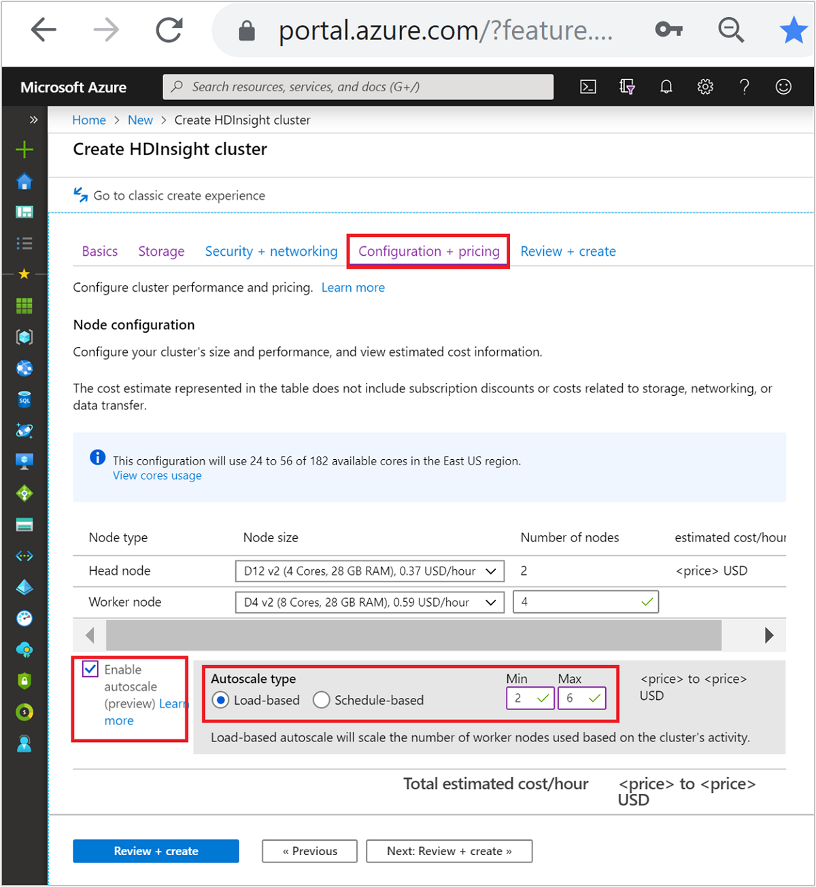
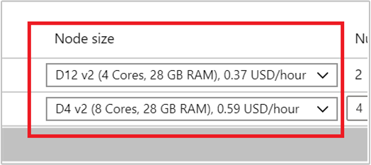
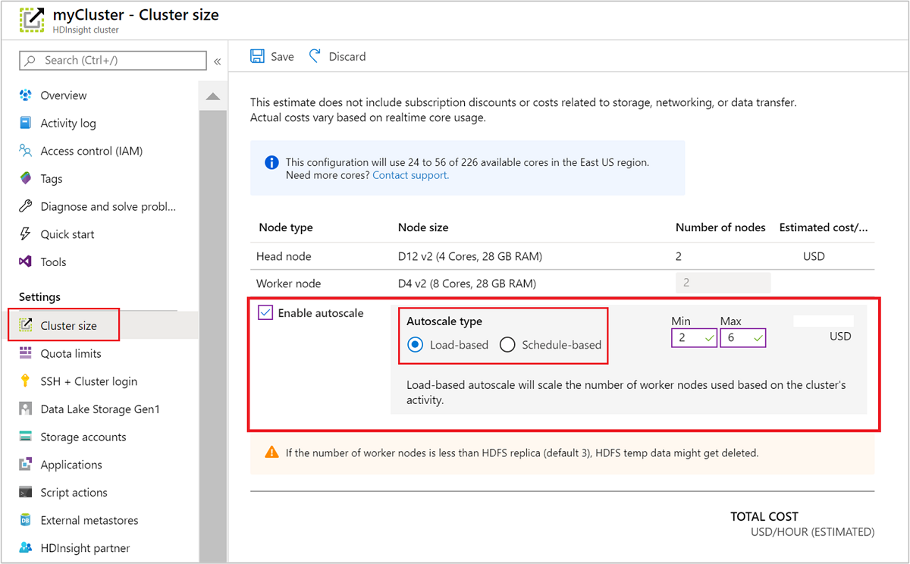

# Automatically scale Azure HDInsight clusters

Azure HDInsight's free Autoscale feature can automatically increase or decrease the number of worker nodes in your cluster based on previously set criteria. You set a minimum and maximum number of nodes during cluster creation, establish the scaling criteria using a day-time schedule or specific performance metrics, and the HDInsight platform does the rest.

## How it works

The Autoscale feature uses two types of conditions to trigger scaling events: thresholds for various cluster performance metrics (called *load-based scaling*) and time-based triggers (called *schedule-based scaling*). Load-based scaling changes the number of nodes in your cluster, within a range that you set, to ensure optimal CPU usage and minimize running cost. Schedule-based scaling changes the number of nodes in your cluster based on operations that you associate with specific dates and times.

The following video provides an overview of the challenges which Autoscale solves and how it can help you to control costs with HDInsight.


> [!VIDEO https://www.youtube.com/embed/UlZcDGGFlZ0?WT.mc_id=dataexposed-c9-niner]

### Choosing load-based or schedule-based scaling

Consider the following factors when choosing a scaling type:

* Load variance: does the load of the cluster follow a consistent pattern at specific times, on specific days? If not, load based scheduling is a better option.
* SLA requirements: Autoscale scaling is reactive instead of predictive. Will there be a sufficient delay between when the load starts to increase and when the cluster needs to be at its target size? If there are strict SLA requirements and the load is a fixed known pattern, 'schedule based' is a better option.

### Cluster metrics

Autoscale continuously monitors the cluster and collects the following metrics:

|Metric|Description|
|---|---|
|Total Pending CPU|The total number of cores required to start execution of all pending containers.|
|Total Pending Memory|The total memory (in MB) required to start execution of all pending containers.|
|Total Free CPU|The sum of all unused cores on the active worker nodes.|
|Total Free Memory|The sum of unused memory (in MB) on the active worker nodes.|
|Used Memory per Node|The load on a worker node. A worker node on which 10 GB of memory is used, is considered under more load than a worker with 2 GB of used memory.|
|Number of Application Masters per Node|The number of Application Master (AM) containers running on a worker node. A worker node that is hosting two AM containers, is considered more important than a worker node that is hosting zero AM containers.|

The above metrics are checked every 60 seconds. You can setup scaling operations for your cluster using any of these metrics.

### Load-based scale conditions

When the following conditions are detected, Autoscale will issue a scale request:

|Scale-up|Scale-down|
|---|---|
|Total pending CPU is greater than total free CPU for more than 3 minutes.|Total pending CPU is less than total free CPU for more than 10 minutes.|
|Total pending memory is greater than total free memory for more than 3 minutes.|Total pending memory is less than total free memory for more than 10 minutes.|

For scale-up, Autoscale issues a scale-up request to add the required number of nodes. The scale-up is based on how many new worker nodes are needed to meet the current CPU and memory requirements.

For scale-down, Autoscale issues a request to remove a certain number of nodes. The scale-down is based on the number of AM containers per node. And the current CPU and memory requirements. The service also detects which nodes are candidates for removal based on current job execution. The scale down operation first decommissions the nodes, and then removes them from the cluster.

### Cluster compatibility

> [!Important]
> The Azure HDInsight Autoscale feature was released for general availability on November 7th, 2019 for Spark and Hadoop clusters and included improvements not available in the preview version of the feature. If you created a Spark cluster prior to November 7th, 2019 and want to use the Autoscale feature on your cluster, the recommended path is to create a new cluster, and enable Autoscale on the new cluster.
>
> Autoscale for Interactive Query (LLAP) and HBase clusters is still in preview. Autoscale is only available on Spark, Hadoop, Interactive Query, and HBase clusters.

The following table describes the cluster types and versions that are compatible with the Autoscale feature.

| Version | Spark | Hive | LLAP | HBase | Kafka | Storm | ML |
|---|---|---|---|---|---|---|---|
| HDInsight 3.6 without ESP | Yes | Yes | Yes | Yes* | No | No | No |
| HDInsight 4.0 without ESP | Yes | Yes | Yes | Yes* | No | No | No |
| HDInsight 3.6 with ESP | Yes | Yes | Yes | Yes* | No | No | No |
| HDInsight 4.0 with ESP | Yes | Yes | Yes | Yes* | No | No | No |

\* HBase clusters can only be configured for schedule-based scaling, not load-based.

## Get started

### Create a cluster with load-based Autoscaling

To enable the Autoscale feature with load-based scaling, complete the following steps as part of the normal cluster creation process:

1. On the **Configuration + pricing** tab, select the **Enable autoscale** checkbox.
1. Select **Load-based** under **Autoscale type**.
1. Enter the intended values for the following properties:  

    * Initial **Number of nodes** for **Worker node**.
    * **Min** number of worker nodes.
    * **Max** number of worker nodes.

    

The initial number of worker nodes must fall between the minimum and maximum, inclusive. This value defines the initial size of the cluster when it's created. The minimum number of worker nodes should be set to three or more. Scaling your cluster to fewer than three nodes can result in it getting stuck in safe mode because of insufficient file replication.  For more information, see [Getting stuck in safe mode](./hdinsight-scaling-best-practices.md#getting-stuck-in-safe-mode).

### Create a cluster with schedule-based Autoscaling

To enable the Autoscale feature with schedule-based scaling, complete the following steps as part of the normal cluster creation process:

1. On the **Configuration + pricing** tab, check the **Enable  autoscale** checkbox.
1. Enter the **Number of nodes** for **Worker node**, which controls the limit for scaling up the cluster.
1. Select the option **Schedule-based** under **Autoscale type**.
1. Select **Configure** to open the **Autoscale configuration** window.
1. Select your timezone and then click **+ Add condition**
1. Select the days of the week that the new condition should apply to.
1. Edit the time the condition should take effect and the number of nodes that the cluster should be scaled to.
1. Add more conditions if needed.

    

The number of nodes must be between 3 and the maximum number of worker nodes that you entered before adding conditions.

### Final creation steps

Select the VM type for worker nodes by selecting a VM from the drop-down list under **Node size**. After you choose the VM type for each node type, you can see the estimated cost range for the whole cluster. Adjust the VM types to fit your budget.



Your subscription has a capacity quota for each region. The total number of cores of your head nodes and the maximum worker nodes can't exceed the capacity quota. However, this quota is a soft limit; you can always create a support ticket to get it increased easily.

> [!Note]  
> If you exceed the total core quota limit, You will receive an error message saying 'the maximum node exceeded the available cores in this region, please choose another region or contact the support to increase the quota.'

For more information on HDInsight cluster creation using the Azure portal, see [Create Linux-based clusters in HDInsight using the Azure portal](hdinsight-hadoop-create-linux-clusters-portal.md).  

### Create a cluster with a Resource Manager template

#### Load-based autoscaling

You can create an HDInsight cluster with load-based Autoscaling an Azure Resource Manager template, by adding an `autoscale` node to the `computeProfile` > `workernode` section with the properties `minInstanceCount` and `maxInstanceCount` as shown in the json snippet below.

```json
{
  "name": "workernode",
  "targetInstanceCount": 4,
  "autoscale": {
      "capacity": {
          "minInstanceCount": 3,
          "maxInstanceCount": 10
      }
  },
  "hardwareProfile": {
      "vmSize": "Standard_D13_V2"
  },
  "osProfile": {
      "linuxOperatingSystemProfile": {
          "username": "[parameters('sshUserName')]",
          "password": "[parameters('sshPassword')]"
      }
  },
  "virtualNetworkProfile": null,
  "scriptActions": []
}
```

#### Schedule-based autoscaling

You can create an HDInsight cluster with schedule-based Autoscaling an Azure Resource Manager template, by adding an `autoscale` node to the `computeProfile` > `workernode` section. The `autoscale` node contains a `recurrence` that has a `timezone` and `schedule` that describes when the change will take place.

```json
{
  "autoscale": {
    "recurrence": {
      "timeZone": "Pacific Standard Time",
      "schedule": [
        {
          "days": [
            "Monday",
            "Tuesday",
            "Wednesday",
            "Thursday",
            "Friday"
          ],
          "timeAndCapacity": {
            "time": "11:00",
            "minInstanceCount": 10,
            "maxInstanceCount": 10
          }
        }
      ]
    }
  },
  "name": "workernode",
  "targetInstanceCount": 4
}
```

### Enable and disable Autoscale for a running cluster

#### Using the Azure portal

To enable Autoscale on a running cluster, select **Cluster size** under **Settings**. Then select **Enable autoscale**. Select the type of Autoscale that you want and enter the options for load-based or schedule-based scaling. Finally, select **Save**.



#### Using the REST API

To enable or disable Autoscale on a running cluster using the REST API, make a POST request to the Autoscale endpoint:

```
https://management.azure.com/subscriptions/{subscription Id}/resourceGroups/{resourceGroup Name}/providers/Microsoft.HDInsight/clusters/{CLUSTERNAME}/roles/workernode/autoscale?api-version=2018-06-01-preview
```

Use the appropriate parameters in the request payload. The json payload below could be used to enable Autoscale. Use the payload `{autoscale: null}` to disable Autoscale.

```json
{ "autoscale": { "capacity": { "minInstanceCount": 3, "maxInstanceCount": 5 } } }
```

See the previous section on [enabling load-based autoscale](#load-based-autoscaling) for a full description of all payload parameters.

## Monitoring Autoscale activities

### Cluster status

The cluster status listed in the Azure portal can help you monitor Autoscale activities.


All of the cluster status messages that you might see are explained in the list below.

| Cluster status | Description |
|---|---|
| Running | The cluster is operating normally. All of the previous Autoscale activities have completed successfully. |
| Updating  | The cluster Autoscale configuration is being updated.  |
| HDInsight configuration  | A cluster scale up or scale down operation is in progress.  |
| Updating Error  | HDInsight met issues during the Autoscale configuration update. Customers can choose to either retry the update or disable autoscale.  |
| Error  | Something is wrong with the cluster, and it isn't usable. Delete this cluster and create a new one.  |

To view the current number of nodes in your cluster, go to the **Cluster size** chart on the **Overview** page for your cluster. Or select **Cluster size** under **Settings**.

### Operation history

You can view the cluster scale-up and scale-down history as part of the cluster metrics. You can also list all scaling actions over the past day, week, or other period of time.

Select **Metrics** under **Monitoring**. Then select **Add metric** and **Number of Active Workers** from the **Metric** dropdown box. Select the button in the upper right to change the time range.


## Other considerations

### Consider the latency of scale up or scale down operations

It can take 10 to 20 minutes for a scaling operation to complete. When setting up a customized schedule, plan for this delay. For example, if you need the cluster size to be 20 at 9:00 AM, set the schedule trigger to an earlier time such as 8:30 AM so that the scaling operation has completed by 9:00 AM.

### Preparation for scaling down

During cluster scaling down process, Autoscale will decommission the nodes to meet the target size. If tasks are running on those nodes, Autoscale will wait until the tasks are completed. Since each worker node also serves a role in HDFS, the temp data will be shifted to the remaining nodes. So you should make sure there's enough space on the remaining nodes to host all the temp data.

The running jobs will continue. The pending jobs will wait for scheduling with fewer available worker nodes.

### Minimum cluster size

Don't scale your cluster down to fewer than three nodes. Scaling your cluster to fewer than three nodes can result in it getting stuck in safe mode because of insufficient file replication.  For more information, see [Getting stuck in safe mode](./hdinsight-scaling-best-practices.md#getting-stuck-in-safe-mode).

## Next steps

Read about guidelines for scaling clusters manually in [Scaling guidelines](hdinsight-scaling-best-practices.md)
