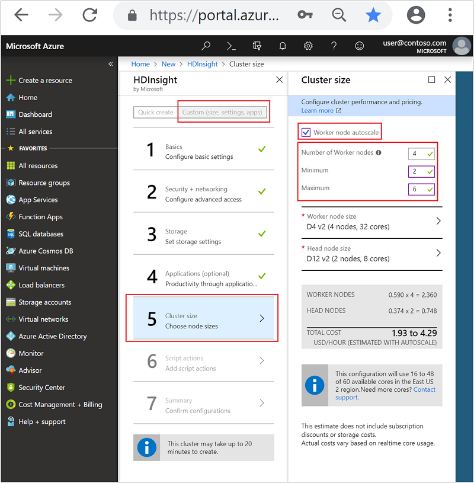
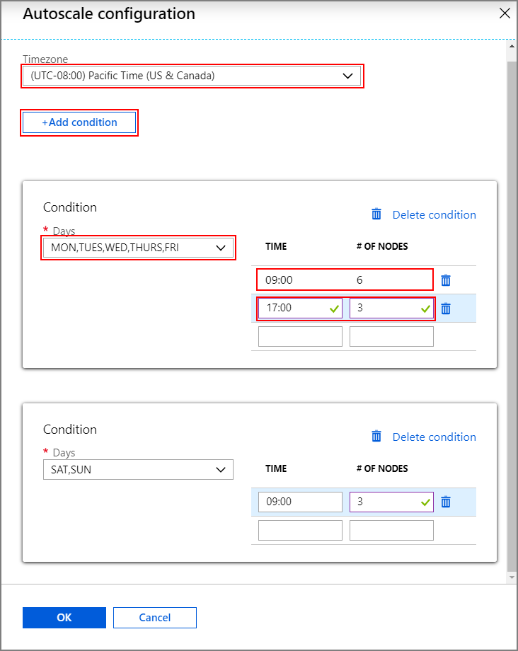
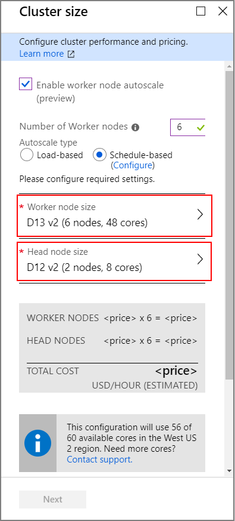
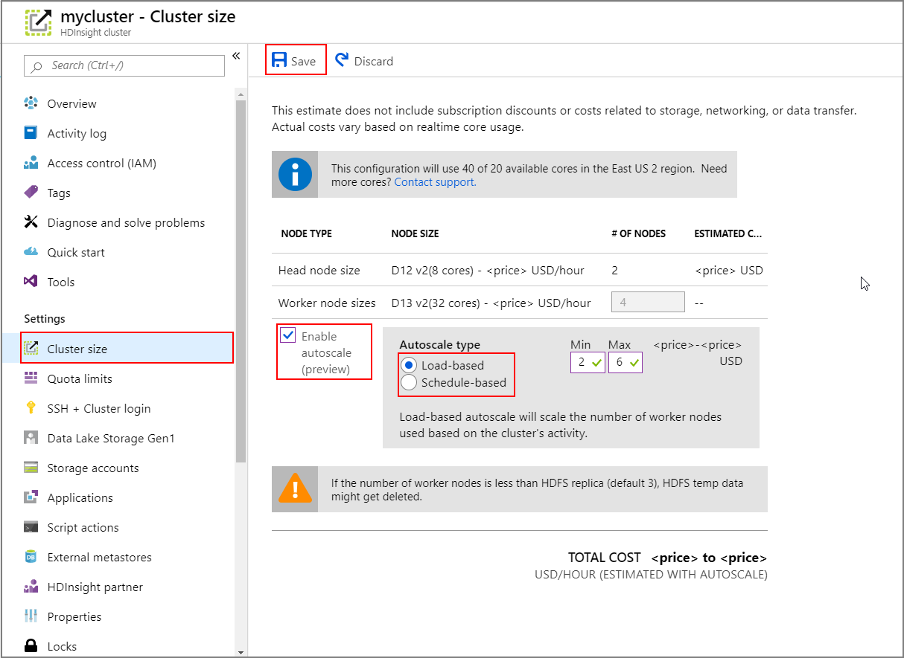
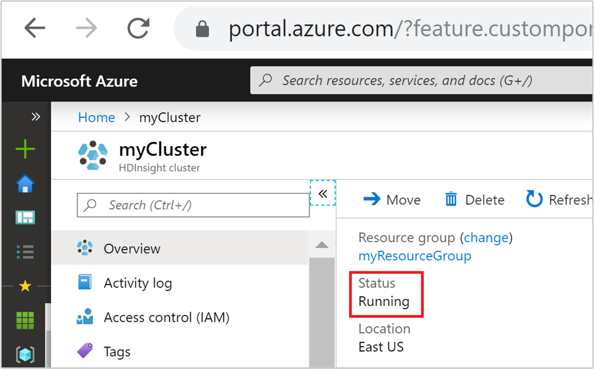
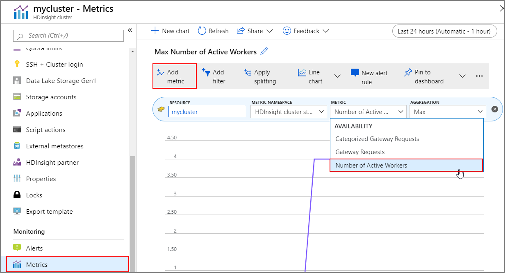

# Automatically scale Azure HDInsight clusters (preview)

> [!Important]
> The Autoscale feature only works for Spark, Hive and MapReduce clusters created after May 8th 2019. 

Azure HDInsight’s cluster Autoscale feature automatically scales the number of worker nodes in a cluster up and down. Other types of nodes in the cluster can't be scaled currently.  During the creation of a new HDInsight cluster, a minimum and maximum number of worker nodes can be set. Autoscale then monitors the resource requirements of the analytics load and scales the number of worker nodes up or down. There's no additional charge for this feature.

## Cluster compatibility

The following table describes the cluster types and versions that are compatible with the Autoscale feature.

| Version | Spark | Hive | LLAP | HBase | Kafka | Storm | ML |
|---|---|---|---|---|---|---|---|
| HDInsight 3.6 without ESP | Yes | Yes | No | No | No | No | No |
| HDInsight 4.0 without ESP | Yes | Yes | No | No | No | No | No |
| HDInsight 3.6 with ESP | Yes | Yes | No | No | No | No | No |
| HDInsight 3.6 with ESP | Yes | Yes | No | No | No | No | No |

## How it works

You can choose load-based scaling or schedule-based scaling for your HDInsight cluster. Load-based scaling changes the number of nodes in your cluster, within a range that you set, to ensure optimal CPU utilization and minimize running cost.

Schedule-based scaling changes the number of nodes in your cluster based on conditions that take effect at specific times. These conditions scale the cluster to a desired number of nodes.

### Metrics monitoring

Autoscale continuously monitors the cluster and collects the following metrics:

* **Total Pending CPU**: The total number of cores required to start execution of all pending containers.
* **Total Pending Memory**: The total memory (in MB) required to start execution of all pending containers.
* **Total Free CPU**: The sum of all unused cores on the active worker nodes.
* **Total Free Memory**: The sum of unused memory (in MB) on the active worker nodes.
* **Used Memory per Node**: The load on a worker node. A worker node on which 10 GB of memory is used, is considered under more load than a worker with 2 GB of used memory.
* **Number of Application Masters per Node**: The number of Application Master (AM) containers running on a worker node. A worker node that is hosting two AM containers, is considered more important than a worker node that is hosting zero AM containers.

The above metrics are checked every 60 seconds. Autoscale makes scale-up and scale-down decisions based on these metrics.

### Load-based cluster scale-up

When the following conditions are detected, Autoscale will issue a scale-up request:

* Total pending CPU is greater than total free CPU for more than 3 minutes.
* Total pending memory is greater than total free memory for more than 3 minutes.

The HDInsight service calculates how many new worker nodes are needed to meet the current CPU and memory requirements, and then issues a scale-up request to add the required number of nodes.

### Load-based cluster scale-down

When the following conditions are detected, Autoscale will issue a scale-down request:

* Total pending CPU is less than total free CPU for more than 10 minutes.
* Total pending memory is less than total free memory for more than 10 minutes.

Based on the number of AM containers per node and the current CPU and memory requirements, Autoscale issues a request to remove a certain number of nodes. The service also detects which nodes are candidates for removal based on current job execution. The scale down operation first decommissions the nodes, and then removes them from the cluster.

## Get started

### Create a cluster with load-based Autoscaling

To enable the Autoscale feature with load-based scaling, complete the following steps as part of the normal cluster creation process:

1. Select **Custom (size, settings, apps)** rather than **Quick create**.
1. On **Custom** step 5 (**Cluster size**), check the **Worker node autoscale** checkbox.
1. Select the option **Load-based** under **Autoscale type**.
1. Enter the desired values for the following properties:  

    * Initial **Number of Worker nodes**.  
    * **Minimum** number of worker nodes.  
    * **Maximum** number of worker nodes.  

    

The initial number of worker nodes must fall between the minimum and maximum, inclusive. This value defines the initial size of the cluster when it is created. The minimum number of worker nodes must be greater than zero.

### Create a cluster with schedule-based Autoscaling

To enable the Autoscale feature with schedule-based scaling, complete the following steps as part of the normal cluster creation process:

1. Select **Custom (size, settings, apps)** rather than **Quick create**.
1. On **Custom** step 5 (**Cluster size**), check the **Worker node autoscale** checkbox.
1. Enter the **Number of Worker nodes**, which controls the limit for scaling up the cluster.
1. Select the option **Schedule-based** under **Autoscale type**.
1. Click **Configure** to open the **Autoscale configuration** window.
1. Select your timezone and then click **+ Add condition**
1. Select the days of the week that the new condition should apply to.
1. Edit the time the condition should take effect and the number of nodes that the cluster should be scaled to.
1. Add more conditions if needed.

    

The number of nodes must be between 1 and the number of worker nodes that you entered before adding conditions.

### Final creation steps

For both load-based and schedule-based scaling, select the VM type for worker nodes by clicking **Worker node size** and **Head node size**. After you choose the VM type for each node type, you can see the estimated cost range for the whole cluster. Adjust the VM types to fit your budget.



Your subscription has a capacity quota for each region. The total number of cores of your head nodes combined with the maximum number of worker nodes can’t exceed the capacity quota. However, this quota is a soft limit; you can always create a support ticket to get it increased easily.

> [!Note]  
> If you exceed the total core quota limit, You will receive an error message saying 'the maximum node exceeded the available cores in this region, please choose another region or contact the support to increase the quota.'

For more information on HDInsight cluster creation using the Azure portal, see [Create Linux-based clusters in HDInsight using the Azure portal](hdinsight-hadoop-create-linux-clusters-portal.md).  

### Create a cluster with a Resource Manager template

#### Load-based autoscaling

You can create an HDInsight cluster with load-based Autoscaling an Azure Resource Manager template, by adding an `autoscale` node to the `computeProfile` > `workernode` section with the properties `minInstanceCount` and `maxInstanceCount` as shown in the json snippet below.

```json
{
  "name": "workernode",
  "targetInstanceCount": 4,
  "autoscale": {
      "capacity": {
          "minInstanceCount": 2,
          "maxInstanceCount": 10
      }
  },
  "hardwareProfile": {
      "vmSize": "Standard_D13_V2"
  },
  "osProfile": {
      "linuxOperatingSystemProfile": {
          "username": "[parameters('sshUserName')]",
          "password": "[parameters('sshPassword')]"
      }
  },
  "virtualNetworkProfile": null,
  "scriptActions": []
}
```

For more information on creating clusters with Resource Manager templates, see [Create Apache Hadoop clusters in HDInsight by using Resource Manager templates](hdinsight-hadoop-create-linux-clusters-arm-templates.md).  

#### Schedule-based autoscaling

You can create an HDInsight cluster with schedule-based Autoscaling an Azure Resource Manager template, by adding an `autoscale` node to the `computeProfile` > `workernode` section. The `autoscale` node contains a `recurrence` that has a `timezone` and `schedule` that describes when the change will take place.

```json
{
  "autoscale": {
    "recurrence": {
      "timeZone": "Pacific Standard Time",
      "schedule": [
        {
          "days": [
            "Monday",
            "Tuesday",
            "Wednesday",
            "Thursday",
            "Friday"
          ],
          "timeAndCapacity": {
            "time": "11:00",
            "minInstanceCount": 10,
            "maxInstanceCount": 10
          }
        },
      ]
    }
  },
  "name": "workernode",
  "targetInstanceCount": 4,
}
```

### Enable and disable Autoscale for a running cluster

To enable Autoscale on a running cluster, select **Cluster size** under **Settings**. Then click **Enable autoscale**. Select the type of Autoscale that you want and enter the options for load-based or schedule-based scaling. Finally, click **Save**.



## Best practices

### Choosing load-based or schedule-based scaling

Consider the following factors before making a decision on which mode to choose:

* Load variance: does the load of the cluster follow a consistent pattern at specific times, on specific days. If not, load based scheduling is a better option.
* SLA requirements: Autoscale scaling is reactive instead of predictive. Will there be a sufficient delay between when the load starts to increase and when the cluster needs to be at its target size? If there are strict SLA requirements and the load is a fixed known pattern, ‘schedule based’ is a better option.

### Consider the latency of scale up or scale down operations

It can take 10 to 20 minutes for a scaling operation to complete. When setting up a customized schedule, plan for this delay. For example, if you need the cluster size to be 20 at 9:00 AM, set the schedule trigger to an earlier time such as 8:30 AM so that the scaling operation has completed by 9:00 AM.

### Preparation for scaling down

During cluster scaling down process, Autoscale will decommission the nodes to meet the target size. If there are running tasks on those nodes, Autoscale will wait until the tasks are completed. Since each worker node also serves a role in HDFS, the temp data will be shifted to the remaining nodes. So you should make sure there is enough space on the remaining nodes to host all the temp data. 

The running jobs will continue to run and finish. The pending jobs will wait to be scheduled as normal with fewer available worker nodes.

## Monitoring

### Cluster status

The cluster status listed in the Azure portal can help you monitor Autoscale activities.



All of the cluster status messages that you might see are explained in the list below.

| Cluster status | Explanation |
|---|---|
| Running | The cluster is operating normally. All of the previous Autoscale activities have completed successfully. |
| Updating  | The cluster Autoscale configuration is being updated.  |
| HDInsight configuration  | A cluster scale up or scale down operation is in progress.  |
| Updating Error  | HDInsight encountered issues during the Autoscale configuration update. Customers can choose to either retry the update or disable autoscale.  |
| Error  | Something is wrong with the cluster, and it is not usable. Delete this cluster and create a new one.  |

To view the current number of nodes in your cluster, go to the **Cluster size** chart on the **Overview** page for your cluster, or click **Cluster size** under **Settings**.

### Operation history

You can view the cluster scale-up and scale-down history as part of the cluster metrics. You can also list all scaling actions over the past day, week, or other period of time.

Select **Metrics** under **Monitoring**. Then click **Add metric** and **Number of Active Workers** from the **Metric** dropdown box. Click the button in the upper right to change the time range.




## Next steps

* Read about best practices for scaling clusters manually in [Scaling best practices](hdinsight-scaling-best-practices.md)
