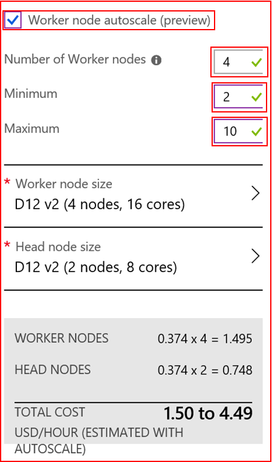

# Automatically scale Azure HDInsight clusters

Azure HDInsight’s cluster Autoscale feature automatically scales the number of worker nodes in a cluster up and down based on load within a predefined range. During the creation of a new HDInsight cluster, a minimum and maximum number of worker nodes can be set. Autoscale then monitors the resource requirements of the analytics load and scales the number of worker nodes up or down accordingly. There is no additional charge for this feature.

## Getting Started

### Create cluster with Azure portal

> [!Note]
> Autoscale is currently only supported for Azure HDInsight Hive, MapReduce and Spark clusters version 3.6.

Follow the steps in [](hdinsight-hadoop-create-linux-clusters-portal.md) and when you reach step 5, **Cluster size**, select **Worker node Autoscale (preview)** as shown below. 

    

By checking this option, you can specify:

* The initial number of worker nodes
* The minimum number of worker nodes
* The maximum number of worker nodes

The initial number of worker nodes must fall between the minimum and maximum, inclusive. This value defines the initial size of the cluster when it is created. The minimum number of worker nodes must be greater than zero.

After you choose the VM type for each node type, you will be able to see the estimated cost range for the whole cluster. You can then adjust these settings to fit your budget.

Your subscription has a capacity quota for each region. The total number of cores of your head nodes combined with the maximum number of worker nodes can’t exceed the capacity quota. However, this quota is a soft limit; you can always create a support ticket to get it increased easily.

> [!Note]
> If you exceed the total core quota limit, You will receive an error message saying ‘the maximum node exceeded the available cores in this region, please choose another region or contact the support to increase the quota.’

### Create cluster with an Resource Manager template

When you create an HDInsight cluster with an Resource Manager template, you need to add the following settings in the “computeProfile” “worker node” section:

```json
{                            
    "name": "workernode",
    "targetInstanceCount": 4,
    "autoscale": {
        "minInstanceCount": 2,
        "maxInstanceCount": 10
    },
    "hardwareProfile": {
        "vmSize": "Standard_D13_V2"
    },
    "osProfile": {
        "linuxOperatingSystemProfile": {
            "username": "[parameters('sshUserName')]",
            "password": "[parameters('sshPassword')]"
        }
    },
    "virtualNetworkProfile": null,
    "scriptActions": []
}
```

### Enable and Disabling Autoscale for a running cluster

Enabling Autoscale for a running cluster is not supported during private preview. It must be enabled during cluster creation.

Disabling Autoscale or modifying Autoscale settings for a running cluster is not supported in private preview. You must delete the cluster and create a new cluster to delete or modify the settings.

## Monitoring

You can view the cluster scale up and down history as part of the cluster metrics. You can list all scale actions over the past day, week, or longer period of time.

## How it works

### Metrics monitoring

Autoscale continuously monitors the cluster and collects the following metrics:

1. **Total Pending CPU**: The total number of cores required to start execution of all pending containers.
2. **Total Pending Memory**: The total memory (in MB) required to start execution of all pending containers.
3. **Total Free CPU**: The sum of all unused cores on the active worker nodes.
4. **Total Free Memory**: The sum of unused memory (in MB) on the active worker nodes.
5. **Used Memory per Node**: The load on a worker node. A worker node on which 10 GB of memory is used, is considered under more load than a worker with 2 GB of used memory.
6. **Number of Application Masters per Node**: The number of Application Master (AM) containers running on a worker node. A worker node hosting 2 AM containers is considered more important than a worker node hosting 0 AM containers.

The above metrics are checked every 60 seconds. Autoscale will make scale up and scale down decisions based on these metrics.

### Cluster scale up

When the following conditions are detected, Autoscale will issue a scale up request:

* Total pending CPU is greater than total free CPU for more than 1 minute.
* Total pending memory is greater than total free memory for more than 1 minute.

We will calculate that N new worker nodes are needed to meet the current CPU and memory requirements and then issue a scale up request by requesting N new worker nodes.

### Cluster scale down

When the following conditions are detected, Autoscale will issue a scale down request:

* Total pending CPU is less than total free CPU for more than 10 minutes.
* Total pending memory is less than total free memory for more than 10 minutes.

Based on the number of AM containers per node as well as the current CPU and memory requirements, Autoscale will issue a request to remove N nodes, specifying which nodes are potential candidates for removal. By default, two nodes will be removed in one cycle.

## Next steps

* Read about best practices for scaling clusters manually in [Scaling best practices](hdinsight-scaling-best-practices.md)
