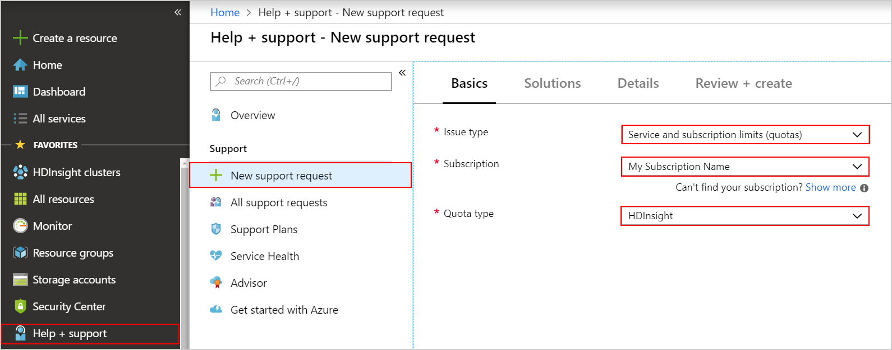

# Capacity planning for HDInsight clusters

Before deploying an HDInsight cluster, plan for the desired cluster capacity by determining the needed performance and scale. This planning helps optimize both usability and costs. Some cluster capacity decisions can't be changed after deployment. If the performance parameters change, a cluster can be dismantled and re-created without losing stored data.

The key questions to ask for capacity planning are:

* In which geographic region should you deploy your cluster?
* How much storage do you need?
* What cluster type should you deploy?
* What size and type of virtual machine (VM) should your cluster nodes use?
* How many worker nodes should your cluster have?

## Choose an Azure region

The Azure region determines where your cluster is physically provisioned. To minimize the latency of reads and writes, the cluster should be near your data.

HDInsight is available in many Azure regions. To find the closest region, see [Products available by region](https://azure.microsoft.com/en-us/global-infrastructure/services/?products=hdinsight/).

## Choose storage location and size

### Location of default storage

The default storage, either an Azure Storage account or Azure Data Lake Storage, must be in the same location as your cluster. Azure Storage is available at all locations. Data Lake Storage Gen1 is available in some regions - see the current [Data Lake Storage availability](https://azure.microsoft.com/en-us/global-infrastructure/services/?products=storage).

### Location of existing data

If you already have a storage account or Data Lake Storage containing your data and want to use this storage as your cluster's default storage, then you must deploy your cluster at that same location.

### Storage size

After you have an HDInsight cluster deployed, you can attach additional Azure Storage accounts or access other Data Lake Storage. All your storage accounts must reside in the same location as your cluster. A Data Lake Storage can be in a different location, although this may introduce some data read/write latency.

Azure Storage has some [capacity limits](../azure-subscription-service-limits.md#storage-limits), while  Data Lake Storage Gen1 is virtually unlimited.

A cluster can access a combination of different storage accounts. Typical examples include:

* When the amount of data is likely to exceed the storage capacity of a single blob storage
container.
* When the rate of access to the blob container might exceed the threshold where throttling occurs.
* When you want to make data, you've already uploaded to a blob container available to the
cluster.
* When you want to isolate different parts of the storage for reasons of security, or to simplify
administration.

For a 48-node cluster, we recommend 4 to 8 storage accounts. Although there may already be sufficient total storage, each storage account provides additional networking bandwidth for the compute nodes. When you have multiple storage accounts, use a random name for each storage account, without a prefix. The purpose of random naming is reducing the chance of storage bottlenecks (throttling) or common-mode failures across all accounts. For better performance, use only one container per storage account.

## Choose a cluster type

The cluster type determines the workload your HDInsight cluster is configured to run, such as [Apache Hadoop](https://hadoop.apache.org/), [Apache Storm](https://storm.apache.org/), [Apache Kafka](https://kafka.apache.org/), or [Apache Spark](https://spark.apache.org/). For a detailed description of the available cluster types, see [Introduction to Azure HDInsight](hdinsight-overview.md#cluster-types-in-hdinsight). Each cluster type has a specific deployment topology that includes requirements for the size and number of nodes.

## Choose the VM size and type

Each cluster type has a set of node types, and each node type has specific options for their VM size and type.

To determine the optimal cluster size for your application, you can benchmark cluster capacity and increase the size as indicated. For example, you can use a simulated workload, or a *canary query*. With a simulated workload, you run your expected workloads on different size clusters, gradually increasing the size until the desired performance is reached. A canary query can be inserted periodically among the other production queries to show whether the cluster has enough resources.

For more information on how to choose the right VM family for your workload, see [Selecting the right VM size for your cluster](hdinsight-selecting-vm-size.md).

## Choose the cluster scale

A cluster's scale is determined by the quantity of its VM nodes. For all cluster types, there are node types that have a specific scale, and node types that support scale-out. For example, a cluster may  require exactly three [Apache ZooKeeper](https://zookeeper.apache.org/) nodes or two Head nodes. Worker nodes that do data processing in a distributed fashion can benefit from scaling out, by adding additional worker nodes.

Depending on your cluster type, increasing the number of worker nodes adds additional computational capacity (such as more cores), but may also add to the total amount of memory required for the entire cluster to support in-memory storage of data being processed. As with the choice of VM size and type, selecting the right cluster scale is typically reached empirically, using simulated workloads or canary queries.

You can scale out your cluster to meet peak load demands, then scale it back down when those extra nodes are no longer needed. The [Autoscale feature](hdinsight-autoscale-clusters.md) allows you automatically scale your cluster based upon predetermined metrics and timings. For more information on scaling your clusters manually, see [Scale HDInsight clusters](hdinsight-scaling-best-practices.md).

### Cluster lifecycle

You are charged for a cluster's lifetime. If there are only specific times that you need your cluster up and running, you can [create on-demand clusters using Azure Data Factory](hdinsight-hadoop-create-linux-clusters-adf.md). You can also create PowerShell scripts that provision and delete your cluster, and then schedule those scripts using [Azure Automation](https://azure.microsoft.com/services/automation/).

> [!NOTE]  
> When a cluster is deleted, its default Hive metastore is also deleted. To persist the metastore for the next cluster re-creation, use an external metadata store such as Azure Database or [Apache Oozie](https://oozie.apache.org/).
<!-- see [Using external metadata stores](hdinsight-using-external-metadata-stores.md). -->

### Isolate cluster job errors

Sometimes errors can occur due to the parallel execution of multiple maps and reduce components on a multi-node cluster. To help isolate the issue, try distributed testing by running concurrent multiple jobs on a single worker node cluster, then expand this approach to run multiple jobs concurrently on clusters containing more than one node. To create a single-node HDInsight cluster in Azure, use the *Custom(size,settings,apps)* option  and use a value of 1 for *Number of Worker nodes* in the **Cluster size** section when provisioning a new cluster in the portal.

## Quotas

After determining your target cluster VM size, scale, and type, check the current quota capacity limits of your subscription. When you reach a quota limit, you may not be able to deploy new clusters, or scale out existing clusters by adding more worker nodes. The only quota limit is the CPU Cores quota that exists at the region level for each subscription. For example, your subscription may have 30 core limit in the East US region. If you need to request a quota increase, do the following steps:

1. Sign in to the [Azure portal](https://portal.azure.com/).
1. Select **Help + support** on the bottom-left side of the page.
1. Select **New support request**.
1. On the **New support request** page, under **Basics** tab, select the following options:

   - **Issue type**: **Service and subscription limits (quotas)**
   - **Subscription**: the subscription you want to modify
   - **Quota type**: **HDInsight**

     

1. Select **Next: Solutions >>**.
1. On the **Details** page, enter a description of the issue, select the severity of the issue, your preferred contact method, and other required fields.
1. Select **Next: Review + create >>**.
1. On the **Review + create** tab, select **Create**.

> [!NOTE]  
> If you need to increase the HDInsight core quota in a private region, [submit a whitelist request](https://aka.ms/canaryintwhitelist).

You can [contact support to request a quota increase](https://docs.microsoft.com/azure/azure-supportability/resource-manager-core-quotas-request).

However, there are some fixed quota limits, for example a single Azure subscription can have at most 10,000 cores. For details on these limits, see [Azure subscription and service limits, quotas, and constraints](https://docs.microsoft.com/azure/azure-subscription-service-limits).

## Next steps

* [Set up clusters in HDInsight with Apache Hadoop, Spark, Kafka, and more](hdinsight-hadoop-provision-linux-clusters.md): Learn how to set up and configure clusters in HDInsight with Apache Hadoop, Spark, Kafka, Interactive Hive, HBase, ML Services, or Storm.
* [Monitor cluster performance](hdinsight-key-scenarios-to-monitor.md): Learn about key scenarios to monitor for your HDInsight cluster that might affect your cluster's capacity.
