# Use Apache Ambari to optimize HDInsight cluster configurations

HDInsight provides [Apache Hadoop](https://hadoop.apache.org/) clusters for large-scale data processing applications. Managing,  monitoring, and optimizing these complex multi-node clusters can be challenging. [Apache Ambari](https://ambari.apache.org/) is a web interface to  manage and monitor HDInsight Linux clusters.  For Windows clusters, use the [Ambari REST API](hdinsight-hadoop-manage-ambari-rest-api.md).

For an introduction to using the Ambari Web UI, see [Manage HDInsight clusters by using the Apache Ambari Web UI](hdinsight-hadoop-manage-ambari.md)

Log in to  Ambari at `https://CLUSTERNAME.azurehdidnsight.net` with your cluster credentials. The initial screen  displays an overview dashboard.

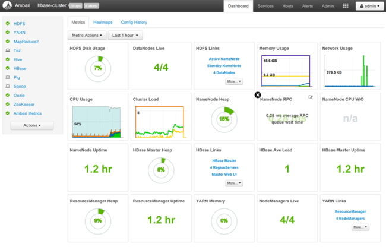

The Ambari web UI can be used to manage hosts, services, alerts, configurations, and views. Ambari can't be used to create an HDInsight cluster, upgrade services, manage stacks and versions, decommission or recommission hosts, or add services to the cluster.

## Manage your cluster's configuration

Configuration settings help tune a particular service. To modify a service's configuration settings, select the service from the **Services** sidebar (on the left), and then navigate to the **Configs** tab in the service detail page.

### Modify NameNode Java heap size

The NameNode Java heap size depends on many factors such as the load on the cluster, the numbers of files, and the numbers of blocks. The default size of 1 GB works well with most clusters, although some workloads can require more or less memory. 

To modify the NameNode Java heap size:

1. Select **HDFS** from the Services sidebar and navigate to the **Configs** tab.

    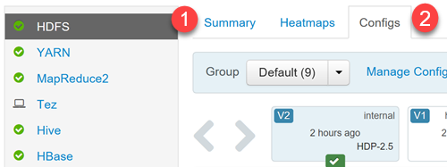

1. Find the setting **NameNode Java heap size**. You can also use the **filter** text box to type and find a particular setting. Select the **pen** icon beside the setting name.

    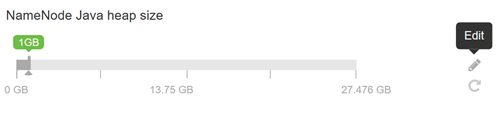

1. Type the new value in the text box, and then press **Enter** to save the change.

    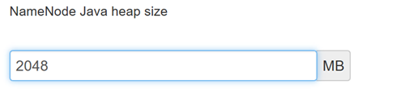

1. The NameNode Java heap size is changed to 1 GB from 2 GB.

    

1. Save your changes by clicking on the green **Save** button on the top of the configuration screen.

    

## Apache Hive optimization

The following sections describe configuration options for optimizing overall Apache Hive performance.

1. To modify Hive configuration parameters, select **Hive** from the Services sidebar.
1. Navigate to the **Configs** tab.

### Set the Hive execution engine

Hive provides two execution engines: [Apache Hadoop MapReduce](https://hadoop.apache.org/docs/r1.2.1/mapred_tutorial.html)  and [Apache TEZ](https://tez.apache.org/). Tez is faster than MapReduce. HDInsight Linux clusters have Tez as the default execution engine. To change the execution engine:

1. In the Hive **Configs** tab, type **execution engine** in the filter box.

    

1. The **Optimization** property's default value is **Tez**.

    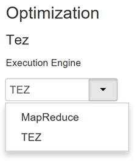

### Tune mappers

Hadoop tries to split (*map*) a single file into multiple files and process the resulting files in parallel. The number of mappers depends on the number of splits. The following two configuration parameters drive the number of splits for the Tez execution engine:

* `tez.grouping.min-size`: Lower limit on the size of a grouped split, with a default value of 16 MB (16,777,216 bytes).
* `tez.grouping.max-size`: Upper limit on the size of a grouped split, with a default value of 1 GB (1,073,741,824 bytes).

As a performance rule of thumb, decrease both of these parameters to improve latency, increase for more throughput.

For example, to set four mapper tasks for a data size of 128 MB, you would set both parameters to 32 MB each (33,554,432 bytes).

1. To modify the limit parameters, navigate to the **Configs** tab of the Tez service. Expand the **General** panel, and  locate the `tez.grouping.max-size` and `tez.grouping.min-size` parameters.

1. Set both parameters to **33,554,432** bytes (32 MB).

    
 
These changes  affect all Tez jobs across the server. To get an optimal result, choose appropriate parameter values.

### Tune reducers

[Apache ORC](https://orc.apache.org/) and [Snappy](https://google.github.io/snappy/) both offer high performance. However, Hive may have too few reducers by default, causing bottlenecks.

For example, say you have an input data size of 50 GB. That data in ORC format with Snappy compression is 1 GB. Hive estimates the number of reducers needed as:     (number of bytes input to mappers / `hive.exec.reducers.bytes.per.reducer`).

With the default settings, this example is 4 reducers.

The `hive.exec.reducers.bytes.per.reducer` parameter specifies the number of bytes processed per reducer. The default value is 64 MB. Tuning this value down increases parallelism and may improve performance. Tuning it too low could also produce too many reducers, potentially adversely affecting performance. This parameter is based on your particular data requirements, compression settings, and other environmental factors.

1. To modify the parameter, navigate to the Hive **Configs** tab and find the **Data per Reducer** parameter on the Settings page.

    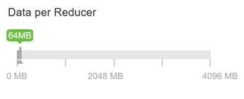
 
1. Select **Edit** to modify the value to 128 MB (134,217,728 bytes), and then press **Enter** to save.

    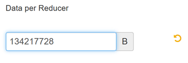
  
    Given an input size of 1,024 MB, with 128 MB of data per reducer, there are  8 reducers (1024/128).

1. An incorrect value for the **Data per Reducer** parameter may result in a large number of reducers, adversely affecting query performance. To limit the maximum number of reducers, set `hive.exec.reducers.max` to an appropriate value. The default value is 1009.

### Enable parallel execution

A Hive query is executed in one or more stages. If the independent stages can be run in parallel, that will increase query performance.

1.	To enable parallel query execution, navigate to the Hive **Config** tab and search for the `hive.exec.parallel` property. The default value is false. Change the value to true, and then press **Enter** to save the value.
 
1.	To limit the number of jobs to run in parallel, modify the `hive.exec.parallel.thread.number` property. The default value is 8.

    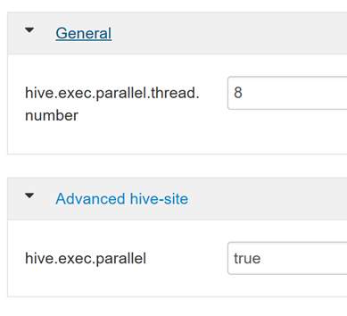

### Enable vectorization

Hive processes data row by row. Vectorization directs Hive to process data in blocks of 1,024 rows rather than one row at a time. Vectorization is only applicable to the ORC file format.

1. To enable a vectorized query execution, navigate to the Hive **Configs** tab and search for the `hive.vectorized.execution.enabled` parameter. The default value is true for Hive 0.13.0 or later.
 
1. To enable vectorized execution for the reduce side of the query, set the `hive.vectorized.execution.reduce.enabled` parameter to true. The default value is false.

    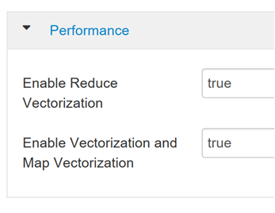

### Enable cost-based optimization (CBO)

By default, Hive follows a set of rules to find one optimal query execution plan. Cost-based optimization (CBO) evaluates multiple plans to execute a query and assigns a cost to each plan, then determines the cheapest plan to execute a query.

To enable CBO, navigate to the Hive **Configs** tab and search for `parameter hive.cbo.enable`, then switch the toggle button to **On**.

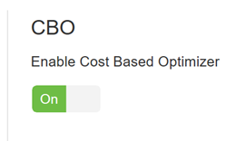

The following additional configuration parameters increase Hive query performance when CBO is enabled:

* `hive.compute.query.using.stats`

    When set to true, Hive uses statistics stored in its metastore to answer simple queries like `count(*)`.

    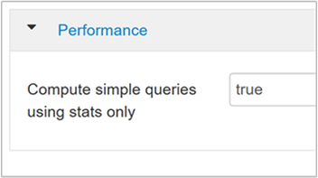

* `hive.stats.fetch.column.stats`

    Column statistics are created when CBO is enabled. Hive uses column statistics, which are stored in metastore, to optimize queries. Fetching column statistics for each column takes longer when the number of columns is high. When set to false, this setting disables fetching column statistics from the metastore.

    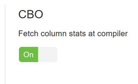

* `hive.stats.fetch.partition.stats`

    Basic partition statistics such as number of rows, data size, and file size are stored in metastore. When set to true, the partition stats are fetched from metastore. When false, the file size is fetched from the file system, and the number of rows is fetched from the row schema.

    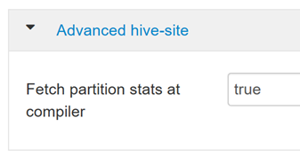

### Enable intermediate compression

Map tasks create intermediate files that are used by the reducer tasks. Intermediate compression shrinks the intermediate file size.

Hadoop jobs are usually I/O bottlenecked. Compressing data can speed up I/O and overall network transfer.

The available compression types are:

| Format | Tool | Algorithm | File Extension | Splittable? |
| -- | -- | -- | -- | -- |
| Gzip | Gzip | DEFLATE | .gz | No |
| Bzip2 | Bzip2 | Bzip2 |.bz2 | Yes |
| LZO | Lzop | LZO | .lzo | Yes, if indexed |
| Snappy | N/A | Snappy | Snappy | No |

As a general rule, having the compression method splittable is important, otherwise very few mappers will be created. If the input data is text, `bzip2` is the best option. For ORC format, Snappy is the fastest compression option.

1. To enable intermediate compression, navigate to the Hive **Configs** tab, and then set the `hive.exec.compress.intermediate` parameter to true. The default value is false.

    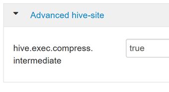

    > [!NOTE]  
    > To compress intermediate files, choose a compression codec with lower CPU cost, even if the codec doesn't have a high compression output.

1. To set the intermediate compression codec, add the custom property `mapred.map.output.compression.codec` to the `hive-site.xml` or `mapred-site.xml` file.

1. To add a custom setting:

    a. Navigate to the Hive **Configs** tab and select the **Advanced** tab.

    b. Under the **Advanced** tab, find and expand the **Custom hive-site** pane.

    c. Click the link **Add Property** at the bottom of the Custom hive-site pane.

    d. In the Add Property window, enter `mapred.map.output.compression.codec` as the key and `org.apache.hadoop.io.compress.SnappyCodec` as the value.

    e. Click **Add**.

    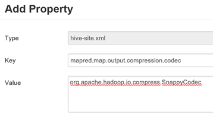

    This will compress the intermediate file using Snappy compression. Once the property is added, it appears in the Custom hive-site pane.

    > [!NOTE]  
    > This procedure modifies the `$HADOOP_HOME/conf/hive-site.xml` file.

### Compress final output

The final Hive output can also be compressed.

1. To compress the final Hive output, navigate to the Hive **Configs** tab, and then set the `hive.exec.compress.output` parameter to true. The default value is false.

1. To choose the output compression codec, add the `mapred.output.compression.codec` custom property to the Custom hive-site pane, as described in the previous section's step 3.

    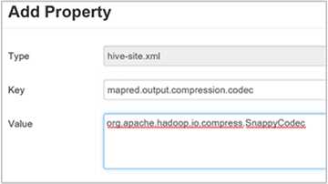

### Enable speculative execution

Speculative execution launches a certain number of duplicate tasks in order to detect and blacklist the slow-running task tracker, while improving the overall job execution by optimizing individual task results.

Speculative execution shouldn't be turned on for long-running MapReduce tasks with large amounts of input.

* To enable speculative execution, navigate to the Hive **Configs** tab, and then set the `hive.mapred.reduce.tasks.speculative.execution` parameter to true. The default value is false.

    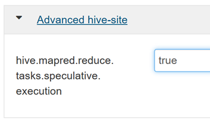

### Tune dynamic partitions

Hive allows for creating dynamic partitions when inserting records into a table, without predefining each and every partition. This is a powerful feature, although it may result in the creation of a large number of partitions and a large number of files for each partition.

1. For Hive to do dynamic partitions, the `hive.exec.dynamic.partition` parameter value should be true (the  default).

1. Change the dynamic partition mode to *strict*. In strict mode, at least one partition has to be static. This prevents queries without the partition filter in the WHERE clause, that is, *strict* prevents queries that scan all partitions. Navigate to the Hive **Configs** tab, and then set `hive.exec.dynamic.partition.mode` to **strict**. The default value is **nonstrict**.
 
1. To limit the number of dynamic partitions to be created, modify the `hive.exec.max.dynamic.partitions` parameter. The default value is 5000.
 
1. To limit the total number of dynamic partitions per node, modify `hive.exec.max.dynamic.partitions.pernode`. The default value is 2000.

### Enable local mode

Local mode enables Hive to perform all tasks of a job on a single machine, or sometimes in a single process. This improves query performance if the input data is small and the overhead of launching tasks for queries consumes a significant percentage of the overall query execution.

To enable local mode, add the `hive.exec.mode.local.auto` parameter to the Custom hive-site panel, as explained in step 3 of the [Enable intermediate compression](#enable-intermediate-compression) section.

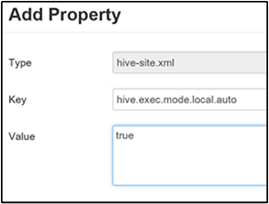

### Set single MapReduce MultiGROUP BY

When this property is set to true, a MultiGROUP BY query with common group-by keys  generates a single MapReduce job.  

To enable this behavior, add the `hive.multigroupby.singlereducer` parameter to the Custom hive-site pane, as explained in step 3 of the [Enable intermediate compression](#enable-intermediate-compression) section.

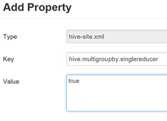

### Additional Hive optimizations

The following sections describe additional Hive-related optimizations you can set.

#### Join optimizations

The default join type in Hive is a *shuffle join*. In Hive,  special mappers read the input and emit a join key/value pair to an intermediate file. Hadoop sorts and merges these pairs in a shuffle stage. This shuffle stage is expensive. Selecting the right join based on your data can significantly improve performance.

| Join Type | When | How | Hive settings | Comments |
| -- | -- | -- | -- | -- |
| Shuffle Join | <ul><li>Default choice</li><li>Always works</li></ul> | <ul><li>Reads from part of one of the tables</li><li>Buckets and sorts on Join key</li><li>Sends one bucket to each reduce</li><li>Join is done on the Reduce side</li></ul> | No significant Hive setting needed | Works every time |
| Map Join | <ul><li>One table can fit in memory</li></ul> | <ul><li>Reads small table into memory hash table</li><li>Streams through part of the large file</li><li>Joins each record from hash table</li><li>Joins are by the mapper alone</li></ul> | `hive.auto.confvert.join=true` | Very fast, but limited |
| Sort Merge Bucket | If both tables are: <ul><li>Sorted the same</li><li>Bucketed the same</li><li>Joining on the sorted/bucketed column</li></ul> | Each process: <ul><li>Reads a bucket from each table</li><li>Processes the row with the lowest value</li></ul> | `hive.auto.convert.sortmerge.join=true` | Very efficient |

#### Execution engine optimizations

Additional recommendations for optimizing the Hive execution engine:

| Setting | Recommended | HDInsight Default |
| -- | -- | -- |
| `hive.mapjoin.hybridgrace.hashtable` | True = safer, slower; false = faster | false |
| `tez.am.resource.memory.mb` | 4-GB upper bound for most | Auto-Tuned |
| `tez.session.am.dag.submit.timeout.secs` | 300+ | 300 |
| `tez.am.container.idle.release-timeout-min.millis` | 20000+ | 10000 |
| `tez.am.container.idle.release-timeout-max.millis` | 40000+ | 20000 |

## Apache Pig optimization

[Apache Pig](https://pig.apache.org/) properties can be  modified from the Ambari web UI to tune Pig queries. Modifying Pig properties from Ambari directly modifies the Pig properties in the `/etc/pig/2.4.2.0-258.0/pig.properties` file.

1. To modify Pig properties, navigate to the Pig **Configs** tab, and then expand the **Advanced pig-properties** pane.

1. Find, uncomment, and change the value of the property you wish to modify.

1. Select **Save** on the top-right side of the window to save the new value. Some properties may require a service restart.

    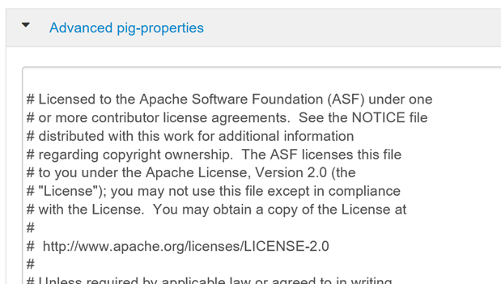
 
> [!NOTE]  
> Any session-level settings override property values in the `pig.properties` file.

### Tune execution engine

Two execution engines are available to execute Pig scripts: MapReduce and Tez. Tez is an optimized engine and is much faster than MapReduce.

1. To modify the execution engine, in the **Advanced pig-properties** pane, find the property `exectype`.

1. The default value is **MapReduce**. Change it to **Tez**.

### Enable local mode

Similar to Hive, local mode is used to speed jobs with relatively smaller amounts of data.

1. To enable the local mode, set `pig.auto.local.enabled` to **true**. The default value is false.

1. Jobs with an input data size less than the `pig.auto.local.input.maxbytes` property value are considered to be small jobs. The default value is 1 GB.

### Copy user jar cache

Pig copies the JAR files required by UDFs to a distributed cache  to make them available for task nodes. These jars do not change frequently. If enabled, the `pig.user.cache.enabled` setting allows jars to be placed in a cache to reuse them for jobs run by the same user. This results in a minor increase in job performance.

1. To enable, set `pig.user.cache.enabled` to true. The default is false.

1. To set the base path of the cached jars, set `pig.user.cache.location` to the base path. The default is `/tmp`.

### Optimize performance with memory settings

The following memory settings can help optimize Pig script performance.

* `pig.cachedbag.memusage`: The amount of memory allocated to a bag. A bag is collection of tuples. A tuple is an ordered set of fields, and a field is a piece of data. If the data in a bag is beyond the allocated memory, it is spilled to disk. The default value is 0.2, which represents 20 percent of available memory. This memory is shared across all bags in an application.

* `pig.spill.size.threshold`: Bags larger than this spill size threshold (in bytes) are  spilled to disk. The default value is 5 MB.

### Compress temporary files

Pig generates temporary files during job execution. Compressing the temporary files results in a performance increase when reading or writing files to disk. The following settings can be used to compress temporary files.

* `pig.tmpfilecompression`: When true, enables temporary file compression. The default value is false.

* `pig.tmpfilecompression.codec`: The compression codec to use for compressing the temporary files. The recommended compression codecs are [LZO](https://www.oberhumer.com/opensource/lzo/) and Snappy for lower CPU utilization.

### Enable split combining

When enabled, small files are combined for fewer map tasks. This improves the efficiency of jobs with many small files. To enable, set `pig.noSplitCombination` to true. The default value is false.

### Tune mappers

The number of mappers is controlled by modifying the property `pig.maxCombinedSplitSize`. This specifies the size of the data to be processed by a single map task. The default value is the filesystem's default block size. Increasing this value results in a decrease of the number of mapper tasks.

### Tune reducers

The number of reducers is calculated based on the parameter `pig.exec.reducers.bytes.per.reducer`. The parameter specifies the number of bytes processed per reducer, by default  1 GB. To limit the maximum number of reducers, set the `pig.exec.reducers.max` property, by  default  999.

## Apache HBase optimization with the Ambari web UI

[Apache HBase](https://hbase.apache.org/) configuration is modified from the **HBase Configs** tab. The following sections describe  some of the important configuration settings that affect HBase performance.

### Set HBASE_HEAPSIZE

The HBase heap size specifies the maximum amount of heap to be used in megabytes by *region* and *master* servers. The default value is 1,000 MB. This should be tuned for the cluster workload.

1. To modify, navigate to the **Advanced HBase-env** pane in the HBase **Configs** tab, and then find the `HBASE_HEAPSIZE` setting.

1. Change the default value to 5,000 MB.

    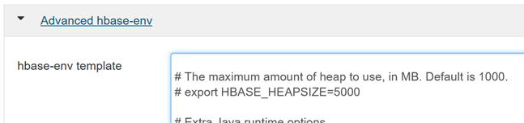

### Optimize read-heavy workloads

The following configurations are important to improve the performance of read-heavy workloads.

#### Block cache size

The block cache is the read cache. Its size is controlled by the `hfile.block.cache.size` parameter. The default value is 0.4, which is 40 percent of the total region server memory. The larger the block cache size, the faster the random reads will be.

1. To modify this parameter, navigate to the **Settings** tab in the HBase **Configs** tab, and then locate **% of RegionServer Allocated to Read Buffers**.

    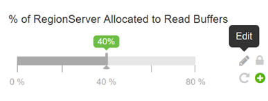
 
1. To change the value, select the **Edit** icon.

#### Memstore size

All edits are stored in the memory buffer, called a *Memstore*. This increases the total amount of data that can be written to disk in a single operation, and it speeds subsequent access to the recent edits. The Memstore size is defined by the following two parameters:

* `hbase.regionserver.global.memstore.UpperLimit`: Defines the maximum percentage of the region server that Memstore combined can use.

* `hbase.regionserver.global.memstore.LowerLimit`: Defines the minimum percentage of the region server that Memstore combined can use.

To optimize for random reads, you can reduce the Memstore upper and lower limits.

#### Number of rows fetched when scanning from disk

The `hbase.client.scanner.caching` setting defines the number of rows read from disk when the `next` method is called on a scanner.  The default value is 100. The higher the number, the fewer the remote calls made from the client to the region server, resulting in faster scans. However, this will also increase memory pressure on the client.

> [!IMPORTANT]  
> Do not set the value such that the time between invocation of the next method on a scanner is greater than the scanner timeout. The scanner timeout duration is defined by the `hbase.regionserver.lease.period` property.

### Optimize write-heavy workloads

The following configurations are important to improve the performance of write-heavy workloads.

#### Maximum region file size

HBase stores  data in an internal file format, called *HFile*. The property `hbase.hregion.max.filesize` defines the size of a single HFile for a region.  A region is split into two regions if the sum of all HFiles in a region is greater than this setting.
 
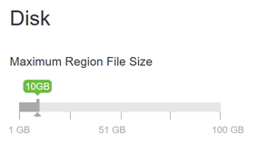

The larger the region file size, the smaller the number of splits. You can increase the file size  to determine a value that results in the maximum write performance.

#### Avoid update blocking

* The property `hbase.hregion.memstore.flush.size` defines the size at which Memstore is flushed to disk. The default size is 128 MB.

* The Hbase region block multiplier is defined by `hbase.hregion.memstore.block.multiplier`. The default value is 4. The maximum allowed is 8.

* HBase blocks updates if the Memstore is (`hbase.hregion.memstore.flush.size` * `hbase.hregion.memstore.block.multiplier`) bytes.

    With the default values of flush size and block multiplier, updates are blocked when Memstore is  128 * 4 = 512 MB in size. To reduce the update blocking count, increase the value of `hbase.hregion.memstore.block.multiplier`.

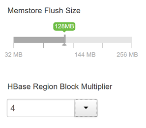

### Define Memstore size

Memstore size is defined by the `hbase.regionserver.global.memstore.UpperLimit` and `hbase.regionserver.global.memstore.LowerLimit` parameters. Setting these values equal to each other reduces pauses during writes (also causing more frequent flushing) and results in increased write performance.

### Set Memstore local allocation buffer

Memstore local allocation buffer usage is determined by the property `hbase.hregion.memstore.mslab.enabled`. When enabled (true), this prevents heap fragmentation during heavy write operation. The default value is true.
 
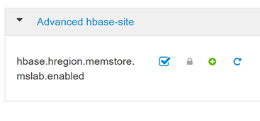

## Next steps

* [Manage HDInsight clusters with the Apache Ambari web UI](hdinsight-hadoop-manage-ambari.md)
* [Apache Ambari REST API](hdinsight-hadoop-manage-ambari-rest-api.md)
