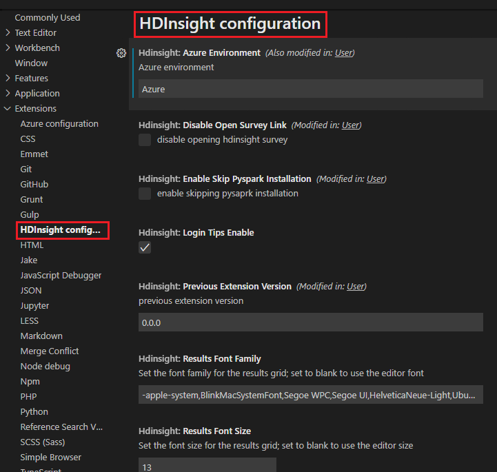

# HDInsight configuration settings reference

The Spark & Hive tools Extension for Visual Studio Code is highly configurable. This page describes the key settings you can work with.  

For general information about working with settings in VS Code, refer to [User and workspace settings](https://code.visualstudio.com/docs/getstarted/settings), as well as the [Variables reference](https://code.visualstudio.com/docs/editor/variables-reference) for information about predefined variable support.

## How to open the HDInsight configuration

1. Open a folder first to create workspace settings.
2. Press **Ctrl + Shift + P**, or navigit to **View** -> **Command  Palettle...** to show all commands.
3. Search **Set Configuration**.
4. Expand **Extensions** in the left directory, and select **HDInsight configuration**.

 

## General settings   

|  Property   | Default | Description   |
| ----- | ----- |----- |
| Hdinsight: Azure Enviroment | Azure | Azure environment |
| Hdinsight: Disable Open Survey Link | Checked | Enable/Disable opening hdinsight survey |
| Hdinsight: Enable Skip Pyspark Installation | Unchecked | Enable/Disable skipping pyspark installation |
| Hdinsight: Login Tips Enable | Unchecked | When this option is checked, there will be a prompt when logging in to Azure |
| Hdinsight: Previous Extension Version | Display the version number of the current extension | Show the previous extension version|
| Hdinsight: Results Font Famliy | -apple-system,BlinkMacSystemFont,Segoe WPC,Segoe UI,HelveticaNeue-Light,Ubuntu,Droid Sans,sans-serif | Set the font famliy for the results grid; set to blank to use the editor font |
| Hdinsight: Results Font Size | 13 |Set the font size for the results gird; set to blank to use the editor size |
| Hdinsight Cluster: Linked Cluster | -- | Linked clusters urls. Also can edit the JSON file to set |
| Hdinsight Hive: Apply Localization | Unchecked | [Optional] Configuration options for localizing into VSCode's configured locale (must restart VSCode for settings to take effect)|
| Hdinsight Hive: Copy Include Headers | Unchecked | [Optional] Configuration option for copying results from the Results View |
| Hdinsight Hive: Copy Remove New Line | Checked | [Optinal] Configuration options for copying multi-line results from the Results View |
| Hdinsight Hive › Format: Align Column Definitions In Columns | Unchecked | Should column defintion be aligned |
| Hdinsight Hive › Format: Datatype Casing | none | Should data types be formatted as UPPERCASE, lowercase, or none (not fomatted) |
| Hdinsight Hive › Format: Keyword Casing | none | Should keywords be formatted as UPPERCASE, lowercase, or none (not formatted) |
| Hdinsight Hive › Format: Place Commas Before Next Statement | Unchecked | Should commas be placed at the beginning of each statement in a list e.g. ', mycolumn2' instead of at the end e.g. 'mycolumn1,'|
| Hdinsight Hive › Format: Place Select Statement References On New Line | Unchecked | Should references to objects in a select statements be split into separate lines? E.g. for 'SELECT C1, C2 FROM T1' both C1 and C2 will be on separate lines
| Hdinsight Hive: Log Debug Info | Unchecked | [Optional] Log debug output to the VS Code console (Help -> Toggle Developer Tools) 
| Hdinsight Hive: Messages Default Open | Checked | True for the messages pane to be open by default; false for closed|
| Hdinsight Hive: Results Font Family | -apple-system,BlinkMacSystemFont,Segoe WPC,Segoe UI,HelveticaNeue-Light,Ubuntu,Droid Sans,sans-serif | Set the font family for the results grid; set to blank to use the editor font |
| Hdinsight Hive: Results Font Size | 13 | Set the font size for the results grid; set to blank to use the editor size |
| Hdinsight Hive › Save As Csv: Include Headers | Checked | [Optional] When true, column headers are included when saving results as CSV |
| Hdinsight Hive: Shortcuts | -- | Shortcuts related to the results window |
| Hdinsight Hive: Show Batch Time| Unchecked | [Optional] Should execution time be shown for individual batches |
| Hdinsight Hive: Split Pane Selection | next | [Optional] Configuration options for which column new result panes should open in |
| Hdinsight Job Submission: Cluster Conf | -- | Cluster Configuration |
| Hdinsight Job Submission: Livy Conf | -- | Livy Configuraiton. POST/batches |
| Hdinsight Jupyter: Append Results| Checked | Whether to append the results to results window, else clear and display. |
| Hdinsight Jupyter: Languages | -- | Default settings per language. |
| Hdinsight Jupyter › Log: Verbose | Unchecked | If enable verbose logging |
| Hdinsight Jupyter › Notebook: Startup Args | Can add item | 'jupyter notebook' command line arguments. Each argument is a separate item in the array. For a full list type 'jupyter notebook --help' in a terminal window. |
| Hdinsight Jupyter › Notebook: Startup Folder | ${workspaceRoot} |-- |
| Hdinsight Jupyter: Python Extension Enabled | Checked | Use Python-Interactive-Window of ms-python extension when submitting pySpark Interactive jobs. Otherwise, use our own jupyter window |
| Hdinsight Spark.NET: 7z | C:\Program Files\7-Zip | <Path to 7z.exe> |
| Hdinsight Spark.NET: HADOOP_HOME | D:\winutils | <Path to bin\winutils.exe> windows OS only |
| Hdinsight Spark.NET: JAVA_HOME | C:\Program Files\Java\jdk1.8.0_201\ | Path to Java Home|
| Hdinsight Spark.NET: SCALA_HOME | C:\Program Files (x86)\scala\ | Path to Scala Home |
| Hdinsight Spark.NET: SPARK_HOME | D:\spark-2.3.3-bin-hadoop2.7\ | Path to Spark Home |
| Hive: Persist Query Result Tabs | Unchecked | Hive PersistQueryResultTabs |
| Hive: Split Pane Selection | next | [Optional] Configuration options for which column new result panes should open in |
| Hive Interactive: Copy Executable Folder | Unchecked | If copy the hive interacvit service runtime folder to user's tmp folder |
| Hql Interactive Server: Wrapper Port | 13424 | Hive interactive service port |
| Hql Language Server: Language Wrapper Port | 12342 | Hive language service port server listen to. |
| Hql Language Server: Max Number Of Problems | 100 | Controls the maximum number of problems produced by the server. |
| Synapse Spark Compute: Synapse Spark Compute Azure Environment | blank | synapse Spark Compute Azure environment |
| Synapse Sparkpool Job Submission: Livy Conf | ----- | Livy Configuraiton. POST/batches
| Synapse Sparkpool Job Submission: Synapse Spark Pool Cluster Conf | ----- | Synapse Spark Pool Configuration |

