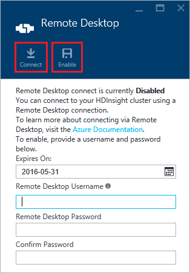

# Connect to Hive on Azure HDInsight using the Hive JDBC driver

[!INCLUDE [ODBC-JDBC-selector](../../includes/hdinsight-selector-odbc-jdbc.md)]

In this document, you will learn how to use JDBC from a Java application to remotely submit Hive queries to an HDInsight cluster. You will learn how to connect from the SQuirreL SQL client, and how to connect programmatically from Java.

For more information on the Hive JDBC Interface, see [HiveJDBCInterface](https://cwiki.apache.org/confluence/display/Hive/HiveJDBCInterface).

## Prerequisites

To complete the steps in this article, you will need the following:

* A Hadoop on HDInsight cluster. Either Linux-based or Windows-based clusters will work.

  > [!IMPORTANT]
  > Linux is the only operating system used on HDInsight version 3.4 or greater. For more information, see [HDInsight Deprecation on Windows](hdinsight-component-versioning.md#hdi-version-33-nearing-deprecation-date).

* [SQuirreL SQL](http://squirrel-sql.sourceforge.net/). SQuirreL is a JDBC client application.

To build and run the example Java application linked from this article, you will need the following.

* The [Java Developer Kit (JDK) version 7](https://www.oracle.com/technetwork/java/javase/downloads/jdk7-downloads-1880260.html) or higher.
* [Apache Maven](https://maven.apache.org). Maven is a project build system for Java projects that is used by the project associated with this article.

## Connection string

JDBC connections to an HDInsight cluster on Azure are made over 443, and the traffic is secured using SSL. The public gateway that the clusters sit behind redirects the traffic to the port that HiveServer2 is actually listening on. So a typical connection string would like the following:

    jdbc:hive2://CLUSTERNAME.azurehdinsight.net:443/default;ssl=true?hive.server2.transport.mode=http;hive.server2.thrift.http.path=/hive2

Replace **CLUSTERNAME** with the name of your HDInsight cluster.

## Authentication

When establishing the connection, you must use the HDInsight cluster admin name and password to authenticate to the cluster gateway. When connecting from JDBC clients such as SQuirreL SQL, you must enter the admin name and password in client settings.

From a Java application, you must use the name and password when establishing a connection. For example, the following Java code opens a new connection using the connection string, admin name, and password:

```java
DriverManager.getConnection(connectionString,clusterAdmin,clusterPassword);
```

## Connect with SQuirreL SQL client

SQuirreL SQL is a JDBC client that can be used to remotely run Hive queries with your HDInsight cluster. The following steps assume that you have already installed SQuirreL SQL, and will walk you through downloading and configuring the drivers for Hive.

1. Copy the Hive JDBC drivers from your HDInsight cluster.

    * For **Linux-based HDInsight**, use the following steps to download the required jar files.

        1. Create a new directory that will contain the files. For example, `mkdir hivedriver`.
        2. From a command prompt, Bash, PowerShell or other command-line prompt, change directories to the new directory and use the following commands to copy the files from the HDInsight cluster.

                scp USERNAME@CLUSTERNAME:/usr/hdp/current/hive-client/lib/hive-jdbc*standalone.jar .
                scp USERNAME@CLUSTERNAME:/usr/hdp/current/hadoop-client/hadoop-common.jar .
                scp USERNAME@CLUSTERNAME:/usr/hdp/current/hadoop-client/hadoop-auth.jar .

            Replace **USERNAME** with the SSH user account name for the cluster. Replace **CLUSTERNAME** with the HDInsight cluster name.

        > [!NOTE]
        > On Windows environments, you may not have the `scp` command. If so, use the PSCP utility instead. You can download it from [http://www.chiark.greenend.org.uk/~sgtatham/putty/download.html](http://www.chiark.greenend.org.uk/~sgtatham/putty/download.html).

    * For **Windows-based HDInsight**, use the following steps to download the jar files.

        1. From the Azure portal, select your HDInsight cluster, and then select the **Remote Desktop** icon.

            

        2. On the Remote Desktop blade, use the **Connect** button to connect to the cluster. If the Remote Desktop is not enabled, use the form to provide a user name and password, then select **Enable** to enable Remote Desktop for the cluster.

            

            After selecting **Connect**, a .rdp file will be downloaded. Use this file to launch the Remote Desktop client. When prompted, use the user name and password you entered for Remote Desktop access.

        3. Once connected, copy the following files from the Remote Desktop session to your local machine. Put them in a local directory named `hivedriver`.

            * C:\apps\dist\hive-0.14.0.2.2.9.1-7\lib\hive-jdbc-0.14.0.2.2.9.1-7-standalone.jar
            * C:\apps\dist\hadoop-2.6.0.2.2.9.1-7\share\hadoop\common\hadoop-common-2.6.0.2.2.9.1-7.jar
            * C:\apps\dist\hadoop-2.6.0.2.2.9.1-7\share\hadoop\common\lib\hadoop-auth-2.6.0.2.2.9.1-7.jar

            > [!NOTE]
            > The version numbers included in the paths and file names may be different for your cluster.

        4. Disconnect the Remote Desktop session once you have finished copying the files.

2. Start the SQuirreL SQL application. From the left of the window, select **Drivers**.

    

3. From the icons at the top of the **Drivers** dialog, select the **+** icon to create a new driver.

    

4. In the Add Driver dialog, add the following information.

    * **Name**: Hive
    * **Example URL**: `jdbc:hive2://localhost:443/default;ssl=true?hive.server2.transport.mode=http;hive.server2.thrift.http.path=/hive2`
    * **Extra Class Path**: Use the Add button to add the jar files downloaded earlier
    * **Class Name**: org.apache.hive.jdbc.HiveDriver

   

   Click **OK** to save these settings.

5. On the left of the SQuirreL SQL window, select **Aliases**. Then click the **+** icon to create a new connection alias.

    

6. Use the following values for the **Add Alias** dialog.

    * **Name**: Hive on HDInsight

    * **Driver**: Use the dropdown to select the **Hive** driver

    * **URL**: jdbc:hive2://CLUSTERNAME.azurehdinsight.net:443/default;ssl=true?hive.server2.transport.mode=http;hive.server2.thrift.http.path=/hive2

        Replace **CLUSTERNAME** with the name of your HDInsight cluster.

    * **User Name**: The cluster login account name for your HDInsight cluster. The default is `admin`.

    * **Password**: The password for the cluster login account. This is a password you provided when creating the HDInsight cluster.

    

    Use the **Test** button to verify that the connection works. When **Connect to: Hive on HDInsight** dialog appears, select **Connect** to perform the test. If the test succeeds, you will see a **Connection successful** dialog.

    Use the **Ok** button at the bottom of the **Add Alias** dialog to save the connection alias.

7. From the **Connect to** dropdown at the top of SQuirreL SQL, select **Hive on HDInsight**. When prompted, select **Connect**.

    

8. Once connected, enter the following query into the SQL query dialog, and then select the **Run** icon. The results area should show the results of the query.

        select * from hivesampletable limit 10;

    

## Connect from an example Java application

An example of using a Java client to query Hive on HDInsight is available at [https://github.com/Azure-Samples/hdinsight-java-hive-jdbc](https://github.com/Azure-Samples/hdinsight-java-hive-jdbc). Follow the instructions in the repository to build and run the sample.

## Troubleshooting

### Unexpected Error occurred attempting to open an SQL connection

**Symptoms**: When connecting to an HDInsight cluster that is version 3.3 or 3.4, you may receive an error that an unexpected error occurred. The stack trace for this error will begin with the following lines:

```java
java.util.concurrent.ExecutionException: java.lang.RuntimeException: java.lang.NoSuchMethodError: org.apache.commons.codec.binary.Base64.<init>(I)V
at java.util.concurrent.FutureTas...(FutureTask.java:122)
at java.util.concurrent.FutureTask.get(FutureTask.java:206)
```

**Cause**: This error is caused by a mismatch in the version of the commons-codec.jar file used by SQuirreL and the one required by the Hive JDBC components downloaded from the HDInsight cluster.

**Resolution**: To fix this error, use the following steps.

1. Download the commons-codec jar file from your HDInsight cluster.

        scp USERNAME@CLUSTERNAME:/usr/hdp/current/hive-client/lib/commons-codec*.jar ./commons-codec.jar

2. Exit SQuirreL, and then go to the directory where SQuirreL is installed on your system. In the SquirreL directory, under the `lib` directory, replace the existing commons-codec.jar with the one downloaded from the HDInsight cluster.

3. Restart SQuirreL. The error should no longer occur when connecting to Hive on HDInsight.

## Next steps

Now that you have learned how to use JDBC to work with Hive, use the following links to explore other ways to work with Azure HDInsight.

* [Upload data to HDInsight](hdinsight-upload-data.md)
* [Use Hive with HDInsight](hdinsight-use-hive.md)
* [Use Pig with HDInsight](hdinsight-use-pig.md)
* [Use MapReduce jobs with HDInsight](hdinsight-use-mapreduce.md)
