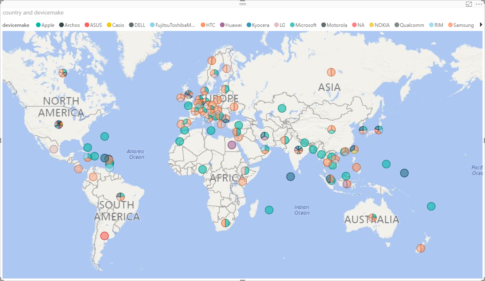
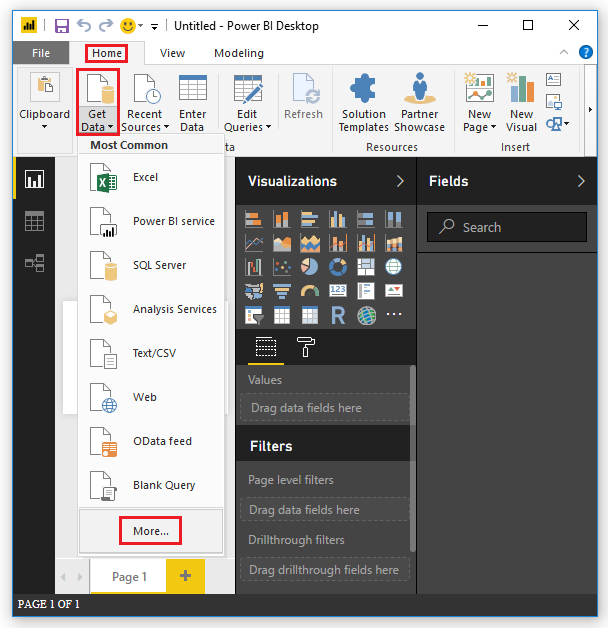
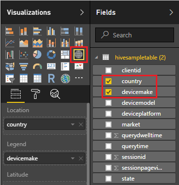

# Visualize Hive data with Microsoft Power BI in Azure HDInsight

Learn how to connect Microsoft Power BI to Azure HDInsight and visualize the Hive data. Currently, Power BI only supports ODBC connection to HDInsight. In this tutorial, you load the data from a hivesampletable Hive table to Power BI. The Hive table contains some mobile phone usage data. Then you plot the usage data on a world map:

The information also applies to the new [Interactive Query](./hdinsight-hadoop-use-interactive-hive.md) cluster type.

## Prerequisites
Before going through this article, you must have the following items:

* **HDInsight cluster**. The cluster can be either a HDInsight cluster with Hive or a newly released Interactive Query cluster. For creating clusters, see [Create cluster](hdinsight-hadoop-linux-tutorial-get-started.md#create-cluster).
* **[Microsoft Power BI Desktop](https://powerbi.microsoft.com/desktop/)**. You can download a copy from the [Microsoft Download Center](https://www.microsoft.com/download/details.aspx?id=45331).

## Create Hive ODBC data source

See [Create Hive ODBC data source](hdinsight-connect-excel-hive-odbc-driver.md#create-hive-odbc-data-source).

## Load data from HDInsight

The hivesampletable Hive table comes with all HDInsight clusters.

1. Sign in to Power BI Desktop.
2. Click the **Home** tab, click **Get Data** from the **External data** ribbon, and then select **More**.

    
3. From the **Get Data** pane, click **Other** from the left, click **ODBC** from the right, and then click **Connect** on the bottom.
4. From the **From ODBC** pane, select the data source name you created in the last section, and then click **OK**.
5. From the **Navigator** pane, expand **ODBC->HIVE->default**, select **hivesampletable**, and then click **Load**.

## Visualize date

Continue from the last procedure.

1. From the Visualizations pane, select **Map**.  It is a globe icon.

    
2. From the Fields pane, select **country** and **devicemake**. You can see the data plotted on the map.
3. Expand the map.

## Next steps
In this article, you learned how to visualize data from HDInsight using Power BI.  To learn more, see the following articles:

* [Use Zeppelin to run Hive queries in Azure HDInsight ](./hdinsight-connect-hive-zeppelin.md)
* [Connect Excel to HDInsight with the Microsoft Hive ODBC Driver](./hdinsight-connect-excel-hive-odbc-driver.md)
* [Connect Excel to Hadoop by using Power Query](./hdinsight-connect-excel-power-query.md)
* [Connect to Azure HDInsight and run Hive queries using Data Lake Tools for Visual Studio](./hdinsight-hadoop-visual-studio-tools-get-started.md)
* [Upload Data to HDInsight](./hdinsight-upload-data.md)
