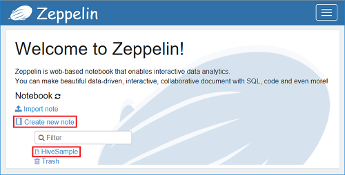
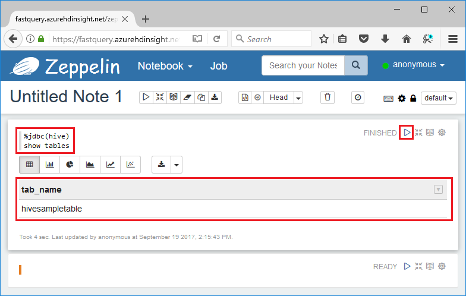

# Use Zeppelin to run Hive queries in Azure HDInsight 

HDInsight Interactive Query clusters include Zeppelin notebooks that you can use to run interactive Hive queries. In this article, you learn how to use Zeppelin to run Hive queries in Azure HDInsight. 

## Prerequisites
Before going through this article, you must have the following items:

* **HDInsight Interactive Query cluster**. See [Create cluster](hdinsight-hadoop-linux-tutorial-get-started.md#create-cluster) to create a HDInsight cluster.  Make sure to choose the Interactive Query type. 
* **[Microsoft Power BI Desktop](https://powerbi.microsoft.com/desktop/)**. You can download a copy from the [Microsoft Download Center](https://www.microsoft.com/download/details.aspx?id=45331).

## Create a Zeppelin Note

1. Browse to the following URL:

        https://CLUSTERNAME.azurehdinsight.net/zeppelin
    Replace **CLUSTERNAME** with the name of your cluster.

2. Enter your Hadoop username and password. From the Zeppelin page, you can either create a new note or open existing notes. HiveSample contains some sample Hive queries.  

    
3. Click **Create new Note**.
4. Type or select the following values:

    - Note name: enter a name for the note.
    - Default interpreter: select **JDBC**.

5. Click **Create Note**.
6. Run the following Hive query:

        %jdbc(hive)
        show tables

    

    The **%jdbc(hive)** statement in the first line tells the notebook to use the Hive JDBC interpreter.

    The query shall return one Hive table called *hivesampletable*.

    The following are two more Hive queries that you can run against the hivesampletable. 

        %jdbc(hive)
        select * from hivesampletable limit 10

        %jdbc(hive)
        select ${group_name}, count(*) as total_count
        from hivesampletable
        group by ${group_name=market,market|deviceplatform|devicemake}
        limit ${total_count=10}

    Comparing to the traditional Hive, the query results come back must faster.

## Next steps
In this article, you learned how to visualize data from HDInsight using Power BI.  To learn more, see the following articles:

* [Visualize Hive data with Microsoft Power BI in Azure HDInsight](./hdinsight-connect-hive-power-bi.md)
* [Connect Excel to HDInsight with the Microsoft Hive ODBC Driver](./hdinsight-connect-excel-hive-odbc-driver.md)
* [Connect Excel to Hadoop by using Power Query](./hdinsight-connect-excel-power-query.md)
* [Connect to Azure HDInsight and run Hive queries using Data Lake Tools for Visual Studio](./hdinsight-hadoop-visual-studio-tools-get-started.md)
* [Upload Data to HDInsight](./hdinsight-upload-data.md)
