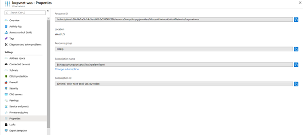

# HDI Insights: Create Cluster Error Dictionary 

This article describes resolutions to errors encountered when creating clusters. 

## Scenario: DeploymentDocument 'CsmDocument_2_0' failed the validation  

### Issue
'Script Action location cannot be accessed Uri : &lt;SCRIPT ACTION URL&gt;, ErrorMessage: The remote server returned an error: (404) Not Found.', 

### Cause
The Script Action URL that is provided as part of the Create Cluster request is not accessible from HDInsight service. We receive the “ErrorMessage” when we try to access the script action.

### Resolution 
  - For an http/https URL, you can verify by trying to open the URL from an incognito browser window. 
  - For a WASB URL, make sure that the script exists in the storage account that is given in request. Make sure that the storage key for this storage account is accurate. 
  - For an ADLS URL, make sure that the script exists in the storage account.

---

## Scenario DeploymentDocument 'CsmDocument_2_0' failed the validation

### Issue
'Script Action location cannot be accessed Uri : &lt;SCRIPT ACTION URL&gt;, ErrorMessage: The given script URI &lt;SCRIPT URI&gt; is in ADLS, but this cluster has no data lake storage principal', 

### Cause
The Script Action URL that is provided as part of the Create Cluster request is not accessible from the HDInsight service. We receive the “ErrorMessage” when we try to access the script action. 

### Resolution

Make sure that the corresponding Azure Data Lake Store Gen 1 account is added to the cluster. The service principal that is used to access the Azure Data Lake Store Gen 1 account is also added to the cluster. 

---

## Scenario: DeploymentDocument 'CsmDocument_2_0' failed the validation.  

### Issue 
'VM size ‘&lt;CUSTOMER SPECIFIED VM SIZE&gt;' provided in the request is invalid or not supported for role '&lt;ROLE&gt;'. Valid values are: &lt;VALID VM SIZE FOR ROLE&gt;. 

### Cause
The customer-specified VM sizes are not allowed for the role. This may be true because the VM size value is not working as expected or is not suitable for the computer role. 

### Resolution
The error message lists the valid values for the VM size. Select one of these valid values, and retry the Create Cluster request. 

---

## Scenario: InvalidVirtualNetworkId  

### Issue 
The VirtualNetworkId is not valid. VirtualNetworkId '&lt;USER_VIRTUALNETWORKID&gt;’ 

### Cause
The **VirtualNetworkId** value that is specified during cluster creation is not in the correct format. 

### Resolution
Make sure that **VirtualNetworkId** and subnet are in the correct format. To obtain the **VirtualnetworkId** value, go to the Azure portal, select your virtual network, and then select **Properties** on the menu. The **ResourceID** property is the **VirtualNetworkId** value. The following screenshot shows the **&lt;*virtual network*&gt; Properties** page in the Azure portal:

---

## Scenario: CustomizationFailedErrorCode  

### Issue
Cluster deployment failed due to an error in the custom script action. Failed Actions: ‘&lt;SCRIPT_NAME&gt;, Please go to Ambari UI to further debug the failure. 

### Cause
The user’s custom script that was provided during the Create Cluster request is executed after the cluster is deployed successfully. This error code indicates that an error was encountered while executing this custom script with name ‘&lt;SCRIPT_NAME&gt;’.   

### Resolution
Because this is the user’s custom script, users should troubleshoot the issue and rerun the script if necessary. To troubleshoot the script failure, examine the logs in the /var/lib/ambari-agent/* folder. Or, open the Operations page in Ambari UI, and select the **run_customscriptionaction** operation to view the error details. The following screenshot shows an example of how the Ambari Operations page appears: 

---

## Scenario: InvalidDocumentErrorCode  

### Issue
The &lt;META_STORE_TYPE&gt; Metastore schema version &lt;METASTORE_MAJOR_VERSION&gt; in database &lt;DATABASE_NAME&gt; is incompatible with cluster version &lt;CLUSTER_VERSION&gt; 

### Cause
The custom metastore is incompatible with the selected HDInsight cluster version. Currently, HDInsight 4.0 cluster supports only Metastore version 3.*x*, and HDInsight 3.6 does not support Metastore version 3.*x* or later. 

### Resolution
Make sure to use only Metastore versions that are supported by each HDInsight cluster version. Notice that if a custom metastore is not specified, HDInsight internally creates a metastore. However, this metastore will automatically be deleted upon cluster deletion. 

---

## Scenario: FailedToConnectWithClusterErrorCode  
### Issue
Unable to connect to cluster management endpoint to perform scaling operation. Verify that network security rules are not blocking external access to the cluster, and that the cluster manager (Ambari) UI can be successfully accessed. 

### Cause
You have a firewall rule on your Network Security Group (NSG) that is blocking cluster communication with critical Azure health and management services. 

### Resolution
If you plan to use network security groups to control network traffic, take the following actions before you install HDInsight: 
  - Identify the Azure region that you plan to use for HDInsight. 
  - Identify the IP addresses required by HDInsight. For more information, see [HDInsight management IP addresses](https://docs.microsoft.com/hdinsight/hdinsight-management-ip-addresses). 
    - Create or modify the network security groups for the subnet that you plan to install HDInsight into. 
    - **Network security groups:** Allow **inbound** traffic on port **443** from the IP addresses. This makes sure that HDInsight management services can reach the cluster from outside the virtual network. 

---

## Scenario: StoragePermissionsBlockedForMsi  

### Issue
The Managed Identity does not have permissions on the storage account. Please verify that 'Storage Blob Data Owner' role is assigned to the Managed Identity for the storage account. Storage: /subscriptions/ &LT;Subscription ID&GT; /resourceGroups/&LT; Resource Group Name&GT; /providers/Microsoft.Storage/storageAccounts/ &LT;Storage Account Name&GT;, Managed Identity: /subscriptions/ &LT;Subscription ID&GT; /resourceGroups/ /&LT; Resource Group Name&GT; /providers/Microsoft.ManagedIdentity/userAssignedIdentities/ &LT;User Managed Identity Name&GT; 

### Cause
The required permissions were not provided to **Manage identity.** **User-assigned managed identity** didn’t have Blob Storage Contributor Role on ADLS Gen2 storage account. 

### Resolution

Open the Azure portal, go to your Storage account, look under **Access Control (IAM)**, and make sure that the Storage Blob Data Contributor or the Storage Blob Data Owner role has ""Assigned" access to the **User-assigned managed identity** for the subscription. For more information, see [Set up permissions for the managed identity on the Data Lake Storage Gen2 account](https://nam06.safelinks.protection.outlook.com/?url=https%3A%2F%2Fdocs.microsoft.com%2Fazure%2Fhdinsight%2Fhdinsight-hadoop-use-data-lake-storage-gen2%23set-up-permissions-for-the-managed-identity-on-the-data-lake-storage-gen2-account&data=02%7C01%7CJasmine.Serano%40microsoft.com%7C395e78a6bca746f62d2208d757381e72%7C72f988bf86f141af91ab2d7cd011db47%7C1%7C0%7C637073770850434499&sdata=DhFi%2FiU9klKpGsPJ686dYngj4X9N88w1kTInlD%2FtmD4%3D&reserved=0). 

---

## Scenario: InvalidNetworkSecurityGroupSecurityRules   

### Issue
The security rules in the Network Security Group '/subscriptions/&LT;SubscriptionID&GT; /resourceGroups/&LT;Resource Group name&GT; default/providers/Microsoft.Network/networkSecurityGroups/&LT;Network Security Group Name configured with subnet '/subscriptions/&LT;SubscriptionID&GT; /resourceGroups/ &LT;Resource Group name&GT; RG-westeurope-vnet-tomtom-default/providers/Microsoft.Network/virtualNetworks/ &LT;Virtual Network Name&GT; /subnets/ &LT;Subnet Name&GT; does not allow required inbound and/or outbound connectivity. For more information, see [Plan a virtual network for Azure HDInsight](https://docs.microsoft.com/azure/hdinsight/hdinsight-plan-virtual-network-deployment), or contact Microsoft Support.

### Cause
If you use network security groups (NSGs) or user-defined routes (UDRs) to control inbound traffic to your HDInsight cluster, you must make sure that your cluster can communicate with critical Azure health and management services.

### Resolution
If you plan to use network security groups to control network traffic, take the following actions before you install HDInsight: 
  - Identify the Azure region that you plan to use for HDInsight, and create a safe list of the IP addresses for your region: [Health and management services: Specific regions](https://docs.microsoft.com/azure/hdinsight/hdinsight-management-ip-addresses#health-and-management-services-specific-regions).
  - Identify the IP addresses that are required by HDInsight. For more information, see [HDInsight management IP addresses](https://nam06.safelinks.protection.outlook.com/?url=https%3A%2F%2Fdocs.microsoft.com%2Fen-us%2Fazure%2Fhdinsight%2Fhdinsight-management-ip-addresses&data=02%7C01%7CJasmine.Serano%40microsoft.com%7C395e78a6bca746f62d2208d757381e72%7C72f988bf86f141af91ab2d7cd011db47%7C1%7C0%7C637073770850454490&sdata=nUgljkdgMKZfKaHCsElGwPEjkTvT3S%2Fsw%2FTG%2BEHh%2BW4%3D&reserved=0). 
  - Create or modify the network security groups for the subnet that you plan to install HDInsight into. 
  
    **Network security groups:** Allow inbound traffic on port 443 from the IP addresses. This makes sure that HDInsight management services can reach the cluster from outside the virtual network.
