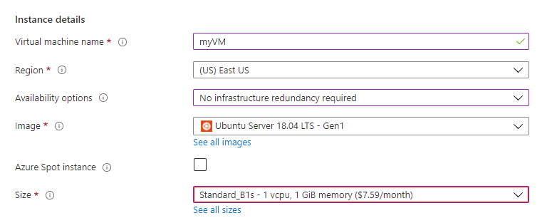
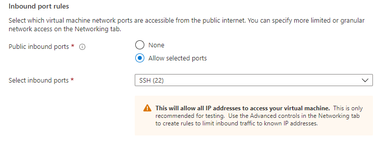
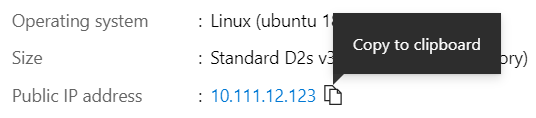

# Create virtual networks for Azure HDInsight clusters

This article provides examples and code samples for creating and configuring [Azure Virtual Networks](../virtual-network/virtual-networks-overview.md). To use with Azure HDInsight clusters. Detailed examples of creating network security groups (NSGs) and configuring DNS are presented.

For background information on using virtual networks with Azure HDInsight, see [Plan a virtual network for Azure HDInsight](hdinsight-plan-virtual-network-deployment.md).

## Prerequisites for code samples and examples

Before executing any of the code samples in this article, have an understanding of TCP/IP networking. If you aren't familiar with TCP/IP networking, consult someone before making modifications to production networks.

Other prerequisites for the samples in this article include the following items:

* If you're using PowerShell, you'll need to install the [AZ Module](/powershell/azure/).
* If you want to use Azure CLI and haven't yet installed it, see [Install the Azure CLI](/cli/azure/install-azure-cli).

> [!IMPORTANT]  
> If you are looking for step by step guidance on connecting HDInsight to your on-premises network using an Azure Virtual Network, see the [Connect HDInsight to your on-premises network](connect-on-premises-network.md) document.

## <a id="hdinsight-nsg"></a>Example: network security groups with HDInsight

The examples in this section demonstrate how to create network security group rules. The rules allow HDInsight to communicate with the Azure management services. Before using the examples, adjust the IP addresses to match the ones for the Azure region you're using. You can find this information in [HDInsight management IP addresses](hdinsight-management-ip-addresses.md).

### Azure Resource Management template

The following Resource Management template creates a virtual network that restricts inbound traffic, but allows traffic from the IP addresses required by HDInsight. This template also creates an HDInsight cluster in the virtual network.

* [Deploy a secured Azure Virtual Network and an HDInsight Hadoop cluster](https://azure.microsoft.com/resources/templates/101-hdinsight-secure-vnet/)

### Azure PowerShell

Use the following PowerShell script to create a virtual network that restricts inbound traffic and allows traffic from the IP addresses for the North Europe region.

> [!IMPORTANT]  
> Change the IP addresses for `hdirule1` and `hdirule2` in this example to match the Azure region you are using. You can find this information [HDInsight management IP addresses](hdinsight-management-ip-addresses.md).

```azurepowershell
$vnetName = "Replace with your virtual network name"
$resourceGroupName = "Replace with the resource group the virtual network is in"
$subnetName = "Replace with the name of the subnet that you plan to use for HDInsight"

# Get the Virtual Network object
$vnet = Get-AzVirtualNetwork `
    -Name $vnetName `
    -ResourceGroupName $resourceGroupName

# Get the region the Virtual network is in.
$location = $vnet.Location

# Get the subnet object
$subnet = $vnet.Subnets | Where-Object Name -eq $subnetName

# Create a Network Security Group.
# And add exemptions for the HDInsight health and management services.
$nsg = New-AzNetworkSecurityGroup `
    -Name "hdisecure" `
    -ResourceGroupName $resourceGroupName `
    -Location $location `
    | Add-AzNetworkSecurityRuleConfig `
        -name "hdirule1" `
        -Description "HDI health and management address 52.164.210.96" `
        -Protocol "*" `
        -SourcePortRange "*" `
        -DestinationPortRange "443" `
        -SourceAddressPrefix "52.164.210.96" `
        -DestinationAddressPrefix "VirtualNetwork" `
        -Access Allow `
        -Priority 300 `
        -Direction Inbound `
    | Add-AzNetworkSecurityRuleConfig `
        -Name "hdirule2" `
        -Description "HDI health and management 13.74.153.132" `
        -Protocol "*" `
        -SourcePortRange "*" `
        -DestinationPortRange "443" `
        -SourceAddressPrefix "13.74.153.132" `
        -DestinationAddressPrefix "VirtualNetwork" `
        -Access Allow `
        -Priority 301 `
        -Direction Inbound `
    | Add-AzNetworkSecurityRuleConfig `
        -Name "hdirule3" `
        -Description "HDI health and management 168.61.49.99" `
        -Protocol "*" `
        -SourcePortRange "*" `
        -DestinationPortRange "443" `
        -SourceAddressPrefix "168.61.49.99" `
        -DestinationAddressPrefix "VirtualNetwork" `
        -Access Allow `
        -Priority 302 `
        -Direction Inbound `
    | Add-AzNetworkSecurityRuleConfig `
        -Name "hdirule4" `
        -Description "HDI health and management 23.99.5.239" `
        -Protocol "*" `
        -SourcePortRange "*" `
        -DestinationPortRange "443" `
        -SourceAddressPrefix "23.99.5.239" `
        -DestinationAddressPrefix "VirtualNetwork" `
        -Access Allow `
        -Priority 303 `
        -Direction Inbound `
    | Add-AzNetworkSecurityRuleConfig `
        -Name "hdirule5" `
        -Description "HDI health and management 168.61.48.131" `
        -Protocol "*" `
        -SourcePortRange "*" `
        -DestinationPortRange "443" `
        -SourceAddressPrefix "168.61.48.131" `
        -DestinationAddressPrefix "VirtualNetwork" `
        -Access Allow `
        -Priority 304 `
        -Direction Inbound `
    | Add-AzNetworkSecurityRuleConfig `
        -Name "hdirule6" `
        -Description "HDI health and management 138.91.141.162" `
        -Protocol "*" `
        -SourcePortRange "*" `
        -DestinationPortRange "443" `
        -SourceAddressPrefix "138.91.141.162" `
        -DestinationAddressPrefix "VirtualNetwork" `
        -Access Allow `
        -Priority 305 `
        -Direction Inbound `

# Set the changes to the security group
Set-AzNetworkSecurityGroup -NetworkSecurityGroup $nsg

# Apply the NSG to the subnet
Set-AzVirtualNetworkSubnetConfig `
    -VirtualNetwork $vnet `
    -Name $subnetName `
    -AddressPrefix $subnet.AddressPrefix `
    -NetworkSecurityGroup $nsg
$vnet | Set-AzVirtualNetwork
```

This example demonstrates how to add rules to allow inbound traffic on the required IP addresses. It doesn't contain a rule to restrict inbound access from other sources. The following code demonstrates how to enable SSH access from the Internet:

```azurepowershell
Get-AzNetworkSecurityGroup -Name hdisecure -ResourceGroupName RESOURCEGROUP |
Add-AzNetworkSecurityRuleConfig -Name "SSH" -Description "SSH" -Protocol "*" -SourcePortRange "*" -DestinationPortRange "22" -SourceAddressPrefix "*" -DestinationAddressPrefix "VirtualNetwork" -Access Allow -Priority 306 -Direction Inbound
```

### Azure CLI

Use the following steps to create a virtual network that restricts inbound traffic, but allows traffic from the IP addresses required by HDInsight.

1. Use the following command to create a new network security group named `hdisecure`. Replace `RESOURCEGROUP` with the resource group that contains the Azure Virtual Network. Replace `LOCATION` with the location (region) that the group was created in.

    ```azurecli
    az network nsg create -g RESOURCEGROUP -n hdisecure -l LOCATION
    ```

    Once the group has been created, you receive information on the new group.

2. Use the following to add rules to the new network security group that allow inbound communication on port 443 from the Azure HDInsight health and management service. Replace `RESOURCEGROUP` with the name of the resource group that contains the Azure Virtual Network.

    > [!IMPORTANT]  
    > Change the IP addresses for `hdirule1` and `hdirule2` in this example to match the Azure region you are using. You can find this information in [HDInsight management IP addresses](hdinsight-management-ip-addresses.md).

    ```azurecli
    az network nsg rule create -g RESOURCEGROUP --nsg-name hdisecure -n hdirule1 --protocol "*" --source-port-range "*" --destination-port-range "443" --source-address-prefix "52.164.210.96" --destination-address-prefix "VirtualNetwork" --access "Allow" --priority 300 --direction "Inbound"
    az network nsg rule create -g RESOURCEGROUP --nsg-name hdisecure -n hdirule2 --protocol "*" --source-port-range "*" --destination-port-range "443" --source-address-prefix "13.74.153.132" --destination-address-prefix "VirtualNetwork" --access "Allow" --priority 301 --direction "Inbound"
    az network nsg rule create -g RESOURCEGROUP --nsg-name hdisecure -n hdirule3 --protocol "*" --source-port-range "*" --destination-port-range "443" --source-address-prefix "168.61.49.99" --destination-address-prefix "VirtualNetwork" --access "Allow" --priority 302 --direction "Inbound"
    az network nsg rule create -g RESOURCEGROUP --nsg-name hdisecure -n hdirule4 --protocol "*" --source-port-range "*" --destination-port-range "443" --source-address-prefix "23.99.5.239" --destination-address-prefix "VirtualNetwork" --access "Allow" --priority 303 --direction "Inbound"
    az network nsg rule create -g RESOURCEGROUP --nsg-name hdisecure -n hdirule5 --protocol "*" --source-port-range "*" --destination-port-range "443" --source-address-prefix "168.61.48.131" --destination-address-prefix "VirtualNetwork" --access "Allow" --priority 304 --direction "Inbound"
    az network nsg rule create -g RESOURCEGROUP --nsg-name hdisecure -n hdirule6 --protocol "*" --source-port-range "*" --destination-port-range "443" --source-address-prefix "138.91.141.162" --destination-address-prefix "VirtualNetwork" --access "Allow" --priority 305 --direction "Inbound"
    ```

3. To retrieve the unique identifier for this network security group, use the following command:

    ```azurecli
    az network nsg show -g RESOURCEGROUP -n hdisecure --query "id"
    ```

    This command returns a value similar to the following text:

    ```output
    "/subscriptions/SUBSCRIPTIONID/resourceGroups/RESOURCEGROUP/providers/Microsoft.Network/networkSecurityGroups/hdisecure"
    ```

4. Use the following command to apply the network security group to a subnet. Replace the `GUID` and `RESOURCEGROUP` values with the ones returned from the previous step. Replace `VNETNAME` and `SUBNETNAME` with the virtual network name and subnet name that you want to create.

    ```azurecli
    az network vnet subnet update -g RESOURCEGROUP --vnet-name VNETNAME --name SUBNETNAME --set networkSecurityGroup.id="/subscriptions/GUID/resourceGroups/RESOURCEGROUP/providers/Microsoft.Network/networkSecurityGroups/hdisecure"
    ```

    Once this command completes, you can install HDInsight into the Virtual Network.

These steps only open access to the HDInsight health and management service on the Azure cloud. Any other access to the HDInsight cluster from outside the Virtual Network is blocked. To enable access from outside the virtual network, you must add additional Network Security Group rules.

The following code demonstrates how to enable SSH access from the Internet:

```azurecli
az network nsg rule create -g RESOURCEGROUP --nsg-name hdisecure -n ssh --protocol "*" --source-port-range "*" --destination-port-range "22" --source-address-prefix "*" --destination-address-prefix "VirtualNetwork" --access "Allow" --priority 306 --direction "Inbound"
```

## <a id="example-dns"></a> Example: DNS configuration

### Name resolution between a virtual network and a connected on-premises network

This example makes the following assumptions:

* You have an Azure Virtual Network that is connected to an on-premises network using a VPN gateway.

* The custom DNS server in the virtual network is running Linux or Unix as the operating system.

* [Bind](https://www.isc.org/downloads/bind/) is installed on the custom DNS server.

On the custom DNS server in the virtual network:

1. Use either Azure PowerShell or Azure CLI to find the DNS suffix of the virtual network:

    Replace `RESOURCEGROUP` with the name of the resource group that contains the virtual network, and then enter the command:

    ```azurepowershell
    $NICs = Get-AzNetworkInterface -ResourceGroupName "RESOURCEGROUP"
    $NICs[0].DnsSettings.InternalDomainNameSuffix
    ```

    ```azurecli
    az network nic list --resource-group RESOURCEGROUP --query "[0].dnsSettings.internalDomainNameSuffix"
    ```

1. On the custom DNS server for the virtual network, use the following text as the contents of the `/etc/bind/named.conf.local` file:

    ```
    // Forward requests for the virtual network suffix to Azure recursive resolver
    zone "0owcbllr5hze3hxdja3mqlrhhe.ex.internal.cloudapp.net" {
        type forward;
        forwarders {168.63.129.16;}; # Azure recursive resolver
    };
    ```

    Replace the `0owcbllr5hze3hxdja3mqlrhhe.ex.internal.cloudapp.net` value with the DNS suffix of your virtual network.

    This configuration routes all DNS requests for the DNS suffix of the virtual network to the Azure recursive resolver.

1. On the custom DNS server for the virtual network, use the following text as the contents of the `/etc/bind/named.conf.options` file:

    ```
    // Clients to accept requests from
    // TODO: Add the IP range of the joined network to this list
    acl goodclients {
        10.0.0.0/16; # IP address range of the virtual network
        localhost;
        localnets;
    };

    options {
            directory "/var/cache/bind";

            recursion yes;

            allow-query { goodclients; };

            # All other requests are sent to the following
            forwarders {
                192.168.0.1; # Replace with the IP address of your on-premises DNS server
            };

            dnssec-validation auto;

            auth-nxdomain no;    # conform to RFC1035
            listen-on { any; };
    };
    ```
    
    * Replace the `10.0.0.0/16` value with the IP address range of your virtual network. This entry allows name resolution requests addresses within this range.

    * Add the IP address range of the on-premises network to the `acl goodclients { ... }` section.  entry allows name resolution requests from resources in the on-premises network.
    
    * Replace the value `192.168.0.1` with the IP address of your on-premises DNS server. This entry routes all other DNS requests to the on-premises DNS server.

1. To use the configuration, restart Bind. For example, `sudo service bind9 restart`.

1. Add a conditional forwarder to the on-premises DNS server. Configure the conditional forwarder to send requests for the DNS suffix from step 1 to the custom DNS server.

    > [!NOTE]  
    > Consult the documentation for your DNS software for specifics on how to add a conditional forwarder.

After completing these steps, you can connect to resources in either network using fully qualified domain names (FQDN). You can now install HDInsight into the virtual network.

### Name resolution between two connected virtual networks

This example makes the following assumptions:

* You have two Azure Virtual Networks that are connected using either a VPN gateway or peering.

* The custom DNS server in both networks is running Linux or Unix as the operating system.

* [Bind](https://www.isc.org/downloads/bind/) is installed on the custom DNS servers.

1. Use either Azure PowerShell or Azure CLI to find the DNS suffix of both virtual networks:

    Replace `RESOURCEGROUP` with the name of the resource group that contains the virtual network, and then enter the command:

    ```azurepowershell
    $NICs = Get-AzNetworkInterface -ResourceGroupName "RESOURCEGROUP"
    $NICs[0].DnsSettings.InternalDomainNameSuffix
    ```

    ```azurecli
    az network nic list --resource-group RESOURCEGROUP --query "[0].dnsSettings.internalDomainNameSuffix"
    ```

2. Use the following text as the contents of the `/etc/bind/named.config.local` file on the custom DNS server. Make this change on the custom DNS server in both virtual networks.

    ```
    // Forward requests for the virtual network suffix to Azure recursive resolver
    zone "0owcbllr5hze3hxdja3mqlrhhe.ex.internal.cloudapp.net" {
        type forward;
        forwarders {10.0.0.4;}; # The IP address of the DNS server in the other virtual network
    };
    ```

    Replace the `0owcbllr5hze3hxdja3mqlrhhe.ex.internal.cloudapp.net` value with the DNS suffix of the __other__ virtual network. This entry routes requests for the DNS suffix of the remote network to the custom DNS in that network.

3. On the custom DNS servers in both virtual networks, use the following text as the contents of the `/etc/bind/named.conf.options` file:

    ```
    // Clients to accept requests from
    acl goodclients {
        10.1.0.0/16; # The IP address range of one virtual network
        10.0.0.0/16; # The IP address range of the other virtual network
        localhost;
        localnets;
    };

    options {
            directory "/var/cache/bind";

            recursion yes;

            allow-query { goodclients; };

            forwarders {
            168.63.129.16;   # Azure recursive resolver
            };

            dnssec-validation auto;

            auth-nxdomain no;    # conform to RFC1035
            listen-on { any; };
    };
    ```

   Replace the `10.0.0.0/16` and `10.1.0.0/16` values with the IP address ranges of your virtual networks. This entry allows resources in each network to make requests of the DNS servers.

    Any requests that aren't for the DNS suffixes of the virtual networks (for example, microsoft.com) is handled by the Azure recursive resolver.

4. To use the configuration, restart Bind. For example, `sudo service bind9 restart` on both DNS servers.

After completing these steps, you can connect to resources in the virtual network using fully qualified domain names (FQDN). You can now install HDInsight into the virtual network.

## Test your settings before deploying

Before deploying your cluster, you can check that your network configuration settings are correct by running the [networkValidator script](https://github.com/Azure-Samples/hdinsight-diagnostic-scripts/blob/main/HDInsightNetworkValidator/networkValidator.sh) on a virtual machine in the same VNet and subnet as the planned cluster.

## To test your configuration settings

1. Open the [Azure portal](https://portal.azure.com/?feature.customportal=false#blade/Microsoft_Azure_Marketplace/GalleryItemDetailsBladeNopdl/product/%7B%22displayName%22%3A%22Ubuntu%20Server%2018.04%20LTS%22%2C%22itemDisplayName%22%3A%22Ubuntu%20Server%2018.04%20LTS%22%2C%22id%22%3A%22canonical.0001-com-ubuntu-server-bionic%22%2C%22offerId%22%3A%220001-com-ubuntu-server-bionic%22%2C%22publisherId%22%3A%22canonical%22%2C%22publisherDisplayName%22%3A%22Canonical%22%2C%22summary%22%3A%22Linux%20For%20The%20Cloud%22%2C%22longSummary%22%3A%22Ubuntu%20Server%20is%20the%20world's%20most%20popular%20Linux%20for%20cloud%20environments.%20Updates%20and%20patches%20for%20Ubuntu%20Server%2018.04%20LTS%20will%20be%20available%20until%20April%202023.%20Ubuntu%20Server%20is%20the%20perfect%20virtual%20machine%20(VM)%20platform%20for%20all%20workloads%20from%20web%20applications%20to%20NoSQL%20databases%20and%20Hadoop.%20For%20more%20information%20see%20%3Ca%20href%3D'https%3A%2F%2Fubuntu.com%2Fazure'%20target%3D'_blank'%3EUbuntu%20on%20Azure%3C%2Fa%3E%20and%20%3Ca%20href%3D'http%3A%2F%2Fjuju.ubuntu.com'%20target%3D'_blank'%3Eusing%20Juju%20to%20deploy%20your%20workloads%3C%2Fa%3E.%22%2C%22description%22%3A%22Ubuntu%20Server%20for%20Azure%20is%20designed%20by%20Canonical%20and%20optimized%20for%20Azure.%20%5CnUbuntu%20is%20the%20world%E2%80%99s%20most%20popular%20Linux%20for%20cloud%20environments%20and%20is%20suitable%20for%20small%20to%20large-scale%20Linux%20operations.%20%5CnFor%20more%20information%2C%20see%20%3Ca%20href%3D%5C%22https%3A%2F%2Fubuntu.com%2Fazure%5C%22%3EUbuntu%20on%20Azure%3C%2Fa%3E.%5Cn%3Cbr%20%2F%3E%5Cn%3Ch1%3E%3Cb%3EWhy%20developers%20and%20devops%20choose%20Ubuntu%20Server%20for%20Azure%3C%2Fb%3E%3C%2Fh1%3E%5Cn%3Cul%3E%5Cn%20%20%3Cli%3EProduction%20ready%3A%20Ubuntu%20is%20the%20leading%20Linux%20in%20the%20public%20cloud%20with%20%26gt%3B%2050%25%20of%20Linux%20workloads%3C%2Fli%3E%5Cn%20%20%3Cli%3EDeveloper%20friendly%3A%20Ubuntu%20is%20the%20%231%20Linux%20for%20developers%20offering%20the%20latest%20library%20and%20tools%20to%20innovate%20with%20the%20latest%20technologies%3C%2Fli%3E%5Cn%20%20%3Cli%3ENo%20mandatory%20licenses%3A%20Ubuntu%20Server%20is%20freely%20available%2C%20with%20no%20mandatory%20licenses%20and%20unlimited%20VMs%3C%2Fli%3E%5Cn%20%20%3Cli%3ENon-stop%20security%3A%20Canonical%20publishes%20images%20on%20a%20daily%20basis%2C%20ensuring%20security%20is%20built-in%20from%20the%20moment%20an%20instance%20launches%3C%2Fli%3E%5Cn%20%20%3Cli%3EOptimised%20performance%3A%20optimized%20kernel%2C%20with%20improved%20boot%20speed%2C%20outstanding%20runtime%20performance%20and%20advanced%20device%20support%3C%2Fli%3E%5Cn%20%20%3Cli%3EPortability%3A%20Ubuntu%20is%20available%20in%20all%20regions%20with%20content%20mirrors%20to%20avoid%20the%20need%20to%20go%20across%20regions%20or%20out%20to%20the%20Internet%20for%20updates%3C%2Fli%3E%5Cn%20%20%3Cli%3E5-year%20security%20maintenance%3A%20Ubuntu%20Server%2018.04%20LTS%20provides%20security%20maintenance%20until%20April%202023%3C%2Fli%3E%5Cn%3C%2Ful%3E%5CnFor%20production%20environments%20or%20applications%20where%20additional%20security%20and%20compliance%20would%20be%20beneficial%2C%5Cnor%20where%20you%20might%20want%20to%20continue%20using%20the%20environment%20beyond%20April%202023%2C%20%5CnCanonical%20recommends%20%5Cn%3Ca%20href%3D%5C%22https%3A%2F%2Fazuremarketplace.microsoft.com%2Fen-us%2Fmarketplace%2Fapps%2Fcanonical.0001-com-ubuntu-pro-bionic%3Ftab%3DOverview%5C%22%3EUbuntu%20Pro%2018.04%20LTS%3C%2Fa%3E.%5Cn%22%2C%22isPrivate%22%3Afalse%2C%22isMacc%22%3Afalse%2C%22isPreview%22%3Afalse%2C%22isByol%22%3Afalse%2C%22isCSPEnabled%22%3Atrue%2C%22isCSPSelective%22%3Afalse%2C%22isThirdParty%22%3Afalse%2C%22isReseller%22%3Afalse%2C%22hasFreeTrials%22%3Afalse%2C%22marketingMaterial%22%3A%7B%22path%22%3A%22marketplace%2Fpartners%2FCanonical%2F0001-com-ubuntu-server-bionic%22%2C%22learnUri%22%3Anull%7D%2C%22legalTermsUri%22%3A%22http%3A%2F%2Fwww.ubuntu.com%2Fproject%2Fabout-ubuntu%2Flicensing%22%2C%22pricingDetailsUri%22%3A%22http%3A%2F%2Fazure.microsoft.com%2Fen-us%2Fpricing%2Fdetails%2Fvirtual-machines%2F%23linux%22%2C%22privacyPolicyUri%22%3A%22http%3A%2F%2Fwww.ubuntu.com%2Faboutus%2Fprivacypolicy%22%2C%22version%22%3A%221.0.38%22%2C%22metadata%22%3A%7B%22leadGeneration%22%3Anull%2C%22testDrive%22%3Anull%7D%2C%22categoryIds%22%3A%5B%22virtualMachine%22%2C%22virtualMachine-Arm%22%2C%22virtualMachine-csp%22%2C%22microsoft-azure-corevm%22%2C%22linux%22%2C%22Ubuntu%22%2C%22Hidden_Gen1%22%2C%22compute%22%2C%22operating-systems%22%2C%22it-and-management-tools%22%2C%22other%22%2C%22Hidden_Gen2%22%5D%2C%22screenshotUris%22%3A%5B%5D%2C%22links%22%3A%5B%7B%22id%22%3A%220%22%2C%22displayName%22%3A%22Ubuntu%20On%20Azure%22%2C%22uri%22%3A%22https%3A%2F%2Fubuntu.com%2Fazure%22%7D%2C%7B%22id%22%3A%221%22%2C%22displayName%22%3A%22Linux%20VM%20Documentation%22%2C%22uri%22%3A%22https%3A%2F%2Fdocs.microsoft.com%2Fazure%2Fvirtual-machines%2Flinux%2F%22%7D%2C%7B%22id%22%3A%222%22%2C%22displayName%22%3A%22Ubuntu%20Documentation%22%2C%22uri%22%3A%22https%3A%2F%2Fhelp.ubuntu.com%2F18.04%2Findex.html%22%7D%2C%7B%22id%22%3A%223%22%2C%22displayName%22%3A%22FAQ%22%2C%22uri%22%3A%22https%3A%2F%2Fhelp.ubuntu.com%2Fcommunity%2FServerFaq%22%7D%2C%7B%22id%22%3A%224%22%2C%22displayName%22%3A%22Pricing%20Details%22%2C%22uri%22%3A%22http%3A%2F%2Fazure.microsoft.com%2Fen-us%2Fpricing%2Fdetails%2Fvirtual-machines%2F%23linux%22%7D%5D%2C%22filters%22%3A%5B%5D%2C%22plans%22%3A%5B%7B%22id%22%3A%22UbuntuServer1804LTS%22%2C%22displayName%22%3A%22Ubuntu%20Server%2018.04%20LTS%22%2C%22summary%22%3A%22Ubuntu%20Server%20delivers%20high%20value%20scale-out%20performance.%22%2C%22description%22%3A%22Ubuntu%20Server%20is%20the%20world's%20most%20popular%20Linux%20for%20cloud%20environments.%20Updates%20and%20patches%20for%20Ubuntu%20Server%2018.04%20LTS%20will%20be%20available%20until%20April%202023.%20Ubuntu%20Server%20is%20the%20perfect%20virtual%20machine%20(VM)%20platform%20for%20all%20workloads%20from%20web%20applications%20to%20NoSQL%20databases%20and%20Hadoop.%20For%20more%20information%20see%20%3Ca%20href%3D'https%3A%2F%2Fubuntu.com%2Fazure'%20target%3D'_blank'%3EUbuntu%20on%20Azure%3C%2Fa%3E%20and%20%3Ca%20href%3D'http%3A%2F%2Fjuju.ubuntu.com'%20target%3D'_blank'%3Eusing%20Juju%20to%20deploy%20your%20workloads%3C%2Fa%3E.%3Cp%3E%3Ch3%20class%3D'msportalfx-text-header'%3ELegal%20Terms%3C%2Fh3%3E%3C%2Fp%3E%3Cp%3EBy%20clicking%20the%20Create%20button%2C%20I%20acknowledge%20that%20I%20am%20getting%20this%20software%20from%20Canonical%20and%20that%20the%20%3Ca%20href%3D'http%3A%2F%2Fwww.ubuntu.com%2Fproject%2Fabout-ubuntu%2Flicensing'%20target%3D'_blank'%3Elegal%20terms%3C%2Fa%3E%20of%20Canonical%20apply%20to%20it.%20Microsoft%20does%20not%20provide%20rights%20for%20third-party%20software.%20Also%20see%20the%20%3Ca%20href%3D'http%3A%2F%2Fwww.ubuntu.com%2Faboutus%2Fprivacypolicy'%20target%3D'_blank'%3Eprivacy%20statement%3C%2Fa%3E%20from%20Canonical.%3C%2Fp%3E%22%2C%22restrictedAudience%22%3A%7B%7D%2C%22skuId%22%3A%22UbuntuServer1804LTS%22%2C%22planId%22%3A%22UbuntuServer1804LTS%22%2C%22legacyPlanId%22%3A%22Canonical.UbuntuServer1804LTS%22%2C%22keywords%22%3A%5B%5D%2C%22type%22%3A%22VirtualMachine%22%2C%22leadGeneration%22%3A%7B%22productId%22%3A%22canonical.firstParty_Ubuntu_Server_18.04_LTS18_04-lts%22%7D%2C%22testDrive%22%3Anull%2C%22categoryIds%22%3A%5B%22virtualMachine%22%2C%22microsoft-azure-corevm%22%2C%22linux%22%2C%22Ubuntu%22%2C%22compute%22%2C%22operating-systems%22%2C%22it-and-management-tools%22%2C%22other%22%5D%2C%22conversionPaths%22%3A%5B%5D%2C%22metadata%22%3A%7B%22videos%22%3A%5B%5D%2C%22altStackReference%22%3A%22Canonical.UbuntuServer1804LTS-ARM%22%2C%22generation%22%3A%221%22%2C%22leadGeneration%22%3A%7B%22productId%22%3A%22canonical.firstParty_Ubuntu_Server_18.04_LTS18_04-lts%22%7D%2C%22hasStandardContractAmendments%22%3Afalse%7D%2C%22uiDefinitionUri%22%3A%22https%3A%2F%2Fcatalogartifact.azureedge.net%2Fpublicartifacts%2FCanonical.UbuntuServer1804LTS-1.0.37%2FUIDefinition.json%22%2C%22artifacts%22%3A%5B%7B%22name%22%3A%22createuidefinition%22%2C%22uri%22%3A%22https%3A%2F%2Fcatalogartifact.azureedge.net%2Fpublicartifacts%2FCanonical.UbuntuServer1804LTS-1.0.37%2FcreateUiDefinition.json%22%2C%22type%22%3A%22Custom%22%7D%2C%7B%22name%22%3A%22DefaultTemplate%22%2C%22uri%22%3A%22https%3A%2F%2Fcatalogartifact.azureedge.net%2Fpublicartifacts%2FCanonical.UbuntuServer1804LTS-1.0.37%2FmainTemplate.json%22%2C%22type%22%3A%22Template%22%7D%5D%2C%22version%22%3A%221.0.37%22%2C%22itemName%22%3A%22UbuntuServer1804LTS%22%2C%22isPrivate%22%3Afalse%2C%22isHidden%22%3Afalse%2C%22hasFreeTrials%22%3Afalse%2C%22isByol%22%3Afalse%2C%22isFree%22%3Afalse%2C%22isPayg%22%3Afalse%2C%22isStopSell%22%3Afalse%2C%22altStackReference%22%3A%22UbuntuServer1804LTS-ARM%22%2C%22stackType%22%3A%22Classic%22%2C%22cspState%22%3A%22OptIn%22%2C%22isQuantifiable%22%3Afalse%2C%22vmSecuritytype%22%3A%22None%22%7D%2C%7B%22id%22%3A%22UbuntuServer1804LTS-ARM%22%2C%22displayName%22%3A%22Ubuntu%20Server%2018.04%20LTS%22%2C%22summary%22%3A%22Ubuntu%20Server%20delivers%20high%20value%20scale-out%20performance.%22%2C%22description%22%3A%22Ubuntu%20Server%20is%20the%20world's%20most%20popular%20Linux%20for%20cloud%20environments.%20Updates%20and%20patches%20for%20Ubuntu%20Server%2018.04%20LTS%20will%20be%20available%20until%20April%202023.%20Ubuntu%20Server%20is%20the%20perfect%20virtual%20machine%20(VM)%20platform%20for%20all%20workloads%20from%20web%20applications%20to%20NoSQL%20databases%20and%20Hadoop.%20For%20more%20information%20see%20%3Ca%20href%3D'https%3A%2F%2Fubuntu.com%2Fazure'%20target%3D'_blank'%3EUbuntu%20on%20Azure%3C%2Fa%3E%20and%20%3Ca%20href%3D'http%3A%2F%2Fjuju.ubuntu.com'%20target%3D'_blank'%3Eusing%20Juju%20to%20deploy%20your%20workloads%3C%2Fa%3E.%3Cp%3E%3Ch3%20class%3D'msportalfx-text-header'%3ELegal%20Terms%3C%2Fh3%3E%3C%2Fp%3E%3Cp%3EBy%20clicking%20the%20Create%20button%2C%20I%20acknowledge%20that%20I%20am%20getting%20this%20software%20from%20Canonical%20and%20that%20the%20%3Ca%20href%3D'http%3A%2F%2Fwww.ubuntu.com%2Fproject%2Fabout-ubuntu%2Flicensing'%20target%3D'_blank'%3Elegal%20terms%3C%2Fa%3E%20of%20Canonical%20apply%20to%20it.%20Microsoft%20does%20not%20provide%20rights%20for%20third-party%20software.%20Also%20see%20the%20%3Ca%20href%3D'http%3A%2F%2Fwww.ubuntu.com%2Faboutus%2Fprivacypolicy'%20target%3D'_blank'%3Eprivacy%20statement%3C%2Fa%3E%20from%20Canonical.%3C%2Fp%3E%22%2C%22restrictedAudience%22%3A%7B%7D%2C%22skuId%22%3A%22UbuntuServer1804LTS-ARM%22%2C%22planId%22%3A%22UbuntuServer1804LTS-ARM%22%2C%22legacyPlanId%22%3A%22Canonical.UbuntuServer1804LTS-ARM%22%2C%22keywords%22%3A%5B%5D%2C%22type%22%3A%22VirtualMachine%22%2C%22leadGeneration%22%3A%7B%22productId%22%3A%22canonical.firstParty_Ubuntu_Server_18.04_LTS18_04-lts%22%7D%2C%22testDrive%22%3Anull%2C%22categoryIds%22%3A%5B%22virtualMachine%22%2C%22virtualMachine-Arm%22%2C%22virtualMachine-csp%22%2C%22microsoft-azure-corevm%22%2C%22linux%22%2C%22Ubuntu%22%2C%22Hidden_Gen1%22%2C%22compute%22%2C%22operating-systems%22%2C%22it-and-management-tools%22%2C%22other%22%5D%2C%22conversionPaths%22%3A%5B%5D%2C%22metadata%22%3A%7B%22videos%22%3A%5B%5D%2C%22altStackReference%22%3A%22Canonical.UbuntuServer1804LTS%22%2C%22generation%22%3A%221%22%2C%22relatedSkus%22%3A%5B%7B%22relationType%22%3A%22Generation%22%2C%22sku%22%3A%7B%22name%22%3A%22Ubuntu%20Server%2018.04%20LTS%22%2C%22generation%22%3A%222%22%2C%22identity%22%3A%22Canonical.UbuntuServer1804LTS18_04-lts-gen2%22%7D%7D%5D%2C%22leadGeneration%22%3A%7B%22productId%22%3A%22canonical.firstParty_Ubuntu_Server_18.04_LTS18_04-lts%22%7D%2C%22hasStandardContractAmendments%22%3Afalse%7D%2C%22uiDefinitionUri%22%3A%22https%3A%2F%2Fcatalogartifact.azureedge.net%2Fpublicartifacts%2FCanonical.UbuntuServer1804LTS-ARM-1.0.38%2FUIDefinition.json%22%2C%22artifacts%22%3A%5B%7B%22name%22%3A%22createuidefinition%22%2C%22uri%22%3A%22https%3A%2F%2Fcatalogartifact.azureedge.net%2Fpublicartifacts%2FCanonical.UbuntuServer1804LTS-ARM-1.0.38%2FcreateUiDefinition.json%22%2C%22type%22%3A%22Custom%22%7D%2C%7B%22name%22%3A%22DefaultTemplate%22%2C%22uri%22%3A%22https%3A%2F%2Fcatalogartifact.azureedge.net%2Fpublicartifacts%2FCanonical.UbuntuServer1804LTS-ARM-1.0.38%2FmainTemplate.json%22%2C%22type%22%3A%22Template%22%7D%5D%2C%22version%22%3A%221.0.38%22%2C%22itemName%22%3A%22UbuntuServer1804LTS-ARM%22%2C%22isPrivate%22%3Afalse%2C%22isHidden%22%3Afalse%2C%22hasFreeTrials%22%3Afalse%2C%22isByol%22%3Afalse%2C%22isFree%22%3Afalse%2C%22isPayg%22%3Afalse%2C%22isStopSell%22%3Afalse%2C%22altStackReference%22%3A%22UbuntuServer1804LTS%22%2C%22stackType%22%3A%22ARM%22%2C%22cspState%22%3A%22OptIn%22%2C%22isQuantifiable%22%3Afalse%2C%22vmSecuritytype%22%3A%22None%22%7D%2C%7B%22id%22%3A%22UbuntuServer1804LTS18_04-lts-gen2%22%2C%22displayName%22%3A%22Ubuntu%20Server%2018.04%20LTS%22%2C%22summary%22%3A%22Ubuntu%20Server%20delivers%20high%20value%20scale-out%20performance.%22%2C%22description%22%3A%22Ubuntu%20Server%20is%20the%20world's%20most%20popular%20Linux%20for%20cloud%20environments.%20Updates%20and%20patches%20for%20Ubuntu%20Server%2018.04%20LTS%20will%20be%20available%20until%20April%202023.%20Ubuntu%20Server%20is%20the%20perfect%20virtual%20machine%20(VM)%20platform%20for%20all%20workloads%20from%20web%20applications%20to%20NoSQL%20databases%20and%20Hadoop.%20For%20more%20information%20see%20%3Ca%20href%3D'https%3A%2F%2Fubuntu.com%2Fazure'%20target%3D'_blank'%3EUbuntu%20on%20Azure%3C%2Fa%3E%20and%20%3Ca%20href%3D'http%3A%2F%2Fjuju.ubuntu.com'%20target%3D'_blank'%3Eusing%20Juju%20to%20deploy%20your%20workloads%3C%2Fa%3E.%3Cp%3E%3Ch3%20class%3D'msportalfx-text-header'%3ELegal%20Terms%3C%2Fh3%3E%3C%2Fp%3E%3Cp%3EBy%20clicking%20the%20Create%20button%2C%20I%20acknowledge%20that%20I%20am%20getting%20this%20software%20from%20Canonical%20and%20that%20the%20%3Ca%20href%3D'http%3A%2F%2Fwww.ubuntu.com%2Fproject%2Fabout-ubuntu%2Flicensing'%20target%3D'_blank'%3Elegal%20terms%3C%2Fa%3E%20of%20Canonical%20apply%20to%20it.%20Microsoft%20does%20not%20provide%20rights%20for%20third-party%20software.%20Also%20see%20the%20%3Ca%20href%3D'http%3A%2F%2Fwww.ubuntu.com%2Faboutus%2Fprivacypolicy'%20target%3D'_blank'%3Eprivacy%20statement%3C%2Fa%3E%20from%20Canonical.%3C%2Fp%3E%22%2C%22restrictedAudience%22%3A%7B%7D%2C%22skuId%22%3A%22UbuntuServer1804LTS18_04-lts-gen2%22%2C%22planId%22%3A%22UbuntuServer1804LTS18_04-lts-gen2%22%2C%22legacyPlanId%22%3A%22Canonical.UbuntuServer1804LTS18_04-lts-gen2%22%2C%22keywords%22%3A%5B%5D%2C%22type%22%3A%22VirtualMachine%22%2C%22leadGeneration%22%3A%7B%22productId%22%3A%22canonical.firstParty_Ubuntu_Server_18.04_LTS18_04-lts%22%7D%2C%22testDrive%22%3Anull%2C%22categoryIds%22%3A%5B%22virtualMachine%22%2C%22virtualMachine-Arm%22%2C%22virtualMachine-csp%22%2C%22microsoft-azure-corevm%22%2C%22linux%22%2C%22Ubuntu%22%2C%22Hidden_Gen2%22%2C%22compute%22%2C%22operating-systems%22%2C%22it-and-management-tools%22%2C%22other%22%5D%2C%22conversionPaths%22%3A%5B%5D%2C%22metadata%22%3A%7B%22videos%22%3A%5B%5D%2C%22generation%22%3A%222%22%2C%22relatedSkus%22%3A%5B%7B%22relationType%22%3A%22Generation%22%2C%22sku%22%3A%7B%22name%22%3A%22Ubuntu%20Server%2018.04%20LTS%22%2C%22generation%22%3A%221%22%2C%22identity%22%3A%22Canonical.UbuntuServer1804LTS-ARM%22%7D%7D%5D%2C%22leadGeneration%22%3A%7B%22productId%22%3A%22canonical.firstParty_Ubuntu_Server_18.04_LTS18_04-lts%22%7D%2C%22hasStandardContractAmendments%22%3Afalse%7D%2C%22uiDefinitionUri%22%3A%22https%3A%2F%2Fcatalogartifact.azureedge.net%2Fpublicartifacts%2FCanonical.UbuntuServer1804LTS18_04-lts-gen2-1.0.37%2FUIDefinition.json%22%2C%22artifacts%22%3A%5B%7B%22name%22%3A%22createuidefinition%22%2C%22uri%22%3A%22https%3A%2F%2Fcatalogartifact.azureedge.net%2Fpublicartifacts%2FCanonical.UbuntuServer1804LTS18_04-lts-gen2-1.0.37%2FcreateUiDefinition.json%22%2C%22type%22%3A%22Custom%22%7D%2C%7B%22name%22%3A%22DefaultTemplate%22%2C%22uri%22%3A%22https%3A%2F%2Fcatalogartifact.azureedge.net%2Fpublicartifacts%2FCanonical.UbuntuServer1804LTS18_04-lts-gen2-1.0.37%2FmainTemplate.json%22%2C%22type%22%3A%22Template%22%7D%5D%2C%22version%22%3A%221.0.37%22%2C%22itemName%22%3A%22UbuntuServer1804LTS18_04-lts-gen2%22%2C%22isPrivate%22%3Afalse%2C%22isHidden%22%3Afalse%2C%22hasFreeTrials%22%3Afalse%2C%22isByol%22%3Afalse%2C%22isFree%22%3Afalse%2C%22isPayg%22%3Afalse%2C%22isStopSell%22%3Afalse%2C%22cspState%22%3A%22OptIn%22%2C%22isQuantifiable%22%3Afalse%2C%22vmSecuritytype%22%3A%22None%22%2C%22stackType%22%3A%22ARM%22%7D%5D%2C%22selectedPlanId%22%3A%22UbuntuServer1804LTS-ARM%22%2C%22iconFileUris%22%3A%7B%22small%22%3A%22https%3A%2F%2Fcatalogartifact.azureedge.net%2Fpublicartifacts%2FCanonical.UbuntuServer1804LTS-ARM-1.0.38%2FSmall.png%22%2C%22medium%22%3A%22https%3A%2F%2Fcatalogartifact.azureedge.net%2Fpublicartifacts%2FCanonical.UbuntuServer1804LTS-ARM-1.0.38%2FMedium.png%22%2C%22large%22%3A%22https%3A%2F%2Fcatalogartifact.azureedge.net%2Fpublicartifacts%2FCanonical.UbuntuServer1804LTS-ARM-1.0.38%2FLarge.png%22%2C%22wide%22%3A%22https%3A%2F%2Fcatalogartifact.azureedge.net%2Fpublicartifacts%2FCanonical.UbuntuServer1804LTS-ARM-1.0.38%2FWide.png%22%7D%2C%22itemType%22%3A%22Single%22%2C%22hasNoProducts%22%3Atrue%2C%22hasNoPlans%22%3Afalse%2C%22privateBadgeText%22%3Anull%2C%22createBladeType%22%3A1%2C%22offerType%22%3A%22VirtualMachine%22%2C%22useEnterpriseContract%22%3Afalse%2C%22hasStandardContractAmendments%22%3Afalse%2C%22standardContractAmendmentsRevisionId%22%3A%2200000000-0000-0000-0000-000000000000%22%2C%22supportUri%22%3Anull%2C%22galleryItemAccess%22%3A0%7D/resourceGroupId//resourceGroupLocation//dontDiscardJourney//launchingContext/%7B%22galleryItemId%22%3A%22canonical.0001-com-ubuntu-server-bionic%22%2C%22productId%22%3A%22canonical.0001-com-ubuntu-server-bionic%22%2C%22source%22%3A%5B%22PlusNewBlade%22%5D%2C%22menuItemId%22%3A%22home%22%2C%22itemIndex%22%3A1%7D) and click **Create** to create an Ubuntu Server 18.04 LTS virtual machine.
1. In the **Basics** tab, under **Project details**, make sure the correct subscription is selected and then choose to **Create new** resource group. Type *myResourceGroup* for the name.*

	

1. Under **Instance details**, type *myVM* for the **Virtual machine name**, choose *East US* for your **Region**, and choose *Ubuntu 18.04 LTS* for your **Image**. Leave the other defaults.

	

1. Under **Administrator account**, select **SSH public key**.

1. In **Username** type *azureuser*.

1. For **SSH public key source**, leave the default of **Generate new key pair**, and then type *myKey* for the **Key pair name**.

    

1. Under **Inbound port rules** > **Public inbound ports**, choose **Allow selected ports** and then select **SSH (22)** and **HTTP (80)** from the drop-down. 

	

1. Leave the remaining defaults and then select the **Review + create** button at the bottom of the page.

1. On the **Create a virtual machine** page, you can see the details about the VM you are about to create. When you are ready, select **Create**.

1. When the **Generate new key pair** window opens, select **Download private key and create resource**. Your key file will be download as **myKey.pem**. Make sure you know where the `.pem` file was downloaded, you will need the path to it in the next step.

1. When the deployment is finished, select **Go to resource**.

1. On the page for your new VM, select the public IP address and copy it to your clipboard.


	

[!INCLUDE [ephemeral-ip-note.md](../../../includes/ephemeral-ip-note.md)]

## Connect to virtual machine

Create an SSH connection with the VM.

1. If you are on a Mac or Linux machine, open a Bash prompt. If you are on a Windows machine, open a PowerShell prompt. 

1. At your prompt, open an SSH connection to your virtual machine. Replace the IP address with the one from your VM, and replace the path to the `.pem` with the path to where the key file was downloaded.

```console
ssh -i .\Downloads\myKey1.pem azureuser@10.111.12.123
```

> [!TIP]
> The SSH key you created can be used the next time your create a VM in Azure. Just select the **Use a key stored in Azure** for **SSH public key source** the next time you create a VM. You already have the private key on your computer, so you won't need to download anything.


## Next steps

* For a complete example of configuring HDInsight to connect to an on-premises network, see [Connect HDInsight to an on-premises network](./connect-on-premises-network.md).
* For configuring Apache HBase clusters in Azure virtual networks, see [Create Apache HBase clusters on HDInsight in Azure Virtual Network](hbase/apache-hbase-provision-vnet.md).
* For configuring Apache HBase geo-replication, see [Set up Apache HBase cluster replication in Azure virtual networks](hbase/apache-hbase-replication.md).
* For more information on Azure virtual networks, see the [Azure Virtual Network overview](../virtual-network/virtual-networks-overview.md).

* For more information on network security groups, see [Network security groups](../virtual-network/network-security-groups-overview.md).

* For more information on user-defined routes, see [User-defined routes and IP forwarding](../virtual-network/virtual-networks-udr-overview.md).
