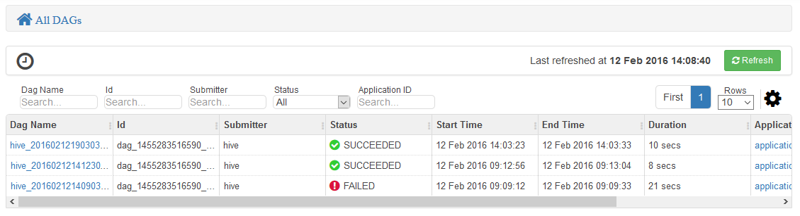
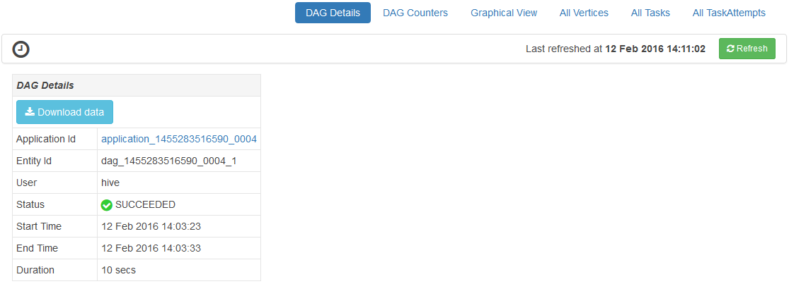
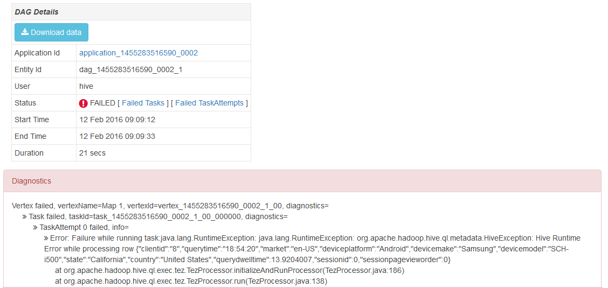
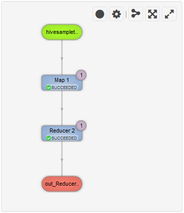
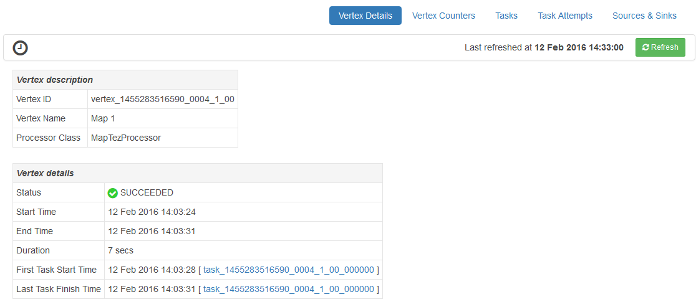
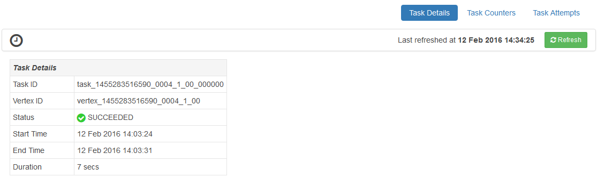

<properties
pageTitle="Use Ambari Tez View with HDInsight | Azure"
description="Learn how to use the Ambari Tez view to debug Tez jobs on HDInsight."
services="hdinsight"
documentationCenter=""
authors="Blackmist"
manager="paulettm"
editor="cgronlun"/>

<tags
ms.service="hdinsight"
ms.devlang="na"
ms.topic="article"
ms.tgt_pltfrm="na"
ms.workload="big-data"
ms.date="07/19/2016"
ms.author="larryfr"/>

# Use Ambari Views to debug Tez Jobs on HDInsight

The Ambari Web UI for HDInsight contains a Tez view that can be used to understand and debug jobs that use Tez as the execution engine. The Tez view allows you to visualize the job as a graph of connected items, drill into each item, and retrieve statistics and logging information.

> [AZURE.NOTE] The information in this document is specific to Linux-based HDInsight clusters. For information on debugging Tez jobs using Windows-based HDInsight, see [Use the Tez UI to debug Tez jobs on Windows-based HDInsight](hdinsight-debug-tez-ui.md).

##Prerequisites

* A Linux-based HDInsight cluster. For steps on creating a new cluster, see [Get started using Linux-based HDInsight](hdinsight-hadoop-linux-tutorial-get-started.md).

* A modern web browser that supports HTML5.

##Understanding Tez

Tez is an extensible framework for data processing in Hadoop that provides greater speeds than traditional MapReduce processing. For Linux-based HDInsight clusters, it is the default engine for Hive.

When work is submitted to Tez, it creates a Directed Acyclic Graph (DAG) that describes the order of execution of the actions required by the job. Individual actions are called vertices, and execute a piece of the overall job. The actual execution of the work described by a vertex is called a task, and may be distributed across multiple nodes in the cluster.

###Understanding the Tez view

The Tez view provides information on processes that are running, or have previously ran using Tez. It allows you to view the DAG generated by Tez, how it is distributed across clusters, counters such as memory used by tasks and vertices, and error information. It may offer useful information in the following scenarios:

* Monitoring long-running processes, viewing the progress of map and reduce tasks.

* Analyzing historical data for successful or failed processes to learn how processing could be improved or why it failed.

##Generate a DAG

The Tez view will only contain data if a job that uses the Tez engine is currently running, or has been ran in the past. Simple Hive queries can usually be resolved without using Tez, however more complex queries that do filtering, grouping, ordering, joins, etc. will usually require Tez.

Use the following steps to run a Hive query that will execute using Tez.

1. In a web browser, navigate to https://CLUSTERNAME.azurehdinsight.net, where __CLUSTERNAME__ is the name of your HDInsight cluster.

2. From the menu at the top of the page, select the __Views__ icon. This looks like a series of squares. In the dropdown that appears, select __Hive view__. 

    

3. When the Hive view loads, paste the following into the Query Editor, and then click __execute__.

        select market, state, country from hivesampletable where deviceplatform='Android' group by market, country, state;
    
    Once the job has completed, you should see the output displayed in the __Query Process Results__ section. The results should be similar to the following
    
        market  state       country
        en-GB   Hessen      Germany
        en-GB   Kingston    Jamaica
        
4. Select the __Log__ tab. You will see information similar to the following:
    
        INFO : Session is already open
        INFO :

        INFO : Status: Running (Executing on YARN cluster with App id application_1454546500517_0063)

    Save the __App id__ value, as this will be used in the next section.

##Use the Tez View

1. From the menu at the top of the page, select the __Views__ icon. In the dropdown that appears, select __Tez view__.

    

2. When the Tez view loads, you will see a list of DAGs that are currently running, or have been ran on the cluster. The default view includes the Dag Name, Id, Submitter, Status, Start Time, End Time, Duration, Application ID, and Queue. More columns can be added using the gear icon at the right of the page.

    

3. If you have only one entry, it will be for the query that you ran in the previous section. If you have multiple entries, you can search by entering the application ID in the __Application ID__ field, and then press enter.

4. Select the __Dag Name__. This will display information about the DAG, as well as the option to download a zip of JSON files that contain information about the DAG.

    

5. Above the __DAG Details__ are several links that can be used to display information about the DAG.

    * __DAG Counters__ displays counters information for this DAG.
    
    * __Graphical View__ displays a graphical representation of this DAG.
    
    * __All Vertices__ displays a list of the vertices in this DAG.
    
    * __All Tasks__ displays a list of the tasks for all vertices in this DAG.
    
    * __All TaskAttempts__ displays information about the attempts to run tasks for this DAG.
    
    > [AZURE.NOTE] If you scroll the column display for Vertices, Tasks and TaskAttempts, notice that there are links to view __counters__ and __view or download logs__ for each row.

    If there was a failure with the job, the DAG Details will display a status of FAILED, along with links to information about the failed task. Diagnostics information will be displayed beneath the DAG details.
    
    

7. Select __Graphical View__. This displays a graphical representation of the DAG. You can place the mouse over each vertex in the view to display information about it.

    

8. Clicking on a vertex will load the __Vertex Details__ for that item. Click on the __Map 1__ vertex to display details for this item.

    

9. Note that you now have links at the top of the page that are related to vertices and tasks.

    > [AZURE.NOTE] You can also arrive at this page by going back to __DAG Details__, selecting __Vertex Details__, and then selecting the __Map 1__ vertex.

    * __Vertex Counters__ displays counter information for this vertex.
    
    * __Tasks__ displays tasks for this vertex.
    
    * __Task Attempts__ displays information about attempts to run tasks for this vertex.
    
    * __Sources & Sinks__ displays data sources and sinks for this vertex.

    > [AZURE.NOTE] As with the previous menu, you can scroll the column display for Tasks, Task Attempts, and Sources & Sinks__ to display links to more information for each item.

10. Select __Tasks__, and then select the item named __00_000000__. This will display __Task Details__ for this task. From this screen, you can view __Task Counters__ and __Task Attempts__.

    

##Next Steps

Now that you have learned how to use the Tez view, learn more about [Using Hive on HDInsight](hdinsight-use-hive.md).

For more detailed technical information on Tez, see the [Tez page at Hortonworks](http://hortonworks.com/hadoop/tez/).

For more information on using Ambari with HDInsight, see [Manage HDInsight clusters using the Ambari Web UI](hdinsight-hadoop-manage-ambari.md)