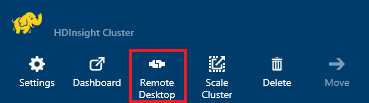
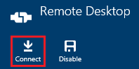
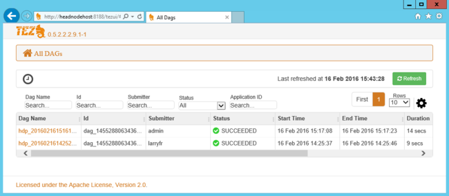
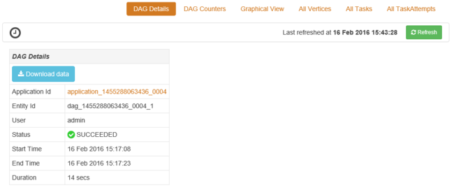
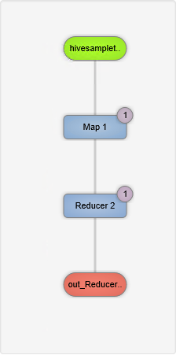
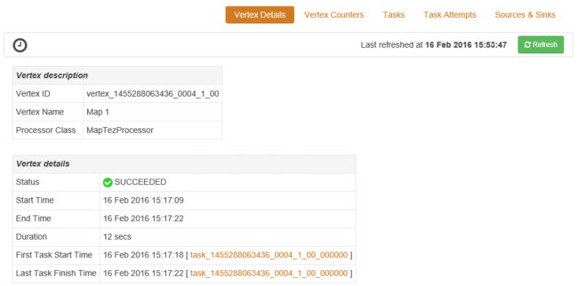
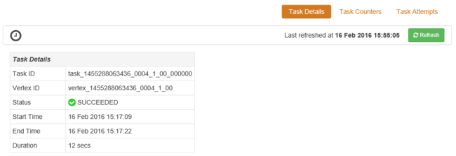

# Use the Tez UI to debug Tez Jobs on Windows-based HDInsight
The Tez UI can be used to debug Hive jobs that use Tez as the execution engine. The Tez UI visualizes the job as a graph of connected items, can drill into each item, and retrieve statistics and logging information.

> [!IMPORTANT]
> The steps in this document require an HDInsight cluster that uses Windows. Linux is the only operating system used on HDInsight version 3.4 or greater. For more information, see [HDInsight retirement on Windows](hdinsight-component-versioning.md#hdinsight-windows-retirement).

## Prerequisites
* A Windows-based HDInsight cluster. For steps on creating a new cluster, see [Get started using Windows-based HDInsight](hdinsight-hadoop-tutorial-get-started-windows.md).

  > [!IMPORTANT]
  > The Tez UI is only available on Windows-based HDInsight clusters created after February 8th, 2016.
  >
  >
* A Windows-based Remote Desktop client.

## Understanding Tez
Tez is an extensible framework for data processing in Hadoop, and provides greater speeds than traditional MapReduce processing. You can enable Tez by including the following text as part of a Hive query:

    set hive.execution.engine=tez;

Tez creates a Directed Acyclic Graph (DAG) that describes the order of execution of the actions required by the job. Individual actions are called vertices, and execute a piece of the overall job. The actual execution of the work described by a vertex is called a task, and may be distributed across multiple nodes in the cluster.

### Understanding the Tez UI
The Tez UI is a web page provides information on processes that use Tez. It may offer useful information in the following scenarios:

* Monitoring long-running processes, viewing the progress of map and reduce tasks.
* Analyzing historical data for successful or failed processes to learn how processing could be improved or why it failed.

## Generate a DAG
The Tez UI contains data if a job that uses the Tez engine is currently running, or has been ran in the past. Simple Hive queries can usually be resolved without using Tez. More complex queries that do filtering, grouping, ordering, joins, etc. require Tez.

Use the following steps to run a Hive query that uses Tez.

1. In a web browser, navigate to https://CLUSTERNAME.azurehdinsight.net, where **CLUSTERNAME** is the name of your HDInsight cluster.
2. From the menu at the top of the page, select the **Hive Editor**. This displays a page with the following example query.

        Select * from hivesampletable

    Erase the example query and replace it with the following.

        set hive.execution.engine=tez;
        select market, state, country from hivesampletable where deviceplatform='Android' group by market, country, state;
3. Select the **Submit** button. The **Job Session** section at the bottom of the page displays the status of the query. Once the status changes to **Completed**, select the **View Details** link to view the results. The **Job Output** should be similar to the following:

        en-GB   Hessen      Germany
        en-GB   Kingston    Jamaica
        en-GB   Nairobi Area    Kenya

## Use the Tez UI
> [!NOTE]
> The Tez UI is only available from the desktop of the cluster head nodes, so you must use Remote Desktop to connect to the head nodes.
>
>

1. From the [Azure portal](https://portal.azure.com), select your HDInsight cluster. From the top of the HDInsight blade, select the **Remote Desktop** icon. This link displays the remote desktop blade

    
2. From the Remote Desktop blade, select **Connect** to connect to the cluster head node. When prompted, use the cluster Remote Desktop user name and password to authenticate the connection.

    

   > [!NOTE]
   > If you have not enabled Remote Desktop connectivity, provide a user name, password, and expiration date, then select **Enable** to enable Remote Desktop. Once it has been enabled, use the previous steps to connect.
   >
   >
3. Once connected, open Internet Explorer on the remote desktop, select the gear icon in the upper right of the browser, and then select **Compatibility View Settings**.
4. From the bottom of **Compatibility View Settings**, clear the check box for **Display intranet sites in Compatibility View** and **Use Microsoft compatibility lists**, and then select **Close**.
5. In Internet Explorer, browse to http://headnodehost:8188/tezui/#/. This displays the Tez UI

    

    When the Tez UI loads, you see a list of DAGs that are currently running, or have been ran on the cluster. The default view includes the DAG Name, Id, Submitter, Status, Start Time, End Time, Duration, Application ID, and Queue. More columns can be added using the gear icon at the right of the page.

    If you have only one entry, it is for the query that you ran in the previous section. If you have multiple entries, you can search by entering search criteria in the fields above the DAGs, then hit **Enter**.
6. Select the **Dag Name** for the most recent DAG entry. This link displays information about the DAG, as well as the option to download a zip of JSON files that contain information about the DAG.

    
7. Above the **DAG Details** are several links that can be used to display information about the DAG.

   * **DAG Counters** displays counters information for this DAG.
   * **Graphical View** displays a graphical representation of this DAG.
   * **All Vertices** displays a list of the vertices in this DAG.
   * **All Tasks** displays a list of the tasks for all vertices in this DAG.
   * **All TaskAttempts** displays information about the attempts to run tasks for this DAG.

     > [!NOTE]
     > If you scroll the column display for Vertices, Tasks and TaskAttempts, notice that there are links to view **counters** and **view or download logs** for each row.
     >
     >

     If there was a failure with the job, the DAG Details display a status of FAILED, along with links to information about the failed task. Diagnostics information is be displayed beneath the DAG details.
8. Select **Graphical View**. This displays a graphical representation of the DAG. You can place the mouse over each vertex in the view to display information about it.

    
9. Clicking on a vertex loads the **Vertex Details** for that item. Click on the **Map 1** vertex to display details for this item. Select **Confirm** to confirm the navigation.

    
10. Note that you now have links at the top of the page that are related to vertices and tasks.

    > [!NOTE]
    > You can also arrive at this page by going back to **DAG Details**, selecting **Vertex Details**, and then selecting the **Map 1** vertex.
    >
    >

    * **Vertex Counters** displays counter information for this vertex.
    * **Tasks** displays tasks for this vertex.
    * **Task Attempts** displays information about attempts to run tasks for this vertex.
    * **Sources & Sinks** displays data sources and sinks for this vertex.

      > [!NOTE]
      > As with the previous menu, you can scroll the column display for Tasks, Task Attempts, and Sources & Sinks__ to display links to more information for each item.
      >
      >
11. Select **Tasks**, and then select the item named **00_000000**. This link displays **Task Details** for this task. From this screen, you can view **Task Counters** and **Task Attempts**.

    

## Next Steps
Now that you have learned how to use the Tez view, learn more about [Using Hive on HDInsight](hadoop/hdinsight-use-hive.md).

For more detailed technical information on Tez, see the [Tez page at Hortonworks](http://hortonworks.com/hadoop/tez/).
