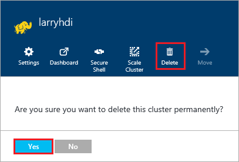

<properties
pageTitle="How to delete an HDInsight cluster | Azure"
description="Information on the various ways that you can delete an HDInsight cluster."
services="hdinsight"
documentationCenter=""
authors="Blackmist"
manager="paulettm"
editor="cgronlun"/>

<tags
ms.service="hdinsight"
ms.devlang="na"
ms.topic="article"
ms.tgt_pltfrm="na"
ms.workload="big-data"
ms.date="05/20/2016"
ms.author="larryfr"/>

#How to delete an HDInsight cluster

HDInsight cluster billing starts once a cluster is created and stops when the cluster is deleted and is pro-rated per minute, so you should always delete your cluster when it is no longer in use. In this document, you will learn how to delete a cluster using the Azure Portal, Azure PowerShell, and the Azure CLI.

> [AZURE.IMPORTANT] Deleting an HDInsight cluster does not delete the Azure Storage account(s) associated with the cluster. This allows you to preserve and reuse any data stored by the cluster.

##Azure Portal

1. Login to the [Azure portal](https://portal.azure.com) and select your HDInsight cluster. If your HDInsight cluster is not pinned to the dashboard, you can search for it by name using the search field (magnifying glass icon,) on the right side of the navigation bar.

    

2. Once the blade opens for the cluster, select the __Delete__ icon. When prompted, select __Yes__ to delete the cluster.

    

##Azure PowerShell

From a PowerShell prompt, use the following command to delete the cluster:

    Remove-AzureRmHDInsightCluster -ClusterName CLUSTERNAME

Replace __CLUSTERNAME__ with the name of your HDInsight cluster.

##Azure CLI

From a prompt, use the following to delete the cluster:

    azure hdinsight cluster delete CLUSTERNAME
    
Replace __CLUSTERNAME__ with the name of your HDInsight cluster.
