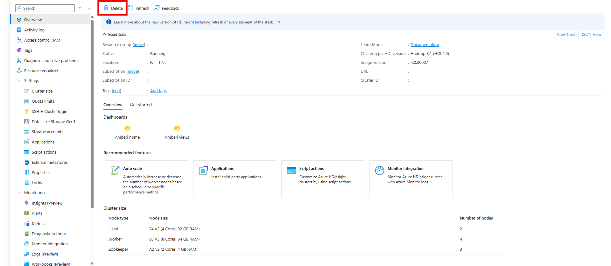

# Delete an HDInsight cluster using your browser, PowerShell, or the Azure CLI

HDInsight cluster billing starts once a cluster is created and stops when the cluster is deleted. Billing is pro-rated per minute, so you should always delete your cluster when it's no longer in use. In this document, you learn how to delete a cluster using the [Azure portal](https://portal.azure.com), [Azure PowerShell Az module](https://docs.microsoft.com/powershell/azure/overview), and the [Azure CLI](https://docs.microsoft.com/cli/azure/?view=azure-cli-latest).

> [!IMPORTANT]  
> Deleting an HDInsight cluster does not delete the Azure Storage accounts or Data Lake Storage associated with the cluster. You can reuse data stored in those services in the future.

## Azure portal

1. Sign in to the [Azure portal](https://portal.azure.com).

2. From the left menu, navigate to **All services** > **Analytics** > **HDInsight clusters** and select your cluster.

3. From the default view, select the **Delete** icon. Follow the prompt to delete your cluster.

    

## Azure PowerShell

Replace `CLUSTERNAME` with the name of your HDInsight cluster in the code below. From a PowerShell prompt, enter the following command to delete the cluster:

```powershell
Remove-AzHDInsightCluster -ClusterName CLUSTERNAME
```

## Azure CLI

Replace `CLUSTERNAME` with the name of your HDInsight cluster, and `RESOURCEGROUP` with the name of your resource group in the code below.  From a command prompt, enter the following to delete the cluster:

```azurecli
az hdinsight delete --name CLUSTERNAME --resource-group RESOURCEGROUP
```
