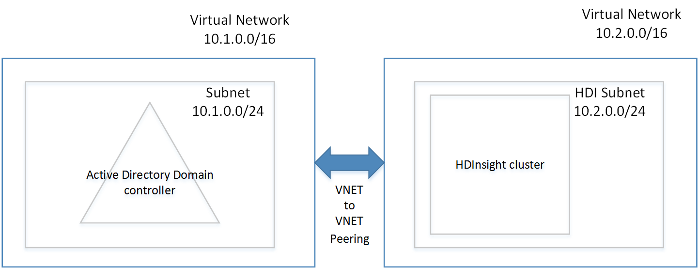
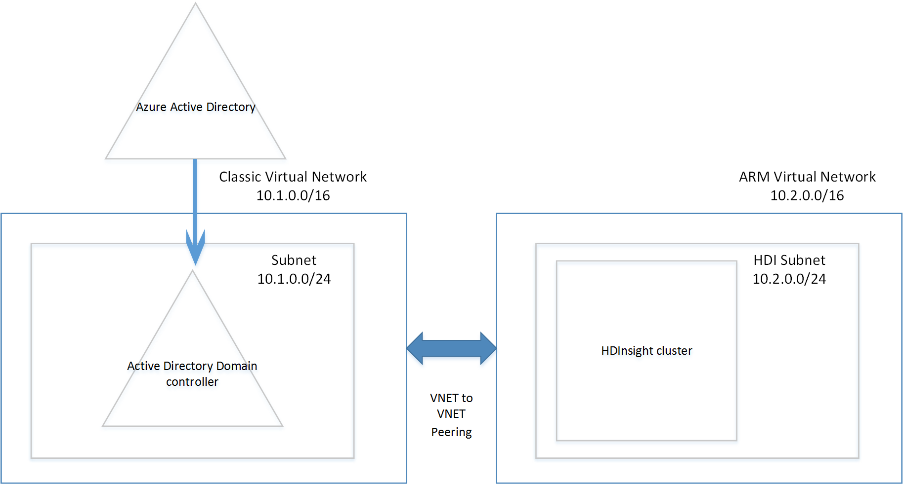
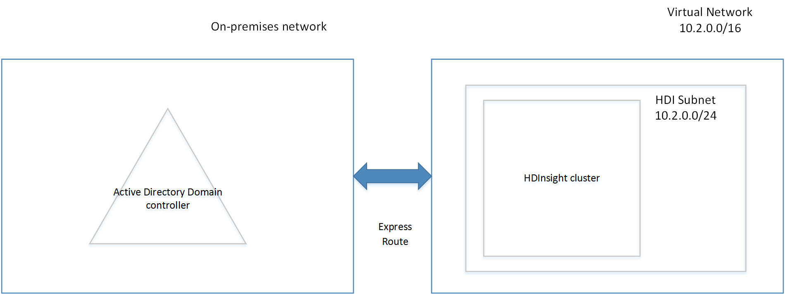

---
title: Domain-joined Azure HDInsight architecture| Microsoft Docs
description: Learn how to plan domain-joined HDInsight.
services: hdinsight
documentationcenter: ''
author: saurinsh
manager: jhubbard
editor: cgronlun
tags: azure-portal

ms.assetid: 7dc6847d-10d4-4b5c-9c83-cc513cf91965
ms.service: hdinsight
ms.devlang: na
ms.topic: hero-article
ms.tgt_pltfrm: na
ms.workload: big-data
ms.date: 01/10/2017
ms.author: saurinsh

---
# Plan Azure Domain-joined Hadoop clusters in HDInsight

Today, HDInsight is a single user cluster, which works fine for most companies who have smaller application teams building their BigData workloads. However, as Hadoop is gaining popularity, many enterprises are moving towards a model where clusters are managed by IT teams, and multiple application teams are sharing clusters. Thus, multi-user clusters are one of the most requested functionalities in HDInsight.

Instead of building our own multi-user authentication, and authorization, HDInsight relies on the most popular identity provider – Active Directory. After integrating HDInsight with Active Directory, AD users can communicate with the cluster using their Active Directory credentials. The powerful security groups functionality in Active Directory can be used to manage multi-user authorization in HDInsight. HDInsight maps the Active Directory user to a local Hadoop user, so all the services running on HDInsight (Ambari, Hive server, Ranger, Spark thrift server, and so on) work seamlessly for the logged in user.

## Integrate HDInsight with Active Directory

When HDInsight is integrated with Active Directory, the HDInsight Linux nodes are domain-joined to the Active Directory domain. HDInsight creates service principals for the hadoop services running on the cluster and place them within a specified Organizational Unit in the Active Directory. HDInsight also creates reverse DNS mappings in the Active Directory domain for the IP addresses of the nodes that are joined to the domain.

To achieve this setup, there are multiple architectures that you can follow. You need to decide which architecture works better for you.

**1. HDInsight integrated with AD running on Azure IAAS**

This is the simplest architecture for integrating HDInsight with Active Directory. The Active Directory domain controller runs on one (or multiple) virtual machines (VM) in Azure. Usually these VMs are within a virtual network. You can setup a new virtual network within which you can place your HDInsight cluster. For HDInsight to have a line of sight to the Active Directory, you need to peer these virtual networks using [VNET to VNET peering](../virtual-network/virtual-networks-create-vnetpeering-arm-portal.md).

Prerequisites that need to be setup on Active Directory

* An Organizational unit must be created, within which you want to place the HDInsight cluster VMs and the service principals used by the cluster.
* LDAPS must be setup for communicating with the Active Directory. The certificate used to setup LDAPS must be a real certificate (not a self-signed certificate).
* Reverse DNS zones must be created on the domain for the IP address range of the HDI Subnet (for example 10.2.0.0/24 in the above picture).
* A service account, or a user account is needed, which issued to create the HDInsight cluster. This account must have the following permissions:

    - Permissions to create service principal objects and machine objects within the organizational unit.
    - Permissions to create reverse DNS proxy rules
    - Permissions to join machines to the Active Directory domain.

**2. HDInsight integrated with a cloud-only Azure AD**

For a cloud-only Azure Active Directory, you need to configure a domain controller so that HDInsight can be integrated with your Azure Active Directory (AAD). This is achieved using [Azure Active Directory domain services](../active-directory-domain-services/active-directory-ds-overview.md) (AD DS). The AD DS creates domain controller machines on the cloud, and provides you with IP addresses for them. It creates two domain controllers for high availability.

The AD DS only exists in Classic VNETs today, and hence you need access to Classic portal, and need to create a classic VNET for configuring AD DS. The HDInsight VNET exists in the Azure portal, which needs to be peered with the classic VNET using VNET to VNET peering.

> [!NOTE]
> Peering between Classic and Azure Resource Manager VNETs requires both vnets are in the same region, and both vnets are under the same Azure subscription.

Prerequisites that need to be setup on Active Directory 

* An [Organizational unit](../active-directory-domain-services/active-directory-ds-admin-guide-create-ou.md) must be created, within which you want to place the HDInsight cluster VMs and the service principals used by the cluster. 
* [LDAPS](../active-directory-domain-services/active-directory-ds-admin-guide-configure-secure-ldap.md) must be setup when you configure AD DS. The certificate used to setup LDAPS must be a real certificate (not a self-signed certificate).
* Reverse DNS zones must be created on the domain for the IP address range of the HDI Subnet (for example 10.2.0.0/24 in the above picture). 
* [Password hashes](../active-directory-domain-services/active-directory-ds-getting-started-password-sync.md) must be synced from AAD to AD DS.
* A service account, or a user account is needed, which is used to create the HDInsight cluster. This account must have the following permissions

    - Permissions to create service principal objects and machine objects within the organizational unit.
    - Permissions to create reverse DNS proxy rules
    - Permissions to join machines to the Active Directory domain.

**3. HDInsight integrated with an on-premises AD via VPN**

This architecture is like the architecture #1. The only difference is that in this case, your Active Directory is on-premises and the line of sight for HDInsight to Active Directory is via a [VPN connection from Azure to on-premises network](../expressroute/expressroute-introduction.md).

Prerequisites that need to be setup on the on-premises Active Directory

* An Organizational unit must be created, within which you want to place the HDInsight cluster VMs and the service principals used by the cluster.
* LDAPS must be setup for communicating with the Active Directory. The certificate used to setup LDAPS must be a real certificate (not a self-signed certificate).
* Reverse DNS zones must be created on the domain for the IP address range of the HDI Subnet (for example 10.2.0.0/24 in the above picture).
* A service account, or a user account is needed, which is used to create the HDInsight cluster. This account must have the following permissions

    - Permissions to create service principal objects and machine objects within the organizational unit.
    - Permissions to create reverse DNS proxy rules
    - Permissions to join machines to the Active Directory domain.

**4. HDInsight integrated with an on-premises AD synced to an Azure AD**

This architecture is like the architecture #2. The only difference is that in this case, the on-premises Active Directory is synced to the Azure Active Directory (AAD). You  need to configure a domain controller on the cloud so that HDInsight can be integrated with your Azure Active Directory (AAD). This is achieved using [Azure Active Directory domain services](../active-directory-domain-services/active-directory-ds-overview.md) (AD DS). The AD DS creates domain controller machines on the cloud, and provides you with IP addresses for them. It creates two domain controllers for high availability.

The AD DS only exists in Classic VNETs today, and hence you need access to Classic portal, and need to create a classic VNET for configuring AD DS. The HDInsight VNET exists in the Azure portal, which needs to be peered with the classic VNET using VNET to VNET peering.

> [!NOTE] 
> Peering between Classic and Azure Resource Manager VNETs requires both vnets are in the same region, and both vnets are under the same Azure subscription.

Prerequisites that need to be setup on Active Directory 

* An [Organizational unit](../active-directory-domain-services/active-directory-ds-admin-guide-create-ou.md) must be created, within which you want to place the HDInsight cluster VMs and the service principals used by the cluster. 
* LDAPS must be setup when you configure AD DS. The certificate used to setup LDAPS must be a real certificate (not a self-signed certificate).
* Reverse DNS zones must be created on the domain for the IP address range of the HDI Subnet (for example 10.2.0.0/24 in the above picture). 
* [Password hashes](../active-directory-domain-services/active-directory-ds-getting-started-password-sync.md) must be synced from AAD to AD DS.
* A service account, or a user account is needed, which is used to create the HDInsight cluster. This account must have the following permissions

    - Permissions to create service principal objects and machine objects within the organizational unit.
    - Permissions to create reverse DNS proxy rules
    - Permissions to join machines to the Active Directory domain.

**5. HDInsight integrated with a non-default Azure AD (recommended only for testing and development)**

This architecture is like architecture #2. In most companies, the admin access to Active Directory is restricted to only certain individuals. Thus, when you want to do a POC, or just try out creating a domain-joined cluster, instead of waiting for admin to configure pre-requisites on the Active Directory, it may be beneficial to just create a new Azure Active Directory in the subscription. Since this is an AAD that you created, you have full permissions to this AAD to configure the AD DS.

The AD DS creates domain controller machines on the cloud, and provides you with IP addresses for them. It creates two domain controllers for high availability.

The AD DS only exists in Classic VNETs today, and hence you need access to Classic portal, and  need to create a classic VNET for configuring AD DS. The HDInsight VNET exists in the Azure portal, which needs to be peered with the classic VNET using VNET to VNET peering.

> [!NOTE]
> Peering between Classic and Azure Resource Manager VNETs requires both vnets are in the same region, and both vnets are under the same Azure subscription.

Prerequisites that need to be setup on Active Directory 

* An Organizational unit must be created, within which you want to place the HDInsight cluster VMs and the service principals used by the cluster. 
* LDAPS must be setup when you configure AD DS. You can create a [self-signed certificate](../active-directory-domain-services/active-directory-ds-admin-guide-configure-secure-ldap.md) to configure LDAPS. However, to use a self-signed certificate, you need to request an exception from <a href="mailto:hdipreview@microsoft.com">hdipreview@microsoft.com</a>.
* Reverse DNS zones must be created on the domain for the IP address range of the HDI Subnet (for example 10.2.0.0/24 in the above picture). 
* Password hashes must be synced from AAD to AD DS.
* A service account, or a user account is needed, which is used to create the HDInsight cluster. This account must have the following permissions

    - Permissions to create service principal objects and machine objects within the organizational unit.
    - Permissions to create reverse DNS proxy rules
    - Permissions to join machines to the Active Directory domain.

## Next steps
* For configuring a Domain-joined HDInsight cluster, see [Configure Domain-joined HDInsight clusters](hdinsight-domain-joined-configure.md).
* For managing Domain-joined HDInsight clusters, see [Manage Domain-joined HDInsight clusters](hdinsight-domain-joined-manage.md).
* For configuring Hive policies and run Hive queries, see [Configure Hive policies for Domain-joined HDInsight clusters](hdinsight-domain-joined-run-hive.md).
* For running Hive queries using SSH on Domain-joined HDInsight clusters, see [Use SSH with Linux-based Hadoop on HDInsight from Linux, Unix, or OS X](hdinsight-hadoop-linux-use-ssh-unix.md).

