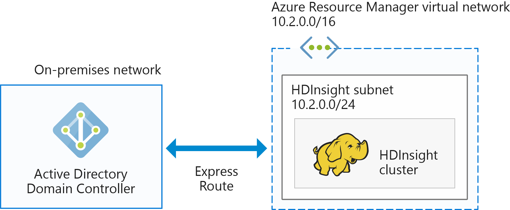

---
title: Domain-joined Azure HDInsight architecture| Microsoft Docs
description: Learn how to plan domain-joined HDInsight.
services: hdinsight
documentationcenter: ''
author: saurinsh
manager: jhubbard
editor: cgronlun
tags: azure-portal

ms.assetid: 7dc6847d-10d4-4b5c-9c83-cc513cf91965
ms.service: hdinsight
ms.devlang: na
ms.topic: hero-article
ms.tgt_pltfrm: na
ms.workload: big-data
ms.date: 02/03/2017
ms.author: saurinsh

---
# Plan Azure domain-joined Hadoop clusters in HDInsight

The traditional Hadoop is a single-user cluster. It is suitable for most companies that have smaller application teams building large data workloads. As Hadoop gains popularity, many enterprises are moving toward a model in which clusters are managed by IT teams and multiple application teams share clusters. Thus, functionalities involving multiuser clusters are among the most requested functionalities in HDInsight.

Instead of building its own multiuser authentication and authorization, HDInsight relies on the most popular identity provider--Azure Active Directory (Azure AD). The powerful security functionality in Azure AD can be used to manage multiuser authorization in HDInsight. By integrating HDInsight with Azure AD, you can communicate with the clusters by using your Azure AD credentials. HDInsight maps an Azure AD user to a local Hadoop user, so all the services running on HDInsight (Ambari, Hive server, Ranger, Spark thrift server, and others) work seamlessly for the authenticated user.

## Integrate HDInsight with Azure AD

By integrating HDInsight with Azure AD, the HDInsight cluster nodes are domain-joined to the Azure AD domain. HDInsight creates service principals for the Hadoop services running on the cluster and places them within a specified Organizational Unit (OU) in Azure AD. HDInsight also creates reverse DNS mappings in the Azure AD domain for the IP addresses of the nodes that are joined to the domain.

You can achieve this setup by using multiple architectures. You can choose from the following architectures:

**HDInsight integrated with Azure AD running on Azure IAAS**

This is the simplest architecture for integrating HDInsight with Azure AD. The Azure AD domain controller runs on one (or multiple) virtual machines (VMs) in Azure. These VMs are usually in a virtual network. You set up another virtual network for the HDInsight cluster. For HDInsight to have a line of sight to Azure AD, you need to peer these virtual networks by using [VNet to VNet peering](../virtual-network/virtual-networks-create-vnetpeering-arm-portal.md).

> [!NOTE]
> In this architecture, you cannot use Azure Data Lake Store with HDInsight cluster.

Prerequisites for the Active Directory:

* An [Organizational Unit](../active-directory-domain-services/active-directory-ds-admin-guide-create-ou.md) must be created, within which you place the HDInsight cluster VMs and the service principals used by the cluster.
* [Lightweight Directory Access Protocols](../active-directory-domain-services/active-directory-ds-admin-guide-configure-secure-ldap.md) (LDAPs) must be set up for communicating with the Active Directory. The certificate used to set up LDAPS must be a real certificate (not a self-signed certificate).
* Reverse DNS zones must be created on the domain for the IP address range of the HDInsight Subnet (for example 10.2.0.0/24 in the previous picture).
* A service account or a user account is needed. Use this account to create the HDInsight cluster. This account must have the following permissions:

    - Permissions to create service principal objects and machine objects within the organizational unit
    - Permissions to create reverse DNS proxy rules
    - Permissions to join machines to the Active Directory domain

**HDInsight integrated with a cloud-only Azure AD**

For a cloud-only Azure AD, configure a domain controller so that HDInsight can be integrated with your Azure AD. This is achieved by using [Azure Active Directory domain services](../active-directory-domain-services/active-directory-ds-overview.md) (Azure AD DS). The Azure AD DS creates domain controller machines on the cloud and provides IP addresses for them. It creates two domain controllers for high availability.

Currently, Azure AD DS exists only in classic VNets. It is only accessible by using the Azure classic portal. The HDInsight VNet exists in the Azure portal, which needs to be peered with the classic VNet by using VNet to VNet peering.

> [!NOTE]
> Peering between a classic VNet and an Azure Resource Manager VNet requires that both VNets are in the same region and under the same Azure subscription.

Prerequisites for Azure AD:

* An [Organizational Unit](../active-directory-domain-services/active-directory-ds-admin-guide-create-ou.md) must be created within which you place the HDInsight cluster VMs and the service principals used by the cluster.
* [LDAPS](../active-directory-domain-services/active-directory-ds-admin-guide-configure-secure-ldap.md) must be set up when you configure Azure AD DS. The certificate used to set up LDAPS must be a real certificate (not a self-signed certificate).
* Reverse DNS zones must be created on the domain for the IP address range of the HDInsight Subnet (for example 10.2.0.0/24 in the previous picture).
* [Password hashes](../active-directory-domain-services/active-directory-ds-getting-started-password-sync.md) must be synced from Azure AD to Azure AD DS.
* A service account or a user account is needed. Use this account to create the HDInsight cluster. This account must have the following permissions:

    - Permissions to create service principal objects and machine objects within the organizational unit
    - Permissions to create reverse DNS proxy rules
    - Permissions to join machines to the Azure AD domain

**HDInsight integrated with an on-premises Active Directory via VPN**

This architecture is similar to HDInsight integrated with Azure AD running on Azure IAAS. The only difference is that Azure AD is on-premises and the line of sight for HDInsight to Azure AD is via a [VPN connection from Azure to an on-premises network](../expressroute/expressroute-introduction.md).

> [!NOTE]
> In this architecture, you cannot use Azure Data Lake Store with HDInsight cluster.

Prerequisites for Azure AD:

* An [Organizational Unit](../active-directory-domain-services/active-directory-ds-admin-guide-create-ou.md) must be created, within which you place the HDInsight cluster VMs and the service principals used by the cluster.
* [LDAPS](../active-directory-domain-services/active-directory-ds-admin-guide-configure-secure-ldap.md) must be set up for communicating with Azure AD. The certificate used to set up LDAPS must be a real certificate (not a self-signed certificate).
* Reverse DNS zones must be created on the domain for the IP address range of the HDInsight Subnet (for example 10.2.0.0/24 in the previous picture).
* A service account or a user account is needed. Use this account to create the HDInsight cluster. This account must have the following permissions:

    - Permissions to create service principal objects and machine objects within the organizational unit
    - Permissions to create reverse DNS proxy rules
    - Permissions to join machines to the Azure AD domain

**HDInsight integrated with an on-premises Active Directory synced to Azure AD**

This architecture is similar to HDInsight integrated with a cloud-only Azure AD. The only difference is that the on-premises Active Directory is synced to the Azure AD. Configure a domain controller in the cloud so that HDInsight can be integrated with your Azure AD. This is achieved by using [Azure Active Directory Domain Services](../active-directory-domain-services/active-directory-ds-overview.md) (AD DS). Azure AD DS creates domain controller machines in the cloud and provides IP addresses for them. It creates two domain controllers for high availability.

Currently, Azure AD DS exists only in classic VNets. It is only accessible by using the Azure classic portal. The HDInsight VNet exists in the Azure portal, which needs to be peered with the classic VNet by using VNet to VNet peering.

> [!NOTE]
> Peering between a classic VNet and an Azure Resource Manager VNet requires that both VNets are in the same region and are under the same Azure subscription.

Prerequisites for the Active Directory:

* An [Organizational unit](../active-directory-domain-services/active-directory-ds-admin-guide-create-ou.md) must be created within which you place the HDInsight cluster VMs and the service principals used by the cluster.
* [LDAPS](../active-directory-domain-services/active-directory-ds-admin-guide-configure-secure-ldap.md) must be set up when you configure Azure AD DS. The certificate used to set up LDAPS must be a real certificate (not a self-signed certificate).
* Reverse DNS zones must be created on the domain for the IP address range of the HDInsight Subnet (for example 10.2.0.0/24 in the previous picture).
* [Password hashes](../active-directory-domain-services/active-directory-ds-getting-started-password-sync.md) must be synced from Azure AD to Azure AD DS.
* A service account or a user account is needed. Use this account to create the HDInsight cluster. This account must have the following permissions:

    - Permissions to create service principal objects and machine objects within the organizational unit
    - Permissions to create reverse DNS proxy rules
    - Permissions to join machines to the Active Directory domain

**HDInsight integrated with a non-default Azure AD (recommended only for testing and development)**

This architecture is similar to HDInsight integrated with a cloud-only Azure AD. For most companies, the admin access to Azure AD is restricted to certain individuals. Thus, when you want to do a proof-of-concept or try out creating a domain-joined cluster, it may be beneficial to create an Azure Active Directory in the subscription instead of waiting for an admin to configure prerequisites on the Active Directory. Since this is an Azure AD that you created, you have full permissions to this Azure AD to configure the Azure AD DS.

The Azure AD DS creates domain controller machines on the cloud and provides IP addresses for them. It creates two domain controllers for high availability.

The Azure AD DS exists only in classic VNets, so you need access to the Azure classic portal, and you must create a classic VNet for configuring Azure AD DS. The HDInsight VNet exists in the Azure portal, which needs to be peered with the classic VNet by using VNet to VNet peering.

> [!NOTE]
> Peering between the classic and Azure Resource Manager VNets requires that both VNets are in the same region and are under the same Azure subscription.

Prerequisites for the Active Directory:

* An [Organizational unit](../active-directory-domain-services/active-directory-ds-admin-guide-create-ou.md) must be created, within which you place the HDInsight cluster VMs and the service principals used by the cluster.
* [LDAPS](../active-directory-domain-services/active-directory-ds-admin-guide-configure-secure-ldap.md) must be set up when you configure AD DS. You can create a [self-signed certificate](../active-directory-domain-services/active-directory-ds-admin-guide-configure-secure-ldap.md) to configure LDAPS. However, to use a self-signed certificate, you must request an exception from <a href="mailto:hdipreview@microsoft.com">hdipreview@microsoft.com</a>.
* Reverse DNS zones must be created on the domain for the IP address range of the HDInsight Subnet (for example 10.2.0.0/24 in the previous picture).
* [Password hashes](../active-directory-domain-services/active-directory-ds-getting-started-password-sync.md) must be synced from Azure AD to Azure AD DS.
* A service account or a user account is needed. Use this account to create the HDInsight cluster. This account must have the following permissions:

    - Permissions to create service principal objects and machine objects within the organizational unit
    - Permissions to create reverse DNS proxy rules
    - Permissions to join machines to the Azure Active Directory domain

## Next steps
* To configure a Domain-joined HDInsight cluster, see [Configure Domain-joined HDInsight clusters](hdinsight-domain-joined-configure.md).
* To manage Domain-joined HDInsight clusters, see [Manage Domain-joined HDInsight clusters](hdinsight-domain-joined-manage.md).
* To configure Hive policies and run Hive queries, see [Configure Hive policies for Domain-joined HDInsight clusters](hdinsight-domain-joined-run-hive.md).
* To run Hive queries by using SSH on Domain-joined HDInsight clusters, see [Use SSH with Linux-based Hadoop on HDInsight from Linux, Unix, or OS X](hdinsight-hadoop-linux-use-ssh-unix.md).
