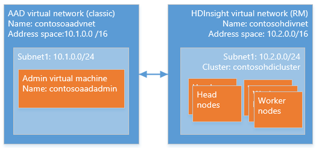

---
title: Configure Domain-joined HDInsight clusters using PowerShell - Azure | Microsoft Docs
description: Learn how to set up and configure Domain-joined HDInsight clusters using Azure PowerShell
services: hdinsight
documentationcenter: ''
author: saurinsh
manager: jhubbard
editor: cgronlun
tags: ''

ms.assetid: a13b2f7a-612d-4800-bc92-7fc0524f3e89
ms.service: hdinsight
ms.custom: hdinsightactive
ms.devlang: na
ms.topic: article
ms.tgt_pltfrm: na
ms.workload: big-data
ms.date: 11/02/2016
ms.author: saurinsh

---
# Configure Domain-joined HDInsight clusters (Preview) using Azure PowerShell
Learn how to set up an Azure HDInsight cluster with Azure Active Directory (Azure AD) and [Apache Ranger](http://hortonworks.com/apache/ranger/) using Azure PowerShell. An Azure PowerShell script is provided to make the configuration faster and less error prone. Domain-joined HDInsight can only be configured on Linux-based clusters. For more information, see [Introduce Domain-joined HDInsight clusters](hdinsight-domain-joined-introduction.md).

> [!IMPORTANT]
> Oozie is not enabled on domain-joined HDInsight.

A typical Domain-joined HDInsight cluster configuration involves the following steps:

1. Create an Azure classic VNet for your Azure AD.  
2. Create and configure Azure AD and Azure AD DS.
3. Add a VM to the classic VNet for creating organizational unit. 
4. Create an organizational unit for Azure AD DS.
5. Create an HDInsight VNet in the Azure resource management mode.
6. Setup Reverse DNS zones for the Azure AD DS.
7. Peer the two VNets.
8. Create an HDInsight cluster.

The PowerShell script provided performs steps 3 through 7. You must go through step 1 and 2 manually.  If you prefer not to use Azure PowerShell, see [Configure Domain-joined HDInsight clusters](hdinsight-domain-joined-configure.md). 

An example of the final topology looks as follows:

Because Azure AD currently only supports classic virtual networks (VNets) and Linux-based HDInsight clusters only support Azure Resource Manager based VNets, HDInsight Azure AD integration requires two VNets and a peering between them. For the comparison information between the two deployment models, see [Azure Resource Manager vs. classic deployment: Understand deployment models and the state of your resources](../azure-resource-manager/resource-manager-deployment-model.md). The two VNets must be in the same region as the Azure AD DS.

> [!NOTE]
> This tutorial assumes that you do not have an Azure AD. If you have one, you can skip the portion in step 2.
> 
> 

## Prerequisites
You must have the following items to go through this tutorial:

* Familiarize yourself with [Azure AD Domain Services](https://azure.microsoft.com/services/active-directory-ds/) its [pricing](https://azure.microsoft.com/pricing/details/active-directory-ds/) structure.
* Ensure that your subscription is whitelisted for this public preview. You can do so by sending an email to hdipreview@microsoft.com with your subscription ID.
* An SSL certificate that is signed by a signing authority for your domain. The certificate is required by configuring secure LDAP. Self-signed certificates cannot be used.
* Azure PowerShell.  See [Install and configure Azure PowerShell](/powershell/azure/overview).

## Create an Azure classic VNet for your Azure AD.
For the instructions, see [here](hdinsight-domain-joined-configure.md#create-an-azure-classic-vnet).

## Create and configure Azure AD and Azure AD DS.
For the instructions, see [here](hdinsight-domain-joined-configure.md#create-and-configure-azure-ad-ds-for-your-azure-ad).

## Run the PowerShell script
The PowerShell script can be downloaded from [GitHub](https://github.com/hdinsight/DomainJoinedHDInsight). Extract the zip file and save the files locally.

**To edit the PowerShell script**

1. Open run.ps1 using Windows PowerShell ISE or any text editor.
2. Fill the values for the following variables:
   
   * **$SubscriptionName** – The name of the Azure subscription where you want to create your HDInsight cluster. You have already created a Classic virtual network in this subscription, and will be creating an Azure Resource Manager virtual network for the HDInsight cluster under subscription.
   * **$ClassicVNetName** - The classic virtual network which contains the Azure AD DS. This virtual network must be in the same subscription which is provided above. This virtual network must be created using the Azure portal, and not using classic portal. If you follow the instruction in [Configure Domain-joined HDInsight clusters (Preview)](hdinsight-domain-joined-configure.md#create-an-azure-classic-vnet), the default name is contosoaadvnet.
   * **$ClassicResourceGroupName** – The Resource Manager group name for the classic virtual network that is mentioned above. For example contosoaadrg. 
   * **$ArmResourceGroupName** – The resource group name within which, you want to create the HDInsight cluster. You can use the same resource group as $ArmResourceGroupName.  If the resource group does not exist, the script creates the resource group.
   * **$ArmVNetName** - The Resource Manager virtual network name within which you want to create the HDInsight cluster. This virtual network will be placed into $ArmResourceGroupName.  If the VNet does not exist, the PowerShell script will create it. If it does exist, it should be part of the resource group that you provide above.
   * **$AddressVnetAddressSpace** – The network address space for the Resource Manager virtual network. Ensure that this address space is available. This address space cannot overlap the classic virtual network’s address space. For example, “10.1.0.0/16”
   * **$ArmVnetSubnetName** - The Resource Manager virtual network subnet name within which you want to place the HDInsight cluster VMs. If the subnet does not exist, the PowerShell script will create it. If it does exist, it should be part of the virtual network that you provide above.
   * **$AddressSubnetAddressSpace** – The network address range for the Resource Manager virtual network subnet. The HDInsight cluster VM IP addresses will be from this subnet address range. For example, “10.1.0.0/24”.
   * **$ActiveDirectoryDomainName** – The Azure AD domain name that you want to join the HDInsight cluster VMs to. For example, “contoso.onmicrosoft.com”
   * **$ClusterUsersGroups** – The common name of the security groups from your AD that you want to sync to the HDInsight cluster. The users within this security group will be able to log on to the cluster dashboard using their active directory domain credentials. These security groups must exist in the active directory. For example, “hiveusers” or “clusteroperatorusers”.
   * **$OrganizationalUnitName** - The organizational unit in the domain, within which you want to place the HDInsight cluster VMs and the service principals used by the cluster. The PowerShell script will create this OU if it does not exist. For example, “HDInsightOU”.
3. Save the changes.

**To run the script**

1. Run **Windows PowerShell** as administrator.
2. Browse to the folder of run.ps1. 
3. Run the script by typing the file name, and hit **ENTER**.  It pops up 3 sign-in dialogs:
   
   1. **Sign in to Azure classic portal** – Enter your credentials which you use to sign in to Azure classic portal. You must have created the Azure AD and Azure AD DS using these credentials.
   2. **Sign in to Azure Resource Manager portal** – Enter your credentials which you use to sign in to Azure Resource Manager portal.
   3. **Domain user name** – Enter the credentials of the Domain user name that you want to be an admin on the HDInsight cluster. If you created an Azure AD from scratch, you must have created this user using this documentation. 
      
      > [!IMPORTANT]
      > Enter the username in this format: 
      > 
      > Domainname\username (for example contoso.onmicrosoft.com\clusteradmin)
      > 
      > 
      
      This user must have 3 privileges: To join machines to the provided Active Directory domain; to create service principals and machine objects within the provided Organizational Unit; and to add reverse DNS proxy rules.

While creating reverse DNS zones, the script will prompt you to enter a network ID. This network ID must be the Resource Manager virtual network’s address prefix. For example, if your Resource Manager virtual network subnet address space is 10.2.0.0/24, enter 10.2.0.0/24 when the tool prompts you for the network ID. 

## Create HDInsight cluster
In this section, you create a Linux-based Hadoop cluster in HDInsight using either the Azure portal or [Azure Resource Manager template](../azure-resource-manager/resource-group-template-deploy.md). For other cluster creation methods and understanding the settings, see [Create HDInsight clusters](hdinsight-hadoop-provision-linux-clusters.md). For more information about using Resource Manager template to create Hadoop clusters in HDInsight, see [Create Hadoop clusters in HDInsight using Resource Manager templates](hdinsight-hadoop-create-windows-clusters-arm-templates.md)

**To create a Domain-joined HDInsight cluster using the Azure portal**

1. Sign on to the [Azure portal](https://portal.azure.com).
2. Click **New**, **Intelligence + analytics**, and then **HDInsight**.
3. From the **New HDInsight cluster** blade, enter or select the following values:
   
   * **Cluster name**: Enter a new cluster name for the Domain-joined HDInsight cluster.
   * **Subscription**: Select an Azure subscription used for creating this cluster.
   * **Cluster configuration**:
     
     * **Cluster Type**: Hadoop. Domain-joined HDInsight is currently only supported on Hadoop clusters.
     * **Operating System**: Linux.  Domain-joined HDInsight is only supported on Linux-based HDInsight clusters.
     * **Version**: Hadoop 2.7.3 (HDI 3.5). Domain-joined HDInsight is only supported on HDInsight cluster version 3.5.
     * **Cluster Type**: PREMIUM
       
       Click **Select** to save the changes.
   * **Credentials**: Configure the credentials for both the cluster user and the SSH user.
   * **Data Source**: Create a new Storage account or use an existing Storage account as the default Storage account for the HDInsight cluster. The location must be the same as the two VNets.  The location is also the location of the HDInsight cluster.
   * **Pricing**: Select the number of worker nodes of your cluster.
   * **Advanced configurations**: 
     
     * **Domain-joining & Vnet/Subnet**: 
       
       * **Domain settings**: 
         
         * **Domain name**: contoso.onmicrosoft.com
         * **Domain user name**: Enter a domain user name. This domain must have the following privileges: Join machines to the domain and place them in the organization unit you configured earlier; Create service principals within the organization unit you configured earlier; Create reverse DNS entries. This domain user will become the administrator of this domain-joined HDInsight cluster.
         * **Domain password**: Enter the domain user password.
         * **Organization Unit**: Enter the distinguished name of the OU that you configured earlier. For example: OU=HDInsightOU,DC=contoso,DC=onmicrosoft,DC=com
         * **LDAPS URL**: ldaps://contoso.onmicrosoft.com:636
         * **Access user group**: Specify the security group whose users you wan to sync to the cluster. For example, HiveUsers.
           
           Click **Select** to save the changes.
           
           
       * **Virtual Network**: contosohdivnet
       * **Subnet**: Subnet1
         
         Click **Select** to save the changes.        
         Click **Select** to save the changes.
   * **Resource Group**: Select the resource group used for the HDInsight VNet (contosohdirg).
4. Click **Create**.  

Another option for creating Domain-joined HDInsight cluster is to use Azure Resource Management template. The following procedure shows you how:

**To create a Domain-joined HDInsight cluster using a Resource Management template**

1. Click the following image to open a Resource Manager template in the Azure portal. The Resource Manager template is located in a public blob container. 
   
    
2. From the **Parameters** blade, enter the following values:
   
   * **Subscription**: (Select your Azure subscription).
   * **Resource group**: Click **Use existing**, and specify the same resource group you have been using.  For example contosohdirg. 
   * **Location**: Specify a resource group location.
   * **Cluster Name**: Enter a name for the Hadoop cluster that you will create. For example contosohdicluster.
   * **Cluster Type**: Select a cluster type.  The default value is **hadoop**.
   * **Location**: Select a location for the cluster.  The default storage account uses the same location.
   * **Cluster Worker Node count**: Select the number of worker nodes.
   * **Cluster login name and password**: The default login name is **admin**.
   * **SSH username and password**: The default username is **sshuser**.  You can rename it. 
   * **Virtual Network Id**: /subscriptions/&lt;SubscriptionID>/resourceGroups/&lt;ResourceGroupName>/providers/Microsoft.Network/virtualNetworks/&lt;VNetName>
   * **Virtual Network Subnet**: /subscriptions/&lt;SubscriptionID>/resourceGroups/&lt;ResourceGroupName>/providers/Microsoft.Network/virtualNetworks/&lt;VNetName>/subnets/Subnet1
   * **Domain Name**: contoso.onmicrosoft.com
   * **Organization Unit DN**: OU=HDInsightOU,DC=contoso,DC=onmicrosoft,DC=com
   * **Cluster Users Group D Ns**: "\"CN=HiveUsers,OU=AADDC Users,DC=<DomainName>,DC=onmicrosoft,DC=com\""
   * **LDAPUrls**: ["ldaps://contoso.onmicrosoft.com:636"]
   * **DomainAdminUserName**: (Enter the domain admin user name)
   * **DomainAdminPassword**: (enter the domain admin user password)
   * **I agree to the terms and conditions stated above**: (Check)
   * **Pin to dashboard**: (Check)
3. Click **Purchase**. You will see a new tile titled **Deploying Template deployment**. It takes about around 20 minutes to create a cluster. Once the cluster is created, you can click the cluster blade in the portal to open it.

After you complete the tutorial, you might want to delete the cluster. With HDInsight, your data is stored in Azure Storage, so you can safely delete a cluster when it is not in use. You are also charged for an HDInsight cluster, even when it is not in use. Since the charges for the cluster are many times more than the charges for storage, it makes economic sense to delete clusters when they are not in use. For the instructions of deleting a cluster, see [Manage Hadoop clusters in HDInsight by using the Azure portal](hdinsight-administer-use-management-portal.md#delete-clusters).

## Next steps

* For configuring Hive policies and run Hive queries, see [Configure Hive policies for Domain-joined HDInsight clusters](hdinsight-domain-joined-run-hive.md).
* For using SSH to connect to Domain-joined HDInsight clusters, see [Use SSH with HDInsight](hdinsight-hadoop-linux-use-ssh-unix.md#domainjoined).

