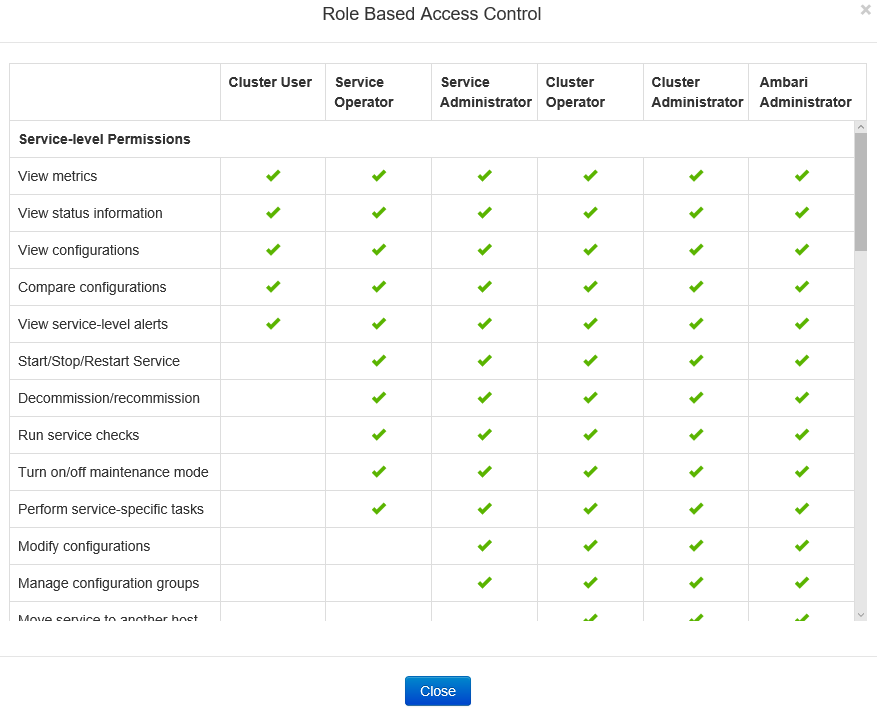
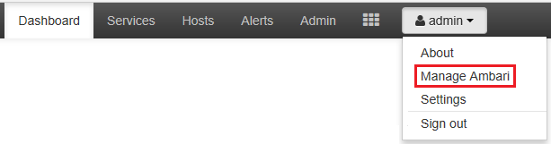
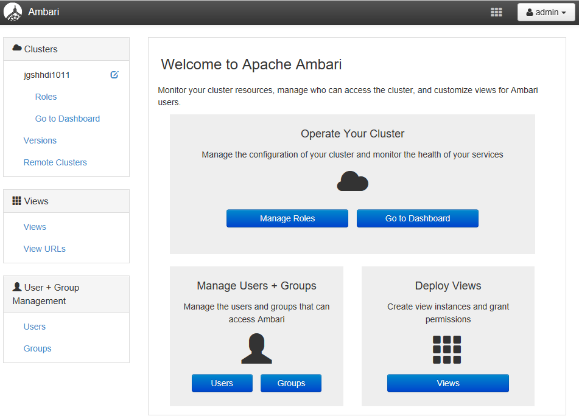
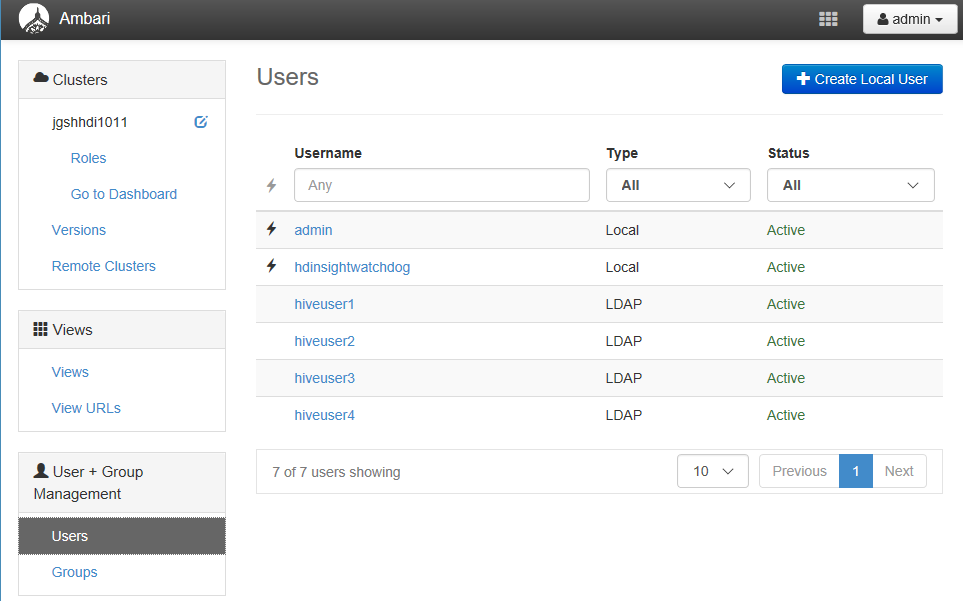
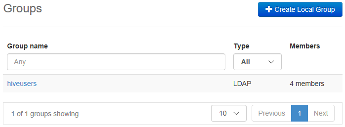
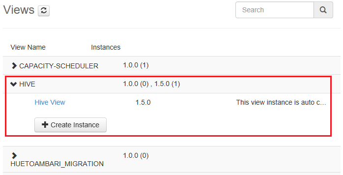
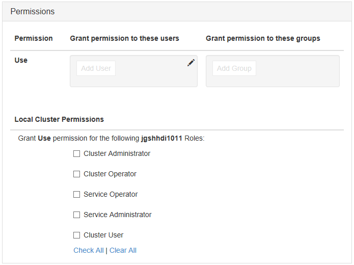

# Manage Domain-joined HDInsight clusters (Preview)
Learn the users and the roles in Domain-joined HDInsight, and how to manage domain-joined HDInsight clusters.

## Users of Domain-joined HDInsight clusters
An HDInsight cluster that is not domain-joined has two user accounts that are created during the cluster creation:

* **Ambari admin**: This account is also known as *Hadoop user* or *HTTP user*. This account can be used to log on to Ambari at https://&lt;clustername>.azurehdinsight.net. It can also be used to run queries on Ambari views, execute jobs via external tools (i.e. PowerShell, Templeton, Visual Studio), and authenticate with the Hive ODBC driver and BI tools (i.e. Excel, PowerBI, or Tableau).
* **SSH user**:  This account can be used with SSH, and execute sudo commands. It has root privileges to the Linux VMs.

A domain-joined HDInsight cluster has three new users in addition to Ambari Admin and SSH user.

* **Ranger admin**:  This account is the local Apache Ranger admin account. It is not an active directory domain user. This account can be used to setup policies and make other users admins or delegated admins (so that those users can manage policies). By default, the username is *admin* and the password is the same as the Ambari admin password. The password can be updated from the Settings page in Ranger.
* **Cluster admin domain user**: This account is an active directory domain user designated as the Hadoop cluster admin including Ambari and Ranger. You must provide this user’s credentials during cluster creation. This user has the following privileges:

  * Join machines to the domain and place them within the OU that you specify during cluster creation.
  * Create service principals within the OU that you specify during cluster creation.
  * Create reverse DNS entries.

    Note the other AD users also have these privileges.

    There are some end points within the cluster (for example, Templeton) which are not managed by Ranger, and hence are not secure. These end points are locked down for all users except the cluster admin domain user.
* **Regular**: During cluster creation, you can provide multiple active directory groups. The users in these groups will be synced to Ranger and Ambari. These users are domain users and will have access to only Ranger-managed endpoints (for example, Hiveserver2). All the RBAC policies and auditing will be applicable to these users.

## Roles of Domain-joined HDInsight clusters
Domain-joined HDInsight have the following roles:

* Cluster Administrator
* Cluster Operator
* Service Administrator
* Service Operator
* Cluster User

**To see the permissions of these roles**

1. Open the Ambari Management UI.  See [Open the Ambari Management UI](#open-the-ambari-management-ui).
2. From the left menu, click **Roles**.
3. Click the blue question mark to see the permissions:

    

## Open the Ambari Management UI
1. Sign on to the [Azure portal](https://portal.azure.com).
2. Open your HDInsight cluster in a blade. See [List and show clusters](hdinsight-administer-use-management-portal.md#list-and-show-clusters).
3. Click **Dashboard** from the top menu to open Ambari.
4. Log on to Ambari using the cluster administrator domain user name and password.
5. Click the **Admin** dropdown menu from the upper right corner, and then click **Manage Ambari**.

    

    The UI looks like:

    

## List the domain users synchronized from your Active Directory
1. Open the Ambari Management UI.  See [Open the Ambari Management UI](#open-the-ambari-management-ui).
2. From the left menu, click **Users**. You shall see all the users synced from your Active Directory to the HDInsight cluster.

    

## List the domain groups synchronized from your Active Directory
1. Open the Ambari Management UI.  See [Open the Ambari Management UI](#open-the-ambari-management-ui).
2. From the left menu, click **Groups**. You shall see all the groups synced from your Active Directory to the HDInsight cluster.

    

## Configure Hive Views permissions
1. Open the Ambari Management UI.  See [Open the Ambari Management UI](#open-the-ambari-management-ui).
2. From the left menu, click **Views**.
3. Click **HIVE** to show the details.

    
4. Click the **Hive View** link to configure Hive Views.
5. Scroll down to the **Permissions** section.

    
6. Click **Add User** or **Add Group**, and then specify the users or groups that can use Hive Views.

## Configure users for the roles
 To see a list of roles and their permissions, see [Roles of Domain-joined HDInsight clusters](#roles-of-domain---joined-hdinsight-clusters).

1. Open the Ambari Management UI.  See [Open the Ambari Management UI](#open-the-ambari-management-ui).
2. From the left menu, click **Roles**.
3. Click **Add User** or **Add Group** to assign users and groups to different roles.

## Next steps
* For configuring a Domain-joined HDInsight cluster, see [Configure Domain-joined HDInsight clusters](hdinsight-domain-joined-configure.md).
* For configuring Hive policies and run Hive queries, see [Configure Hive policies for Domain-joined HDInsight clusters](hdinsight-domain-joined-run-hive.md).
* For running Hive queries using SSH on Domain-joined HDInsight clusters, see [Use SSH with HDInsight](hdinsight-hadoop-linux-use-ssh-unix.md#domainjoined).
