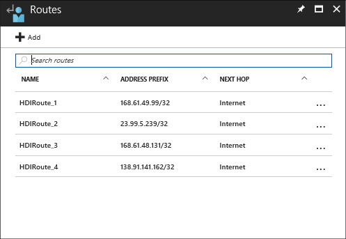

---
title: Extend HDInsight with Virtual Network - Azure | Microsoft Docs
description: Learn how to use Azure Virtual Network to connect HDInsight to other cloud resources, or resources in your datacenter
services: hdinsight
documentationcenter: ''
author: Blackmist
manager: jhubbard
editor: cgronlun

ms.assetid: 37b9b600-d7f8-4cb1-a04a-0b3a827c6dcc
ms.service: hdinsight
ms.custom: hdinsightactive
ms.devlang: na
ms.topic: article
ms.tgt_pltfrm: na
ms.workload: big-data
ms.date: 06/21/2017
ms.author: larryfr

---
# Extend HDInsight capabilities by using Azure Virtual Network

Learn how to use Azure Virtual Networks with HDInsight to enable the following scenarios:

* Restrict access to HDInsight. For example, prevent inbound traffic from the internet.

* Directly access services on HDInsight that aren't exposed over the Internet. For example, directly work with Kafka brokers or use the HBase Java API.

* Directly connect services to HDInsight. For example, use Oozie to import or export data to a SQL Server within your data center.

* Create solutions that involve multiple HDInsight clusters. For example, use Spark or Storm to analyze data stored in Kafka.

## Prerequisites

* Azure CLI 2.0: For more information, see [Install and Configure Azure CLI 2.0](https://docs.microsoft.com/cli/azure/install-az-cli2).

* Azure PowerShell: For more information, see [Install and Configure Azure PowerShell](/powershell/azure/overview).

> [!NOTE]
> The steps in this document require the latest version of the Azure CLI and Azure PowerShell. If you are using an older version, the commands may be different. For best results, use the previous links to install the latest versions.

## <a id="whatis"></a>What is Azure Virtual Network

[Azure Virtual Network](https://azure.microsoft.com/documentation/services/virtual-network/) allows you to create a secure, persistent network containing the resources you need for your solution.

The following are a list of considerations when using HDInsight in a virtual network:

* __Classic and Resource Manager virtual networks__: Use the following table to determine the type of network to use based on the HDInsight cluster operating system:

    | HDInsight operating system | Classic virtual network | Resource Manager virtual network |
    | ---- | ---- | ---- |
    | Linux | no | yes |
    | Windows | yes | no |

    To access resources in an incompatible virtual network, join the two networks. For more information on connecting classic and Resource Manager Virtual Networks, see [Connecting classic VNets to new VNets](../vpn-gateway/vpn-gateway-connect-different-deployment-models-portal.md).

* __Custom DNS__: If you need to enable name resolution between HDInsight and resources in your local network, you must use a custom DNS server. You do not need a custom DNS server to access resources that are publicly available on the internet.

    For more information on using a custom DNS server, see the [Name Resolution for VMs and Role Instances](../virtual-network/virtual-networks-name-resolution-for-vms-and-role-instances.md#name-resolution-using-your-own-dns-server) document.

* __Forced tunneling__: HDInsight does not support forced tunneling.

* __Restricted virtual network__: You can install HDInsight into a virtual network that restricts inbound and outbound traffic. You must allow access to specific IP addresses for the Azure region that you are using.

    * __Network Security Groups__: If you use Network Security Groups, you must allow unrestricted access to several Azure IPs. For the list of IPs, see the [required IP addresses](#hdinsight-ip) section.

        For more information, see the [Network Security Groups](#using-network-security-groups) section.

    * __User-defined routes__: If you use user-defined routes, you must define routes to several Azure IP addresses. For the list of IPs, see the [required IP addresses](#hdinsight-ip) section.

        For more information, see the [User-defined routes](#user-defined-routes) section.

    * __Network Virtual Appliance__: If you use a virtual appliance firewall, see the [Virtual appliance firewall](#virtual-appliance-firewall) section for a list of ports that must be allowed through the firewall.

### Connect cloud resources together in a private network (cloud-only)


Using Virtual Network to link Azure services with Azure HDInsight enables the following scenarios:

* **Invoking HDInsight services or jobs** from Azure websites or services running in Azure virtual machines.

* **Directly transferring data** between HDInsight and Azure SQL Database, SQL Server, or another data storage solution running on a virtual machine.

* **Combining multiple HDInsight servers** into a single solution. There are several types of HDInsight clusters, which correspond to the workload or technology that the cluster is tuned for. There is no supported method to create a cluster that combines multiple types, such as Storm and HBase on one cluster. Using a virtual network allows multiple clusters to directly communicate with each other.

### Connect cloud resources to a local datacenter network

Site-to-site configuration allows you to connect multiple resources in your datacenter to the Azure virtual network. The connection can be made using a hardware VPN device or the Routing and Remote Access service.


Point-to-site configuration allows you to connect a specific resource to the Azure virtual network by using software VPN.


Using Virtual Network to link the cloud and your datacenter enables similar scenarios to the cloud-only configuration. But instead of being limited to working with resources in the cloud, you can also work with resources in your datacenter.

* **Directly transferring data** between HDInsight and your datacenter. An example is using Sqoop to transfer data to or from SQL Server or reading data generated by a line-of-business (LOB) application.

* **Invoking HDInsight services or jobs** from an LOB application. An example is using HBase Java APIs to store and retrieve data from an HDInsight HBase cluster.

For more information on Virtual Network features, benefits, and capabilities, see the [Azure Virtual Network overview](../virtual-network/virtual-networks-overview.md).

> [!NOTE]
> Create the Azure Virtual Network before provisioning an HDInsight cluster, then specify the network when creating the cluster. If you plan on using a custom DNS server, it must be added to the virtual network before HDInsight. For more information, see [Virtual Network configuration tasks](https://azure.microsoft.com/documentation/services/virtual-network/).

##<a id="hdinsight-ip"></a> Required IP addresses

The HDInsight service is a managed service, and requires access to Azure management services during provisioning and while running. Azure management performs the following services:

* Monitor the health of the cluster
* Initiate failover of cluster resources
* Change the number of nodes in the cluster through scaling operations
* Other management tasks

> [!NOTE]
> These operations do not require full access to the internet. When restricting internet access, allow inbound access on port 443 for the following IP addresses. This allows Azure to manage HDInsight:

If you restrict access to the virtual network you must allow access to the managment IP addresses. The IP addresses that should be allowed are specific to the region that the HDInsight cluster and Virtual Network reside in. Use the following table to find the IP addresses for the region you are using.

| Country | Region | Allowed IP addresses | Allowed port |
| ---- | ---- | ---- | ---- |
| Brazil | Brazil South | 191.235.84.104</br>191.235.87.113 | 443 |
| Canada | Canada East | 52.229.127.96</br>52.229.123.172 | 443 |
| &nbsp; | Canada Central | 52.228.37.66</br>52.228.45.222 | 443 |
| Germany | Germany Central | 51.4.146.68</br>51.4.146.80 | 443 |
| &nbsp; | Germany Northeast | 51.5.150.132</br>51.5.144.101 | 443 |
| India | Central India | 52.172.153.209</br>52.172.152.49 | 443 |
| Japan | Japan East | 13.78.125.90</br>13.78.89.60 | 443 |
| &nbsp; | Japan West | 40.74.125.69</br>138.91.29.150 | 443 |
| United Kingdom | UK West | 51.141.13.110</br>51.141.7.20 | 443 |
| &nbsp; | UK South | 51.140.47.39</br>51.140.52.16 | 443 |
| United States | West Central US | 52.161.23.15</br>52.161.10.167 | 443 |
| &nbsp; | West US 2 | 52.175.211.210</br>52.175.222.222 | 443 |

__If your region is not listed in the table__, allow traffic to port __443__ on the following IP addresses:

* 168.61.49.99
* 23.99.5.239
* 168.61.48.131
* 138.91.141.162

> [!IMPORTANT]
> HDInsight doesn't support restricting outbound traffic, only inbound traffic. When defining Network Security Group rules for the subnet that contains HDInsight, __only use inbound rules__.

> [!NOTE]
> If you use a custom DNS server with your virtual network, you must also allow access from __168.63.129.16__. This is the address of Azure's recursive resolver. For more information, see the [Name resolution for VMs and Role instances](../virtual-network/virtual-networks-name-resolution-for-vms-and-role-instances.md) document.

## Network Security Groups

If you block internet access using Network Security Groups (NSG), you cannot use HDInsight services that are normally exposed through the public gateway for a cluster. These include Ambari and SSH. Instead, you must access services using the internal IP address of the cluster head nodes.

To find the internal IP address of the head nodes, use the scripts in the [Internal IPs and FQDNs](#internal-ips-and-fqdns) section.

### Example: Secured virtual network

The following examples demonstrate how to create a Network Security Group that allows inbound traffic on port 443 from the following IP addresses:

* 168.61.49.99
* 23.99.5.239
* 168.61.48.131
* 138.91.141.162

> [!IMPORTANT]
> These addresses are for regions that do not have specific IP addresses listed. To find the IP addresses for your region, use the information in the [Secured Virtual Networks](#secured-virtual-networks) section.

These steps assume that you have already created a Virtual Network and subnet that you want to install HDInsight into. See [Create a virtual network using the Azure portal](../virtual-network/virtual-networks-create-vnet-arm-pportal.md).

> [!WARNING]
> Rules are tested against network traffic in order by __priority__. Once a rule matches the test criteria, it is applied and no more rules are tested for that request. If you have a rule that broadly blocks inbound traffic (such as a **deny all** rule), it __must__ come after the rules that allow traffic.
>
> For more information on Network Security Group rules, see the [What is a Network Security Group](../virtual-network/virtual-networks-nsg.md) document.

**Example: Azure Resource Management template**

Using the following Resource Management template from the [Azure QuickStart Templates](https://azure.microsoft.com/resources/templates/) to create an HDInsight cluster in a VNet with the secure network configurations:

[Deploy a secured Azure VNet and an HDInsight Hadoop cluster within the VNet](https://azure.microsoft.com/resources/templates/101-hdinsight-secure-vnet/)

**Example: Azure PowerShell**

```powershell
$vnetName = "Replace with your virtual network name"
$resourceGroupName = "Replace with the resource group the virtual network is in"
$subnetName = "Replace with the name of the subnet that HDInsight will be installed into"
# Get the Virtual Network object
$vnet = Get-AzureRmVirtualNetwork `
    -Name $vnetName `
    -ResourceGroupName $resourceGroupName
# Get the region the Virtual network is in.
$location = $vnet.Location
# Get the subnet object
$subnet = $vnet.Subnets | Where-Object Name -eq $subnetName
# Create a Network Security Group.
# And add exemptions for the HDInsight health and management services.
$nsg = New-AzureRmNetworkSecurityGroup `
    -Name "hdisecure" `
    -ResourceGroupName $resourceGroupName `
    -Location $location `
    | Add-AzureRmNetworkSecurityRuleConfig `
        -name "hdirule1" `
        -Description "HDI health and management address 168.61.49.99" `
        -Protocol "*" `
        -SourcePortRange "*" `
        -DestinationPortRange "443" `
        -SourceAddressPrefix "168.61.49.99" `
        -DestinationAddressPrefix "VirtualNetwork" `
        -Access Allow `
        -Priority 300 `
        -Direction Inbound `
    | Add-AzureRmNetworkSecurityRuleConfig `
        -Name "hdirule2" `
        -Description "HDI health and management 23.99.5.239" `
        -Protocol "*" `
        -SourcePortRange "*" `
        -DestinationPortRange "443" `
        -SourceAddressPrefix "23.99.5.239" `
        -DestinationAddressPrefix "VirtualNetwork" `
        -Access Allow `
        -Priority 301 `
        -Direction Inbound `
    | Add-AzureRmNetworkSecurityRuleConfig `
        -Name "hdirule3" `
        -Description "HDI health and management 168.61.48.131" `
        -Protocol "*" `
        -SourcePortRange "*" `
        -DestinationPortRange "443" `
        -SourceAddressPrefix "168.61.48.131" `
        -DestinationAddressPrefix "VirtualNetwork" `
        -Access Allow `
        -Priority 302 `
        -Direction Inbound `
    | Add-AzureRmNetworkSecurityRuleConfig `
        -Name "hdirule4" `
        -Description "HDI health and management 138.91.141.162" `
        -Protocol "*" `
        -SourcePortRange "*" `
        -DestinationPortRange "443" `
        -SourceAddressPrefix "138.91.141.162" `
        -DestinationAddressPrefix "VirtualNetwork" `
        -Access Allow `
        -Priority 303 `
        -Direction Inbound
# Set the changes to the security group
Set-AzureRmNetworkSecurityGroup -NetworkSecurityGroup $nsg
# Apply the NSG to the subnet
Set-AzureRmVirtualNetworkSubnetConfig `
    -VirtualNetwork $vnet `
    -Name $subnetName `
    -AddressPrefix $subnet.AddressPrefix `
    -NetworkSecurityGroup $nsg
```

**Example: Azure CLI**

1. Use the following command to create a new network security group named `hdisecure`. Replace **RESOURCEGROUPNAME** with the resource group that contains the Azure Virtual Network. Replace **LOCATION** with the location (region) that the group was created in.

    ```azurecli
    az network nsg create -g RESOURCEGROUPNAME -n hdisecure -l LOCATION
    ```

    Once the group has been created, you receive information on the new group.

2. Use the following to add rules to the new network security group that allow inbound communication on port 443 from the Azure HDInsight health and management service. Replace **RESOURCEGROUPNAME** with the name of the resource group that contains the Azure Virtual Network.

    ```azurecli
    az network nsg rule create -g RESOURCEGROUPNAME --nsg-name hdisecure -n hdirule1 --protocol "*" --source-port-range "*" --destination-port-range "443" --source-address-prefix "168.61.49.99/24" --destination-address-prefix "VirtualNetwork" --access "Allow" --priority 300 --direction "Inbound"
    az network nsg rule create -g RESOURCEGROUPNAME --nsg-name hdisecure -n hdirule2 --protocol "*" --source-port-range "*" --destination-port-range "443" --source-address-prefix "23.99.5.239/24" --destination-address-prefix "VirtualNetwork" --access "Allow" --priority 301 --direction "Inbound"
    az network nsg rule create -g RESOURCEGROUPNAME --nsg-name hdisecure -n hdirule3 --protocol "*" --source-port-range "*" --destination-port-range "443" --source-address-prefix "168.61.48.131/24" --destination-address-prefix "VirtualNetwork" --access "Allow" --priority 302 --direction "Inbound"
    az network nsg rule create -g RESOURCEGROUPNAME --nsg-name hdisecure -n hdirule4 --protocol "*" --source-port-range "*" --destination-port-range "443" --source-address-prefix "138.91.141.162/24" --destination-address-prefix "VirtualNetwork" --access "Allow" --priority 303 --direction "Inbound"
    ```

3. Once the rules have been created, use the following to retrieve the unique identifier for this network security group:

    ```azurecli
    az network nsg show -g RESOURCEGROUPNAME -n hdisecure --query 'id'
    ```

    This command returns a value similar to the following text:

        "/subscriptions/SUBSCRIPTIONID/resourceGroups/RESOURCEGROUPNAME/providers/Microsoft.Network/networkSecurityGroups/hdisecure"

    Use double-quotes around id in the command if you don't get the expected results.

4. Using the following command to apply the network security group to a subnet. Replace the __GUID__ and __RESOURCEGROUPNAME__ values with the ones returned from the previous step. Replace __VNETNAME__ and __SUBNETNAME__ with the virtual network name and subnet name that you want to use when creating an HDInsight cluster.

    ```azurecli
    az network vnet subnet update -g RESOURCEGROUPNAME --vnet-name VNETNAME --name SUBNETNAME --set networkSecurityGroup.id="/subscriptions/GUID/resourceGroups/RESOURCEGROUPNAME/providers/Microsoft.Network/networkSecurityGroups/hdisecure"
    ```

    Once this command completes, you can successfully install HDInsight into the secured Virtual Network on the subnet used in these steps.

> [!IMPORTANT]
> Using the preceding steps only open access to the HDInsight health and management service on the Azure cloud. Any other access to the HDInsight cluster from outside the Virtual Network is blocked. To enable access from outside the virtual network, you must add additional Network Security Group rules.
>
> The following example demonstrates how to enable SSH access from the Internet:
>
> ```powershell
> Add-AzureRmNetworkSecurityRuleConfig -Name "SSH" -Description "SSH" -Protocol "*" -SourcePortRange "*" -DestinationPortRange "22" -SourceAddressPrefix "*" -DestinationAddressPrefix "VirtualNetwork" -Access Allow -Priority 304 -Direction Inbound
> ```
>
> ```azurecli
> az network nsg rule create -g RESOURCEGROUPNAME --nsg-name hdisecure -n hdirule5 --protocol "*" --source-port-range "*" --destination-port-range "22" --source-address-prefix "*" --destination-address-prefix "VirtualNetwork" --access "Allow" --priority 304 --direction "Inbound"
> ```

For more information on Network Security Groups, see [Network Security Groups overview](../virtual-network/virtual-networks-nsg.md). For information on controlling routing in an Azure Virtual Network, see [User-defined Routes and IP forwarding](../virtual-network/virtual-networks-udr-overview.md).

## User-defined routes

If you use user-defined routes (UDR) to secure the virtual network, you must add routes for the HDInsight management IP addresses for your region. For a list of IP addresses by region, see the [Required IP addresses](#hdinsight-ip) section.

The routes to the required IP addresses must set the __Next Hop__ type to __Internet__. The following image is an example of how the routes appear in the Azure portal:



For more information on user-defined routes, see the [user-defined routes and IP forwarding](../virtual-network/virtual-networks-udr-overview.md) document.

## Virtual appliance firewall

If you are using a virtual appliance firewall to secure the virtual network, you must allow outbound traffic on the following ports:

* 53
* 443
* 1433
* 11000-11999
* 14000-14999

For more information on firewall rules for virtual appliances, see the [virtual appliance scenario](../virtual-network/virtual-network-scenario-udr-gw-nva.md) document.

## Forced tunneling

Forced tunneling is not supported with HDInsight.

## Retrieve internal IPs and FQDNs

When connecting to HDInsight using a virtual network, you can connect directly to the nodes in the cluster. Use the following scripts to determine the internal IP address and fully qualified domain names (FQDN) for the nodes in the cluster:

**Azure PowerShell**

```powershell
$resourceGroupName = Read-Input -Prompt "Enter the resource group that contains the virtual network used with HDInsight"

$clusterNICs = Get-AzureRmNetworkInterface -ResourceGroupName $resourceGroupName | where-object {$_.Name -like "*node*"}

$nodes = @()
foreach($nic in $clusterNICs) {
    $node = new-object System.Object
    $node | add-member -MemberType NoteProperty -name "Type" -value $nic.Name.Split('-')[1]
    $node | add-member -MemberType NoteProperty -name "InternalIP" -value $nic.IpConfigurations.PrivateIpAddress
    $node | add-member -MemberType NoteProperty -name "InternalFQDN" -value $nic.DnsSettings.InternalFqdn
    $nodes += $node
}
$nodes | sort-object Type
```

__Azure CLI__

```azurecli
az network nic list --resource-group <resourcegroupname> --output table --query "[?contains(name,'node')].{NICname:name,InternalIP:ipConfigurations[0].privateIpAddress,InternalFQDN:dnsSettings.internalFqdn}"
```

> [!IMPORTANT]
> In the Azure CLI 2.0 example, replace `<resourcegroupname>` with the name of the resource group that contains the virtual network.

The scripts work by querying the virtual network interface cards (NICs) for the cluster. The NICs exist in the resource group that contains the virtual network used by HDInsight.

## <a id="nextsteps"></a>Next steps

The following examples demonstrate how to use HDInsight with Azure Virtual Network:

* [HBase clusters in Azure Virtual Network](hdinsight-hbase-provision-vnet.md)

* [Analyze sensor data with Storm and HBase in HDInsight](hdinsight-storm-sensor-data-analysis.md)

* [Provision Hadoop clusters in HDInsight](hdinsight-hadoop-provision-linux-clusters.md)

* [Use Sqoop with Hadoop in HDInsight](hdinsight-use-sqoop-mac-linux.md)

To learn more about Azure virtual networks, see the [Azure Virtual Network overview](../virtual-network/virtual-networks-overview.md).

