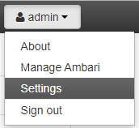
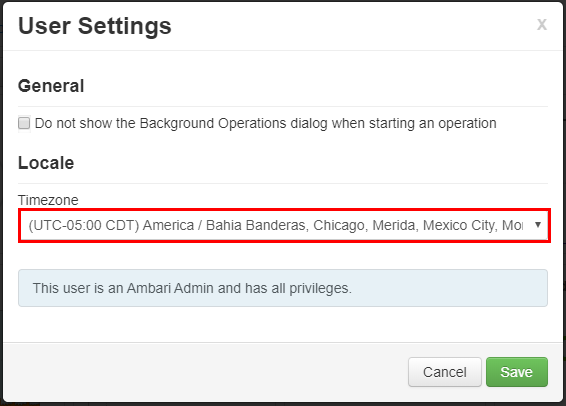

# Azure HDInsight: Frequently asked questions

This article provides answers to some of the most common questions about how to run [Azure HDInsight](https://azure.microsoft.com/services/hdinsight/).

## Creating or deleting HDInsight clusters

### How do I provision an HDInsight cluster?

To review the types of HDInsight clusters available, and the provisioning methods, see [Set up clusters in HDInsight with Apache Hadoop, Apache Spark, Apache Kafka, and more](https://docs.microsoft.com/azure/hdinsight/hdinsight-hadoop-provision-linux-clusters).

### How do I delete an existing HDInsight cluster?

To learn more about deleting a cluster when it's no longer in use, see [Delete an HDInsight cluster](hdinsight-delete-cluster.md).

Leave at least 30 to 60 minutes between create and delete operations. Otherwise the operation may fail with the following error message:

``Conflict (HTTP Status Code: 409) error when attempting to delete a cluster immediately after creation of a cluster. If you encounter this error, wait until the newly created cluster is in operational state before attempting to delete it.``

### How do I select the correct number of cores or nodes for my workload?

The appropriate number of cores and other configuration options depend on various factors.

For more information, see [Capacity planning for HDInsight clusters](https://docs.microsoft.com/azure/hdinsight/hdinsight-capacity-planning).

### What can I do when cluster provisioning fails because of a capacity issue?

Common capacity issue errors and mitigation techniques are provided in this section.

#### Error: The deployment would exceed the quota of '800'

Azure has a quota limit of 800 deployments per resource group. Different quotas are applied per resource group, subscription, account, or other scopes. For example, your subscription may be configured to limit the number of cores for a region. If you try to deploy a virtual machine that has more cores than the permitted amount, you receive an error message that states that the quota was exceeded.

To resolve this issue, delete the deployments that are no longer needed by using the Azure portal, CLI, or PowerShell.

For more information, see [Resolve errors for resource quotas](https://docs.microsoft.com/azure/azure-resource-manager/resource-manager-quota-errors).

#### Error: The maximum node exceeded the available cores in this region

Your subscription may be configured to limit the number of cores for a region. If you try to deploy a resource that has more cores than the permitted amount, you receive an error message that states that the quota was exceeded.

To request a quota increase, follow these steps:

1. Go to the [Azure portal](https://portal.azure.com), and select **Help + support**.
   
1. Select **New support request**.
   
1. On the **Basics** tab of the **New support request** page, provide the following information:
   
   - **Issue type:** Select **Service and subscription limits (quotas)**.
   - **Subscription:** Select the subscription you want to modify.
   - **Quota type:** Select **HDInsight**.

For more information, see [Create a support ticket to increase core](hdinsight-capacity-planning.md#quotas).

### What are the various types of nodes in an HDInsight cluster?

Azure HDInsight clusters have different types of virtual machines, or nodes. Each node type plays a role in the operation of the system.

For more information, see [Resource types in Azure HDInsight clusters](hdinsight-virtual-network-architecture.md#resource-types-in-azure-hdinsight-clusters).

## Individual Components

### Can I install additional components on my cluster?

Yes. To install additional components or customize cluster configuration, use:

- Scripts during or after creation. Scripts are invoked via [script action](https://docs.microsoft.com/azure/hdinsight/hdinsight-hadoop-customize-cluster-linux), which is a configuration option you can use from the Azure portal, HDInsight Windows PowerShell cmdlets, or the HDInsight .NET SDK. This configuration option can be used from the Azure portal, HDInsight Windows PowerShell cmdlets, or the HDInsight .NET SDK.

- [HDInsight Application Platform](https://azure.microsoft.com/services/hdinsight/partner-ecosystem/) to install ecosystem applications.

For a list of supported components see [What are the Apache Hadoop components and versions available with HDInsight?](https://docs.microsoft.com/azure/hdinsight/hdinsight-component-versioning#apache-hadoop-components-available-with-different-hdinsight-versions)

### Can I upgrade the individual components that are pre-installed on the cluster?

If you upgrade built-in components or applications that are pre-installed on your cluster, the resulting configuration will not be supported by Microsoft. These system configurations have not been tested by Microsoft. Try to use a different version of the HDInsight cluster that may already have the upgraded version of the component pre-installed.

For example, upgrading Hive as an individual component is not supported. HDInsight is a managed service, and many services are integrated with Ambari server and tested. Upgrading a Hive on its own causes the indexed binaries of other components to change, and will cause component integration issues on your cluster.

### Can Spark and Kafka run on the same HDInsight cluster?

No, it's not possible to run Apache Kafka and Apache Spark on the same HDInsight cluster. Create separate clusters for Kafka and Spark to avoid resource contention issues.

### How do I change timezone in Ambari?

1. Open the Ambari Web UI at `https://CLUSTERNAME.azurehdinsight.net`, where CLUSTERNAME is the name of your cluster.
2. In the upper-right corner, select admin | Settings. 

   

3. In the User Settings window, select the new timezone from the Timezone drop down, and then click Save.

   

## Metastore

### How can I migrate from the existing metastore to Azure SQL Server? 

To migrate from SQL Server to Azure SQL Server, see [Tutorial: Migrate SQL Server to a single database or pooled database in Azure SQL Database offline using DMS](../dms/tutorial-sql-server-to-azure-sql.md).

### Is the Hive metastore deleted when the cluster is deleted?

It depends on the type of metastore that your cluster is configured to use.

For a default metastore: The default metastore is part of the cluster lifecycle. When you delete a cluster, the corresponding metastore and metadata are also deleted.

For a custom metastore: The lifecycle of the metastore is not tied to a cluster’s lifecycle. Therefore, you can create and delete clusters without losing metadata. Metadata such as your Hive schemas persists even after you delete and re-create the HDInsight cluster.

For more information, see [Use external metadata stores in Azure HDInsight](hdinsight-use-external-metadata-stores.md).

### Does migrating a Hive metastore also migrate the default policies of the Ranger database?

No, the policy definition is in the Ranger database, so migrating the Ranger database will migrate its policy.

### Can you migrate a Hive metastore from an Enterprise Security Package (ESP) cluster to a non-ESP cluster, and vice-versa?

Yes, you can migrate a Hive metastore from an ESP to a non-ESP cluster.

### How can I estimate the size of a Hive metastore database?

A Hive metastore is used to store the metadata for data sources that are used by the Hive server.The size requirements depend partly on the number and complexity of your Hive data sources, and can't be estimated up front. As outlined in [Hive metastore best practices](hdinsight-use-external-metadata-stores.md#hive-metastore-best-practices), you can start with a S2 tier, which provides 50 DTU and 250 GB of storage, and if you see a bottleneck, you can scale up the database.

### Do you support any other database other than Azure SQL Database as an external metastore?

No, Microsoft supports only Azure SQL Database as an external custom metastore.

### Can I share a metastore across multiple clusters?

Yes, you can share custom metastore across multiple clusters as long as they are using the same version of HDInsight.

## Connectivity and virtual networks  

### What are the implications of blocking ports 22 and 23 on my network?

If you block ports 22 and port 23, you will not have SSH access to the cluster. These ports are not used by HDInsight service.

For more information, see the following documents:

- [Controlling Network traffic](https://docs.microsoft.com/azure/hdinsight/hdinsight-plan-virtual-network-deployment#networktraffic)

- [Secure incoming traffic to HDInsight clusters in a virtual network with private endpoint](https://azure.microsoft.com/blog/secure-incoming-traffic-to-hdinsight-clusters-in-a-vnet-with-private-endpoint/)

- [HDInsight management IP addresses](https://docs.microsoft.com/azure/hdinsight/hdinsight-management-ip-addresses)

### Can I deploy an additional virtual machine within the same subnet as an HDInsight cluster?

Yes, you can deploy an additional virtual machine within the same subnet as an HDInsight cluster. The following configurations are possible:

- Edge nodes: You can add another edge node to the cluster, as described in [Use empty edge nodes on Apache Hadoop clusters in HDInsight](hdinsight-apps-use-edge-node.md).

- Standalone nodes:  You can add a standalone virtual machine to the same subnet and access the cluster from that virtual machine by using the private end point `https://<CLUSTERNAME>-int.azurehdinsight.net`. For more information, see [Controlling network traffic](hdinsight-plan-virtual-network-deployment.md#networktraffic).

### Should I store data on the local disk of an edge node?

No, storing data on a local disk isn't a good idea. If the node fails, all data stored locally will be lost. We recommend storing data in Azure Data Lake Storage Gen2 or Azure Blob storage, or by mounting an Azure Files share for storing the data.


### Can I add an existing HDInsight cluster to another virtual network?

No, you can't. The virtual network should be specified at the time of provisioning. If no virtual network is specified during provisioning, the deployment creates an internal network that isn't accessible from outside. For more information, see [Add HDInsight to an existing virtual network](hdinsight-plan-virtual-network-deployment.md#existingvnet).

## Security and Certificates

### What are the recommendations for malware protection on Azure HDInsight clusters?

For information on malware protection, see [Microsoft Antimalware for Azure Cloud Services and Virtual Machines](../security/fundamentals/antimalware.md).

### How do I create a keytab for an HDInsight ESP cluster?

Create a Kerberos keytab for your domain username. You can later use this keytab to authenticate to remote domain-joined clusters without entering a password. The domain name is uppercase:

```shell
ktutil
ktutil: addent -password -p <username>@<DOMAIN.COM> -k 1 -e RC4-HMAC
Password for <username>@<DOMAIN.COM>: <password>
ktutil: wkt <username>.keytab
ktutil: q
```

### Can I use an existing Azure Active Directory tenant to create an HDInsight cluster that has the ESP?

You must enable Azure Active Directory Domain Services (Azure AD DS) before you can create an HDInsight cluster with ESP. Open-source Hadoop relies on Kerberos for Authentication (as opposed to OAuth).

To join VMs to a domain, you must have a domain controller. Azure AD DS is the managed domain controller, and is considered an extension of Azure Active Directory that provides all the Kerberos requirements to build a secure Hadoop cluster in a managed way. HDInsight as a managed service integrates with Azure AD DS to provide end-to-end security.

### Can I use a self-signed certificate in an AAD-DS secure LDAP setup and provision an ESP cluster?

Using a certificate issued by a certificate authority is recommended, but using a self-signed certificate is also supported on ESP. For more information, see:

- [Enable Azure Active Directory Domain Services](domain-joined/apache-domain-joined-configure-using-azure-adds.md#enable-azure-ad-ds)

- [Tutorial: Configure secure LDAP for an Azure Active Directory Domain Services managed domain](../active-directory-domain-services/tutorial-configure-ldaps.md)

### How can I pull login activity shown in Ranger?

For auditing requirements, Microsoft recommends enabling Azure Monitor logs as described in [Use Azure Monitor logs to monitor HDInsight clusters](https://docs.microsoft.com/azure/hdinsight/hdinsight-hadoop-oms-log-analytics-tutorial).

### Can I disable Clamscan on my cluster?

Clamscan is the antivirus software that runs on the HDInsight cluster and is used by Azure security (azsecd) to protect your clusters from virus attacks. Microsoft strongly recommends that users refrain from making any changes to the default Clamscan configuration.

This process does not interfere with or take any cycles away from other processes. It will always yield to other process. CPU spikes from Clamscan should be seen only when the system is idle.  

In scenarios in which you must control the schedule, you can use the following steps:

1. Disable automatic execution using the following command:
   
   `/usr/local/vbin/azsecd config -s clamav -d Disabled`
   
1. Add a Cron job that runs the following command as root:
   
   `/usr/local/bin/azsecd manual -s clamav`

For more information about how to set up and run a cron job, see [How do I set up a Cron job](https://askubuntu.com/questions/2368/how-do-i-set-up-a-cron-job)?

### Why is LLAP available on Spark ESP clusters?
On ESP Spark clusters, LLAP is enabled for security reasons (i.e. Apache Ranger), not performance. You should use larger node VMs to accommodate for the resource usage of LLAP (e.g. minimum D13V2). 

### How can I add additional AAD groups after creating an ESP cluster?
There are two ways to achieve this:
1- You can recreate the cluster and add the additional group at the time of cluster creation. If you are using scoped synchronization in AAD-DS, please make sure group B is included in the scoped synchronization.
2- Add the group as a nested sub group of the previous group that was used to create the ESP cluster. For example, if you have created an ESP cluster with group `A`, you can later on add group `B` as a nested subgroup of `A` and after approximately one hour it will be synced and available in the cluster automatically. 

## Storage

### Can I add an Azure Data Lake Storage Gen2 to an existing HDInsight cluster as an additional storage account?

No, it's currently not possible to add an Azure Data Lake Storage Gen2 storage account to a cluster that has blob storage as its primary storage. For more information, see [Compare storage options](hdinsight-hadoop-compare-storage-options.md).

### How can I find the currently linked Service Principal for a Data Lake storage account?

You can find your settings in **Data Lake Storage Gen1 access** under your cluster properties in the Azure portal. For more information, see [Verify cluster setup](../data-lake-store/data-lake-store-hdinsight-hadoop-use-portal.md#verify-cluster-set-up).
 
### How can I calculate the usage of storage accounts and blob containers for my HDInsight clusters?

Do one of the following:

- [Use PowerShell](../storage/scripts/storage-blobs-container-calculate-size-powershell.md)

- Find the size of the */user/hive/.Trash/* folder on the HDInsight cluster, using the following command line:
  
  `hdfs dfs -du -h /user/hive/.Trash/`

### How can I set up auditing for my blob storage account?

To audit blob storage accounts, configure monitoring using the procedure at [Monitor a storage account in the Azure portal](../storage/common/storage-monitor-storage-account.md). An HDFS-audit log provides only auditing information for the local HDFS filesystem only (hdfs://mycluster).  It does not include operations that are done on remote storage.

### How can I transfer files between a blob container and an HDInsight head node?

Run a script similar to the following shell script on your head node:

```shell
for i in cat filenames.txt
do
   hadoop fs -get $i <local destination>
done
```
 
> [!NOTE]
> The file *filenames.txt* will have the absolute path of the files in the blob containers.
 
### Are there any Ranger plugins for storage?

Currently, no Ranger plugin exists for blob storage and Azure Data Lake Storage Gen1 or Gen2. For ESP clusters, you should use Azure Data Lake Storage, because you can at least set fine-grain permissions manually at the file system level using HDFS tools. Also, when using Azure Data Lake Storage, ESP clusters will do some of the file system access control using Azure Active Directory at the cluster level. 

You can assign data access policies to your users' security groups by using the Azure Storage Explorer. For more information, see:

- [How do I set permissions for Azure AD users to query data in Data Lake Storage Gen2 by using Hive or other services?](hdinsight-hadoop-use-data-lake-storage-gen2.md#how-do-i-set-permissions-for-azure-ad-users-to-query-data-in-data-lake-storage-gen2-by-using-hive-or-other-services)
- [Set file and directory level permissions using Azure Storage Explorer with Azure Data Lake Storage Gen2](/azure/storage/blobs/data-lake-storage-how-to-set-permissions-storage-explorer)

### Can I increase HDFS storage on a cluster without increasing the disk size of worker nodes?

No, you can't increase the disk size of any worker node, so the only way to increase disk size is to drop the cluster and recreate it with larger worker VMs. Don't use HDFS for storing any of your HDInsight data, because the data is deleted if you delete your cluster. Instead, store your data in Azure. Scaling up the cluster can also add additional capacity to your HDInsight cluster.

## Edge nodes

### Can I add an edge node after the cluster has been created?

HDInsight cluster, or to a new cluster when creating the cluster. For more information, see [Use empty edge nodes on Apache Hadoop clusters in HDInsight](hdinsight-apps-use-edge-node.md).

### How can I connect to an edge node?

After you create an edge node, you can connect to it by using SSH on port 22. You can find the name of the edge node from the cluster portal. The names usually end with *-ed*.

### Why are persisted scripts not running automatically on newly created edge nodes?

You use persisted scripts to customize new worker nodes added to the cluster through scaling operations. Persisted scripts don't apply to edge nodes.

## REST API

### What are the REST API calls to pull a Tez query view from the cluster?

You can use the following REST endpoints to pull the necessary information in JSON format. Use basic authentication headers to make the requests.

- Tez Query View: *https:\//\<cluster name>.azurehdinsight.net/ws/v1/timeline/HIVE_QUERY_ID/*
- Tez Dag View: *https:\//\<cluster name>.azurehdinsight.net/ws/v1/timeline/TEZ_DAG_ID/*

### How do I retrieve the configuration details from HDI cluster by using an Azure Active Directory user?

To negotiate proper authentication tokens with your AAD user, go through the gateway by using the following format:

* https://`<cluster dnsname>`.azurehdinsight.net/api/v1/clusters/testclusterdem/stack_versions/1/repository_versions/1 

### How do I use Ambari Restful API to monitor YARN performance?

If you call the Curl command in the same virtual network or a peered virtual network, the command is:

```curl
curl -u <cluster login username> -sS -G
http://<headnodehost>:8080/api/v1/clusters/<ClusterName>/services/YARN/components/NODEMANAGER?fields=metrics/cpu
```
 
If you call the command from outside the virtual network or from a non-peered virtual network, the command format is:

- For a non-ESP cluster:
  
  ```curl
  curl -u <cluster login username> -sS -G 
  https://<ClusterName>.azurehdinsight.net/api/v1/clusters/<ClusterName>/services/YARN/components/NODEMANAGER?fields=metrics/cpu
  ```

- For an ESP cluster:
  
  ```curl
  curl -u <cluster login username>-sS -G 
  https://<ClusterName>.azurehdinsight.net/api/v1/clusters/<ClusterName>/services/YARN/components/NODEMANAGER?fields=metrics/cpu
  ```

> [!NOTE]
> Curl will prompt you for a password. You must enter a valid password for the cluster login username.

## Billing

### How much does it cost to deploy an HDInsight cluster?

For more information about pricing and FAQ related to billing, see the [Azure HDInsight Pricing](https://azure.microsoft.com/pricing/details/hdinsight/) page.

### When does HDInsight billing start & stop?

HDInsight cluster billing starts once a cluster is created and stops when the cluster is deleted. Billing is pro-rated per minute.

### How do I cancel my subscription?

For information about how to cancel your subscription, see [Cancel your Azure subscription](https://docs.microsoft.com/azure/billing/billing-how-to-cancel-azure-subscription).

### For pay-as-you-go subscriptions, what happens after I cancel my subscription?

For information about your subscription after it's canceled, see
[What happens after I cancel my subscription?](/azure/billing/billing-how-to-cancel-azure-subscription)

## Hive

### Why does the Hive version appear as 1.2.1000 instead of 2.1 in the Ambari UI even though I am running an HDInsight 3.6 cluster?

Although only 1.2 appears in the Ambari UI, HDInsight 3.6 contains both Hive 1.2 and Hive 2.1.

## Other FAQ

### What does HDInsight offer in terms of real-time stream processing capabilities?

For information about the integration capabilities of stream processing in Azure HDInsight, see [Choosing a stream processing technology in Azure](/azure/architecture/data-guide/technology-choices/stream-processing).

### Is there a way to dynamically terminate the head node of the cluster when the cluster is idle for a specific period?

You can't do this with HDInsight clusters. You can use Azure Data Factory for these scenarios.

### What compliance offerings does HDInsight offer?

For compliance information, see the [Microsoft Trust Center](https://www.microsoft.com/trust-center) and the [Overview of Microsoft Azure compliance](https://gallery.technet.microsoft.com/Overview-of-Azure-c1be3942).
