# Use Azure HDInsight Tools for Visual Studio Code

Learn how to use Azure HDInsight Tools for Visual Studio Code to create and submit Apache Hive batch jobs, interactive Hive queries, and PySpark scripts for Apache Spark. First we'll describe how to install the HDInsight tools in Visual Studio Code and then we'll walk through how to submit jobs to Hive and Spark.  

Azure HDInsight Tools can be installed on platforms that are supported by Visual Studio Code, which include Windows, Linux, and macOS. Below you'll find the prerequisites for different platforms.


## Prerequisites

The following items are required for completing the steps in this article:

- An HDInsight cluster. To create a cluster, see [Get started with HDInsight](hadoop/apache-hadoop-linux-create-cluster-get-started-portal.md).
- [Visual Studio Code](https://code.visualstudio.com/).
- [Mono](https://www.mono-project.com/docs/getting-started/install/). Mono is only required for Linux and macOS.
- The [Azure Account extension](https://marketplace.visualstudio.com/items?itemName=ms-vscode.azure-account) for Visual Studio Code.
- [Set up PySpark interactive environment for Visual Studio Code](set-up-pyspark-interactive-environment.md).
- A local directory named **HDexample**.  This article uses  **C:\HD\HDexample**.

## Install Azure HDInsight Tools

After you have completed the prerequisites, you can install  Azure HDInsight Tools for Visual Studio Code.  Complete the following steps to install Azure HDInsight Tools:

1. Open Visual Studio Code.

2. From the menu bar, navigate to **View** > **Extensions**.

3. In the search box, enter **HDInsight**.

4. Select **Azure HDInsight Tools** from the search results, and then select **Install**.  

   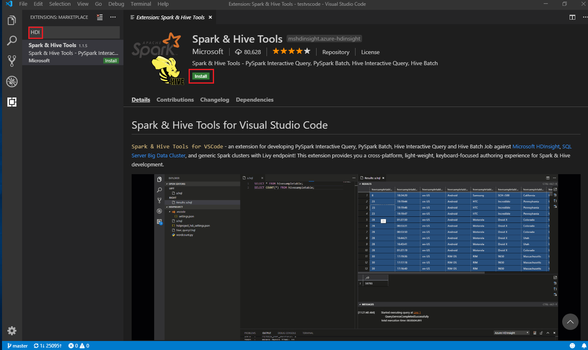

5. Select **Reload** to activate the **Azure HDInsight Tools** extension after it installs.


## Open HDInsight work folder

Complete the following steps to open a work folder, and create a file in Visual Studio Code:

1. From the menu bar, navigate to **File** > **Open Folder...** > **C:\HD\HDexample**, then select the **Select Folder** button. The folder appears in the **Explorer** view on the left.

2. From the **Explorer** view, select the folder, **HDexample**, and then the **New File** icon next to the work folder.

   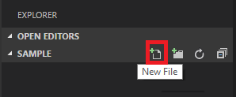

3. Name the new file with either the `.hql` (Hive queries) or the `.py` (Spark script) file extension.  This example uses **HelloWorld.hql**.

## Set the Azure environment

1. [Connect](#connect-to-azure-account) to your Azure account or link a cluster if you haven't yet done so.

2. From the menu bar navigate to **View** > **Command Palette...**, and enter **HDInsight: Set Azure Environment**.

3. Select an environment as your default login entry.

4. Meanwhile, the tool has already saved your default login entry in **.VSCode\settings.json**. You can also directly update it in this configuration file. 

   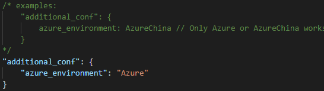

## Connect to Azure account

Before you can submit scripts to HDInsight clusters from Visual Studio Code, you need to either connect to your Azure account, or link a cluster (using Ambari username/password or domain joined account).  Complete the following steps to connect to Azure:

1. From the menu bar navigate to **View** > **Command Palette...**, and enter **HDInsight: Login**.

    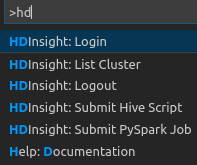

2. Follow the sign in instructions in the **OUTPUT** pane.
    + For Azure global environment, **HDInsight: Login** command will trigger **Sign in to Azure** action in the HDInsight explorer and vice versa.

        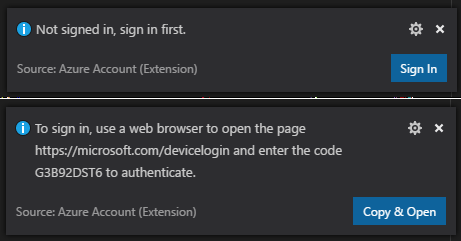

    + For Other environments, follow the sign in instructions.

        

   After you're connected, your Azure account name is shown on the status bar at the bottom left of the Visual Studio Code window.  
  

## Link a cluster

### Link: Azure HDInsight

You can link a normal cluster by using an [Apache Ambari](https://ambari.apache.org/) managed username or link an Enterprise Security Pack secure Hadoop cluster by using a domain username (such as: user1@contoso.com).

1. From the menu bar navigate to **View** > **Command Palette...**, and enter **HDInsight: Link a Cluster**.

   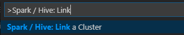

2. Select linked cluster type **Azure HDInsight**.

3. Enter HDInsight cluster URL.

4. Enter Ambari user name, default is **admin**.

5. Enter Ambari password.

6. Select cluster type.

7. Review **OUTPUT** view for verification.

   > [!NOTE]  
   > The linked username and password are used if the cluster both logged in Azure subscription and Linked a cluster.  


### Link: Generic Livy Endpoint

1. From the menu bar navigate to **View** > **Command Palette...**, and enter **HDInsight: Link a Cluster**.

2. Select linked cluster type **Generic Livy Endpoint**.

3. Enter the generic Livy endpoint, for example: http\://10.172.41.42:18080.

4. Select authorization type **Basic** or **None**.  If **Basic**, then:  
    &emsp;a. Enter Ambari user name, default is **admin**.  
    &emsp;b. Enter Ambari password.

5. Review **OUTPUT** view for verification.

## List HDInsight clusters

1. From the menu bar navigate to **View** > **Command Palette...**, and enter **HDInsight: List Cluster**.

2. Select the desired subscription.

3. Review the **OUTPUT** view.  The view will show your linked cluster(s) and all cluster(s) under your Azure subscription.

    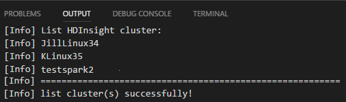

## Set default cluster

1. Re-Open the folder **HDexample** created [earlier](#open-hdinsight-work-folder) if closed.  

2. Select the file  **HelloWorld.hql** created [earlier](#open-hdinsight-work-folder) and it will open in the script editor.

3. Right-click the script editor, and select **HDInsight: Set Default Cluster**.  

4. [Connect](#connect-to-azure-account) to your Azure account or link a cluster if you haven't yet done so.

5. Select a cluster as the default cluster for the current script file. The tools automatically update the configuration file **.VSCode\settings.json**. 

   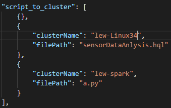


## Submit interactive Hive queries, Hive batch scripts

With HDInsight Tools for Visual Studio Code, you can submit interactive Hive queries, and Hive batch scripts to HDInsight clusters.

1. Reopen the folder **HDexample** created [earlier](#open-hdinsight-work-folder) if closed.  

2. Select the file  **HelloWorld.hql** created [earlier](#open-hdinsight-work-folder) and it will open in the script editor.


3. Copy and paste the following code into your Hive file, and then save it.

    ```hiveql
    SELECT * FROM hivesampletable;
    ```

4. [Connect](#connect-to-azure-account) to your Azure account or link a cluster if you haven't yet done so.

5. Right-click the script editor, select **HDInsight: Hive Interactive** to submit the query, or use shortcut **Ctrl + Alt + I**.  Select **HDInsight: Hive Batch** to submit the script, or use shortcut **Ctrl + Alt + H**.  

6. Select the cluster if you haven't specified a default cluster. The tools also allow you to submit a block of code instead of the whole script file using the context menu. After a few moments, the query results appear in a new tab.

   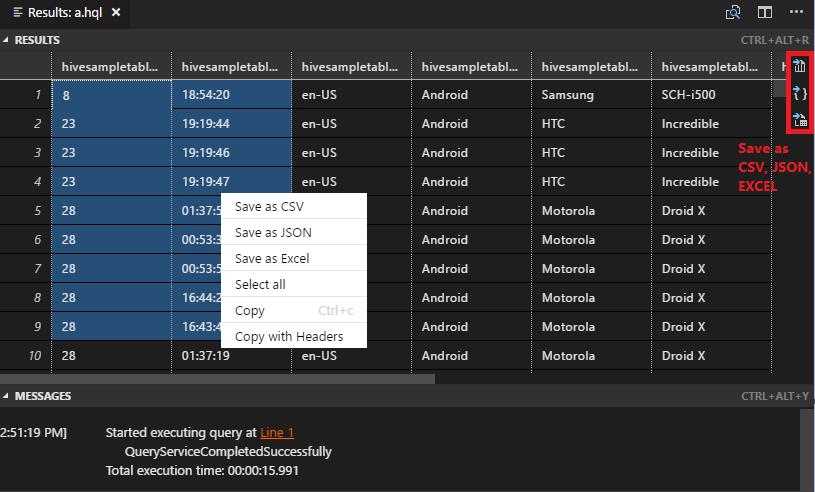

    - **RESULTS** panel: You can save the whole result as CSV, JSON, or Excel file to local path, or just select multiple lines.

    - **MESSAGES** panel: When you select **Line** number, it jumps to the first line of the running script.

## Submit interactive PySpark queries

You can submit interactive PySpark queries by following the steps below:

1. Reopen the folder **HDexample** created [earlier](#open-hdinsight-work-folder) if closed.  

2. Create a new file **HelloWorld.py** following the [earlier](#open-hdinsight-work-folder) steps.

3. Copy and paste the following code into the script file:
   ```python
   from operator import add
   lines = spark.read.text("/HdiSamples/HdiSamples/FoodInspectionData/README").rdd.map(lambda r: r[0])
   counters = lines.flatMap(lambda x: x.split(' ')) \
                .map(lambda x: (x, 1)) \
                .reduceByKey(add)

   coll = counters.collect()
   sortedCollection = sorted(coll, key = lambda r: r[1], reverse = True)

   for i in range(0, 5):
        print(sortedCollection[i])
   ```

4. [Connect](#connect-to-azure-account) to your Azure account or link a cluster if you haven't yet done so.

5. Choose all the code and right-click the script editor, select **HDInsight: PySpark Interactive** to submit the query, or use shortcut **Ctrl + Alt + I**.

   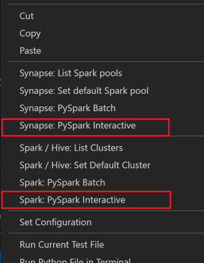

6. Select the cluster if you haven't specified a default cluster. After a few moments, the **Python Interactive results** appear in a new tab. The tools also allow you to submit a block of code instead of the whole script file using the context menu. 

   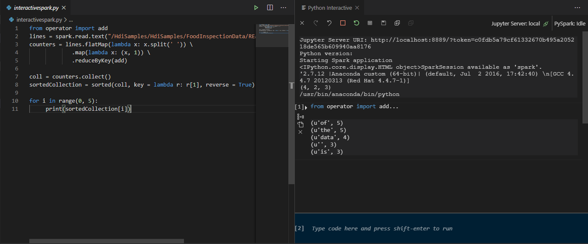 

7. Enter **"%%info"**, and then press **Shift + Enter** to view job information. (Optional)

   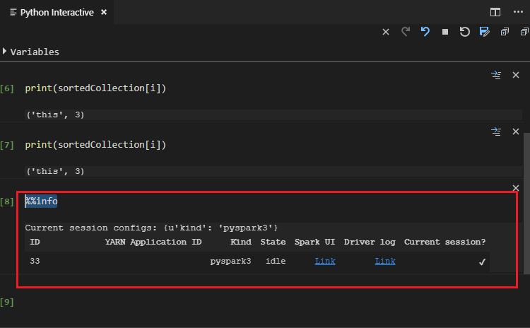

8. The tool also supports the **Spark SQL** query.

   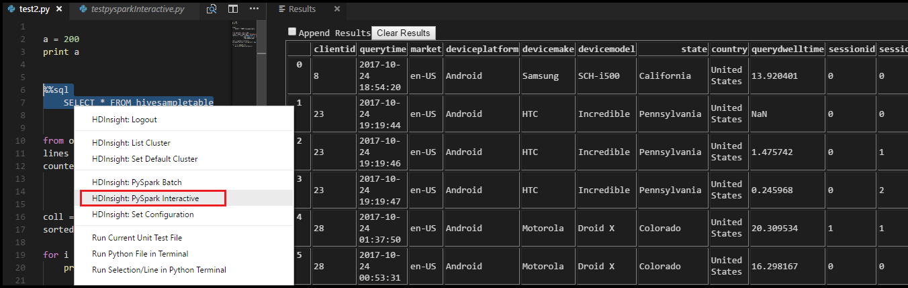

   The submission status appears on the left of the bottom status bar when you're running queries. Don't submit other queries when the status is **PySpark Kernel (busy)**.  

   > [!NOTE] 
   >
   > When **Python Extension Enabled** is unchecked in the settings (The default setting is checked), the submitted pyspark interaction results will use the old window.
   >
   > 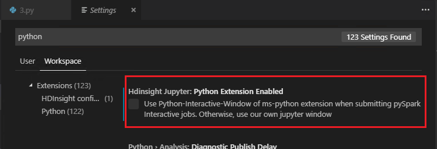


## Submit PySpark batch job

1. Reopen the folder **HDexample** created [earlier](#open-hdinsight-work-folder) if closed.  

2. Create a new file **BatchFile.py** following the [earlier](#open-hdinsight-work-folder) steps.

3. Copy and paste the following code into the script file:

    ```python
    from __future__ import print_function
    import sys
    from operator import add
    from pyspark.sql import SparkSession
    if __name__ == "__main__":
        spark = SparkSession\
            .builder\
            .appName("PythonWordCount")\
            .getOrCreate()
    
        lines = spark.read.text('/HdiSamples/HdiSamples/SensorSampleData/hvac/HVAC.csv').rdd.map(lambda r: r[0])
        counts = lines.flatMap(lambda x: x.split(' '))\
                    .map(lambda x: (x, 1))\
                    .reduceByKey(add)
        output = counts.collect()
        for (word, count) in output:
            print("%s: %i" % (word, count))
        spark.stop()
    ```

4. [Connect](#connect-to-azure-account) to your Azure account or link a cluster if you haven't yet done so.

5. Right-click the script editor, and then select **HDInsight: PySpark Batch**, or use shortcut **Ctrl + Alt + H**. 

6. Select a cluster to which to submit your PySpark job. 

   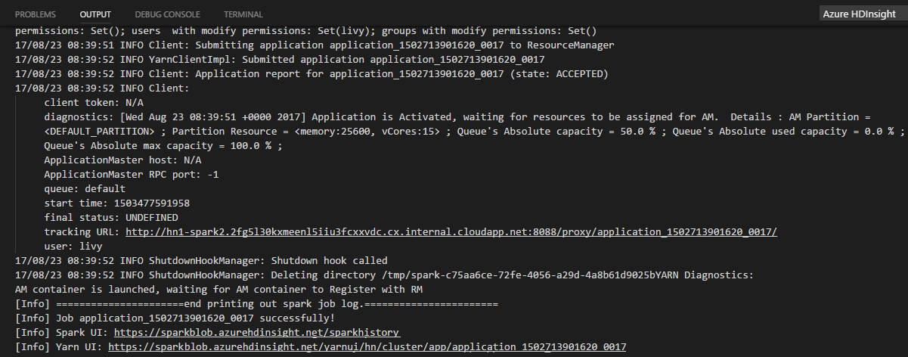 

After you submit a Python job, submission logs appear in the **OUTPUT** window in Visual Studio Code. The **Spark UI URL** and **Yarn UI URL** are shown as well. You can open the URL in a web browser to track the job status.

## Apache Livy configuration

[Apache Livy](https://livy.incubator.apache.org/) configuration is supported, it can be set at the **.VSCode\settings.json** in the work space folder. Currently, livy configuration only supports Python script. More details, see [Livy README](https://github.com/cloudera/livy/blob/master/README.rst ).

<a id="triggerlivyconf"></a>**How to trigger livy configuration**

Method 1  
1. From the menu bar, navigate to **File** > **Preferences** > **Settings**.  
2. In the **Search settings** text box enter **HDInsight Job Sumission: Livy Conf**.  
3. Select **Edit in settings.json** for the relevant search result.

Method 2   
Submit a file, notice the .vscode folder is added automatically to the work folder. You can find the livy configuration by clicking **.vscode\settings.json**.

+ The project settings:

    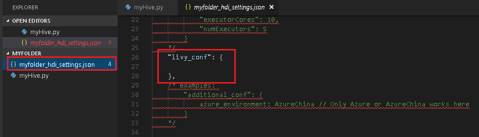

>[!NOTE]
>For settings **driverMomory** and **executorMomry**, set the value with unit, for example 1g or 1024m. 

+ The supported Livy configurations:   

    **POST /batches**   
    Request Body

    | name | description | type | 
    | :- | :- | :- | 
    | file | File containing the application to execute | path (required) | 
    | proxyUser | User to impersonate when running the job | string | 
    | className | Application Java/Spark main class | string |
    | args | Command line arguments for the application | list of strings | 
    | jars | jars to be used in this session | List of string | 
    | pyFiles | Python files to be used in this session | List of string |
    | files | files to be used in this session | List of string |
    | driverMemory | Amount of memory to use for the driver process | string |
    | driverCores | Number of cores to use for the driver process | int |
    | executorMemory | Amount of memory to use per executor process | string |
    | executorCores | Number of cores to use for each executor | int |
    | numExecutors | Number of executors to launch for this session | int |
    | archives | Archives to be used in this session | List of string |
    | queue | The name of the YARN queue to which submitted | string |
    | name | The name of this session | string |
    | conf | Spark configuration properties | Map of key=val |

    Response Body   
    The created Batch object.

    | name | description | type | 
    | :- | :- | :- | 
    | id | The session id | int | 
    | appId | The application id of this session | 	String |
    | appInfo | The detailed application info | Map of key=val |
    | log | The log lines | list of strings |
    | state | 	The batch state | string |

>[!NOTE]
>The assigned livy config will display in output pane when submit script.

## Integrate with Azure HDInsight from Explorer

**Azure HDInsight** has been added to the Explorer view. You can browse and manage you cluster(s) directly through **Azure HDInsight**.

1. [Connect](#connect-to-azure-account) to your Azure account or link a cluster if you haven't yet done so.

2. From the menu bar, navigate to **View** > **Explorer**.

3. From the left pane, expand **AZURE HDINSIGHT**.  The available subscriptions and clusters (Spark, Hadoop, and HBase are supported) will be listed. 

   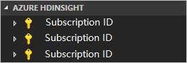

4. Expand the cluster to view hive metadata database and table schema.

   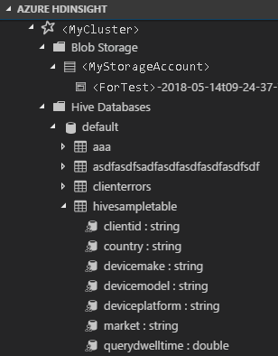


## Preview Hive Table
You can preview Hive Table in your cluster(s) directly through **Azure HDInsight** explorer.
1. [Connect](#connect-to-azure-account) to your Azure account if you haven't yet done so.

2. Click **Azure** icon from leftmost column.

3. From the left pane, expand AZURE HDINSIGHT. The available subscriptions and clusters will be listed.

4. Expand the cluster to view hive metadata database and table schema.

5. Right-click on the Hive Table, e.g hivesampletable. Select **Preview**. 

   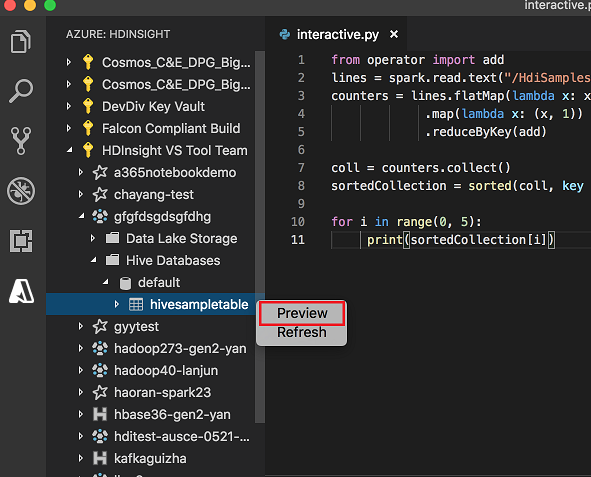

6. The **Preview Results** window will be opened.

   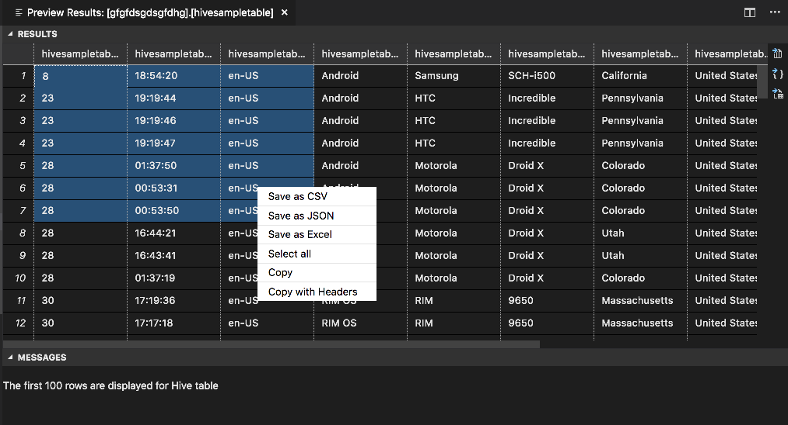
   
- **RESULTS** panel

   You can save the whole result as CSV, JSON, or Excel file to local path, or just select multiple lines.

- **MESSAGES** panel
   1. When the number of rows in the table is greater than 100 rows, the message shows: **The first 100 rows are displayed for Hive table**.
   2. When the number of rows in the table is less than or equal to 100 rows, the message shows: **60 rows are displayed for Hive table**.
   3. When there is no content in the table, the message shows: **0 row is displayed for Hive table**.

>[!NOTE]
>
>In Linux, install xclip to enable copy table data.
>
>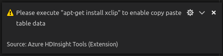
## Additional features

HDInsight for Visual Studio Code supports the following features:

- **IntelliSense autocomplete**. Suggestions pop up for keyword, methods, variables, and so on. Different icons represent different types of objects.

    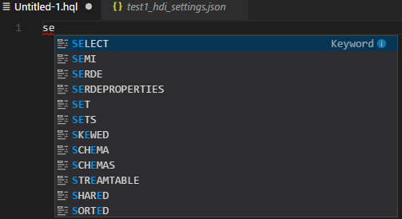
- **IntelliSense error marker**. The language service underlines the editing errors for the Hive script.     
- **Syntax highlights**. The language service uses different colors to differentiate variables, keywords, data type, functions, and so on. 

    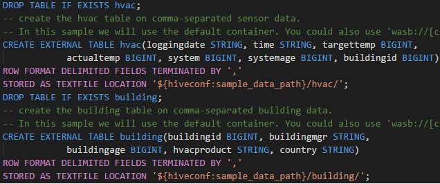

## Reader Only Role

Users with cluster **Reader** **only** **role** can no longer submit job to the HDInsight cluster nor view the Hive database. You need to contact the cluster administrator to upgrade your role to [**HDInsight** **Cluster** **Operator**](https://docs.microsoft.com/azure/hdinsight/hdinsight-migrate-granular-access-cluster-configurations#add-the-hdinsight-cluster-operator-role-assignment-to-a-user) in the [Azure portal](https://ms.portal.azure.com/). If you know Ambari credentials, you can manually link the cluster following the instruction below.

### Browse HDInsight Cluster  

When clicking on the Azure HDInsight explorer to expand an HDInsight cluster, you will be prompted to link the cluster if you are reader only role for the cluster. Follow the steps below to link to the cluster via Ambari credentials. 

### Submit job to HDInsight cluster

When submitting job to an HDInsight cluster, you will be prompted to link the cluster if you are reader only role for the cluster. Follow the steps below to link to the cluster via Ambari credentials. 

### Link to cluster

1.	Enter the Ambari username 
2.	Enter Ambari user Password.

   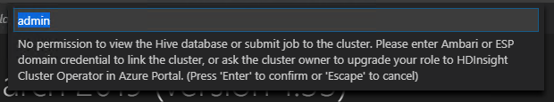

   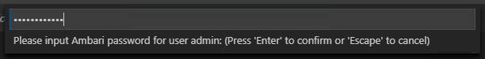

> [!NOTE]
>
>You can use HDInsight: List Cluster to check the linked cluster.
>
>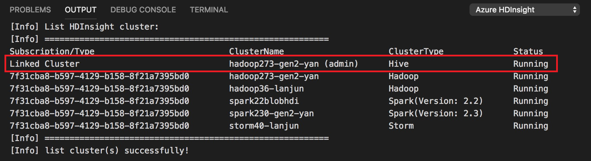

## Azure Data Lake Storage Gen2 (ADLS Gen2)

### Browse an ADLS Gen2 Account

When clicking on the Azure HDInsight explorer to expand an ADLS Gen2 account, you will be prompted to enter the storage **Access key** if your Azure account has no access to the Gen2 storage. The ADLS Gen2 account will be auto expanded once the access key is validated successfully. 

### Submit jobs to HDInsight cluster with ADLS Gen2

When submitting job to an HDInsight cluster with ADLS Gen2, you will be prompted to enter the storage **Access key** if your Azure account has no write access to the Gen2 storage.  The job will be successfully submitted once the access key is validated successfully. 

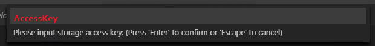   

> [!NOTE]
> 
>You can get the access key for storage account from the Azure portal. For information, see [View and copy access keys](https://docs.microsoft.com/azure/storage/common/storage-account-manage#access-keys).

## Unlink cluster

1. From the menu bar navigate to **View** > **Command Palette...**, and then enter **HDInsight: Unlink a Cluster**.  

2. Select cluster to unlink.  

3. Review **OUTPUT** view for verification.  

## Sign out  

From the menu bar navigate to **View** > **Command Palette...**, and then enter **HDInsight: Logout**.  There will be a pop-up in the bottom right-hand corner stating **Logout successfully!**.


## Next steps
For a demonstration video of using HDInsight for Visual Studio Code, see [HDInsight for Visual Studio Code](https://go.microsoft.com/fwlink/?linkid=858706)
