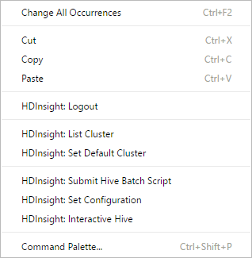

# Use Azure HDInsight Tool for Visual Studio Code

Learn how to use the Azure HDInsight Tools for Visual Studio Code (VSCode) to create, submit Hive batch jobs, interactive Hive queries, and pySpark scripts. The Azure HDInsight Tools can be installed on the platforms supported by VSCode including Windows, Linux, and MacOS. You can find the prerequisites for different platforms.


## Prerequisites

The following items are required for completing this article:

- A HDInsight cluster.  To create a cluster, see [Get started with HDInsight]( hdinsight-hadoop-linux-tutorial-get-started.md).
- [Visual Studio Code](https://www.visualstudio.com/products/code-vs.aspx).
- [Mono](http://www.mono-project.com/docs/getting-started/install/). Mono is only required for Linux and MacOS.

## Install the HDInsight Tools
   
After you have installed the prerequisites, you can install the Azure HDInsight Tools for VSCode. 

**To Install Azure HDInsight tools**

1. Open **Visual Studio Code**.
2. Click **Extensions** in the left pane. Enter **HDInsight** in the search box.
3. Click **Install** next to **Azure HDInsight tools**. After a few seconds, the **Install** button will be changed to **Reload**.
4. Click **Reload** to activate the **Azure HDInsight tools** extension.
5. Click **Reload Window** to confirm. You can see **Azure HDInsight tools** in the Extensions pane.

   

For Spark users, the Python extension is recommended for better language service experiences. The Python extension is not required for Hive users. 

**To install Python**

1. Open **Visual Studio Code**.
2. Click **Extensions** in the left pane. Enter **python** in the search box. You can see a list of python extensions. One of them is **Python**.
3. Click **Install** next to **Python**. After a few seconds, the **Install** button will be changed to **Reload**.
4. Click **Reload** to activate the **Python** extension.
5. Click **Reload Window** to confirm. You can see **Python** in the Extensions pane.

     

## Open HDInsight workspace

You must create a workspace in VSCode before you can connect to Azure.

**To open a workspace**

1. From the **File** menu, click **Open Folder**, specify an existing folder, or create a new folder as your work folder. The foler appears on the left pane.
2. From left pane, click the **New File** icon next to the work folder.

   
3. Name the new file with either the .hql (Hive queries) or the .py (Spark script) file extension. Notice a **XXXX_hdi_settings.json** configuration file is automatically added to the work folder.
4. Open **XXXX_hdi_settings.json** from **EXPLORER**, or right-click on the script editor to select **Set Configuration**. You can configure login entry, default cluster, and job submission parameters, as shown in the sample in the file. You also can leave the remaining parameters empty.

## Connect to Azure

Before you can submit scripts to HDInsight clusters from VSCode, you need connect to your Azure account.

**To connect to Azure**

1. Create a new work folder and a new script file if you don't have one.
2. Right-click the script editor, and then select **HDInsight: Login** from the context menu. You can also press **CTRL+SHIFT+P** and entering **HDInsight: Login**.

    
3. Follow the login instructions in the **OUTPUT** pane to log in.

    **Azure:**
    

    Once connected, your Azure account name is shown on the status bar at the left-bottom of the VSCode window. 

    > [!NOTE] 
    > If your Azure account has two factors enabled, it is recommended to use phone authentication instead of Pin.
    > There is a known issue about Azure login using Google Chrome.

4. Right-click the script edit to open the context menu:

    

    From the context menu, you can perform the following tasks:

    - logout
    - list clusters
    - Set default cluster
    - Submit interactive Hive queries
    - Submit Hive batch script
    - Set configuration

## List HDInsight clusters

To test the connection, you can list your HDInsight clusters:

**To list HDInsight clusters under your Azure subscription**
1. Open a workspace and connect to Azure. See [Open HDInsight workspace](#open-hdinsight-workspace) and [Connect to Azure](#connect-to-azure).
2. Right-click the script editor, and then select **HDInsight: List Cluster** from the context menu. 
3. The Hive and Spark clusters appear in the **Output** pane.

    

## Set default cluster
1. Open a workspace and connect to Azure. See [Open HDInsight workspace](#open-hdinsight-workspace) and [Connect to Azure](#connect-to-azure).
2. Right-click the script editor, and then click **HDInsight: Set Default Cluster**. 
3. Select a cluster as default cluster for the current script file. The Tools automatically update the configuration file, **XXXX_hdi_settings.json**. 

   

## Set Azure environment 
1. Open the command palette by pressing **CTRL+SHIFT+P**.
2. Enter **HDInsight: Set Azure Environment**.
3. Select one way from Azure and AzureChina as your default login entry.
4. Meanwhile, our tool already saved what you selected default login entry into **XXXX_hdi_settings.json**. You also directly update it in this configuration file. 

   

## Submit interactive Hive queries

HDInsight Tools for VSCode enable you to submit interactive Hive queries to HDInsight Interactive Query clusters.

1. Create a new work folder and a new Hive script file if you don't have one.
2. Connect to your Azure account, and then configure the default cluster if you haven't done so.
3. Copy and paste the following code into your Hive file, then save it.

    ```hiveql
    SELECT * FROM hivesampletable;
    ```
3. Right-click the script editor, and then click **HDInsight: Interactive Hive** to submit the query. The Tools also allow you to submit a block of code instead of the whole script file using the context menu. Soon after, the query result is shown in a new tab:

   

    - **RESULTS** panel: You can save the whole result as CSV,JSON,EXCEL to local path, or just select multiple lines.
    - **MESSAGES** panel: Clicking **Line** number, it jumps to the first line of the running script.

Comparing to [running a Hive batch job](#submit-hive-batch-scripts), the interactive query takes much less time.

## Submit Hive batch scripts

1. Create a new work folder and a new Hive script file if you don't have one.
2. Connect to your Azure account, and then configure the default cluster if you haven't done so.
3. Copy and paste the following code into your Hive file, then save it.

    ```hiveql
    SELECT * FROM hivesampletable;
    ```
3. Right-click the script editor, and then click **HDInsight: Submit Hive Batch Script** to submit a Hive job. 
4. Select a cluster where you want to submit to.  

    After submitting a Hive job, the submission success info and jobid is shown in **OUTPUT** panel. And it opens **WEB BROWSER** which the job realtime logs and status shown in.

   

Comparing to [submitting interactive Hive queries](#submit-interactive-hive-queries), the batch job takes much longer time.


## Submit PySpark job

1. Create a new work folder and a new script file with the .py extension if you don't have one.
2. Connect to your Azure account, and then configure the default cluster if you haven't done so.
3. Copy and paste the following code into the script file:

    ```python
    from __future__ import print_function
    import sys
    from operator import add
    from pyspark.sql import SparkSession
    if __name__ == "__main__":
        spark = SparkSession\
            .builder\
            .appName("PythonWordCount")\
            .getOrCreate()
    
        lines = spark.read.text('/HdiSamples/HdiSamples/SensorSampleData/hvac/HVAC.csv').rdd.map(lambda r: r[0])
        counts = lines.flatMap(lambda x: x.split(' '))\
                    .map(lambda x: (x, 1))\
                    .reduceByKey(add)
        output = counts.collect()
        for (word, count) in output:
            print("%s: %i" % (word, count))
        spark.stop()
    ```
4. Right-click the script editor, and then click **HDInsight: Submit PySpark Job**. 
5. Select a cluster to submit your PySpark job. 

    

After submitting a python job, submission logs is shown in **OUTPUT** window in VSCode. The **Spark UI URL** and **Yarn UI URL** are shown as well. You can open the URL in a web browser to track the job status.


## Additional features

The HDInsight for VSCode supports the following features:

- **IntelliSense auto-complete**. Suggestions are popped up around keyword, method, variables, etc. Different icons represent different types of the objects:

    
- **IntelliSense error marker**. The language service underlines the editing errors for Hive script.     
- **Syntax highlights**. The language service uses different color to differentiate variables, keywords, data type, functions, etc. 

    

## Next steps

### Demo
* HDInsight for VScode: [Video](https://go.microsoft.com/fwlink/?linkid=858706)

### Tools and extensions
* [Use Azure Toolkit for IntelliJ to debug Spark applications remotely through VPN](hdinsight-apache-spark-intellij-tool-plugin-debug-jobs-remotely.md)
* [Use Azure Toolkit for IntelliJ to debug Spark applications remotely through SSH](hdinsight-apache-spark-intellij-tool-debug-remotely-through-ssh.md)
* [Use HDInsight Tools for IntelliJ with Hortonworks Sandbox](hdinsight-tools-for-intellij-with-hortonworks-sandbox.md)
* [Use HDInsight Tools in Azure Toolkit for Eclipse to create Spark applications](hdinsight-apache-spark-eclipse-tool-plugin.md)
* [Use Zeppelin notebooks with a Spark cluster on HDInsight](hdinsight-apache-spark-zeppelin-notebook.md)
* [Kernels available for Jupyter notebook in Spark cluster for HDInsight](hdinsight-apache-spark-jupyter-notebook-kernels.md)
* [Use external packages with Jupyter notebooks](hdinsight-apache-spark-jupyter-notebook-use-external-packages.md)
* [Install Jupyter on your computer and connect to an HDInsight Spark cluster](hdinsight-apache-spark-jupyter-notebook-install-locally.md)
* [Visualize Hive data with Microsoft Power BI in Azure HDInsight](./hdinsight-connect-hive-power-bi.md).
* [Use Zeppelin to run Hive queries in Azure HDInsight ](./hdinsight-connect-hive-zeppelin.md).

### Scenarios
* [Spark with BI: Perform interactive data analysis using Spark in HDInsight with BI tools](hdinsight-apache-spark-use-bi-tools.md)
* [Spark with Machine Learning: Use Spark in HDInsight for analyzing building temperature using HVAC data](hdinsight-apache-spark-ipython-notebook-machine-learning.md)
* [Spark with Machine Learning: Use Spark in HDInsight to predict food inspection results](hdinsight-apache-spark-machine-learning-mllib-ipython.md)
* [Spark Streaming: Use Spark in HDInsight for building realtime streaming applications](hdinsight-apache-spark-eventhub-streaming.md)
* [Website log analysis using Spark in HDInsight](hdinsight-apache-spark-custom-library-website-log-analysis.md)

### Creating and running applications
* [Create a standalone application using Scala](hdinsight-apache-spark-create-standalone-application.md)
* [Run jobs remotely on a Spark cluster using Livy](hdinsight-apache-spark-livy-rest-interface.md)

### Managing resources
* [Manage resources for the Apache Spark cluster in Azure HDInsight](hdinsight-apache-spark-resource-manager.md)
* [Track and debug jobs running on an Apache Spark cluster in HDInsight](hdinsight-apache-spark-job-debugging.md)


