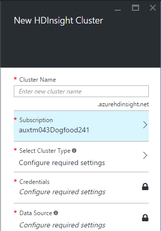
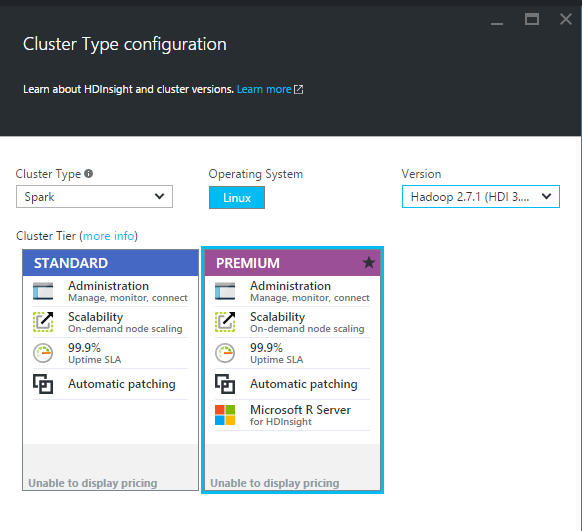
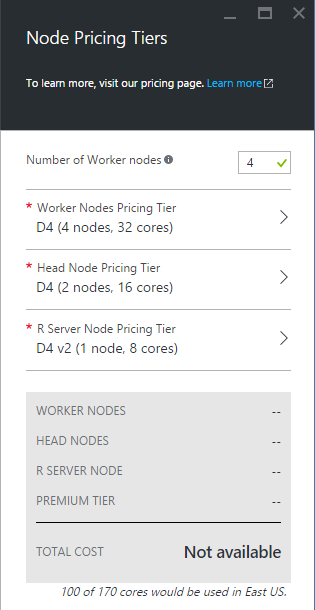

<properties
   pageTitle="Get started: Create R Server for Azure HDInsight (Linux)"
   description="Learn how to create an R Server on Spark cluster in HDInsight and then submit an R script on the cluster."
   services="HDInsight"
   documentationCenter=""
   authors="jeffstokes72"
   manager="paulettem"
   editor="cgronlun"
/>

<tags
   ms.service="HDInsight"
   ms.devlang="R"
   ms.topic="article"
   ms.tgt_pltfrm="na"
   ms.workload="data-services"
   ms.date="03/20/2016"
   ms.author=jeffstok"/>

# Get started: Create an R Server for Azure HDInsight (Linux)

Learn how to create an R Server on Spark cluster in HDInsight and then submit an R script on the cluster.

## Prerequisites

-   **An Azure subscription**. Before you begin this tutorial, you must have an Azure subscription. See [Get Azure free trial](https://azure.microsoft.com/documentation/videos/get-azure-free-trial-for-testing-hadoop-in-hdinsight/).
-   **A Secure Shell (SSH) client**: Linux, Unix, and OS X systems provied an SSH client through the ssh command. For Windows systems, we recommend [PuTTY](http://www.chiark.greenend.org.uk/~sgtatham/putty/download.html).
-   **Secure Shell (SSH) keys (optional)**: You can secure the SSH account used to connect to the cluster using either a password or a public key. Using a password gets you started quickly, and you should use this option if you want to quickly create a cluster and run some test jobs. Using a key is more secure, however it requires additional setup. You might want to use this approach when creating a production cluster. In this article, we use the password approach. For instructions on how to create and use SSH keys with HDInsight, refer to the following articles:
    -   From a Linux computer - [Use SSH with Linux-based HDInsight (Hadoop) from Linux, Unix, or OS X](hdinsight-hadoop-linux-use-ssh-unix.md).
    -   From a Windows computer - [Use SSH with Linux-based HDInsight (Hadoop) from Windows](hdinsight-hadoop-linux-use-ssh-windows.md).

## Create a R Server cluster on HDInsight Linux

R Server run on top of Spark or Mapreduce for its distributed computation. In this section, you will create an R Server on HDInsight cluster which is based on the version 3.4 HDInsight cluster with built in Spark version 1.6. For information about HDInsight versions and their SLAs, see [HDInsight component versioning](hdinsight-component-versioning.md).

>[AZURE.NOTE] The steps in this article create an R Server on HDInsight cluster using basic configuration settings. For information about other cluster configuration settings (such as using additional storage, an Azure virtual network, or a metastore for Hive), see [Create HDInsight Spark clusters using custom options](hdinsight-hadoop-provision-linux-clusters.md).

## To create a R Server cluster

1.  Sign in to the [Azure preview portal](https://ms.portal.azure.com/).
2.  Click **NEW**, click **Data + Analytics**, and then click **HDInsight**.    
	    
3.  Enter a **Cluster Name**,
	
4.  If you have more than one subscription, click the **Subscription** entry to select the Azure subscription to use for the cluster.
5.  Enter to the Cluster Type blade and select **R Server on Spark** for the **Cluster Type**, from the drop-down menu. This selection will default to **Linux** operating system and **Premium** card. Select the desired version from the **Version** drop-down. A green check appears beside the cluster name if it is available. Additionally, you can install R Server on Hadoop and Spark Cluster Types. To do so you need to select **Hadoop** or **Spark** for the **ClusterType** from the drop-down menu, select **Linux** for the operating system and select any version of HDI 3.4 or higher.  
      
6.  Click **Select** to save the Cluster Type configuration.
7.  Click **Credentials** and then enter a password for the admin user. You must also enter an **SSH Username**. For **SSH Authentication Type**, click **PASSWORD** and specify a password for the SSH user. Click **Select** at the bottom to save the credentials configuration.  
	  
8.  Click **Select** to save the Cluster Credentials configuration.
9.  Click **Data Source** to choose an existing data source for the cluster, or create a new one. When you create a Hadoop cluster in HDInsight, you specify an Azure Storage account. A specific Blob storage container from that account is designated as the default file system, like in the Hadoop distributed file system (HDFS). By default, the HDInsight cluster is created in the same data center as the storage account you specify. For more information, see [Use Azure Blob storage with HDInsight](hdinsight-hadoop-use-blob-storage.md).

>[AZURE.NOTE] SSH is used to remotely access the HDInsight cluster using a command-line. The user name and password you use here is used when connecting to the cluster through SSH. Also, the SSH user name must be unique, as it creates a user account on all the HDInsight cluster nodes. The following are some of the account names reserved for use by services on the cluster, and cannot be used as the SSH user name: root, hdiuser, storm, hbase, ubuntu, zookeeper, hdfs, yarn, mapred, hbase, hive, oozie, falcon, sqoop, admin, tez, hcat, hdinsight-zookeeper.

For more information on using SSH with HDInsight, see one of the following articles:

-   [Use SSH with Linux-based Hadoop on HDInsight from Linux, Unix, or OS X](hdinsight-hadoop-linux-use-ssh-unix.md)

Currently you can select an Azure Storage Account as the data source for an HDInsight cluster. Use the following to understand the entries on the **Data Source** blade.

-   **Selection Method**: Set this to **From all subscriptions** to enable browsing of storage accounts from all your subscriptions. Set this to **Access Key** if you want to enter the **Storage Name** and **Access Key** of an existing storage account.
-   **Select storage account / Create New**: Click **Select storage account** to browse and select an existing storage account you want to associate with the cluster. Or, click **Create New** to create a new storage account. Use the field that appears to enter the name of the storage account. A green check appears if the name is available.
-   **Choose Default Container**: Use this to enter the name of the default container to use for the cluster. While you can enter any name here, we recommend using the same name as the cluster so that you can easily recognize that the container is used for this specific cluster.
-   **Location**: The geographic region that the storage account is in, or will be created in.

>[AZURE.ALERT] Selecting the location for the default data source also sets the location of the HDInsight cluster. The cluster and default data source must be located in the same region.

Click **Select** to save the data source configuration.

1.  Click **Node Pricing Tiers** to display information about the nodes that will be created for this cluster. Set the number of worker nodes that you need for the cluster. The estimated cost of the cluster will be shown within the blade.

2.  Click **Select** to save the node pricing configuration.

3.  Click **Resource Group** to see a list of existing resource groups and select where to create the cluster. Or, you can click **Create New** and then enter the name of the new resource group. A green check appears to indicate if the new group name is available. This entry defaults to one of your existing resource groups, if any are available.

4.  On the **New HDInsight Cluster** blade, ensure that **Pin to Startboard** is selected, and then click **Create**. This creates the cluster and adds a tile for it to the Startboard of your Azure portal. The icon will indicate that the cluster is being created, and will change to display the HDInsight icon once creation has completed.

While creating

Creation complete

It will take some time for the cluster to be created, usually around 15 minutes. Use the tile on the Startboard, or the **Notifications** entry on the left of the page to check on the creation process. Once the creation is complete, click the tile for the R Server on HDInsight cluster from the Startboard to launch the cluster blade.

## Run your first distributed R Query

In this section, you use a SSH to run a R server in a distributed way. You need to use SSH to connect to the edge node and start the script from there. You can use R Studio as your editor which you can learn how to install at <Create an R script that use the Spark engine>

See also Overview:
R Server on HDInsight

Tools and extensions
-   [Use R Server for HDInsight from RStudio to submit R scripts](https://azure.microsoft.com/en-us/documentation/articles/hdinsight-apache-spark-intellij-tool-plugin/)

Manage resources
-   [Manage resources for the R Server for HDInsight](https://azure.microsoft.com/en-us/documentation/articles/hdinsight-apache-spark-resource-manager/)

Known issues
-   [Known issues of R Studio for HDInsight (Linux)](https://azure.microsoft.com/en-us/documentation/articles/hdinsight-apache-spark-known-issues/)
