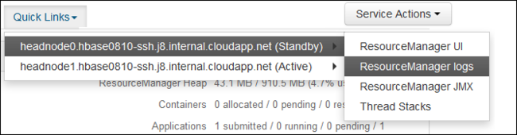

# Access Apache Hadoop YARN application logs on Linux-based HDInsight

Learn how to access the logs for [Apache Hadoop YARN](https://hadoop.apache.org/docs/current/hadoop-yarn/hadoop-yarn-site/YARN.html) (Yet Another Resource Negotiator) applications on an Apache Hadoop cluster in Azure HDInsight.

## What is Apache YARN?

YARN supports multiple programming models (Apache Hadoop MapReduce being one of them) by decoupling resource management from application scheduling/monitoring. YARN uses a global *`ResourceManager`* (RM), per-worker-node *NodeManagers* (NMs), and per-application *ApplicationMasters* (AMs). The per-application AM negotiates resources (CPU, memory, disk, network) for running your application with the RM. The RM works with NMs to grant these resources, which are granted as *containers*. The AM is responsible for tracking the progress of the containers assigned to it by the RM. An application may require many containers depending on the nature of the application.

Each application may consist of multiple *application attempts*. If an application fails, it may be retried as a new attempt. Each attempt runs in a container. In a sense, a container provides the context for basic unit of work done by a YARN application. All work that is done within the context of a container is done on the single worker node on which the container was given. See [Hadoop: Writing YARN Applications](https://hadoop.apache.org/docs/r2.7.4/hadoop-yarn/hadoop-yarn-site/WritingYarnApplications.html), or [Apache Hadoop YARN](https://hadoop.apache.org/docs/current/hadoop-yarn/hadoop-yarn-site/YARN.html) for further reference.

To scale your cluster to support greater processing throughput, you can use [Autoscale](hdinsight-autoscale-clusters.md) or [Scale your clusters manually using a few different languages](hdinsight-scaling-best-practices.md#utilities-to-scale-clusters).

## YARN Timeline Server

The [Apache Hadoop YARN Timeline Server](https://hadoop.apache.org/docs/r2.7.3/hadoop-yarn/hadoop-yarn-site/TimelineServer.html) provides generic information on completed applications

YARN Timeline Server includes the following type of data:

* The application ID, a unique identifier of an application
* The user who started the application
* Information on attempts made to complete the application
* The containers used by any given application attempt

## YARN applications and logs

Application logs (and the associated container logs) are critical in debugging problematic Hadoop applications. YARN provides a nice framework for collecting, aggregating, and storing application logs with [Log Aggregation](https://hortonworks.com/blog/simplifying-user-logs-management-and-access-in-yarn/).

The Log Aggregation feature makes accessing application logs more deterministic. It aggregates logs across all containers on a worker node and stores them as one aggregated log file per worker node. The log is stored on the default file system after an application finishes. Your application may use hundreds or thousands of containers, but logs for all containers run on a single worker node are always aggregated to a single file. So there's only 1 log per worker node used by your application. Log Aggregation is enabled by default on HDInsight clusters version 3.0 and above. Aggregated logs are located in default storage for the cluster. The following path is the HDFS path to the logs:

```
/app-logs/<user>/logs/<applicationId>
```

In the path, `user` is the name of the user who started the application. The `applicationId` is the unique identifier assigned to an application by the YARN RM.

The aggregated logs aren't directly readable, as they're written in a TFile, binary format indexed by container. Use the YARN `ResourceManager` logs or CLI tools to view these logs as plain text for applications or containers of interest.

## Yarn logs in an ESP cluster

Two configurations must be added to the custom `mapred-site` in Ambari.

1. From a web browser, navigate to `https://CLUSTERNAME.azurehdinsight.net`, where `CLUSTERNAME` is the name of your cluster.

1. From the Ambari UI, navigate to **MapReduce2** > **Configs** > **Advanced** > **Custom mapred-site**.

1. Add *one* of the following sets of properties:

    **Set 1**

    ```
    mapred.acls.enabled=true
    mapreduce.job.acl-view-job=*
    ```

    **Set 2**

    ```
    mapreduce.job.acl-view-job=<user1>,<user2>,<user3>
    ```

1. Save changes and restart all affected services.

## YARN CLI tools

1. Use [ssh command](./hdinsight-hadoop-linux-use-ssh-unix.md) to connect to your cluster. Edit the command below by replacing CLUSTERNAME with the name of your cluster, and then enter the command:

    ```cmd
    ssh sshuser@CLUSTERNAME-ssh.azurehdinsight.net
    ```

1. List all the application IDs of the currently running Yarn applications with the following command:

    ```bash
    yarn top
    ```

    Note the application ID from the `APPLICATIONID` column whose logs are to be downloaded.

    ```output
    YARN top - 18:00:07, up 19d, 0:14, 0 active users, queue(s): root
    NodeManager(s): 4 total, 4 active, 0 unhealthy, 0 decommissioned, 0 lost, 0 rebooted
    Queue(s) Applications: 2 running, 10 submitted, 0 pending, 8 completed, 0 killed, 0 failed
    Queue(s) Mem(GB): 97 available, 3 allocated, 0 pending, 0 reserved
    Queue(s) VCores: 58 available, 2 allocated, 0 pending, 0 reserved
    Queue(s) Containers: 2 allocated, 0 pending, 0 reserved
    
                      APPLICATIONID USER             TYPE      QUEUE   #CONT  #RCONT  VCORES RVCORES     MEM    RMEM  VCORESECS    MEMSECS %PROGR       TIME NAME
     application_1490377567345_0007 hive            spark  thriftsvr       1       0       1       0      1G      0G    1628407    2442611  10.00   18:20:20 Thrift JDBC/ODBC Server
     application_1490377567345_0006 hive            spark  thriftsvr       1       0       1       0      1G      0G    1628430    2442645  10.00   18:20:20 Thrift JDBC/ODBC Server
    ```

1. You can view these logs as plain text by running one of the following commands:

    ```bash
    yarn logs -applicationId <applicationId> -appOwner <user-who-started-the-application>
    yarn logs -applicationId <applicationId> -appOwner <user-who-started-the-application> -containerId <containerId> -nodeAddress <worker-node-address>
    ```

    Specify the &lt;applicationId>, &lt;user-who-started-the-application>, &lt;containerId>, and &lt;worker-node-address> information when running these commands.

### Other sample commands

1. Download Yarn containers logs for all application masters with the command below. This step will create the log file named `amlogs.txt` in text format.

    ```bash
    yarn logs -applicationId <application_id> -am ALL > amlogs.txt
    ```

1. Download Yarn container logs for only the latest application master with the following command:

    ```bash
    yarn logs -applicationId <application_id> -am -1 > latestamlogs.txt
    ```

1. Download YARN container logs for first two application masters with the following command:

    ```bash
    yarn logs -applicationId <application_id> -am 1,2 > first2amlogs.txt
    ```

1. Download all Yarn container logs with the following command:

    ```bash
    yarn logs -applicationId <application_id> > logs.txt
    ```

1. Download yarn container log for a particular container with the following command:

    ```bash
    yarn logs -applicationId <application_id> -containerId <container_id> > containerlogs.txt
    ```

## YARN `ResourceManager` UI

The YARN `ResourceManager` UI runs on the cluster headnode. It's accessed through the Ambari web UI. Use the following steps to view the YARN logs:

1. In your web browser, navigate to `https://CLUSTERNAME.azurehdinsight.net`. Replace CLUSTERNAME with the name of your HDInsight cluster.

2. From the list of services on the left, select **YARN**.

    

3. From the **Quick Links** dropdown, select one of the cluster head nodes and then select **`ResourceManager Log`**.

    

    You're presented with a list of links to YARN logs.

## Next steps

* [Apache Hadoop architecture in HDInsight](hdinsight-hadoop-architecture.md)
* [Troubleshoot Apache Hadoop YARN by using Azure HDInsight](hdinsight-troubleshoot-yarn.md)
