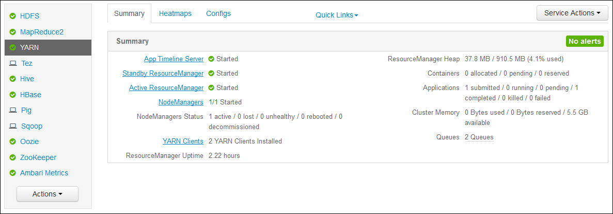
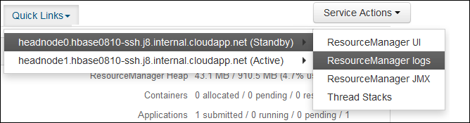

# Access Apache Hadoop YARN application logs on Linux-based HDInsight

Learn how to access the logs for [Apache Hadoop YARN](https://hadoop.apache.org/docs/current/hadoop-yarn/hadoop-yarn-site/YARN.html) (Yet Another Resource Negotiator) applications on an [Apache Hadoop](https://hadoop.apache.org/) cluster in Azure HDInsight.

## YARN Timeline Server

The [Apache Hadoop YARN Timeline Server](https://hadoop.apache.org/docs/r2.7.3/hadoop-yarn/hadoop-yarn-site/TimelineServer.html) provides generic information on completed applications

YARN Timeline Server includes the following type of data:

* The application ID, a unique identifier of an application
* The user who started the application
* Information on attempts made to complete the application
* The containers used by any given application attempt

## YARN applications and logs

YARN supports multiple programming models ([Apache Hadoop MapReduce](https://hadoop.apache.org/docs/r1.2.1/mapred_tutorial.html)  being one of them) by decoupling resource management from application scheduling/monitoring. YARN uses a global *ResourceManager* (RM), per-worker-node *NodeManagers* (NMs), and per-application *ApplicationMasters* (AMs). The per-application AM negotiates resources (CPU, memory, disk, network) for running your application with the RM. The RM works with NMs to grant these resources, which are granted as *containers*. The AM is responsible for tracking the progress of the containers assigned to it by the RM. An application may require many containers depending on the nature of the application.

Each application may consist of multiple *application attempts*. If an application fails, it may be retried as a new attempt. Each attempt runs in a container. In a sense, a container provides the context for basic unit of work performed by a YARN application. All work that is done within the context of a container is performed on the single worker node on which the container was allocated. See [Apache Hadoop YARN Concepts](https://hadoop.apache.org/docs/r2.7.4/hadoop-yarn/hadoop-yarn-site/WritingYarnApplications.html) for further reference.

Application logs (and the associated container logs) are critical in debugging problematic Hadoop applications. YARN provides a nice framework for collecting, aggregating, and storing application logs with the [Log Aggregation](https://hortonworks.com/blog/simplifying-user-logs-management-and-access-in-yarn/) feature. The Log Aggregation feature makes accessing application logs more deterministic. It aggregates logs across all containers on a worker node and stores them as one aggregated log file per worker node. The log is stored on the default file system after an application finishes. Your application may use hundreds or thousands of containers, but logs for all containers run on a single worker node are always aggregated to a single file. So there is only 1 log per worker node used by your application. Log Aggregation is enabled by default on HDInsight clusters version 3.0 and above. Aggregated logs are located in default storage for the cluster. The following path is the HDFS path to the logs:

    /app-logs/<user>/logs/<applicationId>

In the path, `user` is the name of the user who started the application. The `applicationId` is the unique identifier assigned to an application by the YARN RM.

The aggregated logs are not directly readable, as they are written in a [TFile][T-file], [binary format][binary-format] indexed by container. Use the YARN ResourceManager logs or CLI tools to view these logs as plain text for applications or containers of interest.

## YARN CLI tools

To use the YARN CLI tools, you must first connect to the HDInsight cluster using SSH. For information, see [Use SSH with HDInsight](hdinsight-hadoop-linux-use-ssh-unix.md).

You can view these logs as plain text by running one of the following commands:

    yarn logs -applicationId <applicationId> -appOwner <user-who-started-the-application>
    yarn logs -applicationId <applicationId> -appOwner <user-who-started-the-application> -containerId <containerId> -nodeAddress <worker-node-address>

Specify the &lt;applicationId>, &lt;user-who-started-the-application>, &lt;containerId>, and &lt;worker-node-address> information when running these commands.

## YARN ResourceManager UI

The YARN ResourceManager UI runs on the cluster headnode. It is accessed through the Ambari web UI. Use the following steps to view the YARN logs:

1. In your web browser, navigate to https://CLUSTERNAME.azurehdinsight.net. Replace CLUSTERNAME with the name of your HDInsight cluster.
2. From the list of services on the left, select **YARN**.

    
3. From the **Quick Links** dropdown, select one of the cluster head nodes and then select **ResourceManager Log**.

    

    You are presented with a list of links to YARN logs.

[YARN-timeline-server]:https://hadoop.apache.org/docs/r2.4.0/hadoop-yarn/hadoop-yarn-site/TimelineServer.html
[T-file]:https://issues.apache.org/jira/secure/attachment/12396286/TFile%20Specification%2020081217.pdf
[binary-format]:https://issues.apache.org/jira/browse/HADOOP-3315
