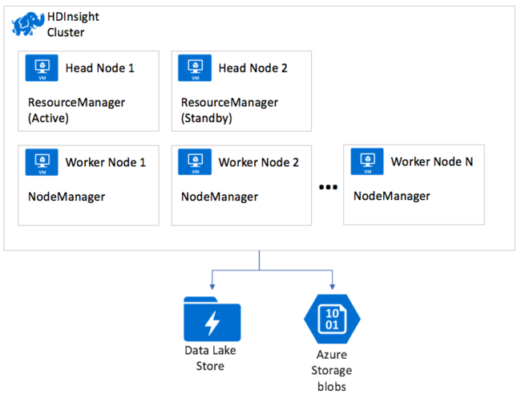

# Apache Hadoop architecture in HDInsight

[Apache Hadoop](https://hadoop.apache.org/) includes two core components: the [Apache Hadoop Distributed File System (HDFS)](https://hadoop.apache.org/docs/current/hadoop-project-dist/hadoop-hdfs/HdfsUserGuide.html) that provides storage, and [Apache Hadoop Yet Another Resource Negotiator (YARN)](https://hadoop.apache.org/docs/current/hadoop-yarn/hadoop-yarn-site/YARN.html) that provides processing. With storage and processing capabilities, a cluster becomes capable of running [MapReduce](https://hadoop.apache.org/docs/current/hadoop-mapreduce-client/hadoop-mapreduce-client-core/MapReduceTutorial.html) programs to perform the desired data processing.

> [!NOTE]  
> An HDFS is not typically deployed within the HDInsight cluster to provide storage. Instead, an HDFS-compatible interface layer is used by Hadoop  components. The actual storage capability is provided by either Azure Storage or Azure Data Lake Storage. For Hadoop, MapReduce jobs executing on the HDInsight cluster run as if an HDFS were present and so require no changes to support their storage needs. In Hadoop on HDInsight, storage is outsourced, but YARN processing  remains a core component. For more information, see [Introduction to Azure HDInsight](hadoop/apache-hadoop-introduction.md).

This article introduces YARN and how it coordinates the execution of applications on HDInsight.

## Apache Hadoop YARN basics

YARN governs and orchestrates data processing in Hadoop. YARN has two core services that run as processes on nodes in the cluster:

* ResourceManager
* NodeManager

The ResourceManager grants cluster compute resources to applications like MapReduce jobs. The ResourceManager grants these resources as containers, where each container consists of an allocation of CPU cores and RAM memory. If you combined all the resources available in a cluster and then distributed the cores and memory in blocks, each block of resources is a container. Each node in the cluster has a capacity for a certain number of containers, therefore the cluster has a fixed limit on the number of containers available. The allotment of resources in a container is configurable.

When a MapReduce application runs on a cluster, the ResourceManager provides the application the containers in which to execute. The ResourceManager tracks the status of running applications, available cluster capacity, and tracks applications as they complete and release their resources.

The ResourceManager also runs a web server process that provides a web user interface to monitor the status of applications.

When a user submits a MapReduce application to run on the cluster, the application is submitted to the ResourceManager. In turn, the ResourceManager allocates a container on  available NodeManager nodes. The NodeManager nodes are where the application actually executes. The first container allocated  runs a special application called the ApplicationMaster. This ApplicationMaster is responsible for acquiring resources, in the form of subsequent containers, needed to run the submitted application. The ApplicationMaster examines the stages of the application, such as the map stage and reduce stage, and factors in how much data needs to be processed. The ApplicationMaster then requests (*negotiates*) the resources from the ResourceManager on behalf of the application. The ResourceManager in turn grants resources from the NodeManagers in the cluster to the ApplicationMaster for it to use in executing the application.

The NodeManagers run the tasks that make up the application, then report their progress and status back to the ApplicationMaster. The ApplicationMaster in turn reports the status of the application back to the ResourceManager. The ResourceManager returns any results to the client.

## YARN on HDInsight

All HDInsight cluster types deploy YARN. The ResourceManager is deployed for high availability with a primary and secondary instance, which runs on the first and second head nodes within the cluster respectively. Only the one instance of the ResourceManager is active at a time. The NodeManager instances run across the available worker nodes in the cluster.

## Soft delete

To undelete a file from your Storage Account, see:

### Azure Storage

* [Soft delete for Azure Storage blobs](../storage/blobs/storage-blob-soft-delete.md)
* [Undelete Blob](https://docs.microsoft.com/rest/api/storageservices/undelete-blob)

### Azure Data Lake Storage Gen 1

[Restore-AzDataLakeStoreDeletedItem](https://docs.microsoft.com/powershell/module/az.datalakestore/restore-azdatalakestoredeleteditem)

### Azure Data Lake Storage Gen 2

[Known issues with Azure Data Lake Storage Gen2](../storage/blobs/data-lake-storage-known-issues.md)

## Trash purging

The `fs.trash.interval` property from **HDFS** > **Advanced core-site** should remain at the default value `0` because you shouldn't store any data on the local file system. This value doesn't affect remote storage accounts(WASB, ADLS GEN1, ABFS)

## Next steps

* [Use MapReduce in Apache Hadoop on HDInsight](hadoop/hdinsight-use-mapreduce.md)
* [Introduction to Azure HDInsight](hadoop/apache-hadoop-introduction.md)
