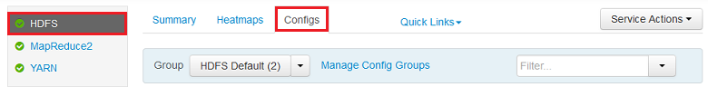
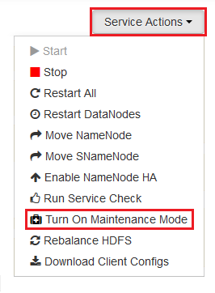

<properties
	pageTitle="Enable heap dumps for Hadoop services on HDInsight | Microsoft Azure"
	description="Enable heap dumps for Hadoop services from Linux-based HDInsight clusters for debugging and analysis."
	services="hdinsight"
	documentationCenter=""
	authors="Blackmist"
	manager="paulettm"
	editor="cgronlun"
	tags="azure-portal"/>

<tags
	ms.service="hdinsight"
	ms.workload="big-data"
	ms.tgt_pltfrm="na"
	ms.devlang="na"
	ms.topic="article"
	ms.date="07/12/2016"
	ms.author="larryfr"/>

#Enable heap dumps for Hadoop services on Linux-based HDInsight (Preview)

[AZURE.INCLUDE [heapdump-selector](../../includes/hdinsight-selector-heap-dump.md)]

Heap dumps contain a snapshot of the application's memory, including the values of variables at the time the dump was created. So they are very useful for diagnosing problems that occur at run-time.

> [AZURE.NOTE] The information in this article only applies to Linux-based HDInsight. For information on Windows-based HDInsight, see [Enable heap dumps for Hadoop services on Windows-based HDInsight](hdinsight-hadoop-collect-debug-heap-dumps.md)

## Services

You can enable heap dumps for the following services:

*  **hcatalog** - tempelton
*  **hive** - hiveserver2, metastore, derbyserver
*  **mapreduce** - jobhistoryserver
*  **yarn** - resourcemanager, nodemanager, timelineserver
*  **hdfs** - datanode, secondarynamenode, namenode

You can also enable heap dumps for the map and reduce processes ran by HDInsight.

## Understanding heap dump configuration

Heap dumps are enabled by passing options (sometimes known as opts, or parameters) to the JVM when a service is started. For most Hadoop services, this can be accomplished by modifying the shell script used to start the service.

In each script, there is an export for **\*\_OPTS**, which contains the options passed to the JVM. For example, in the **hadoop-env.sh** script, the line that begins with `export HADOOP_NAMENODE_OPTS=` contains the options for the NameNode service.

Map and reduce processes are slightly different, as these are a child process of the MapReduce service. Each map or reduce process runs in a child container, and there are two entries that contain the JVM options for these. Both contained in **mapred-site.xml**:

* **mapreduce.admin.map.child.java.opts**
* **mapreduce.admin.reduce.child.java.opts**

> [AZURE.NOTE] We recommend using Ambari to modify both the scripts and mapred-site.xml settings, as Ambari will handle replicating changes across nodes in the cluster. See the [Using Ambari](#using-ambari) section for specific steps.

###Enable heap dumps

The following option enables heap dumps when an OutOfMemoryError occurs:

    -XX:+HeapDumpOnOutOfMemoryError

The **+** indicates that this option is enabled. The default is disabled.

> [AZURE.WARNING] Heap dumps are not enabled for Hadoop services on HDInsight by default, as the dump files can be large. If you do enable them for troubleshooting, remember to disable them once you have reproduced the problem and gathered the dump files.

###Dump location

The default location for the dump file is the current working directory. You can control where the file is stored using the following option:

    -XX:HeapDumpPath=/path

For example, using `-XX:HeapDumpPath=/tmp` will cause the dumps to be stored in the /tmp directory.

###Scripts

You can also trigger a script when an **OutOfMemoryError** occurs. For example, triggering a notification so you know that the error has occurred. This is controlled using the following option:

    -XX:OnOutOfMemoryError=/path/to/script

> [AZURE.NOTE] Since Hadoop is a distributed system, any script used must be placed on all nodes in the cluster that the service runs on.
>
> The script must also be in a location that is accessible by the account the service runs as, and must provide execute permissions. For example, you may wish to store scripts in `/usr/local/bin` and use `chmod go+rx /usr/local/bin/filename.sh` to grant read and execute permissions.

##Using Ambari

To modify the configuration for a service, use the following steps:

1. Open the Ambari web UI for your cluster. The URL will be https://YOURCLUSTERNAME.azurehdinsight.net.

    When prompted, authenticate to the site using the HTTP account name (default: admin,) and password for your cluster.

    > [AZURE.NOTE] You may be prompted a second time by Ambari for the user name and password. If so, just re-enter the same account name and password

2. Using the list of on the left, select the service area you want to modify. For example, **HDFS**. In the center area, select the **Configs** tab.

    

3. Using the **Filter...** entry, enter **opts**. This will filter the list of configuration items to only those containing this text, and is a quick way to find the shell script, or **template** that can be used to set these options.

    

4. Find the **\*\_OPTS** entry for the service you want to enable heap dumps for, and add the options you wish to enable. In the following image, I've added `-XX:+HeapDumpOnOutOfMemoryError -XX:HeapDumpPath=/tmp/` to the **HADOOP\_NAMENODE\_OPTS** entry:

    

	> [AZURE.NOTE] When enabling heap dumps for the map or reduce child process, you will instead look for the fields labled **mapreduce.admin.map.child.java.opts** and **mapreduce.admin.reduce.child.java.opts**.

    Use the **Save** button to save the changes. You will be allowed to enter a short note describing the changes.

5. Once the changes have been applied, the **Restart required** icon will appear beside one or more services.

    

6. Select each service that needs a restart, and use the **Service Actions** button to **Turn On Maintenance Mode**. This prevents alerts from being generated from this service when you restart it.

    

7. Once you have enabled maintenance mode, use the **Restart** button for the service to **Restart All Effected**

    

    > [AZURE.NOTE] the entries for the **Restart** button may be different for other services.

8. Once the services have been restarted, use the **Service Actions** button to **Turn Off Maintenance Mode**. This Ambari to resume monitoring for alerts for the service.
