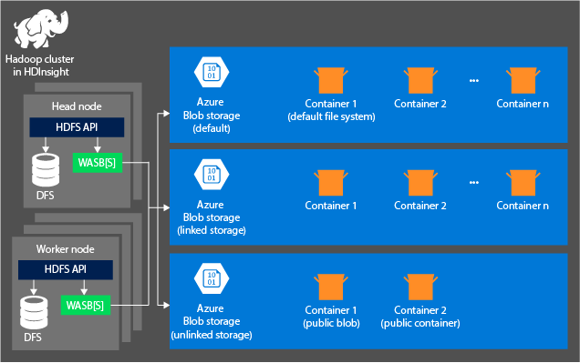

# Compare storage options for use with Azure HDInsight clusters

You can choose between a few different Azure storage services when creating HDInsight clusters:

* Azure Storage
* Azure Data Lake Storage Gen2
* Azure Data Lake Storage Gen1

This article provides an overview of these storage types and their unique features.

The following table summarizes the Azure Storage services that are supported with different versions of HDInsight:

| Storage service | Account type | Namespace Type | Supported services | Supported performance tiers | Supported access tiers | HDInsight Version | Cluster type |
|---|---|---|---|---|---|---|---|
|Azure Data Lake Storage Gen2| General-purpose V2 | Hierarchical (filesystem) | Blob | Standard | Hot, Cool, Archive | 3.6+ | All |
|Azure Storage| General-purpose V2 | Object | Blob | Standard | Hot, Cool, Archive | 3.6+ | All |
|Azure Storage| General-purpose V1 | Object | Blob | Standard | N/A | All | All |
|Azure Storage| Blob Storage** | Object | Block Blob | Standard | Hot, Cool, Archive | All | All |
|Azure Data Lake Storage Gen1| N/A | Hierarchical (filesystem) | N/A | N/A | N/A | 3.6 Only | All except HBase |

**For HDInsight clusters, only secondary storage accounts can be of type BlobStorage.

For more information on Azure Storage account types, see [Azure storage account overview](../storage/common/storage-account-overview.md)

For more information on Azure Storage access tiers, see [Azure Blob storage: Premium (preview), Hot, Cool, and Archive storage tiers](../storage/blobs/storage-blob-storage-tiers.md)

You can create a cluster using different combinations of services for primary and optional secondary storage. The following table summarizes the cluster storage configurations that are currently supported in HDInsight:

| HDInsight Version | Primary Storage | Secondary Storage | Supported |
|---|---|---|---|
| 3.6 & 4.0 | General Purpose V1 , General Purpose V2 | General Purpose V1 , General Purpose V2, BlobStorage(Block Blobs) | Yes |
| 3.6 & 4.0 | General Purpose V1 , General Purpose V2 | Data Lake Storage Gen2 | No |
| 3.6 & 4.0 | General Purpose V1 , General Purpose V2 | Data Lake Storage Gen1 | Yes |
| 3.6 & 4.0 | Data Lake Storage Gen2* | Data Lake Storage Gen2 | Yes |
| 3.6 & 4.0 | Data Lake Storage Gen2* | General Purpose V1 , General Purpose V2, BlobStorage(Block Blobs) | Yes |
| 3.6 & 4.0 | Data Lake Storage Gen2 | Data Lake Storage Gen1 | No |
| 3.6 | Data Lake Storage Gen1 | Data Lake Storage Gen1 | Yes |
| 3.6 | Data Lake Storage Gen1 | General Purpose V1 , General Purpose V2, BlobStorage(Block Blobs) | Yes |
| 3.6 | Data Lake Storage Gen1 | Data Lake Storage Gen2 | No |
| 4.0 | Data Lake Storage Gen1 | Any | No |

*=This could be one or multiple Data Lake Storage Gen2 accounts, as long as they are all setup to use the same managed identity for cluster access.

## Use Azure Data Lake Storage Gen2 with Apache Hadoop in Azure HDInsight

Azure Data Lake Storage Gen2 takes core features from Azure Data Lake Storage Gen1 and integrates them into Azure Blob storage. These features include a file system that is compatible with Hadoop, Azure Active Directory (Azure AD), and POSIX-based access control lists (ACLs). This combination allows you to take advantage of the performance of Azure Data Lake Storage Gen1 while also using the tiering and data life-cycle management of Blob storage.

For more information on Azure Data Lake Storage Gen2, see [Introduction to Azure Data Lake Storage Gen2](../storage/blobs/data-lake-storage-introduction.md).

### Core functionality of Azure Data Lake Storage Gen2

* **Access that is compatible with Hadoop:** In Azure Data Lake Storage Gen2, you can manage and access data just as you would with a Hadoop Distributed File System (HDFS). The Azure Blob File System (ABFS) driver is available within all Apache Hadoop environments, including Azure HDInsight and Azure Databricks. Use ABFS to access data stored in Data Lake Storage Gen2.

* **A superset of POSIX permissions:** The security model for Data Lake Gen2 supports ACL and POSIX permissions along with some extra granularity specific to Data Lake Storage Gen2. Settings can be configured through admin tools or frameworks like Apache Hive and Apache Spark.

* **Cost effectiveness:** Data Lake Storage Gen2 offers low-cost storage capacity and transactions. Features such as Azure Blob storage life cycle help lower costs by adjusting billing rates as data moves through its life cycle.

* **Compatibility with Blob storage tools, frameworks, and apps:** Data Lake Storage Gen2 continues to work with a wide array of tools, frameworks, and applications for Blob storage.

* **Optimized driver:** The ABFS driver is optimized specifically for big data analytics. The corresponding REST APIs are surfaced through the distributed file system (DFS) endpoint, dfs.core.windows.net.

### What's new for Azure Data Lake Storage Gen 2

#### Managed identities for secure file access

Azure HDInsight uses managed identities to secure cluster access to files in Azure Data Lake Storage Gen2. Managed identities are a feature of Azure Active Directory that provides Azure services with a set of automatically managed credentials. These credentials can be used to authenticate to any service that supports Active Directory authentication. Using managed identities doesn't require you to store credentials in code or configuration files.

For more information, see [Managed identities for Azure resources](../active-directory/managed-identities-azure-resources/overview.md).

#### Azure Blob File System driver

Apache Hadoop applications natively expect to read and write data from local disk storage. A Hadoop file system driver like ABFS enables Hadoop applications to work with cloud storage by emulating regular Hadoop file system operations. The driver converts those commands received from the application into operations that the actual cloud storage platform understands.

Previously, the Hadoop file system driver converted all file system operations to Azure Storage REST API calls on the client side and then invoked the REST API. This client-side conversion, however, resulted in multiple REST API calls for a single file system operation like the renaming of a file. ABFS has moved some of the Hadoop file system logic from the client side to the server side. The Azure Data Lake Storage Gen2 API now runs in parallel with the Blob API. This migration improves performance because now common Hadoop file system operations can be executed with one REST API call.

For more information, see [The Azure Blob Filesystem driver (ABFS): A dedicated Azure Storage driver for Hadoop](../storage/blobs/data-lake-storage-abfs-driver.md).

#### URI scheme for Azure Data Lake Storage Gen 2 

Azure Data Lake Storage Gen2 uses a new URI scheme to access files in Azure Storage from HDInsight:

`abfs[s]://<FILE_SYSTEM_NAME>@<ACCOUNT_NAME>.dfs.core.windows.net/<PATH>`

The URI scheme provides SSL-encrypted access (`abfss://` prefix) and unencrypted access (`abfs://` prefix). Use `abfss` wherever possible, even when accessing data that lives inside the same region in Azure.

`<FILE_SYSTEM_NAME>` identifies the path of the file system Data Lake Storage Gen2.

`<ACCOUNT_NAME>` identifies the Azure Storage account name. A fully qualified domain name (FQDN) is required.

`<PATH>` is the file or directory HDFS path name.

If values for `<FILE_SYSTEM_NAME>` and `<ACCOUNT_NAME>` aren't specified, the default file system is used. For the files on the default file system, use a relative path or an absolute path. For example, the `hadoop-mapreduce-examples.jar` file that comes with HDInsight clusters can be referred to by using one of the following paths:

```
abfss://myfilesystempath@myaccount.dfs.core.windows.net/example/jars/hadoop-mapreduce-examples.jar
abfss:///example/jars/hadoop-mapreduce-examples.jar /example/jars/hadoop-mapreduce-examples.jar
```

> [!Note]
> The file name is `hadoop-examples.jar` in HDInsight versions 2.1 and 1.6 clusters. When you're working with files outside of HDInsight, you'll find that most utilities don't recognize the ABFS format but instead expect a basic path format, such as `example/jars/hadoop-mapreduce-examples.jar`.

For more information, see [Use the Azure Data Lake Storage Gen2 URI](../storage/blobs/data-lake-storage-introduction-abfs-uri.md).

## Azure Storage

Azure Storage is a robust general-purpose storage solution that integrates seamlessly with HDInsight. HDInsight can use a blob container in Azure Storage as the default file system for the cluster. Through an HDFS interface, the full set of components in HDInsight can operate directly on structured or unstructured data stored as blobs.

We recommend to use separate storage containers for your default cluster storage and your business data, to isolate the HDInsight logs and temporary files from your own business data. We also recommend deleting the default blob container, which contains application and system logs, after each use to reduce storage cost. Make sure to retrieve the logs before deleting the container.

If you choose to secure your storage account with the **Firewalls and virtual networks** restrictions on **Selected networks**, be sure to enable the exception **Allow trusted Microsoft services...** so that HDInsight can access your storage account.

### HDInsight storage architecture

The following diagram provides an abstract view of the HDInsight architecture of Azure Storage:



HDInsight provides access to the distributed file system that is locally attached to the compute nodes. This file system can be accessed by using the fully qualified URI, for example:

    hdfs://<namenodehost>/<path>

Through HDInsight you can also access data in Azure Storage. The syntax is as follows:

    wasb://<containername>@<accountname>.blob.core.windows.net/<path>

Consider the following principles when using an Azure Storage account with HDInsight clusters:

* **Containers in the storage accounts that are connected to a cluster:** Because the account name and key are associated with the cluster during creation, you have full access to the blobs in those containers.

* **Public containers or public blobs in storage accounts that are *not* connected to a cluster:** You have read-only permission to the blobs in the containers.
  
  > [!NOTE]  
  > Public containers allow you to get a list of all blobs that are available in that container and to get container metadata. Public blobs allow you to access the blobs only if you know the exact URL. For more information, see [Manage anonymous read access to containers and blobs](../storage/blobs/storage-manage-access-to-resources.md).

* **Private containers in storage accounts that are *not* connected to a cluster:** You can't access the blobs in the containers unless you define the storage account when you submit the WebHCat jobs. 

The storage accounts that are defined in the creation process and their keys are stored in %HADOOP_HOME%/conf/core-site.xml on the cluster nodes. By default, HDInsight uses the storage accounts defined in the core-site.xml file. You can modify this setting by using [Apache Ambari](./hdinsight-hadoop-manage-ambari.md).

Multiple WebHCat jobs, including Apache Hive, MapReduce, Apache Hadoop streaming, and Apache Pig, can carry a description of storage accounts and metadata with them. (This is currently true for Pig with storage accounts but not for metadata.) For more information, see [Using an HDInsight cluster with alternate storage accounts and metastores](https://social.technet.microsoft.com/wiki/contents/articles/23256.using-an-hdinsight-cluster-with-alternate-storage-accounts-and-metastores.aspx).

Blobs can be used for structured and unstructured data. Blob containers store data as key/value pairs and have no directory hierarchy. However the key name can include a slash character ( / )  to make it appear as if a file is stored within a directory structure. For example, a blob's key can be `input/log1.txt`. No actual `input` directory exists, but because of the slash character in the key name, the key looks like a file path.

### <a id="benefits"></a>Benefits of Azure Storage
Compute clusters and storage resources that aren't colocated have implied performance costs. These costs are mitigated by the way the compute clusters are created close to the storage account resources inside the Azure region. In this region, the compute nodes can efficiently access the data over the high-speed network inside Azure Storage.

When you store the data in Azure Storage instead of HDFS, you get several benefits:

* **Data reuse and sharing:** The data in HDFS is located inside the compute cluster. Only the applications that have access to the compute cluster can use the data by using HDFS APIs. The data in Azure Storage, by contrast, can be accessed through either the HDFS APIs or the Blob storage REST APIs. Because of this arrangement, a larger set of applications (including other HDInsight clusters) and tools can be used to produce and consume the data.

* **Data archiving:** When data is stored in Azure Storage, the HDInsight clusters used for computation can be safely deleted without losing user data.

* **Data storage cost:** Storing data in DFS for the long term is more costly than storing the data in Azure Storage because the cost of a compute cluster is higher than the cost of Azure Storage. Also, because the data doesn't have to be reloaded for every compute cluster generation, you're saving data-loading costs as well.

* **Elastic scale-out:** Although HDFS provides you with a scaled-out file system, the scale is determined by the number of nodes that you create for your cluster. Changing the scale can be more complicated than relying on the elastic scaling capabilities that you get automatically in Azure Storage.

* **Geo-replication:** Your Azure Storage can be geo-replicated. Although geo-replication gives you geographic recovery and data redundancy, a failover to the geo-replicated location severely affects your performance, and it might incur additional costs. So choose geo-replication cautiously and only if the value of the data justifies the additional cost.

Certain MapReduce jobs and packages might create intermediate results that you wouldn't want to store in Azure Storage. In that case, you can choose to store the data in the local HDFS. HDInsight uses DFS for several of these intermediate results in Hive jobs and other processes.

> [!NOTE]  
> Most HDFS commands (for example, `ls`, `copyFromLocal`, and `mkdir`) work as expected in Azure Storage. Only the commands that are specific to the native HDFS implementation (which is referred to as DFS), such as `fschk` and `dfsadmin`, show different behavior in Azure Storage.

## Overview of Azure Data Lake Storage Gen1

Azure Data Lake Storage Gen1 is an enterprise-wide hyperscale repository for big data analytic workloads. Using Azure Data Lake, you can capture data of any size, type, and ingestion speed in one place for operational and exploratory analytics.

Access Data Lake Storage Gen1 from Hadoop (available with an HDInsight cluster) by using the WebHDFS-compatible REST APIs. Data Lake Storage Gen1 is designed to enable analytics on the stored data and is tuned for performance in data analytics scenarios. Out of the box, it includes the capabilities that are essential for real-world enterprise use cases. These capabilities include security, manageability, scalability, reliability, and availability.

For more information on Azure Data Lake Storage Gen1, see the detailed [Overview of Azure Data Lake Storage Gen1](../data-lake-store/data-lake-store-overview.md).

The key capabilities of Data Lake Storage Gen1 include the following.

### Compatibility with Hadoop

Data Lake Storage Gen1 is an Apache Hadoop file system that is compatible with HDFS and works with the Hadoop ecosystem.  Your existing HDInsight applications or services that use the WebHDFS API can easily integrate with Data Lake Storage Gen1. Data Lake Storage Gen1 also exposes a WebHDFS-compatible REST interface for applications.

Data stored in Data Lake Storage Gen1 can be easily analyzed using Hadoop analytic frameworks such as MapReduce or Hive. Azure HDInsight clusters can be provisioned and configured to directly access data stored in Data Lake Storage Gen1.

### Unlimited storage, petabyte files

Data Lake Storage Gen1 provides unlimited storage and is suitable for storing a variety of data for analytics. It doesn't impose limits on account sizes, file sizes, or the amount of data that can be stored in a data lake. Individual files can range in size from kilobytes to petabytes, making Data Lake Storage Gen1 a great choice to store any type of data. Data is stored durably by making multiple copies, and there are no limits on how long the data can be stored in the data lake.

### Performance tuning for big data analytics

Data Lake Storage Gen1 is built to run large-scale analytic systems that require massive throughput to query and analyze large amounts of data. The data lake spreads parts of a file over several individual storage servers. When you're analyzing data, this setup improves the read throughput when the file is read in parallel.

### Readiness for enterprise: Highly available and secure

Data Lake Storage Gen1 provides industry-standard availability and reliability. Data assets are stored durably: redundant copies guard against unexpected failures. Enterprises can use Data Lake Storage Gen1 in their solutions as an important part of their existing data platform.

Data Lake Storage Gen1 also provides enterprise-grade security for stored data. For more information, see [Securing data in Azure Data Lake Storage Gen1](#DataLakeStoreSecurity).

### Flexible data structures

Data Lake Storage Gen1 can store any data in its native format, as is, without requiring prior transformations. Data Lake Storage Gen1 doesn't require a schema to be defined before the data is loaded. The individual analytic framework interprets the data and defines a schema at the time of the analysis. Because it can store files of arbitrary sizes and formats, Data Lake Storage Gen1 can handle structured, semistructured, and unstructured data.

Data Lake Storage Gen1 containers for data are essentially folders and files. You operate on the stored data by using SDKs, the Azure portal, and Azure PowerShell. As long as you put your data into the store by using these interfaces and the appropriate containers, you can store any type of data. Data Lake Storage Gen1 doesn't perform any special handling of data based on the type of data it stores.

## <a name="DataLakeStoreSecurity"></a>Data security in Data Lake Storage Gen1
Data Lake Storage Gen1 uses Azure Active Directory for authentication and uses access control lists (ACLs) to manage access to your data.

| **Feature** | **Description** |
| --- | --- |
| Authentication |Data Lake Storage Gen1 integrates with Azure Active Directory (Azure AD) for identity and access management for all the data stored in Data Lake Storage Gen1. Because of the integration, Data Lake Storage Gen1 benefits from all Azure AD features. These features include multifactor authentication, Conditional Access, role-based access control, application usage monitoring, security monitoring and alerting, and so on. Data Lake Storage Gen1 supports the OAuth 2.0 protocol for authentication within the REST interface. See [Authentication within Azure Data Lake Storage Gen1 using Azure Active Directory](../data-lake-store/data-lakes-store-authentication-using-azure-active-directory.md)|
| Access control |Data Lake Storage Gen1 provides access control by supporting POSIX-style permissions that are exposed by the WebHDFS protocol. ACLs can be enabled on the root folder, on subfolders, and on individual files. For more information on how ACLs work in the context of Data Lake Storage Gen1, see [Access control in Data Lake Storage Gen1](../data-lake-store/data-lake-store-access-control.md). |
| Encryption |Data Lake Storage Gen1 also provides encryption for data that is stored in the account. You specify the encryption settings while creating a Data Lake Storage Gen1 account. You can choose to have your data encrypted or opt for no encryption. For more information, see [Encryption in Data Lake Storage Gen1](../data-lake-store/data-lake-store-encryption.md). For instructions on how to provide an encryption-related configuration, see [Get started with Azure Data Lake Storage Gen1 using the Azure portal](../data-lake-store/data-lake-store-get-started-portal.md). |

To learn more about securing data in Data Lake Storage Gen1, see [Securing data stored in Azure Data Lake Storage Gen1](../data-lake-store/data-lake-store-secure-data.md).

## Applications that are compatible with Data Lake Storage Gen1
Data Lake Storage Gen1 is compatible with most open-source components in the Hadoop ecosystem. It also integrates nicely with other Azure services.  Follow the links below to learn more about how Data Lake Storage Gen1 can be used both with open-source components as well as other Azure services.

* See [Open-source big data applications that work with Azure Data Lake Storage Gen1](../data-lake-store/data-lake-store-compatible-oss-other-applications.md) for a list of open-source applications that interoperate with Data Lake Storage Gen1.
* See [Integrating Azure Data Lake Storage Gen1 with other Azure services](../data-lake-store/data-lake-store-integrate-with-other-services.md) to understand how to use Data Lake Storage Gen1 with other Azure services to enable a wider range of scenarios.
* See [Using Azure Data Lake Storage Gen1 for big data requirements](../data-lake-store/data-lake-store-data-scenarios.md) to learn how to use Data Lake Storage Gen1 in scenarios such as ingesting data, processing data, downloading data, and visualizing data.

## Data Lake Storage Gen1 file system (adl://)
In Hadoop environments (available with an HDInsight cluster), you can access Data Lake Storage Gen1 through the new file system, the AzureDataLakeFilesystem (adl://). The performance of applications and services that use adl:// can be optimized in ways that aren't currently available in WebHDFS. As a result, when you use Data Lake Storage Gen1, you get the flexibility to either avail the best performance by using the recommended adl:// or maintain existing code by continuing to use the WebHDFS API directly. Azure HDInsight takes full advantage of the AzureDataLakeFilesystem to provide the best performance on Data Lake Storage Gen1.

Access your data in Data Lake Storage Gen1 by using the following:

`adl://<data_lake_storage_gen1_name>.azuredatalakestore.net`

For more information on how to access the data in Data Lake Storage Gen1, see [Actions available on the stored data](../data-lake-store/data-lake-store-get-started-portal.md#properties).


## Next steps

* [Introduction to Azure Data Lake Storage Gen2](../storage/blobs/data-lake-storage-introduction.md)
* [Introduction to Azure Storage](../storage/common/storage-introduction.md)
