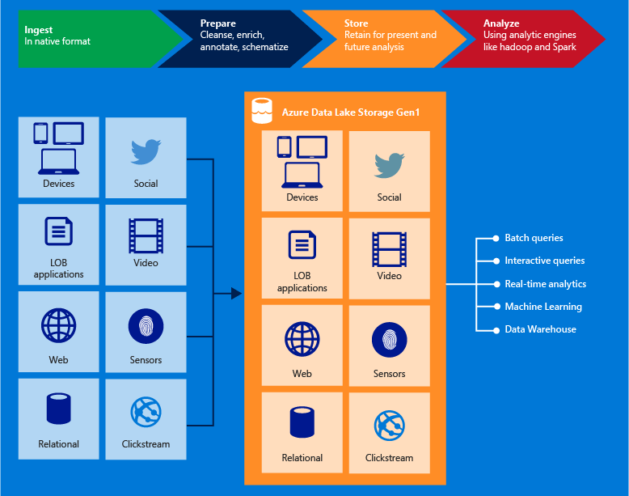

# Compare storage options for use with Azure HDInsight clusters

Azure HDInsight users can choose between a few different storage options when creating HDInsight clusters:

* Azure Data Lake Storage Gen2
* Azure Storage
* Azure Data Lake Storage Gen1

This article provides an overview of these different storage types and their unique features.

## Use Azure Data Lake Storage Gen2 with Apache Hadoop in Azure HDInsight

For more information on Azure Data Lake Storage Gen2, see [Introduction to Azure Data Lake Storage Gen2](/../storage/blobs/data-lake-storage-introduction.md).

Azure Data Lake Storage Gen2 takes core features from Azure Data Lake Storage Gen1 such as a Hadoop compatible file system, Azure Active Directory, and POSIX-based access control lists (ACLs) and integrates them into Azure Blob Storage. This combination allows you to take advantage of the performance of Azure Data Lake Storage Gen1 while also using Blob Storage’s tiering and data life-cycle management.

### Core functionality of Azure Data Lake Storage Gen2

* Hadoop compatible access: Azure Data Lake Storage Gen2 allows you to manage and access data just as you would with a Hadoop Distributed File System (HDFS). The Azure Blob Filesystem (ABFS) driver is available within all Apache Hadoop environments, including Azure HDInsight and Azure Databricks to access data stored in Data Lake Storage Gen2.

* A superset of POSIX permissions: The security model for Data Lake Gen2 supports ACL and POSIX permissions along with some extra granularity specific to Data Lake Storage Gen2. Settings may be configured through admin tools or frameworks like Apache Hive and Apache Spark.

* Cost effective: Data Lake Storage Gen2 offers low-cost storage capacity and transactions. Features such as Azure Blob storage lifecycle help lower costs by adjusting billing rates as data moves through its lifecycle.

* Works with Blob storage tools, frameworks, and apps: Data Lake Storage Gen2 continues to work with a wide array of tools, frameworks, and applications that exist today for Blob storage.

* Optimized driver: The ABFS driver is optimized specifically for big data analytics. The corresponding REST APIs are surfaced through the dfs endpoint, dfs.core.windows.net.

### What's new about Azure Data Lake Storage Gen 2

#### Managed identities for secure file access

Azure HDInsight uses managed identities to secure cluster access to files in Azure Data Lake Storage Gen2. Managed identities are a feature of Azure Active Directory that provides Azure services with a set of automatically managed credentials. These credentials can be used to authenticate to any service that supports AD authentication. Using managed identities doesn't require you to store credentials in code or configuration files.

For more information, see [What is managed identities for Azure resources](../active-directory/managed-identities-azure-resources/overview.md).

#### Azure Blob filesystem (ABFS) driver

Apache Hadoop applications natively expect to read and write data from local disk storage. A Hadoop filesystem driver like ABFS enables Hadoop applications to work with cloud storage by emulating regular Hadoop file system operations. The driver converts those commands received from the application into operations that the actual cloud storage platform understands.

Previously, the Hadoop filesystem driver would convert all filesystem operations to Azure Storage REST API calls on the client side and then invoke the REST API. This client-side conversion, however, resulted in multiple REST API calls for a single filesystem operation like a file rename. ABFS has moved some of the Hadoop filesystem logic from the client-side to the server-side and the Azure Data Lake Storage Gen2 API now runs in parallel with the Blob API. This migration improves performance because now common Hadoop filesystem operations can be executed with one REST API call.

For more information, see [The Azure Blob Filesystem driver (ABFS): A dedicated Azure Storage driver for Hadoop](/../storage/blobs/data-lake-storage-abfs-driver.md).

#### Azure Data Lake Storage Gen 2 URI scheme

Azure Data Lake Storage Gen2 uses a new URI scheme for accessing files in Azure storage from HDInsight:

`abfs[s]://<FILE_SYSTEM_NAME>@<ACCOUNT_NAME>.dfs.core.windows.net/<PATH>`

The URI scheme provides SSL encrypted access (`abfss://` prefix) and unencrypted access (`abfs://` prefix). We recommend using `abfss` wherever possible, even when accessing data that lives inside the same region in Azure.

`<FILE_SYSTEM_NAME>` identifies the path of the file system Data Lake Storage Gen2.

`<ACCOUNT_NAME>` identifies the Azure Storage account name. A fully qualified domain name (FQDN) is required.

The `<PATH>` is the file or directory HDFS path name.

If values for `<FILE_SYSTEM_NAME>` and `<ACCOUNT_NAME>` aren't specified, the default file system is used. For the files on the default file system, you can use a relative path or an absolute path. For example, the `hadoop-mapreduce-examples.jar` file that comes with HDInsight clusters can be referred to by using one of the following paths:

```
abfss://myfilesystempath@myaccount.dfs.core.windows.net/example/jars/hadoop-mapreduce-examples.jar
abfss:///example/jars/hadoop-mapreduce-examples.jar /example/jars/hadoop-mapreduce-examples.jar
```

> [!Note]
> The file name is `hadoop-examples.jar` in HDInsight versions 2.1 and 1.6 clusters. When working with files outside of HDInsight, most utilities do not recognize the ABFS format and instead expect a basic path format, such as `example/jars/hadoop-mapreduce-examples.jar`.

For more information, see [Use the Azure Data Lake Storage Gen2 URI](/../storage/blobs/data-lake-storage-introduction-abfs-uri.md).

## Use Azure storage

Azure storage is a robust, general-purpose storage solution that integrates seamlessly with HDInsight. HDInsight can use a blob container in Azure Storage as the default file system for the cluster. Through a Hadoop distributed file system (HDFS) interface, the full set of components in HDInsight can operate directly on structured or unstructured data stored as blobs.

> [!WARNING]  
> There are several options available when creating an Azure Storage account. The following table provides information on what options are supported with HDInsight:

| Storage account type | Supported services | Supported performance tiers | Supported access tiers |
|----------------------|--------------------|-----------------------------|------------------------|
| General-purpose V2   | Blob               | Standard                    | Hot, Cool, Archive*    |
| General-purpose V1   | Blob               | Standard                    | N/A                    |
| Blob storage         | Blob               | Standard                    | Hot, Cool, Archive*    |

We don't recommend that you use the default blob container for storing business data. Deleting the default blob container after each use to reduce storage cost is a good practice. The default container contains application and system logs. Make sure to retrieve the logs before deleting the container.

Using one blob container as the default file system for multiple clusters is not supported.
 
 > [!NOTE]  
 > The Archive access tier is an offline tier that has a several hour retrieval latency and is not recommended for use with HDInsight. For more information, see [Archive access tier](/../storage/blobs/storage-blob-storage-tiers.md#archive-access-tier).

### HDInsight storage architecture
The following diagram provides an abstract view of the HDInsight storage architecture of using Azure Storage:


HDInsight provides access to the distributed file system that is locally attached to the compute nodes. This file system can be accessed by using the fully qualified URI, for example:

    hdfs://<namenodehost>/<path>

In addition, HDInsight allows you to access data that is stored in Azure Storage. The syntax is:

    wasb[s]://<containername>@<accountname>.blob.core.windows.net/<path>

Here are some considerations when using Azure Storage account with HDInsight clusters.

* **Containers in the storage accounts that are connected to a cluster:** Because the account name and key are associated with the cluster during creation, you have full access to the blobs in those containers.

* **Public containers or public blobs in storage accounts that are NOT connected to a cluster:** You have read-only permission to the blobs in the containers.
  
  > [!NOTE]  
  > Public containers allow you to get a list of all blobs that are available in that container and get container metadata. Public blobs allow you to access the blobs only if you know the exact URL. For more information, see [Manage access to containers and blobs](/../storage/blobs/storage-manage-access-to-resources.md).

* **Private containers in storage accounts that are NOT connected to a cluster:** You can't access the blobs in the containers unless you define the storage account when you submit the WebHCat jobs. This is explained later in this article.

The storage accounts that are defined in the creation process and their keys are stored in %HADOOP_HOME%/conf/core-site.xml on the cluster nodes. The default behavior of HDInsight is to use the storage accounts defined in the core-site.xml file. You can modify this setting using [Apache Ambari](./hdinsight-hadoop-manage-ambari.md).

Multiple WebHCat jobs, including Apache Hive, MapReduce, Apache Hadoop streaming, and Apache Pig, can carry a description of storage accounts and metadata with them. (This currently works for Pig with storage accounts, but not for metadata.) For more information, see [Using an HDInsight Cluster with Alternate Storage Accounts and Metastores](https://social.technet.microsoft.com/wiki/contents/articles/23256.using-an-hdinsight-cluster-with-alternate-storage-accounts-and-metastores.aspx).

Blobs can be used for structured and unstructured data. Blob containers store data as key/value pairs, and there is no directory hierarchy. However the slash character ( / ) can be used within the key name to make it appear as if a file is stored within a directory structure. For example, a blob's key may be `input/log1.txt`. No actual `input` directory exists, but due to the presence of the slash character in the key name, it has the appearance of a file path.

### <a id="benefits"></a>Benefits of Azure Storage
The implied performance cost of not co-locating compute clusters and storage resources is mitigated by the way the compute clusters are created close to the storage account resources inside the Azure region, where the high-speed network makes it efficient for the compute nodes to access the data inside Azure storage.

There are several benefits associated with storing the data in Azure storage instead of HDFS:

* **Data reuse and sharing:** The data in HDFS is located inside the compute cluster. Only the applications that have access to the compute cluster can use the data by using HDFS APIs. The data in Azure storage can be accessed either through the HDFS APIs or through the Blob Storage REST APIs. Thus, a larger set of applications (including other HDInsight clusters) and tools can be used to produce and consume the data.
* **Data archiving:** Storing data in Azure storage enables the HDInsight clusters used for computation to be safely deleted without losing user data.
* **Data storage cost:** Storing data in DFS for the long term is more costly than storing the data in Azure storage because the cost of a compute cluster is higher than the cost of Azure storage. In addition, because the data does not have to be reloaded for every compute cluster generation, you're also saving data loading costs.
* **Elastic scale-out:** Although HDFS provides you with a scaled-out file system, the scale is determined by the number of nodes that you create for your cluster. Changing the scale can become a more complicated process than relying on the elastic scaling capabilities that you get automatically in Azure storage.
* **Geo-replication:** Your Azure storage can be geo-replicated. Although this gives you geographic recovery and data redundancy, a failover to the geo-replicated location severely impacts your performance, and it may incur additional costs. So our recommendation is to choose the geo-replication wisely and only if the value of the data is worth the additional cost.

Certain MapReduce jobs and packages may create intermediate results that you don't really want to store in Azure storage. In that case, you can elect to store the data in the local HDFS. In fact, HDInsight uses DFS for several of these intermediate results in Hive jobs and other processes.

> [!NOTE]  
> Most HDFS commands (for example, `ls`, `copyFromLocal` and `mkdir`) still work as expected. Only the commands that are specific to the native HDFS implementation (which is referred to as DFS), such as `fschk` and `dfsadmin`, show different behavior in Azure storage.

## Use Azure Data Lake Storage Gen1

For more information on Azure Data Lake Storage Gen1, see [Overview of Azure Data Lake Storage Gen1](/../data-lake-store/data-lake-store-overview.md).

Azure Data Lake Storage Gen1 is an enterprise-wide hyper-scale repository for big data analytic workloads. Azure Data Lake enables you to capture data of any size, type, and ingestion speed in one single place for operational and exploratory analytics.

Data Lake Storage Gen1 can be accessed from Hadoop (available with an HDInsight cluster) using the WebHDFS-compatible REST APIs. It is designed to enable analytics on the stored data and is tuned for performance for data analytics scenarios. Out of the box, it includes all the enterprise-grade capabilities—security, manageability, scalability, reliability, and availability—essential for real-world enterprise use cases.



Some of the key capabilities of Data Lake Storage Gen1 include the following.

### Built for Hadoop

Data Lake Storage Gen1 is an Apache Hadoop file system compatible with Hadoop Distributed File System (HDFS) and works with the Hadoop ecosystem.  Your existing HDInsight applications or services that use the WebHDFS API can easily integrate with Data Lake Storage Gen1. Data Lake Storage Gen1 also exposes a WebHDFS-compatible REST interface for applications

Data stored in Data Lake Storage Gen1 can be easily analyzed using Hadoop analytic frameworks such as MapReduce or Hive. Microsoft Azure HDInsight clusters can be provisioned and configured to directly access data stored in Data Lake Storage Gen1.

### Unlimited storage, petabyte files

Data Lake Storage Gen1 provides unlimited storage and is suitable for storing a variety of data for analytics. It does not impose any limits on account sizes, file sizes, or the amount of data that can be stored in a data lake. Individual files can range from kilobyte to petabytes in size making it a great choice to store any type of data. Data is stored durably by making multiple copies and there is no limit on the duration of time for which the data can be stored in the data lake.

### Performance-tuned for big data analytics

Data Lake Storage Gen1 is built for running large scale analytic systems that require massive throughput to query and analyze large amounts of data. The data lake spreads parts of a file over a number of individual storage servers. This improves the read throughput when reading the file in parallel for performing data analytics.

### Enterprise-ready: Highly available and secure

Data Lake Storage Gen1 provides industry-standard availability and reliability. Your data assets are stored durably by making redundant copies to guard against any unexpected failures. Enterprises can use Data Lake Storage Gen1 in their solutions as an important part of their existing data platform.

Data Lake Storage Gen1 also provides enterprise-grade security for the stored data. For more information, see [Securing data in Azure Data Lake Storage Gen1](#DataLakeStoreSecurity).

### All Data

Data Lake Storage Gen1 can store any data in their native format, as is, without requiring any prior transformations. Data Lake Storage Gen1 does not require a schema to be defined before the data is loaded, leaving it up to the individual analytic framework to interpret the data and define a schema at the time of the analysis. Being able to store files of arbitrary sizes and formats makes it possible for Data Lake Storage Gen1 to handle structured, semi-structured, and unstructured data.

Data Lake Storage Gen1 containers for data are essentially folders and files. You operate on the stored data using SDKs, Azure portal, and Azure Powershell. As long as you put your data into the store using these interfaces and using the appropriate containers, you can store any type of data. Data Lake Storage Gen1 does not perform any special handling of data based on the type of data it stores.

## <a name="DataLakeStoreSecurity"></a>Securing data in Data Lake Storage Gen1
Data Lake Storage Gen1 uses Azure Active Directory for authentication and access control lists (ACLs) to manage access to your data.

| Feature | Description |
| --- | --- |
| Authentication |Data Lake Storage Gen1 integrates with Azure Active Directory (AAD) for identity and access management for all the data stored in Data Lake Storage Gen1. As a result of the integration, Data Lake Storage Gen1 benefits from all AAD features including multi-factor authentication, conditional access, role-based access control, application usage monitoring, security monitoring and alerting, etc. Data Lake Storage Gen1 supports the OAuth 2.0 protocol for authentication with in the REST interface. See [Data Lake Storage Gen1 authentication](/../data-lake-store/data-lakes-store-authentication-using-azure-active-directory.md)|
| Access control |Data Lake Storage Gen1 provides access control by supporting POSIX-style permissions exposed by the WebHDFS protocol. ACLs can be enabled on the root folder, on subfolders, and on individual files. For more information on how ACLs work in context of Data Lake Storage Gen1, see [Access control in Data Lake Storage Gen1](/../data-lake-store/data-lake-store-access-control.md). |
| Encryption |Data Lake Storage Gen1 also provides encryption for data that is stored in the account. You specify the encryption settings while creating a Data Lake Storage Gen1 account. You can chose to have your data encrypted or opt for no encryption. For more information, see [Encryption in Data Lake Storage Gen1](/../data-lake-store/data-lake-store-encryption.md). For instructions on how to provide encryption-related configuration, see [Get started with Azure Data Lake Storage Gen1 using the Azure portal](/../data-lake-store/data-lake-store-get-started-portal.md). |

Want to learn more about securing data in Data Lake Storage Gen1? Follow the links below.

* For instructions on how to secure data in Data Lake Storage Gen1, see [Securing data in Azure Data Lake Storage Gen1](/../data-lake-store/data-lake-store-secure-data.md).

## Applications compatible with Data Lake Storage Gen1
Data Lake Storage Gen1 is compatible with most open-source components in the Hadoop ecosystem. It also integrates nicely with other Azure services.  Follow the links below to learn more about how Data Lake Storage Gen1 can be used both with open-source components as well as other Azure services.

* See [Applications and services compatible with Azure Data Lake Storage Gen1](/../data-lake-store/data-lake-store-compatible-oss-other-applications.md) for a list of open-source applications interoperable with Data Lake Storage Gen1.
* See [Integrating with other Azure services](/../data-lake-store/data-lake-store-integrate-with-other-services.md) to understand how Data Lake Storage Gen1 can be used with other Azure services to enable a wider range of scenarios.
* See [Scenarios for using Data Lake Storage Gen1](/../data-lake-store/data-lake-store-data-scenarios.md) to learn how to use Data Lake Storage Gen1 in scenarios such as ingesting data, processing data, downloading data, and visualizing data.

## What is Data Lake Storage Gen1 file system (adl://)?
Data Lake Storage Gen1 can be accessed via the new filesystem, the AzureDataLakeFilesystem (adl://), in Hadoop environments (available with HDInsight cluster). Applications and services that use adl:// are able to take advantage of further performance optimization that are not currently available in WebHDFS. As a result, Data Lake Storage Gen1 gives you the flexibility to either avail the best performance with the recommended option of using adl:// or maintain existing code by continuing to use the WebHDFS API directly. Azure HDInsight fully leverages the AzureDataLakeFilesystem to provide the best performance on Data Lake Storage Gen1.

You can access your data in Data Lake Storage Gen1 using `adl://<data_lake_storage_gen1_name>.azuredatalakestore.net`. For more information on how to access the data in Data Lake Storage Gen1, see [View properties of the stored data](/../data-lake-store/data-lake-store-get-started-portal.md#properties)


## Next steps

* [Introduction to Azure Data Lake Storage Gen2](/../storage/blobs/data-lake-storage-introduction.md).
* [Introduction to Azure Storage](/../storage/common/storage-introduction.md)