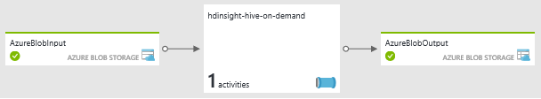
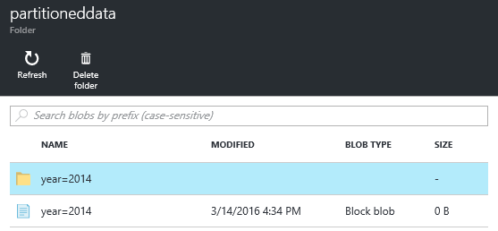
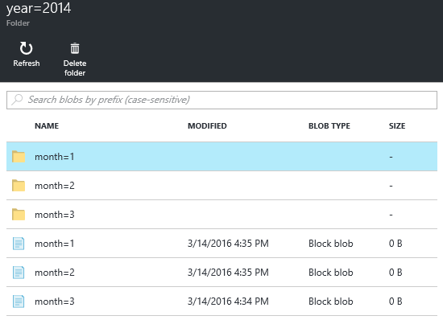

<properties
   pageTitle="Create on demand Linux-based Hadoop clusters in HDInsight using Azure Data Factory | Microsoft Azure"
   	description="Learn how to create on demand HDInsight clusters using Azure Data Factory."
   services="hdinsight"
   documentationCenter=""
   tags="azure-portal"
   authors="mumian"
   manager="paulettm"
   editor="cgronlun"/>

<tags
   ms.service="hdinsight"
   ms.devlang="na"
   ms.topic="article"
   ms.tgt_pltfrm="na"
   ms.workload="big-data"
   ms.date="05/18/2016"
   ms.author="jgao"/>

# Create on-demand Linux-based Hadoop clusters in HDInsight using Azure Data Factory

[AZURE.INCLUDE [selector](../../includes/hdinsight-selector-create-clusters.md)]

[Azure Data Factory](../data-factory/data-factory-introduction.md) is a cloud-based data integration service that orchestrates and automates the movement and transformation of data. In this article, you will learn how to Azure Data Factory to create an [Azure HDInsight on-demand linked service](../data-factory/data-factory-compute-linked-services.md#azure-hdinsight-on-demand-linked-service), and use the cluster to run a Hive job. Here is the high level flow:

1. Create an HDInsight cluster on demand.
2. Run an Hive job to read raw web log data from a source blob storage account, transform the data, and the write the output to a destination blob storage account. 
3. Delete the cluster based on the time-to-live setting.

The Hive activity defined in the data factory pipeline calls a predefined HiveQL script. The script creates an external table that references the raw web log data stored in Azure Blob storage and then partitions the raw data by year and month.

Here are the sample rows for each month in the input file.

    2014-01-01,02:01:09,SAMPLEWEBSITE,GET,/blogposts/mvc4/step2.png,X-ARR-LOG-ID=2ec4b8ad-3cf0-4442-93ab-837317ece6a1,80,-,1.54.23.196,Mozilla/5.0+(Windows+NT+6.3;+WOW64)+AppleWebKit/537.36+(KHTML,+like+Gecko)+Chrome/31.0.1650.63+Safari/537.36,-,http://weblogs.asp.net/sample/archive/2007/12/09/asp-net-mvc-framework-part-4-handling-form-edit-and-post-scenarios.aspx,\N,200,0,0,53175,871 
    2014-02-01,02:01:10,SAMPLEWEBSITE,GET,/blogposts/mvc4/step7.png,X-ARR-LOG-ID=d7472a26-431a-4a4d-99eb-c7b4fda2cf4c,80,-,1.54.23.196,Mozilla/5.0+(Windows+NT+6.3;+WOW64)+AppleWebKit/537.36+(KHTML,+like+Gecko)+Chrome/31.0.1650.63+Safari/537.36,-,http://weblogs.asp.net/sample/archive/2007/12/09/asp-net-mvc-framework-part-4-handling-form-edit-and-post-scenarios.aspx,\N,200,0,0,30184,871
    2014-03-01,02:01:10,SAMPLEWEBSITE,GET,/blogposts/mvc4/step7.png,X-ARR-LOG-ID=d7472a26-431a-4a4d-99eb-c7b4fda2cf4c,80,-,1.54.23.196,Mozilla/5.0+(Windows+NT+6.3;+WOW64)+AppleWebKit/537.36+(KHTML,+like+Gecko)+Chrome/31.0.1650.63+Safari/537.36,-,http://weblogs.asp.net/sample/archive/2007/12/09/asp-net-mvc-framework-part-4-handling-form-edit-and-post-scenarios.aspx,\N,200,0,0,30184,871

The script creates three output folders based on the previous input. Each folder contains a file with entries from each month.

    adfgetstarted/partitioneddata/year=2014/month=1/000000_0
    adfgetstarted/partitioneddata/year=2014/month=2/000000_0
    adfgetstarted/partitioneddata/year=2014/month=3/000000_0

For a list of Data Factory data transformation activities in addition to Hive activity, see [Transform and analyze using Azure Data Factory](../data-factory/data-factory-data-transformation-activities.md).

There are many benefits with using HDInsight with Data factory:

- HDInsight clusters billing is pro-rated per minute, whether you are using them or not. Using Data Factory, the clusters are created on demand. And the clusters are deleted automatically when the jobs are completed.  So you only pay for the job running time and the brief idle time (time-to-live).
- You can create a workflow using Data Factory pipeline.
- You can schedule recursive jobs .  

##Prerequisites:

Before you begin the instructions in this article, you must have the following:

- [Azure subscription](https://azure.microsoft.com/documentation/videos/get-azure-free-trial-for-testing-hadoop-in-hdinsight/).
- Azure CLI or Azure PowerShell. 

    [AZURE.INCLUDE [use-latest-version](../../includes/hdinsight-use-latest-powershell-and-cli.md)]

##Prepare storage account

You can use up to three storage accounts in this scenario:

- default storage account for the HDInsight cluster
- storage account for the input data
- storage account for the output data

To simplify the tutorial, you will use one storage account to serve the 3 purposes. The Azure CLI and Azure PowerShell sample script found in this section perform the following:

1. Login to Azure.
2. Create an Azure resource group.
3. Create an Azure Storage account.
4. Create a Blob container on the storage account
5. Copy the following two files to the Blob container:

    - Input data file: [https://hditutorialdata.blob.core.windows.net/adfhiveactivity/inputdata/input.log](https://hditutorialdata.blob.core.windows.net/adfhiveactivity/inputdata/input.log)
    - HiveQL script: [https://hditutorialdata.blob.core.windows.net/adfhiveactivity/script/partitionweblogs.hql](https://hditutorialdata.blob.core.windows.net/adfhiveactivity/script/partitionweblogs.hql)

    Both files are stored in a public Blob container. 

>[AZURE.IMPORTANT] Write down the resource group name, the storage account name and the storage account key used in your script.  You will need them in the next section.

**To prepare the storage and copy the files using Azure CLI**

    azure login
    
    azure config mode arm

    azure group create --name "<Azure Resource Group Name>" --location "East US 2"

    azure storage account create --resource-group "<Azure Resource Group Name>" --location "East US 2" --type "LRS" <Azure Storage Account Name>

    azure storage account keys list --resource-group "<Azure Resource Group Name>" "<Azure Storage Account Name>"
    azure storage container create "adfgetstarted" --account-name "<Azure Storage AccountName>" --account-key "<Azure Storage Account Key>"

    azure storage blob copy start "https://hditutorialdata.blob.core.windows.net/adfhiveactivity/inputdata/input.log" --dest-account-name "<Azure Storage Account Name>" --dest-account-key "<Azure Storage Account Key>" --dest-container "adfgetstarted" 
    azure storage blob copy start "https://hditutorialdata.blob.core.windows.net/adfhiveactivity/script/partitionweblogs.hql" --dest-account-name "<Azure Storage Account Name>" --dest-account-key "<Azure Storage Account Key>" --dest-container "adfgetstarted" 

The container name is *adfgetstarted*.  Please keep it as it is. Otherwise you will need to update the ARM template.

If you need help with this CLI script, see [Using the Azure CLI with Azure Storage](../storage/storage-azure-cli.md).

**To prepare the storage and copy the files using Azure PowerShell**

    $resourceGroupName = "<Azure Resource Group Name>"
    $storageAccountName = "<Azure Storage Account Name>"
    $location = "East US 2"

    $sourceStorageAccountName = "hditutorialdata"  
    $sourceContainerName = "adfhiveactivity"

    $destStorageAccountName = $storageAccountName
    $destContainerName = "adfgetstarted" # don't change this value.

    ####################################
    # Connect to Azure
    ####################################
    #region - Connect to Azure subscription
    Write-Host "`nConnecting to your Azure subscription ..." -ForegroundColor Green
    try{Get-AzureRmContext}
    catch{Login-AzureRmAccount}
    #endregion

    ####################################
    # Create a resource group, storage, and container
    ####################################

    #region - create Azure resources
    Write-Host "`nCreating resource group, storage account and blob container ..." -ForegroundColor Green

    New-AzureRmResourceGroup -Name $resourceGroupName -Location $location 
    New-AzureRmStorageAccount `
        -ResourceGroupName $resourceGroupName `
        -Name $destStorageAccountName `
        -type Standard_LRS `
        -Location $location 

    $destStorageAccountKey = (Get-AzureRmStorageAccountKey `
        -ResourceGroupName $resourceGroupName `
        -Name $destStorageAccountName)[0].Value

    $sourceContext = New-AzureStorageContext `
        -StorageAccountName $sourceStorageAccountName `
        -Anonymous
    $destContext = New-AzureStorageContext `
        -StorageAccountName $destStorageAccountName `
        -StorageAccountKey $destStorageAccountKey

    New-AzureStorageContainer -Name $destContainerName -Context $destContext
    #endregion

    ####################################
    # Copy files
    ####################################
    #region - copy files
    Write-Host "`nCopying files ..." -ForegroundColor Green

    $blobs = Get-AzureStorageBlob `
        -Context $sourceContext `
        -Container $sourceContainerName 

    $blobs|Start-AzureStorageBlobCopy `
        -DestContext $destContext `
        -DestContainer $destContainerName

    Write-Host "`nCopied files ..." -ForegroundColor Green
    Get-AzureStorageBlob -Context $destContext -Container $destContainerName 
    #endregion

    Write-host "`nYou will use the following values:" -ForegroundColor Green
    write-host "`nResource group name: $resourceGroupName"
    Write-host "Storage Account Name: $destStorageAccountName"
    write-host "Storage Account Key: $destStorageAccountKey"

    Write-host "`nScript completed" -ForegroundColor Green

If you need help with this PowerShell script, see [Using the Azure PowerShell with Azure Storage](../storage/storage-powershell-guide-full.md).

**To examine the storage account and the contents**

1. Sign on to the [Azure portal](https://portal.azure.com).
2. Click **Resource groups** on the left pane.
3. Double-click the resource group name you created in your CLI or PowerShell script. Use the filter if you have too many resource groups listed. 
4. On the **Resources** tile, you shall have one resource listed unless you share the resource group with other projects. That is the storage account with the name you specified earlier. Click the storage account name.
5. Click the **Blobs** tiles.
6. Click the **adfgetstarted** container. You will see two folders: **input data** and **script**.
7. Open the folder and check the files in the folders.
 
## Create data factory

With the storage account, the input data, and the HiveQL script prepared, you are ready to create an Azure data factory. There are several methods for creating data factory. You will use the Azure portal to call a custom ARM template in this tutorial. You can also call the ARM template from [Azure CLI](../resource-group-template-deploy.md#deploy-with-azure-cli-for-mac-linux-and-windows) and [Azure PowerShell](../resource-group-template-deploy.md#deploy-with-powershell). For other data factory creation methods, see [Tutorial: Build your first data factory](../data-factory/data-factory-build-your-first-pipeline.md).

The top level ARM template contains:

    {
        "contentVersion": "1.0.0.0",
        "$schema": "http://schema.management.azure.com/schemas/2015-01-01/deploymentTemplate.json#",
        "parameters": { ...
        },
        "variables": { ...
        },
        "resources": [
            {
                "name": "[parameters('dataFactoryName')]",
                "apiVersion": "[variables('apiVersion')]",
                "type": "Microsoft.DataFactory/datafactories",
                "location": "westus",
                "resources": [
                    { ... },
                    { ... },
                    { ... },
                    { ... }
                ]
            }
        ]
    }

It contains one data factory resource called *hdinsight-hive-on-demand* (The name is not shown on the screenshot). Data factory is currently only supported in the West US region and the North Europe region. 

The *hdinsight-hive-on-demand* resource contains 4 resources:

- A linkedservice to the storage account that will be used as the default HDInsight storage account, input data storage, and output data storage.
- A linkedservice to the HDInsight cluster to be created:

        {
            "dependsOn": [ ... ],
            "type": "linkedservices",
            "name": "[variables('hdInsightOnDemandLinkedServiceName')]",
            "apiVersion": "[variables('apiVersion')]",
            "properties": {
                "type": "HDInsightOnDemand",
                "typeProperties": {
                    "osType": "linux",
                    "version": "3.2",
                    "clusterSize": 1,
                    "sshUserName": "myuser",                            
                    "sshPassword": "MyPassword!",
                    "timeToLive": "00:30:00",
                    "linkedServiceName": "[variables('storageLinkedServiceName')]"
                }
            }
        },

    Even though it is not specified, the cluster is created in the same region as the storage account.
    
    Notice the *timeToLive* setting. The data factory deletes the cluster automatically after the cluster is being idle for 30 minutes.
- A dataset for the input data. The file name and the folder name are defined here:

        "fileName": "input.log",
        "folderPath": "adfgetstarted/inputdata",
        
- A dataset for the output data, and then pipeline for the data processing. The output path is defined here:
        
        "folderPath": "adfgetstarted/partitioneddata",

    The [dataset availability](../data-factory/data-factory-create-datasets.md#Availability) setting is as follows:
    
        "availability": {
            "frequency": "Month",
            "interval": 1,
            "style": "EndOfInterval"
        },

    In Azure Data Factory, output dataset availability drives the pipeline. This means the slice is produced monthly on the last day of month. For more information, see [Data Factory Scheduling and Execution](../data-factory/data-factory-scheduling-and-execution.md).

    The pipeline definition is as follows:
    
        {
            "dependsOn": [ ... ],
            "type": "datapipelines",
            "name": "[parameters('dataFactoryName')]",
            "apiVersion": "[variables('apiVersion')]",
            "properties": {
                "description": "Azure Data Factory pipeline with an Hadoop Hive activity",
                "activities": [
                    { ...}
                ],
                "start": "2016-01-01T00:00:00Z",
                "end": "2016-01-31T00:00:00Z",
                "isPaused": false
            }
        }
                
    It contains one activity. Both *start* and *end* of the activity have a past date, which means there will be only one slice. If the end is a future date, the data factory will create another slice when the times comes. For more information, see [Data Factory Scheduling and Execution](../data-factory/data-factory-scheduling-and-execution.md).

    The following is the activity definition:
    
        "activities": [
            {
                "type": "HDInsightHive",
                "typeProperties": {
                    "scriptPath": "adfgetstarted/script/partitionweblogs.hql",
                    "scriptLinkedService": "[variables('storageLinkedServiceName')]",
                    "defines": {
                        "inputtable": "[concat('wasbs://adfgetstarted@', parameters('storageAccountName'), '.blob.core.windows.net/inputdata')]",
                        "partitionedtable": "[concat('wasbs://adfgetstarted@', parameters('storageAccountName'), '.blob.core.windows.net/partitioneddata')]"
                    }
                },
                "inputs": [
                    {
                        "name": "AzureBlobInput"
                    }
                ],
                "outputs": [
                    {
                        "name": "AzureBlobOutput"
                    }
                ],
                "policy": {
                    "concurrency": 1,
                    "retry": 3
                },
                "name": "RunSampleHiveActivity",
                "linkedServiceName": "HDInsightOnDemandLinkedService"
            }
        ],
    
    The inputs, outputs and the script path are defined.
    
**To create a data factory**

1. Click the following image to sign in to Azure and open the ARM template in the Azure Portal. The template is located at https://hditutorialdata.blob.core.windows.net/adfhiveactivity/data-factory-hdinsight-on-demand.json. 

    

2. Enter **DATAFACTORYNAME**, **STORAGEACCOUNTNAME** and **STORAGEACCOUNTKEY** for the account you created in the last section, and then click **OK**. Data Factory Name must be globally unique.
3. In **Resource Group**, select the same resource group you used in the last section.
4. Click **Legal terms**, and then click **Create**.
5. Click **Create**. You will see a tile on the Dashboard called **Deploying Template deployment**. Wait until the tile text is changed to the resource group name. It usually takes about 20 minutes to create an HDInsight cluster.
6. Click the tile to open the resource group. Now you shall see one more data factory resource listed in addition to the storage account resource.
7. Click **hdinsight-hive-on-demand**.
8. Click the **Diagram** tile. The diagram shows one activity with an input dataset, and an output dataset:

    
    
    The names are defined in the ARM template.
9. Dould-click **AzureBlobOutput**.
10. On the **Recent updated slices**, you shall see one slice. If the status is **In progress**, wait until it is changed to **Ready**.

**To check the data factory output**

1. Use the same procedure in the last session to check the contain of the adfgetstarted container. There are two new containers in addition to **adfgetsarted**:

    - adfhdinsight-hive-on-demand-hdinsightondemandlinked-xxxxxxxxxxxxx: This is the default container for the HDInsight cluster. Default container name follows the pattern:  "adf>yourdatafactoryname>-linkedservicename-datetimestamp". 
    - adfjobs: This is the container for the ADF job logs.
    
    The data factory output is stored in afgetstarted as you configured in the ARM template. 
2. Click **adfgetstarted**.
3. Double-click **partitioneddata**. You will see a **year=2014** folder because all the web logs are dated in year 2014. 

    

    If you drill down the list, you shall see 3 folders for January, February, and March. And there is a log for each month.

    

##Clean up the tutorial

With on-demand HDInsight linked service, an HDInsight cluster is created every time a slice needs to be processed unless there is an existing live cluster (timeToLive); and the cluster is deleted when the processing is done. For each cluster, Azure Data Factory creates an Azure blob storage used as the default file system for the cluster.  Even though HDInsight cluster is deleted, the default blob storage container and the associated storage account are not deleted. This is by design. As more and more slices are processed, you will see a lot of containers in your Azure blob storage. If you do not need them for troubleshooting of the jobs, you may want to delete them to reduce the storage cost. The name of these containers follow a pattern: "adfyourdatafactoryname-linkedservicename-datetimestamp". 

[Azure Resource Manager](../resource-group-overview.md) is used to deploy, manage and monitor your solution as a group.  Deleting a resource group will delete all the components inside the group.  

**To delete the resource group**

1. Sign on to the [Azure portal](https://portal.azure.com).
2. Click **Resource groups** on the left pane.
3. Double-click the resource group name you created in your CLI or PowerShell script. Use the filter if you have too many resource groups listed. It opens the resource group ina  new blade.
4. On the **Resources** tile, you shall have the default storage account and the data factory listed unless you share the resource group with other projects.
5. Click **Delete** on top the of the blade. Doing so, you will also delete the storage account and the data stored in the storage account.
6. Enter the resource group name, and then click **Delete**.

In case you don't want to delete the storage account when you delete the resource group, you can consider the following architecture design by separating the business data from the default storage account. In this case, you will have one resource group for the storage account with the business data, and the other resource group for the default storage account and the data factory.  When you delete the second resource group, it will not impact the business data storage account.  To do so: 

- Add the following to the top level resource group along with the Microsoft.DataFactory/datafactories resource in your ARM template. It will create a new storage account:

        {
            "name": "[parameters('defaultStorageAccountName')]",
            "type": "Microsoft.Storage/storageAccounts",
            "location": "[parameters('location')]",
            "apiVersion": "[variables('defaultApiVersion')]",
            "dependsOn": [ ],
            "tags": {

            },
            "properties": {
                "accountType": "Standard_LRS"
            }
        },

- Add a new linked service point to the new storage account:

        {
            "dependsOn": [ "[concat('Microsoft.DataFactory/dataFactories/', parameters('dataFactoryName'))]" ],
            "type": "linkedservices",
            "name": "[variables('defaultStorageLinkedServiceName')]",
            "apiVersion": "[variables('apiVersion')]",
            "properties": {
                "type": "AzureStorage",
                "typeProperties": {
                    "connectionString": "[concat('DefaultEndpointsProtocol=https;AccountName=',parameters('defaultStorageAccountName'),';AccountKey=',listKeys(resourceId('Microsoft.Storage/storageAccounts', variables('defaultStorageAccountName')), variables('defaultApiVersion')).key1)]"
                }
            }
        },
    
- Configure the HDInsight ondemand linked service with an additional dependsOn and an additionalLinkedServiceNames:

        {
            "dependsOn": [
                "[concat('Microsoft.DataFactory/dataFactories/', parameters('dataFactoryName'))]",
                "[concat('Microsoft.DataFactory/dataFactories/', parameters('dataFactoryName'), '/linkedservices/', variables('defaultStorageLinkedServiceName'))]",
                "[concat('Microsoft.DataFactory/dataFactories/', parameters('dataFactoryName'), '/linkedservices/', variables('storageLinkedServiceName'))]"
                
            ],
            "type": "linkedservices",
            "name": "[variables('hdInsightOnDemandLinkedServiceName')]",
            "apiVersion": "[variables('apiVersion')]",
            "properties": {
                "type": "HDInsightOnDemand",
                "typeProperties": {
                    "osType": "linux",
                    "version": "3.2",
                    "clusterSize": 1,
                    "sshUserName": "myuser",                            
                    "sshPassword": "MyPassword!",
                    "timeToLive": "00:30:00",
                    "linkedServiceName": "[variables('storageLinkedServiceName')]",
                    "additionalLinkedServiceNames": "[variables('defaultStorageLinkedServiceName')]"
                }
            }
        },            

##Next steps
In this article, you have learned how to use Azure Data Factory to create on-demand HDInsight cluster to process Hive jobs. To read more:

- [Hadoop tutorial: Get started using Linux-based Hadoop in HDInsight](hdinsight-hadoop-linux-tutorial-get-started.md)
- [Create Linux-based Hadoop clusters in HDInsight](hdinsight-hadoop-provision-linux-clusters.md)
- [HDInsight documentation](https://azure.microsoft.com/documentation/services/hdinsight/)
- [Data factory documentation](https://azure.microsoft.com/documentation/services/data-factory/)

