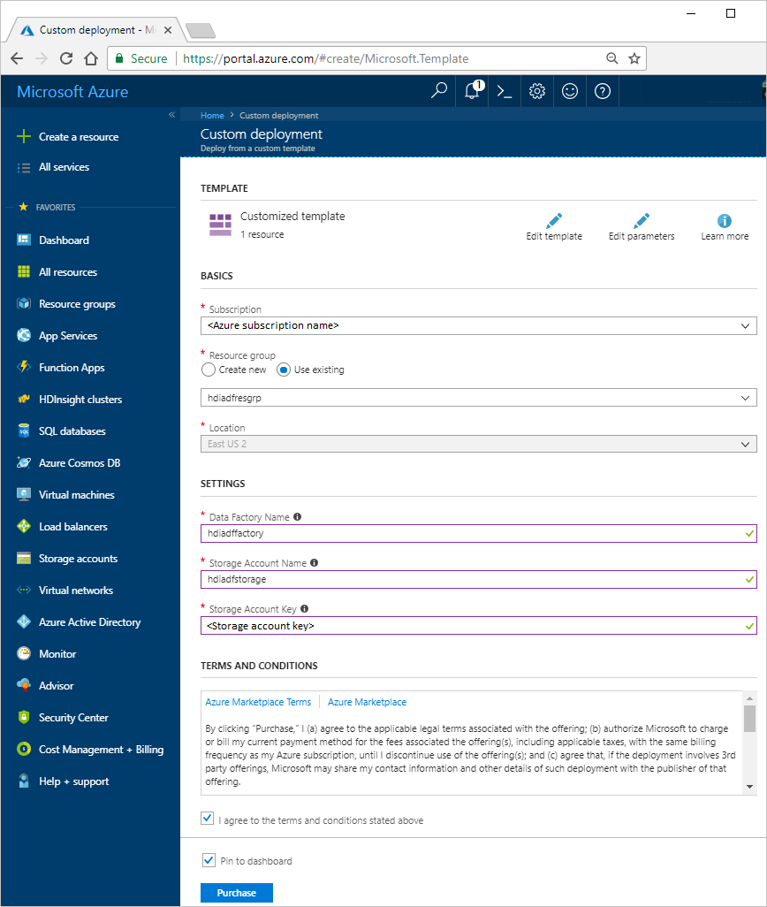

# Tutorial: Create on-demand Hadoop clusters in HDInsight using Azure Data Factory
[!INCLUDE [selector](../../includes/hdinsight-create-linux-cluster-selector.md)]

In this article, you learn how to create a Hadoop cluster, on demand, in Azure HDInsight using Azure Data Factory. You then use data pipelines in Azure Data Factory to run Hive jobs and delete the cluster. By the end of this tutorial, you learn how to operationalize a big data job run where cluster creation, job run, and cluster deletion is performed on a schedule.

This tutorial covers the following tasks: 

> [!div class="checklist"]
> * Create an Azure storage account
> * Understand Azure Data Factory activity
> * Create a data factory using Resource Manager template
> * Create a table in Azure SQL database
> * Use Sqoop to export data to Azure SQL database

If you don't have an Azure subscription, [create a free account](https://azure.microsoft.com/free/) before you begin.

## Prerequisites

* Azure PowerShell. For instructions, see [Install and configure Azure PowerShell](https://docs.microsoft.com/powershell/azure/install-azurerm-ps?view=azurermps-5.7.0).

## Create an Azure storage account

In this tutorial, you need three different storage locations:

- A default storage account for the HDInsight cluster
- A storage location for the input data
- A storage location for the output data

Instead of creating three different storage accounts for each of the above requirements, you use just one storage account in this tutorial. You then use different folders in the storage account to serve different purposes. You use an Azure PowerShell script to create the storage account and the folders within it. 

The Azure PowerShell sample script in this section performs the following tasks:

1. Logs in to Azure.
2. Creates an Azure resource group.
3. Creates an Azure Storage account.
4. Creates a Blob container in the storage account
5. Copies the following files to the Blob container:

   * Input data file: [https://hditutorialdata.blob.core.windows.net/adfhiveactivity/inputdata/input.log](https://hditutorialdata.blob.core.windows.net/adfhiveactivity/inputdata/input.log)
   * HiveQL script: [https://hditutorialdata.blob.core.windows.net/adfhiveactivity/script/partitionweblogs.hql](https://hditutorialdata.blob.core.windows.net/adfhiveactivity/script/partitionweblogs.hql)

    These files are already available in another public Blob container. The PowerShell script below makes a copy of these files into the Azure Storage account it creates. These files are required later in this tutorial.


**To create a storage account and copy the files using Azure PowerShell:**
> [!IMPORTANT]
> Specify names for the Azure resource group and the Azure storage account that will be created by the script.
> Write down **resource group name**, **storage account name**, and **storage account key** outputted by the script. You need them in the next section.

```powershell
$resourceGroupName = "<Azure Resource Group Name>"
$storageAccountName = "<Azure Storage Account Name>"
$location = "East US 2"

$sourceStorageAccountName = "hditutorialdata"  
$sourceContainerName = "adfhiveactivity"

$destStorageAccountName = $storageAccountName
$destContainerName = "adfgetstarted" # don't change this value.

####################################
# Connect to Azure
####################################
#region - Connect to Azure subscription
Write-Host "`nConnecting to your Azure subscription ..." -ForegroundColor Green
Login-AzureRmAccount
#endregion

####################################
# Create a resource group, storage, and container
####################################

#region - create Azure resources
Write-Host "`nCreating resource group, storage account and blob container ..." -ForegroundColor Green

New-AzureRmResourceGroup -Name $resourceGroupName -Location $location
New-AzureRmStorageAccount `
    -ResourceGroupName $resourceGroupName `
    -Name $destStorageAccountName `
    -type Standard_LRS `
    -Location $location

$destStorageAccountKey = (Get-AzureRmStorageAccountKey `
    -ResourceGroupName $resourceGroupName `
    -Name $destStorageAccountName)[0].Value

$sourceContext = New-AzureStorageContext `
    -StorageAccountName $sourceStorageAccountName `
    -Anonymous
$destContext = New-AzureStorageContext `
    -StorageAccountName $destStorageAccountName `
    -StorageAccountKey $destStorageAccountKey

New-AzureStorageContainer -Name $destContainerName -Context $destContext
#endregion

####################################
# Copy files
####################################
#region - copy files
Write-Host "`nCopying files ..." -ForegroundColor Green

$blobs = Get-AzureStorageBlob `
    -Context $sourceContext `
    -Container $sourceContainerName

$blobs|Start-AzureStorageBlobCopy `
    -DestContext $destContext `
    -DestContainer $destContainerName

Write-Host "`nCopied files ..." -ForegroundColor Green
Get-AzureStorageBlob -Context $destContext -Container $destContainerName
#endregion

Write-host "`nYou will use the following values:" -ForegroundColor Green
write-host "`nResource group name: $resourceGroupName"
Write-host "Storage Account Name: $destStorageAccountName"
write-host "Storage Account Key: $destStorageAccountKey"

Write-host "`nScript completed" -ForegroundColor Green
```

If you need help with the PowerShell script, see [Using the Azure PowerShell with Azure Storage](../storage/common/storage-powershell-guide-full.md). If you like to use Azure CLI instead, see the [Appendix](#appendix) section for the Azure CLI script.

**To verify the storage account creation**

1. Sign on to the [Azure portal](https://portal.azure.com).
2. Click **Resource groups** on the left pane.
3. Double-click the resource group name you created in your PowerShell script. Use the filter if you have too many resource groups listed.
4. On the **Resources** tile, you see one resource listed unless you share the resource group with other projects. That resource is the storage account with the name you specified earlier. Click the storage account name.
5. Click the **Blobs** tiles.
6. Click the **adfgetstarted** container. You see two folders: **inputdata** and **script**. You also see a **data-factory-hdinsight-on-demand.json** file
7. Open the folder and check the files in the folders. The inputdata contains the input.log file with input data and the script folder contains the HiveQL script file.

## Understand the Azure Data Factory activity

[Azure Data Factory](../data-factory/introduction.md) orchestrates and automates the movement and transformation of data. Azure Data Factory can create an HDInsight Hadoop cluster just-in-time to process an input data slice and delete the cluster when the processing is complete. 

In Azure Data Factory, a data factory can have one or more data pipelines. A data pipeline has one or more activities. There are two types of activities:

* [Data Movement Activities](../data-factory/copy-activity-overview.md) - You use data movement activities (currently, only Copy Activity) to move data from a source data store to a destination data store.
* [Data Transformation Activities](../data-factory/transform-data.md). You use data transformation activities to transform/process data. HDInsight Hive Activity is one of the transformation activities supported by Data Factory. You use the Hive transformation activity in this tutorial.

You configure the Hive activity to create an on-demand HDInsight Hadoop cluster. When the activity runs to process data, here is what happens:

1. An HDInsight Hadoop cluster is automatically created for you just-in-time to process the slice. 

2. The input data is processed by running a HiveQL script on the cluster. In this tutorial, the HiveQL script associated with the hive activity performs the following actions:

    a. Creates an external table that references the raw web log data stored in an Azure Blob storage.

    b. Partitions the raw data by year and month.
    
    c. Stores the partitioned data in the Azure blob storage. 

3. The HDInsight Hadoop cluster is deleted after the processing is complete and the cluster is idle for the configured amount of time (timeToLive setting). If the next data slice is available for processing with in this timeToLive idle time, the same cluster is used to process the slice.  

Here are the sample rows for each month in the raw input file (**input.log**).

```
2014-01-01,02:01:09,SAMPLEWEBSITE,GET,/blogposts/mvc4/step2.png,X-ARR-LOG-ID=2ec4b8ad-3cf0-4442-93ab-837317ece6a1,80,-,1.54.23.196,Mozilla/5.0+(Windows+NT+6.3;+WOW64)+AppleWebKit/537.36+(KHTML,+like+Gecko)+Chrome/31.0.1650.63+Safari/537.36,-,http://weblogs.asp.net/sample/archive/2007/12/09/asp-net-mvc-framework-part-4-handling-form-edit-and-post-scenarios.aspx,\N,200,0,0,53175,871
2014-02-01,02:01:10,SAMPLEWEBSITE,GET,/blogposts/mvc4/step7.png,X-ARR-LOG-ID=d7472a26-431a-4a4d-99eb-c7b4fda2cf4c,80,-,1.54.23.196,Mozilla/5.0+(Windows+NT+6.3;+WOW64)+AppleWebKit/537.36+(KHTML,+like+Gecko)+Chrome/31.0.1650.63+Safari/537.36,-,http://weblogs.asp.net/sample/archive/2007/12/09/asp-net-mvc-framework-part-4-handling-form-edit-and-post-scenarios.aspx,\N,200,0,0,30184,871
2014-03-01,02:01:10,SAMPLEWEBSITE,GET,/blogposts/mvc4/step7.png,X-ARR-LOG-ID=d7472a26-431a-4a4d-99eb-c7b4fda2cf4c,80,-,1.54.23.196,Mozilla/5.0+(Windows+NT+6.3;+WOW64)+AppleWebKit/537.36+(KHTML,+like+Gecko)+Chrome/31.0.1650.63+Safari/537.36,-,http://weblogs.asp.net/sample/archive/2007/12/09/asp-net-mvc-framework-part-4-handling-form-edit-and-post-scenarios.aspx,\N,200,0,0,30184,871
```

Here are the sample rows after the HiveQL script processes the input file. The HiveQL script partitions the raw data by year and month. It creates three output folders based on the previous input. Each folder contains a file with entries from each month.

```
adfgetstarted/partitioneddata/year=2014/month=1/000000_0
adfgetstarted/partitioneddata/year=2014/month=2/000000_0
adfgetstarted/partitioneddata/year=2014/month=3/000000_0
```

> [!NOTE]
> Currently, you can only create HDInsight cluster version 3.2 from Azure Data Factory.


## Create a data factory using Resource Manager template
With the storage account, the input data, and the HiveQL script prepared, you are ready to create an Azure data factory. There are several methods for creating data factory. In this tutorial, you create a data factory by deploying an Azure Resource Manager template.

1. Select the **Deploy to Azure** button below to sign in to Azure and open the Resource Manager template in the Azure portal.. 

    <a href="https://portal.azure.com/#create/Microsoft.Template/uri/https%3A%2F%2Fhditutorialdata.blob.core.windows.net%2Fadfhiveactivity%2Fdata-factory-hdinsight-on-demand.json" target="_blank"></a>

2. Enter or select the values as shown in the following screenshot:

    

    Enter or select the following values:
    
    |Property  |Description  |
    |---------|---------|
    |**Subscription**     |  Select your Azure subscription. |
    |**Resource group**     | Select **Use existing** and then select the resource group you created using the PowerShell script. |
    |**Location**     | This is automatically set to the location you specified while creating the resource group earlier. For this tutorial, this is set to **East US 2**. |
    |**Data Factory Name**     | Enter a name for the data factory. This name must be globally unique. |
    |**Storage account name**     | Enter the name of the storage account you created using the PowerShell script earlier. |
    |**Storage account key**     | Enter the storage account key that you got as the output of the PowerShell script|

3. Select **I agree to the terms and conditions stated above** and **Pin to dashboard**, and then select **Purchase**. You shall see a new tile titled **Submitting deployment** on the portal dashboard. Creating a data factory might take anywhere between 2 to 4 minutes.

     
 
4. Once the data factory is created, the caption of the tile is changed to the resource group name you specified. The tile also lists the data factory that is created within the resource group. 
   
    

4. Wait until the **Resource group** blade for your resource group opens. You can also click the tile titled as your resource group name to open the resource group blade.
1. Click the tile to open the resource group if the resource group blade is not already open. Now you shall see one more data factory resource listed in addition to the storage account resource.
2. Click the name of your data factory (value you specified for the **Data Factory Name** parameter).
3. In the Data Factory blade, click the **Diagram** tile. The diagram shows one activity with an input dataset, and an output dataset:

    

    The names are defined in the Resource Manager template.
9. Double-click **AzureBlobOutput**.
10. On the **Recent updated slices**, you shall see one slice. If the status is **In progress**, wait until it is changed to **Ready**. It usually takes about **20 minutes** to create an HDInsight cluster.

### Check the data factory output

1. Use the same procedure in the last session to check the containers of the adfgetstarted container. There are two new containers in addition to **adfgetsarted**:

   * A container with name that follows the pattern: `adf<yourdatafactoryname>-linkedservicename-datetimestamp`. This container is the default container for the HDInsight cluster.
   * adfjobs: This container is the container for the ADF job logs.

     The data factory output is stored in **afgetstarted** as you configured in the Resource Manager template.
2. Click **adfgetstarted**.
3. Double-click **partitioneddata**. You see a **year=2014** folder because all the web logs are dated in year 2014.

    

    If you drill down the list, you shall see three folders for January, February, and March. And there is a log for each month.

    

## Data Factory entities in the template
Here is how the top-level Resource Manager template for a data factory looks like:

```json
{
    "contentVersion": "1.0.0.0",
    "$schema": "http://schema.management.azure.com/schemas/2015-01-01/deploymentTemplate.json#",
    "parameters": { ...
    },
    "variables": { ...
    },
    "resources": [
        {
            "name": "[parameters('dataFactoryName')]",
            "apiVersion": "[variables('apiVersion')]",
            "type": "Microsoft.DataFactory/datafactories",
            "location": "westus",
            "resources": [
                { ... },
                { ... },
                { ... },
                { ... }
            ]
        }
    ]
}
```

### Define data factory
You define a data factory in the Resource Manager template as shown in the following sample:  

```json
"resources": [
{
	"name": "[parameters('dataFactoryName')]",
    "apiVersion": "[variables('apiVersion')]",
    "type": "Microsoft.DataFactory/datafactories",
    "location": "westus",
}
```
The dataFactoryName is the name of the data factory you specify when you deploy the template. Data factory is currently only supported in the East US, West US, and North Europe regions.

### Defining entities within the data factory
The following Data Factory entities are defined in the JSON template:

* [Azure Storage linked service](#azure-storage-linked-service)
* [HDInsight on-demand linked service](#hdinsight-on-demand-linked-service)
* [Azure blob input dataset](#azure-blob-input-dataset)
* [Azure blob output dataset](#azure-blob-output-dataset)
* [Data pipeline with a copy activity](#data-pipeline)

#### Azure Storage linked service
The Azure Storage linked service links your Azure storage account to the data factory. In this tutorial, the same storage account is used as the default HDInsight storage account, input data storage, and output data storage. Therefore, you define only one Azure Storage linked service. In the linked service definition, you specify the name and key of your Azure storage account. See [Azure Storage linked service](../data-factory/connector-azure-blob-storage.md) for details about JSON properties used to define an Azure Storage linked service.

```json
{
    "name": "[variables('storageLinkedServiceName')]",
    "type": "linkedservices",
    "dependsOn": [ "[concat('Microsoft.DataFactory/dataFactories/', parameters('dataFactoryName'))]" ],
    "apiVersion": "[variables('apiVersion')]",
    "properties": {
        "type": "AzureStorage",
        "typeProperties": {
            "connectionString": "[concat('DefaultEndpointsProtocol=https;AccountName=',parameters('storageAccountName'),';AccountKey=',parameters('storageAccountKey'))]"
        }
    }
}
```
The **connectionString** uses the storageAccountName and storageAccountKey parameters. You specify values for these parameters while deploying the template.  

#### HDInsight on-demand linked service
In the on-demand HDInsight linked service definition, you specify values for configuration parameters that are used by the Data Factory service to create a HDInsight Hadoop cluster at runtime. See [Compute linked services](../data-factory/compute-linked-services.md#azure-hdinsight-on-demand-linked-service) article for details about JSON properties used to define an HDInsight on-demand linked service.  

```json

{
    "type": "linkedservices",
    "name": "[variables('hdInsightOnDemandLinkedServiceName')]",
    "dependsOn": [
        "[concat('Microsoft.DataFactory/dataFactories/', parameters('dataFactoryName'))]",
        "[concat('Microsoft.DataFactory/dataFactories/', parameters('dataFactoryName'), '/linkedservices/', variables('storageLinkedServiceName'))]"
    ],
    "apiVersion": "[variables('apiVersion')]",
    "properties": {
        "type": "HDInsightOnDemand",
        "typeProperties": {
            "version": "3.5",
            "clusterSize": 1,
            "timeToLive": "00:05:00",
            "osType": "Linux",
            "sshUserName": "myuser",                            
            "sshPassword": "MyPassword!",
            "linkedServiceName": "[variables('storageLinkedServiceName')]"
        }
    }
}
```
Note the following points:

* The Data Factory creates a **Linux-based** HDInsight cluster for you.
* The HDInsight Hadoop cluster is created in the same region as the storage account.
* Notice the *timeToLive* setting. The data factory deletes the cluster automatically after the cluster is being idle for 30 minutes.
* The HDInsight cluster creates a **default container** in the blob storage you specified in the JSON (**linkedServiceName**). HDInsight does not delete this container when the cluster is deleted. This behavior is by design. With on-demand HDInsight linked service, a HDInsight cluster is created every time a slice needs to be processed unless there is an existing live cluster (**timeToLive**) and is deleted when the processing is done.

See [On-demand HDInsight Linked Service](../data-factory/compute-linked-services.md#azure-hdinsight-on-demand-linked-service) for details.

> [!IMPORTANT]
> As more slices are processed, you see many containers in your Azure blob storage. If you do not need them for troubleshooting of the jobs, you may want to delete them to reduce the storage cost. The names of these containers follow a pattern: "adf**yourdatafactoryname**-**linkedservicename**-datetimestamp". Use tools such as [Microsoft Storage Explorer](http://storageexplorer.com/) to delete containers in your Azure blob storage.

#### Azure blob input dataset
In the input dataset definition, you specify the names of blob container, folder, and file that contains the input data. See [Azure Blob dataset properties](../data-factory/connector-azure-blob-storage.md) for details about JSON properties used to define an Azure Blob dataset.

```json

{
    "type": "datasets",
    "name": "[variables('blobInputDatasetName')]",
    "dependsOn": [
        "[concat('Microsoft.DataFactory/dataFactories/', parameters('dataFactoryName'))]",
        "[concat('Microsoft.DataFactory/dataFactories/', parameters('dataFactoryName'), '/linkedServices/', variables('storageLinkedServiceName'))]"
    ],
    "apiVersion": "[variables('apiVersion')]",
	"properties": {
		"type": "AzureBlob",
		"linkedServiceName": "[variables('storageLinkedServiceName')]",
		"typeProperties": {
			"fileName": "input.log",
			"folderPath": "adfgetstarted/inputdata",
			"format": {
				"type": "TextFormat",
				"columnDelimiter": ","
			}
		},
		"availability": {
			"frequency": "Month",
			"interval": 1
		},
		"external": true,
		"policy": {}
	}
}

```

Notice the following specific settings in the JSON definition:

```json
"fileName": "input.log",
"folderPath": "adfgetstarted/inputdata",
```

#### Azure Blob output dataset
In the output dataset definition, you specify the names of blob container and folder that holds the output data. See [Azure Blob dataset properties](../data-factory/connector-azure-blob-storage.md) for details about JSON properties used to define an Azure Blob dataset.  

```json

{
    "type": "datasets",
    "name": "[variables('blobOutputDatasetName')]",
    "dependsOn": [
        "[concat('Microsoft.DataFactory/dataFactories/', parameters('dataFactoryName'))]",
        "[concat('Microsoft.DataFactory/dataFactories/', parameters('dataFactoryName'), '/linkedServices/', variables('storageLinkedServiceName'))]"
    ],
    "apiVersion": "[variables('apiVersion')]",
	"properties": {
		"type": "AzureBlob",
		"linkedServiceName": "[variables('storageLinkedServiceName')]",
		"typeProperties": {
			"folderPath": "adfgetstarted/partitioneddata",
			"format": {
				"type": "TextFormat",
				"columnDelimiter": ","
			}
		},
		"availability": {
			"frequency": "Month",
			"interval": 1,
			"style": "EndOfInterval"
		}
	}
}
```

The folderPath specifies the path to the folder that holds the output data:

```json
"folderPath": "adfgetstarted/partitioneddata",
```

The [dataset availability](../data-factory/concepts-datasets-linked-services.md) setting is as follows:

```json
"availability": {
    "frequency": "Month",
    "interval": 1,
    "style": "EndOfInterval"
},
```

In Azure Data Factory, output dataset availability drives the pipeline. In this example, the slice is produced monthly on the last day of month (EndOfInterval). 

#### Data pipeline
You define a pipeline that transforms data by running Hive script on an on-demand Azure HDInsight cluster. See [Pipeline JSON](../data-factory/concepts-pipelines-activities.md) for descriptions of JSON elements used to define a pipeline in this example.

```json
{
    "type": "datapipelines",
    "name": "[parameters('dataFactoryName')]",
    "dependsOn": [
        "[concat('Microsoft.DataFactory/dataFactories/', parameters('dataFactoryName'))]",
        "[concat('Microsoft.DataFactory/dataFactories/', parameters('dataFactoryName'), '/linkedServices/', variables('storageLinkedServiceName'))]",
        "[concat('Microsoft.DataFactory/dataFactories/', parameters('dataFactoryName'), '/linkedServices/', variables('hdInsightOnDemandLinkedServiceName'))]",
        "[concat('Microsoft.DataFactory/dataFactories/', parameters('dataFactoryName'), '/datasets/', variables('blobInputDatasetName'))]",
        "[concat('Microsoft.DataFactory/dataFactories/', parameters('dataFactoryName'), '/datasets/', variables('blobOutputDatasetName'))]"
    ],
    "apiVersion": "[variables('apiVersion')]",
    "properties": {
        "description": "Azure Data Factory pipeline with an Hadoop Hive activity",
        "activities": [
            {
                "type": "HDInsightHive",
                "typeProperties": {
                    "scriptPath": "adfgetstarted/script/partitionweblogs.hql",
                    "scriptLinkedService": "[variables('storageLinkedServiceName')]",
                    "defines": {
                        "inputtable": "[concat('wasb://adfgetstarted@', parameters('storageAccountName'), '.blob.core.windows.net/inputdata')]",
                        "partitionedtable": "[concat('wasb://adfgetstarted@', parameters('storageAccountName'), '.blob.core.windows.net/partitioneddata')]"
                    }
                },
                "inputs": [
                    {
                        "name": "AzureBlobInput"
                    }
                ],
                "outputs": [
                    {
                        "name": "AzureBlobOutput"
                    }
                ],
                "policy": {
                    "concurrency": 1,
                    "retry": 3
                },
                "name": "RunSampleHiveActivity",
                "linkedServiceName": "HDInsightOnDemandLinkedService"
            }
        ],
        "start": "2016-01-01T00:00:00Z",
        "end": "2016-01-31T00:00:00Z",
        "isPaused": false
    }
}
```

The pipeline contains one activity, HDInsightHive activity. As both start and end dates are in January 2016, data for only one month (a slice) is processed. Both *start* and *end* of the activity have a past date, so the Data Factory processes data for the month immediately. If the end is a future date, the data factory creates another slice when the time comes. For more information, see [Data Factory Scheduling and Execution](../data-factory/v1/data-factory-scheduling-and-execution.md).

## Clean up the tutorial

### Delete the blob containers created by on-demand HDInsight cluster
With on-demand HDInsight linked service, an HDInsight cluster is created every time a slice needs to be processed unless there is an existing live cluster (timeToLive); and the cluster is deleted when the processing is done. For each cluster, Azure Data Factory creates a blob container in the Azure blob storage used as the default stroage account for the cluster. Even though HDInsight cluster is deleted, the default blob storage container and the associated storage account are not deleted. This behavior is by design. As more slices are processed, you see many containers in your Azure blob storage. If you do not need them for troubleshooting of the jobs, you may want to delete them to reduce the storage cost. The names of these containers follow a pattern: `adfyourdatafactoryname-linkedservicename-datetimestamp`.

Delete the **adfjobs** and **adfyourdatafactoryname-linkedservicename-datetimestamp** folders. The adfjobs container contains job logs from Azure Data Factory.

### Delete the resource group
[Azure Resource Manager](../azure-resource-manager/resource-group-overview.md) is used to deploy, manage, and monitor your solution as a group.  Deleting a resource group deletes all the components inside the group.  

1. Sign on to the [Azure portal](https://portal.azure.com).
2. Click **Resource groups** on the left pane.
3. Click the resource group name you created in your PowerShell script. Use the filter if you have too many resource groups listed. It opens the resource group in a new blade.
4. On the **Resources** tile, you shall have the default storage account and the data factory listed unless you share the resource group with other projects.
5. Click **Delete** on the top of the blade. Doing so deletes the storage account and the data stored in the storage account.
6. Enter the resource group name to confirm deletion, and then click **Delete**.

In case you don't want to delete the storage account when you delete the resource group, consider the following architecture by separating the business data from the default storage account. In this case, you have one resource group for the storage account with the business data, and the other resource group for the default storage account for HDInsight linked service and the data factory. When you delete the second resource group, it does not impact the business data storage account. To do so:

* Add the following to the top-level resource group along with the Microsoft.DataFactory/datafactories resource in your Resource Manager template. It creates a storage account:

	```json
    {
        "name": "[parameters('defaultStorageAccountName')]",
        "type": "Microsoft.Storage/storageAccounts",
        "location": "[parameters('location')]",
        "apiVersion": "[variables('defaultApiVersion')]",
        "dependsOn": [ ],
        "tags": {

        },
        "properties": {
            "accountType": "Standard_LRS"
        }
    },
	```
* Add a new linked service point to the new storage account:

	```json
    {
        "dependsOn": [ "[concat('Microsoft.DataFactory/dataFactories/', parameters('dataFactoryName'))]" ],
        "type": "linkedservices",
        "name": "[variables('defaultStorageLinkedServiceName')]",
        "apiVersion": "[variables('apiVersion')]",
        "properties": {
            "type": "AzureStorage",
            "typeProperties": {
                "connectionString": "[concat('DefaultEndpointsProtocol=https;AccountName=',parameters('defaultStorageAccountName'),';AccountKey=',listKeys(resourceId('Microsoft.Storage/storageAccounts', variables('defaultStorageAccountName')), variables('defaultApiVersion')).key1)]"
            }
        }
    },
	```
* Configure the HDInsight ondemand linked service with an additional dependsOn and an additionalLinkedServiceNames:

	```json
    {
        "dependsOn": [
            "[concat('Microsoft.DataFactory/dataFactories/', parameters('dataFactoryName'))]",
            "[concat('Microsoft.DataFactory/dataFactories/', parameters('dataFactoryName'), '/linkedservices/', variables('defaultStorageLinkedServiceName'))]",
            "[concat('Microsoft.DataFactory/dataFactories/', parameters('dataFactoryName'), '/linkedservices/', variables('storageLinkedServiceName'))]"

        ],
        "type": "linkedservices",
        "name": "[variables('hdInsightOnDemandLinkedServiceName')]",
        "apiVersion": "[variables('apiVersion')]",
        "properties": {
            "type": "HDInsightOnDemand",
            "typeProperties": {
            	"version": "3.5",
	            "clusterSize": 1,
    	        "timeToLive": "00:05:00",
    	        "osType": "Linux",
                "sshUserName": "myuser",                            
                "sshPassword": "MyPassword!",
                "linkedServiceName": "[variables('storageLinkedServiceName')]",
                "additionalLinkedServiceNames": "[variables('defaultStorageLinkedServiceName')]"
            }
        }
    },            
	```
## Next steps
In this article, you have learned how to use Azure Data Factory to create on-demand HDInsight cluster to process Hive jobs. To read more:

* [Hadoop tutorial: Get started using Linux-based Hadoop in HDInsight](hadoop/apache-hadoop-linux-tutorial-get-started.md)
* [Create Linux-based Hadoop clusters in HDInsight](hdinsight-hadoop-provision-linux-clusters.md)
* [HDInsight documentation](https://azure.microsoft.com/documentation/services/hdinsight/)
* [Data factory documentation](https://azure.microsoft.com/documentation/services/data-factory/)

## Appendix

### Azure CLI script
You can use Azure CLI instead of using Azure PowerShell to do the tutorial. To use Azure CLI, first install Azure CLI as per the following instructions:

[!INCLUDE [use-latest-version](../../includes/hdinsight-use-latest-cli.md)]

#### Use Azure CLI to prepare the storage and copy the files

```
azure login

azure config mode arm

azure group create --name "<Azure Resource Group Name>" --location "East US 2"

azure storage account create --resource-group "<Azure Resource Group Name>" --location "East US 2" --type "LRS" <Azure Storage Account Name>

azure storage account keys list --resource-group "<Azure Resource Group Name>" "<Azure Storage Account Name>"
azure storage container create "adfgetstarted" --account-name "<Azure Storage AccountName>" --account-key "<Azure Storage Account Key>"

azure storage blob copy start "https://hditutorialdata.blob.core.windows.net/adfhiveactivity/inputdata/input.log" --dest-account-name "<Azure Storage Account Name>" --dest-account-key "<Azure Storage Account Key>" --dest-container "adfgetstarted"
azure storage blob copy start "https://hditutorialdata.blob.core.windows.net/adfhiveactivity/script/partitionweblogs.hql" --dest-account-name "<Azure Storage Account Name>" --dest-account-key "<Azure Storage Account Key>" --dest-container "adfgetstarted"
```

The container name is *adfgetstarted*. Keep it as it is. Otherwise you need to update the Resource Manager template. If you need help with this CLI script, see [Using the Azure CLI with Azure Storage](../storage/common/storage-azure-cli.md).
