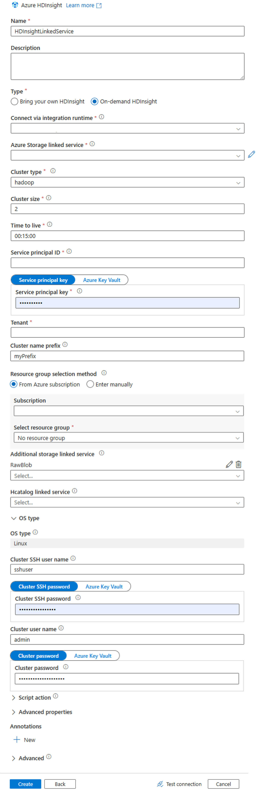
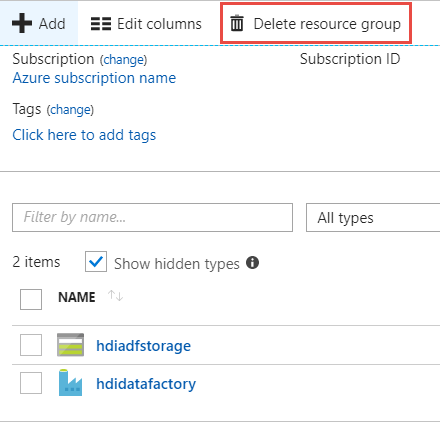

# Tutorial: Create on-demand Hadoop clusters in HDInsight using Azure Data Factory
[!INCLUDE [selector](../../includes/hdinsight-create-linux-cluster-selector.md)]

In this article, you learn how to create a Hadoop cluster, on demand, in Azure HDInsight using Azure Data Factory. You then use data pipelines in Azure Data Factory to run Hive jobs and delete the cluster. By the end of this tutorial, you learn how to operationalize a big data job run where cluster creation, job run, and cluster deletion are performed on a schedule.

This tutorial covers the following tasks: 

> [!div class="checklist"]
> * Create an Azure storage account
> * Understand Azure Data Factory activity
> * Create a data factory using Azure portal
> * Create linked services
> * Create a pipeline
> * Trigger a pipeline
> * Monitor a pipeline
> * Verify the output

If you don't have an Azure subscription, [create a free account](https://azure.microsoft.com/free/) before you begin.

## Prerequisites

- Azure PowerShell. For instructions, see [Install and configure Azure PowerShell](https://docs.microsoft.com/powershell/azure/install-azurerm-ps?view=azurermps-5.7.0).

- An Azure Active Directory service principal. Once you have created the service principal, be sure to retrieve the **application ID** and **authentication key** using the instructions in the linked article. You need these values later in this tutorial. Also, make sure the service principal is a member of the *Contributor* role of the subscription or the resource group in which the cluster is created. For instructions to retrieve the required values and assign the right roles, see [Create an Azure Active Directory service principal](../azure-resource-manager/resource-group-create-service-principal-portal.md).

## Create an Azure storage account

In this section, you create a storage account that will be used as the default storage for the HDInsight cluster you create on-demand. This storage account also contains the sample HiveQL script (**hivescript.hql**) that you use to simulate a sample Hive job that runs on the cluster.

This section uses an Azure PowerShell script to create the storage account and copy over the required files within the storage account. The Azure PowerShell sample script in this section performs the following tasks:

1. Logs in to Azure.
1. Creates an Azure resource group.
1. Creates an Azure Storage account.
1. Creates a Blob container in the storage account
1. Copies the sample HiveQL script (**hivescript.hql**) the Blob container. The script is available at [https://hditutorialdata.blob.core.windows.net/adfv2hiveactivity/hivescripts/hivescript.hql](https://hditutorialdata.blob.core.windows.net/adfhiveactivity/script/partitionweblogs.hql). The sample script is already available in another public Blob container. The PowerShell script below makes a copy of these files into the Azure Storage account it creates.


**To create a storage account and copy the files using Azure PowerShell:**
> [!IMPORTANT]
> Specify names for the Azure resource group and the Azure storage account that will be created by the script.
> Write down **resource group name**, **storage account name**, and **storage account key** outputted by the script. You need them in the next section.

```powershell
$resourceGroupName = "<Azure Resource Group Name>"
$storageAccountName = "<Azure Storage Account Name>"
$location = "East US 2"

$sourceStorageAccountName = "hditutorialdata"  
$sourceContainerName = "adfv2hiveactivity"

$destStorageAccountName = $storageAccountName
$destContainerName = "adfgetstarted" # don't change this value.

####################################
# Connect to Azure
####################################
#region - Connect to Azure subscription
Write-Host "`nConnecting to your Azure subscription ..." -ForegroundColor Green
Login-AzureRmAccount
#endregion

####################################
# Create a resource group, storage, and container
####################################

#region - create Azure resources
Write-Host "`nCreating resource group, storage account and blob container ..." -ForegroundColor Green

New-AzureRmResourceGroup -Name $resourceGroupName -Location $location
New-AzureRmStorageAccount `
    -ResourceGroupName $resourceGroupName `
    -Name $destStorageAccountName `
    -type Standard_LRS `
    -Location $location

$destStorageAccountKey = (Get-AzureRmStorageAccountKey `
    -ResourceGroupName $resourceGroupName `
    -Name $destStorageAccountName)[0].Value

$sourceContext = New-AzureStorageContext `
    -StorageAccountName $sourceStorageAccountName `
    -Anonymous
$destContext = New-AzureStorageContext `
    -StorageAccountName $destStorageAccountName `
    -StorageAccountKey $destStorageAccountKey

New-AzureStorageContainer -Name $destContainerName -Context $destContext
#endregion

####################################
# Copy files
####################################
#region - copy files
Write-Host "`nCopying files ..." -ForegroundColor Green

$blobs = Get-AzureStorageBlob `
    -Context $sourceContext `
    -Container $sourceContainerName

$blobs|Start-AzureStorageBlobCopy `
    -DestContext $destContext `
    -DestContainer $destContainerName

Write-Host "`nCopied files ..." -ForegroundColor Green
Get-AzureStorageBlob -Context $destContext -Container $destContainerName
#endregion

Write-host "`nYou will use the following values:" -ForegroundColor Green
write-host "`nResource group name: $resourceGroupName"
Write-host "Storage Account Name: $destStorageAccountName"
write-host "Storage Account Key: $destStorageAccountKey"

Write-host "`nScript completed" -ForegroundColor Green
```

**To verify the storage account creation**

1. Sign on to the [Azure portal](https://portal.azure.com).
1. Select **Resource groups** on the left pane.
1. Double-click the resource group name you created in your PowerShell script. Use the filter if you have too many resource groups listed.
1. On the **Resources** tile, you see one resource listed unless you share the resource group with other projects. That resource is the storage account with the name you specified earlier. Select the storage account name.
1. Select the **Blobs** tiles.
1. Select the **adfgetstarted** container. You see a folder called **hivescripts**.
1. Open the folder and make sure it contains the sample script file, **hivescript.hql**.

## Understand the Azure Data Factory activity

[Azure Data Factory](../data-factory/introduction.md) orchestrates and automates the movement and transformation of data. Azure Data Factory can create an HDInsight Hadoop cluster just-in-time to process an input data slice and delete the cluster when the processing is complete. 

In Azure Data Factory, a data factory can have one or more data pipelines. A data pipeline has one or more activities. There are two types of activities:

- [Data Movement Activities](../data-factory/copy-activity-overview.md) - You use data movement activities to move data from a source data store to a destination data store.
- [Data Transformation Activities](../data-factory/transform-data.md). You use data transformation activities to transform/process data. HDInsight Hive Activity is one of the transformation activities supported by Data Factory. You use the Hive transformation activity in this tutorial.

In this article, you configure the Hive activity to create an on-demand HDInsight Hadoop cluster. When the activity runs to process data, here is what happens:

1. An HDInsight Hadoop cluster is automatically created for you just-in-time to process the slice. 

1. The input data is processed by running a HiveQL script on the cluster. In this tutorial, the HiveQL script associated with the hive activity performs the following actions:
    
    - Uses the existing table (*hivesampletable*) to create another table **HiveSampleOut**.
    - Populates the **HiveSampleOut** table with only specific columns from the original *hivesampletable*.
    
1. The HDInsight Hadoop cluster is deleted after the processing is complete and the cluster is idle for the configured amount of time (timeToLive setting). If the next data slice is available for processing with in this timeToLive idle time, the same cluster is used to process the slice.  

## Create a data factory

1. Log in to the [Azure portal](https://portal.azure.com/).

1. In the Azure portal, select **Create a resource** > **Data + Analytics** > **Data Factory**.

    

1. Enter or select the values as shown in the following screenshot:

    

    Enter or select the following values:
    
    |Property  |Description  |
    |---------|---------|
    |**Name** |  Enter a name for the data factory. This name must be globally unique.|
    |**Subscription**     |  Select your Azure subscription. |
    |**Resource group**     | Select **Use existing** and then select the resource group you created using the PowerShell script. |
    |**Version**     | Select **V2 (Preview)** |
    |**Location**     | The location is automatically set to the location you specified while creating the resource group earlier. For this tutorial, the location is set to **East US 2**. |
    

1. Select **Pin to dashboard**, and then select **Create**. You shall see a new tile titled **Submitting deployment** on the portal dashboard. Creating a data factory might take anywhere between 2 to 4 minutes.

     
 
1. Once the data factory is created, the portal shows the overview for the data factory.

    

1. Select **Author & Monitor** to launch the Azure Data Factory authoring and monitoring portal.

## Create linked services

In this section, you author two linked services within your data factory.

- An **Azure Storage linked service** that links an Azure storage account to the data factory. This storage is used by the on-demand HDInsight cluster. It also contains the Hive script that is run on the cluster.
- An **on-demand HDInsight linked service**. Azure Data Factory automatically creates an HDInsight cluster and runs the Hive script. It then deletes the HDInsight cluster after the cluster is idle for a preconfigured time.

###  Create an Azure Storage linked service

1. From the left pane of the **Let's get started** page, select the **Edit** icon.

    

1. Select **Connections** from the bottom-left corner of the window and then select **+New**.

    

1. In the **New Linked Service** dialog box, select **Azure Blob Storage** and then select **Continue**.

    

1. Provide a name for the storage linked service, select the Azure Storage account you created as part of the PowerShell script, and then select **Finish**.

    

### Create an on-demand HDInsight linked service

1. Select the **+ New** button again to create another linked service.

1. In the **New Linked Service** window, select **Compute** > **Azure HDInsight**, and then select **Continue**.

    

1. In the **New Linked Service** window, provide the required values.

    

    Enter the following values and leave the rest as default.

    | Property | Description |
    | --- | --- |
    | Name | Enter a name for the HDInsight linked service |
    | Type | Select **On-demand HDInsight** |
    | Azure Storage Linked Service | Select the Storage linked service you created earlier. |
    | Cluster type | Select **hadoop** |
    | Time to live | Provide the duration for which you want the HDInsight cluster to be available before being automatically deleted.|
    | Service principal ID | Provide the application ID of the Azure Active Directory service principal you created as part of the prerequisites |
    | Service principal key | Provide the authentication key for the Azure Active Directory service principal |
    | Cluster name prefix | Provide a value that will be prefixed to all the cluster types that are created by the data factory |
    | Resource group | Select the resource group you created as part of the PowerShell script you used earlier| 
    | Cluster SSH user name | Enter an SSH user name |
    | Cluster SSH password | Provide a password for the SSH user |

    Select **Finish**.

## Create a pipeline

1. Select the **+** (plus) button, and then select **Pipeline**.

    

1. In the **Activities** toolbox, expand **HDInsight**, and drag the **Hive** activity to the pipeline designer surface. In the **General** tab, provide a name for the activity.

    

1. Make sure you have the Hive activity selected, select the **HDI Cluster** tab, and from the **HDInsight Linked Service** drop-down, select the linked service you created earlier for HDInsight.

    

1. Select the **Script** tab and complete the following steps:
    
    1. For **Script Linked Service**, select **HDIStorageLinkedService**. This value is the storage linked service you created earlier.
    
    1. For **File Path**, select **Browse Storage** and navigate to the location where the sample Hive script is available. If you ran the PowerShell script earlier, this location should be `adfgetstarted/hivescripts/hivescript.hql`.
    
        
    
    1. Under **Advanced** > **Parameters**, select **Auto-fill from script**. This option looks for any parameters in the Hive script that require values at runtime. The script you use (**hivescript.hql**) has an **Output** parameter. Provide the value in the format `wasb://<Container>@<StorageAccount>.blob.core.windows.net/outputfolder/` to point to an existing folder on your Azure Storage. The path is case-sensitive. This is the path where the output of the script will be stored.
    
        

1. Select **Validate** to validate the pipeline. Select the **>>** (right arrow) button to close the validation window.

    

1. Finally, select **Publish All** to publish the artifacts to Azure Data Factory.

    

## Trigger a pipeline

1. From the toolbar on the designer surface, select **Trigger** > **Trigger Now**.

    

1. Select **Finish** in the pop-up side bar.

## Monitor a pipeline

1. Switch to the **Monitor** tab on the left. You see a pipeline run in the **Pipeline Runs** list. Notice the status of the run under the **Status** column.

    

1. Select **Refresh** to refresh the status.

1. You can also select the **View Activity Runs** icon to see the activity run associated with the pipeline. In the screenshot below, you see only one activity run since there is only one activity in the pipeline you created. To switch back to the previous view, select **Pipelines** towards the top of the page.

    


## Verify the output

1. To verify the output, in the Azure portal navigate to the storage account that you used for this tutorial. You should see the following folders or containers:

    - You see an **adfgerstarted/outputfolder** that contains the output of the Hive script that was run as part of the pipeline.

    - You see an **adfhdidatafactory-\<linked-service-name>-\<timestamp>** container. This container is the default storage location of the HDInsight cluster that was created as part of the pipeline run.

    - You see an **adfjobs** container that has the Azure Data Factory job logs.  

        


## Clean up the tutorial

With the on-deman HDInsight cluster creation, you do not need to explicitly delete the HDInsight cluster. The cluster is deleted based on the configuration you provided while creating the pipeline. However, even after the cluster is deleted, the storage accounts associated with the cluster continue to exist. This behavior is by design so that you can keep your data intact. However, if you do not want to persist the data, you may delete the storage account you created.

Alternatively, you can delete the entire resource group that you created for this tutorial. This deletes the storage account and the Azure Data Factory that you created.

### Delete the resource group

1. Sign on to the [Azure portal](https://portal.azure.com).
1. Select **Resource groups** on the left pane.
1. Select the resource group name you created in your PowerShell script. Use the filter if you have too many resource groups listed. It opens the resource group.
1. On the **Resources** tile, you shall have the default storage account and the data factory listed unless you share the resource group with other projects.
1. Select **Delete resource group**. Doing so deletes the storage account and the data stored in the storage account.

    

1. Enter the resource group name to confirm deletion, and then select **Delete**.


## Next steps
In this article, you learned how to use Azure Data Factory to create on-demand HDInsight cluster and run Hive jobs. Advance to the next artciel to learn how to create HDInsight clusters with custom configuration.

> [!div class="nextstepaction"]
>[Create Azure HDInsight clusters with custom configuration](hdinsight-hadoop-provision-linux-clusters.md)


