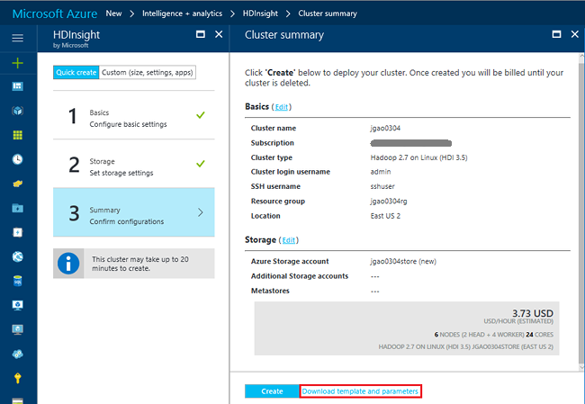
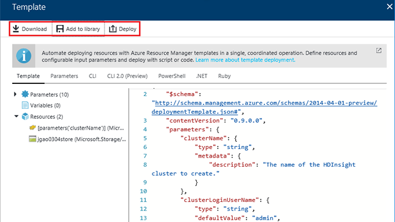

# Create Hadoop clusters in HDInsight by using Resource Manager templates
[!INCLUDE [selector](../../includes/hdinsight-create-linux-cluster-selector.md)]

In this article, you learn several ways to create Azure HDInsight clusters with Azure Resource Manager templates. For more information, see [Deploy an application with Azure Resource Manager template](../azure-resource-manager/resource-group-template-deploy.md). To learn about other cluster creation tools and features, click the tab selector on the top of this page or see [Cluster creation methods](hdinsight-hadoop-provision-linux-clusters.md#cluster-setup-methods).

## Prerequisites
[!INCLUDE [delete-cluster-warning](../../includes/hdinsight-delete-cluster-warning.md)]

To follow the instructions in this article, you'll need:

* An [Azure subscription](https://azure.microsoft.com/documentation/videos/get-azure-free-trial-for-testing-hadoop-in-hdinsight/).
* Azure PowerShell and/or Azure CLI.

[!INCLUDE [use-latest-version](../../includes/hdinsight-use-latest-powershell-and-cli.md)]

### Resource Manager templates
A Resource Manager template makes it easy to create the following for your application in a single, coordinated operation:
* HDInsight clusters and their dependent resources (such as the default storage account)
* Other resources (such as Azure SQL Database to use Apache Sqoop)

In the template, you define the resources that are needed for the application. You also specify deployment parameters to input values for different environments. The template consists of JSON and expressions that you use to construct values for your deployment.

You can find HDInsight template samples at [Azure Quickstart Templates](https://azure.microsoft.com/resources/templates/?term=hdinsight). Use cross-platform [Visual Studio Code](https://code.visualstudio.com/#alt-downloads) with the [Resource Manager extension](https://marketplace.visualstudio.com/items?itemName=msazurermtools.azurerm-vscode-tools) or a text editor to save the template into a file on your workstation. You learn how to call the template by using different methods.

For more information about Resource Manager templates, see the following articles:

* [Author Azure Resource Manager templates](../azure-resource-manager/resource-group-authoring-templates.md)
* [Deploy an application with Azure Resource Manager templates](../azure-resource-manager/resource-group-template-deploy.md)

## Generate templates

By using the Azure portal, you can configure all the properties of a cluster and then save the template before deploying it. You can then reuse the template.

**To generate a template by using the Azure portal**

1. Sign in to the [Azure portal](https://portal.azure.com).
2. Click **New** on the left menu, click **Intelligence + analytics**, and then click **HDInsight**.
3. Follow the instructions to enter properties. You can use either the **Quick create** or the **Custom** option.
4. On the **Summary** tab, click **Download template and parameters**:

    

    You see a list of the template file, parameters file, and code samples used to deploy the template:

    

    From here, you can download the template, save it to your template library, or deploy the template.

    To access a template in your library, click **More services** from the left menu, and then click **Templates** (under the **Other** category).

    > [!Note]
    > The template and parameters file must be used together. Otherwise, you might get unexpected results. For example, the default **clusterKind** property value is always **hadoop**, despite what you specify before you download the template.

## Deploy with PowerShell

This procedure creates a Hadoop cluster in HDInsight.

1. Save the JSON file in the [Appendix](#appx-a-arm-template) to your workstation. In the PowerShell script, the file name is `C:\HDITutorials-ARM\hdinsight-arm-template.json`.
2. Set the parameters and variables if needed.
3. Run the template by using the following PowerShell script:

        ####################################
        # Set these variables
        ####################################
        #region - used for creating Azure service names
        $nameToken = "<Enter an Alias>"
        $templateFile = "C:\HDITutorials-ARM\hdinsight-arm-template.json"
        #endregion

        ####################################
        # Service names and variables
        ####################################
        #region - service names
        $namePrefix = $nameToken.ToLower() + (Get-Date -Format "MMdd")

        $resourceGroupName = $namePrefix + "rg"
        $hdinsightClusterName = $namePrefix + "hdi"
        $defaultStorageAccountName = $namePrefix + "store"
        $defaultBlobContainerName = $hdinsightClusterName

        $location = "East US 2"

        $armDeploymentName = $namePrefix
        #endregion

        ####################################
        # Connect to Azure
        ####################################
        #region - Connect to Azure subscription
        Write-Host "`nConnecting to your Azure subscription ..." -ForegroundColor Green
        try{Get-AzureRmContext}
        catch{Login-AzureRmAccount}
        #endregion

        # Create a resource group
        New-AzureRmResourceGroup -Name $resourceGroupName -Location $Location

        # Create cluster and the dependent storage account
        $parameters = @{clusterName="$hdinsightClusterName"}

        New-AzureRmResourceGroupDeployment `
            -Name $armDeploymentName `
            -ResourceGroupName $resourceGroupName `
            -TemplateFile $templateFile `
            -TemplateParameterObject $parameters

        # List cluster
        Get-AzureRmHDInsightCluster -ResourceGroupName $resourceGroupName -ClusterName $hdinsightClusterName

    The PowerShell script configures only the cluster name. The storage account name is hard-coded in the template. You are prompted to enter the cluster user password. (The default username is **admin**.) You are also prompted to enter the SSH user password. (The default SSH username is **sshuser**.)  

For more information, see  [Deploy with PowerShell](../azure-resource-manager/resource-group-template-deploy.md#deploy-local-template).

## Deploy with CLI
The following sample uses Azure command-line interface (CLI). It creates a cluster and its dependent storage account and container by calling a Resource Manager template:

    azure login
    azure config mode arm
    azure group create -n hdi1229rg -l "East US"
    azure group deployment create --resource-group "hdi1229rg" --name "hdi1229" --template-file "C:\HDITutorials-ARM\hdinsight-arm-template.json"

You are prompted to enter:
* The cluster name.
* The cluster user password. (The default username is **admin**.)
* The SSH user password. (The default SSH username is **sshuser**.)

The following code provides inline parameters:

    azure group deployment create --resource-group "hdi1229rg" --name "hdi1229" --template-file "c:\Tutorials\HDInsightARM\create-linux-based-hadoop-cluster-in-hdinsight.json" --parameters '{\"clusterName\":{\"value\":\"hdi1229\"},\"clusterLoginPassword\":{\"value\":\"Pass@word1\"},\"sshPassword\":{\"value\":\"Pass@word1\"}}'

## Deploy with the REST API
See [Deploy with the REST API](../azure-resource-manager/resource-group-template-deploy-rest.md).

## Deploy with Visual Studio
 Use Visual Studio to create a resource group project and deploy it to Azure through the user interface. You select the type of resources to include in your project. Those resources are automatically added to the Resource Manager template. The project also provides a PowerShell script to deploy the template.

For an introduction to using Visual Studio with resource groups, see [Creating and deploying Azure resource groups through Visual Studio](../azure-resource-manager/vs-azure-tools-resource-groups-deployment-projects-create-deploy.md).

## Troubleshoot

If you run into issues with creating HDInsight clusters, see [access control requirements](hdinsight-administer-use-portal-linux.md#create-clusters).

## Next steps
In this article, you have learned several ways to create an HDInsight cluster. To learn more, see the following articles:

* For an example of deploying resources through the .NET client library, see [Deploy resources by using .NET libraries and a template](../virtual-machines/windows/csharp-template.md?toc=%2fazure%2fvirtual-machines%2fwindows%2ftoc.json).
* For an in-depth example of deploying an application, see [Provision and deploy microservices predictably in Azure](../app-service-web/app-service-deploy-complex-application-predictably.md).
* For guidance on deploying your solution to different environments, see [Development and test environments in Microsoft Azure](../solution-dev-test-environments.md).
* To learn about the sections of the Azure Resource Manager template, see [Authoring templates](../azure-resource-manager/resource-group-authoring-templates.md).
* For a list of the functions you can use in an Azure Resource Manager template, see [Template functions](../azure-resource-manager/resource-group-template-functions.md).

## Appendix: Resource Manager template to create a Hadoop cluster
The following Azure Resource Manager template creates a Linux-based Hadoop cluster with the dependent Azure storage account.

> [!NOTE]
> This sample includes configuration information for Hive metastore and Oozie metastore. Remove the section or configure the section before using the template.
>
>

    {
    "$schema": "https://schema.management.azure.com/schemas/2015-01-01/deploymentTemplate.json#",
    "contentVersion": "1.0.0.0",
    "parameters": {
        "clusterName": {
        "type": "string",
        "metadata": {
            "description": "The name of the HDInsight cluster to create."
        }
        },
        "clusterLoginUserName": {
        "type": "string",
        "defaultValue": "admin",
        "metadata": {
            "description": "These credentials can be used to submit jobs to the cluster and to log into cluster dashboards."
        }
        },
        "clusterLoginPassword": {
        "type": "securestring",
        "metadata": {
            "description": "The password must be at least 10 characters in length and must contain at least one digit, one non-alphanumeric character, and one upper or lower case letter."
        }
        },
        "sshUserName": {
        "type": "string",
        "defaultValue": "sshuser",
        "metadata": {
            "description": "These credentials can be used to remotely access the cluster."
        }
        },
        "sshPassword": {
        "type": "securestring",
        "metadata": {
            "description": "The password must be at least 10 characters in length and must contain at least one digit, one non-alphanumeric character, and one upper or lower case letter."
        }
        },
        "location": {
        "type": "string",
        "defaultValue": "East US",
        "allowedValues": [
            "East US",
            "East US 2",
            "North Central US",
            "South Central US",
            "West US",
            "North Europe",
            "West Europe",
            "East Asia",
            "Southeast Asia",
            "Japan East",
            "Japan West",
            "Australia East",
            "Australia Southeast"
        ],
        "metadata": {
            "description": "The location where all azure resources will be deployed."
        }
        },
        "clusterType": {
        "type": "string",
        "defaultValue": "hadoop",
        "allowedValues": [
            "hadoop",
            "hbase",
            "storm",
            "spark"
        ],
        "metadata": {
            "description": "The type of the HDInsight cluster to create."
        }
        },
        "clusterWorkerNodeCount": {
        "type": "int",
        "defaultValue": 2,
        "metadata": {
            "description": "The number of nodes in the HDInsight cluster."
        }
        }
    },
    "variables": {
        "defaultApiVersion": "2015-05-01-preview",
        "clusterApiVersion": "2015-03-01-preview",
        "clusterStorageAccountName": "[concat(parameters('clusterName'),'store')]"
    },
    "resources": [
        {
        "name": "[variables('clusterStorageAccountName')]",
        "type": "Microsoft.Storage/storageAccounts",
        "location": "[parameters('location')]",
        "apiVersion": "[variables('defaultApiVersion')]",
        "dependsOn": [ ],
        "tags": { },
        "properties": {
            "accountType": "Standard_LRS"
        }
        },
        {
        "name": "[parameters('clusterName')]",
        "type": "Microsoft.HDInsight/clusters",
        "location": "[parameters('location')]",
        "apiVersion": "[variables('clusterApiVersion')]",
        "dependsOn": [ "[concat('Microsoft.Storage/storageAccounts/',variables('clusterStorageAccountName'))]" ],
        "tags": {

        },
        "properties": {
            "clusterVersion": "3.4",
            "osType": "Linux",
            "tier": "standard",
            "clusterDefinition": {
            "kind": "[parameters('clusterType')]",
            "configurations": {
                "gateway": {
                "restAuthCredential.isEnabled": true,
                "restAuthCredential.username": "[parameters('clusterLoginUserName')]",
                "restAuthCredential.password": "[parameters('clusterLoginPassword')]"
                },
                "hive-site": {
                    "javax.jdo.option.ConnectionDriverName": "com.microsoft.sqlserver.jdbc.SQLServerDriver",
                    "javax.jdo.option.ConnectionURL": "jdbc:sqlserver://myadla0901dbserver.database.windows.net;database=myhive20160901;encrypt=true;trustServerCertificate=true;create=false;loginTimeout=300",
                    "javax.jdo.option.ConnectionUserName": "johndole",
                    "javax.jdo.option.ConnectionPassword": "myPassword$"
                },
                "hive-env": {
                    "hive_database": "Existing MSSQL Server database with SQL authentication",
                    "hive_database_name": "myhive20160901",
                    "hive_database_type": "mssql",
                    "hive_existing_mssql_server_database": "myhive20160901",
                    "hive_existing_mssql_server_host": "myadla0901dbserver.database.windows.net",
                    "hive_hostname": "myadla0901dbserver.database.windows.net"
                },
                "oozie-site": {
                    "oozie.service.JPAService.jdbc.driver": "com.microsoft.sqlserver.jdbc.SQLServerDriver",
                    "oozie.service.JPAService.jdbc.url": "jdbc:sqlserver://myadla0901dbserver.database.windows.net;database=myhive20160901;encrypt=true;trustServerCertificate=true;create=false;loginTimeout=300",
                    "oozie.service.JPAService.jdbc.username": "johndole",
                    "oozie.service.JPAService.jdbc.password": "myPassword$",
                    "oozie.db.schema.name": "oozie"
                },
                "oozie-env": {
                    "oozie_database": "Existing MSSQL Server database with SQL authentication",
                    "oozie_database_name": "myhive20160901",
                    "oozie_database_type": "mssql",
                    "oozie_existing_mssql_server_database": "myhive20160901",
                    "oozie_existing_mssql_server_host": "myadla0901dbserver.database.windows.net",
                    "oozie_hostname": "myadla0901dbserver.database.windows.net"
                }            
            }
            },
            "storageProfile": {
            "storageaccounts": [
                {
                "name": "[concat(variables('clusterStorageAccountName'),'.blob.core.windows.net')]",
                "isDefault": true,
                "container": "[parameters('clusterName')]",
                "key": "[listKeys(resourceId('Microsoft.Storage/storageAccounts', variables('clusterStorageAccountName')), variables('defaultApiVersion')).key1]"
                }
            ]
            },
            "computeProfile": {
            "roles": [
                {
                "name": "headnode",
                "targetInstanceCount": "2",
                "hardwareProfile": {
                    "vmSize": "Standard_D3"
                },
                "osProfile": {
                    "linuxOperatingSystemProfile": {
                    "username": "[parameters('sshUserName')]",
                    "password": "[parameters('sshPassword')]"
                    }
                }
                },
                {
                "name": "workernode",
                "targetInstanceCount": "[parameters('clusterWorkerNodeCount')]",
                "hardwareProfile": {
                    "vmSize": "Standard_D3"
                },
                "osProfile": {
                    "linuxOperatingSystemProfile": {
                    "username": "[parameters('sshUserName')]",
                    "password": "[parameters('sshPassword')]"
                    }
                }
                }
            ]
            }
        }
        }
    ],
    "outputs": {
        "cluster": {
        "type": "object",
        "value": "[reference(resourceId('Microsoft.HDInsight/clusters',parameters('clusterName')))]"
        }
    }
    }

## Appendix: Resource Manager template to create a Spark cluster

This section provides an ARM template that you can use to create an HDInsight Spark cluster. This template includes configurations for `spark-defaults` and `spark-thrift-sparkconf` (for Spark 1.6 clusters) and `spark2-defaults` and `spark2-thrift-sparkconf` (for Spark 2 clusters). In addition to this, HDInsight calculates and sets configurations such as `spark.executor.instances`, `spark.executor.memory`, and `spark.executor.cores` based on the cluster size. 

If you set any one parameter in a section as part of the template itself, HDInsight does not calculate and set the other parameters of the same section. For example, parameter `spark.executor.instances` is in the  `spark-defaults` configuration. If you set another parameter (for example, `spark.yarn.exector.memoryOverhead`) in the `spark-defaults` configuration, HDInsight does not calculate and set the `spark.executor.instances` parameter as well.

    {
    "$schema": "http://schema.management.azure.com/schemas/2014-04-01-preview/deploymentTemplate.json#",
    "contentVersion": "0.9.0.0",
    "parameters": {
        "clusterName": {
            "type": "string",
            "metadata": {
                "description": "The name of the HDInsight cluster to create."
            }
        },
        "clusterLoginUserName": {
            "type": "string",
            "defaultValue": "admin",
            "metadata": {
                "description": "These credentials can be used to submit jobs to the cluster and to log into cluster dashboards."
            }
        },
        "clusterLoginPassword": {
            "type": "securestring",
            "metadata": {
                "description": "The password must be at least 10 characters in length and must contain at least one digit, one non-alphanumeric character, and one upper or lower case letter."
            }
        },
        "location": {
            "type": "string",
            "defaultValue": "southcentralus",
            "metadata": {
                "description": "The location where all azure resources will be deployed."
            }
        },
        "clusterVersion": {
            "type": "string",
            "defaultValue": "3.5",
            "metadata": {
                "description": "HDInsight cluster version."
            }
        },
        "clusterWorkerNodeCount": {
            "type": "int",
            "defaultValue": 4,
            "metadata": {
                "description": "The number of nodes in the HDInsight cluster."
            }
        },
        "clusterKind": {
            "type": "string",
            "defaultValue": "SPARK",
            "metadata": {
                "description": "The type of the HDInsight cluster to create."
            }
        },
        "sshUserName": {
            "type": "string",
            "defaultValue": "sshuser",
            "metadata": {
                "description": "These credentials can be used to remotely access the cluster."
            }
        },
        "sshPassword": {
            "type": "securestring",
            "metadata": {
                "description": "The password must be at least 10 characters in length and must contain at least one digit, one non-alphanumeric character, and one upper or lower case letter."
            }
        }
    },
    "resources": [
        {
            "apiVersion": "2015-03-01-preview",
            "name": "[parameters('clusterName')]",
            "type": "Microsoft.HDInsight/clusters",
            "location": "[parameters('location')]",
            "dependsOn": [],
            "properties": {
                "clusterVersion": "[parameters('clusterVersion')]",
                "osType": "Linux",
                "tier": "standard",
                "clusterDefinition": {
                    "kind": "[parameters('clusterKind')]",
                    "configurations": {
                        "gateway": {
                            "restAuthCredential.isEnabled": true,
                            "restAuthCredential.username": "[parameters('clusterLoginUserName')]",
                            "restAuthCredential.password": "[parameters('clusterLoginPassword')]"
                        },
						"spark-defaults": {
                            "spark.executor.cores": "2"
                        },
						"spark-thrift-sparkconf": {
                            "spark.yarn.executor.memoryOverhead": "896"
                        }
                    }
                },
                "storageProfile": {
                    "storageaccounts": [
                        {
                            "name": "[concat(variables('clusterStorageAccountName'),'.blob.core.windows.net')]",
                            "isDefault": true,
                            "container": "[parameters('clusterName')]",
                            "key": "[listKeys(resourceId('Microsoft.Storage/storageAccounts', variables('clusterStorageAccountName')), variables('defaultApiVersion')).key1]"
                        }
                    ]
                },
                "computeProfile": {
                    "roles": [
                        {
                            "name": "headnode",
                            "minInstanceCount": 1,
                            "targetInstanceCount": 2,
                            "hardwareProfile": {
                                "vmSize": "Standard_D12"
                            },
                            "osProfile": {
                                "linuxOperatingSystemProfile": {
                                    "username": "[parameters('sshUserName')]",
                                    "password": "[parameters('sshPassword')]"
                                }
                            },
                            "virtualNetworkProfile": null,
                            "scriptActions": []
                        },
                        {
                            "name": "workernode",
                            "minInstanceCount": 1,
                            "targetInstanceCount": 4,
                            "hardwareProfile": {
                                "vmSize": "Standard_D4"
                            },
                            "osProfile": {
                                "linuxOperatingSystemProfile": {
                                    "username": "[parameters('sshUserName')]",
                                    "password": "[parameters('sshPassword')]"
                                    }
                                },
                                "virtualNetworkProfile": null,
                                "scriptActions": []
                            }
                        ]
                    }
                }
            }
        ]
    }