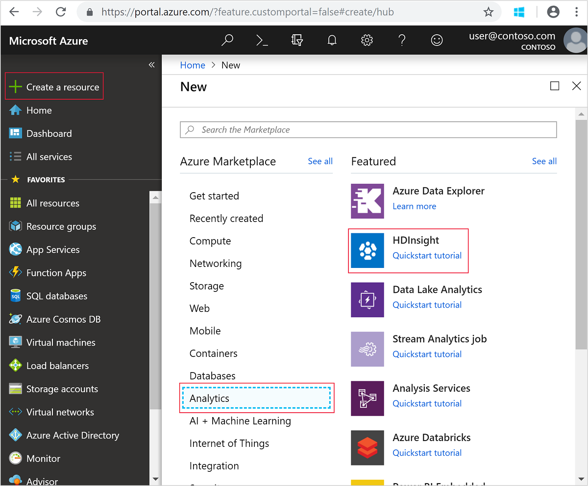
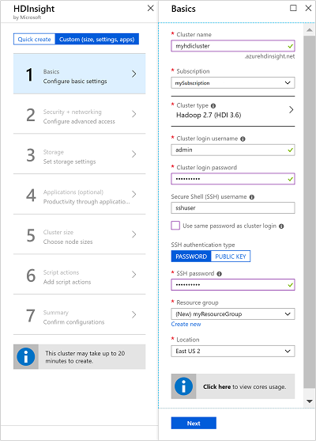
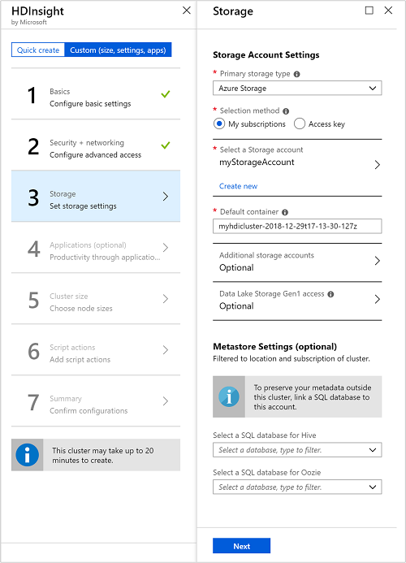
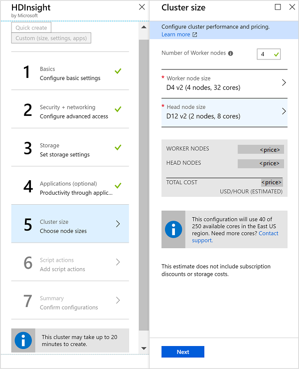
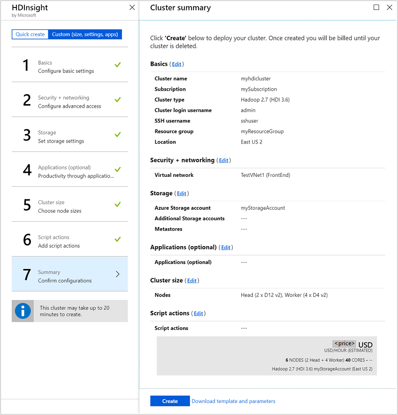

# Create Linux-based clusters in HDInsight by using the Azure portal
[!INCLUDE [selector](../../includes/hdinsight-create-linux-cluster-selector.md)]

The Azure portal is a web-based management tool for services and resources hosted in the Microsoft Azure cloud. In this article, you learn how to create Linux-based Azure HDInsight clusters by using the portal.

## Prerequisites
[!INCLUDE [delete-cluster-warning](../../includes/hdinsight-delete-cluster-warning.md)]

* **An Azure subscription**. See [How to get Azure Free trial for testing Hadoop in HDInsight](https://azure.microsoft.com/documentation/videos/get-azure-free-trial-for-testing-hadoop-in-hdinsight/).
* **A modern web browser**. The Azure portal uses HTML5 and JavaScript. It might not function correctly in older web browsers.

## Create clusters
The Azure portal exposes most of the cluster properties. By using Azure Resource Manager templates, you can hide many details. For more information, see [Create Apache Hadoop clusters in HDInsight by using Resource Manager templates](hdinsight-hadoop-create-linux-clusters-arm-templates.md).

[!INCLUDE [secure-transfer-enabled-storage-account](../../includes/hdinsight-secure-transfer.md)]

1. Sign in to the [Azure portal](https://portal.azure.com).

1. From the left menu, select **+ Create a resource**.

1.  Under **Azure Marketplace**, select **Analytics**.

1.  Under **Featured**, select **HDInsight**.
   
    

1. On the **HDInsight** page, select **Custom (size, settings, apps)**.

1. Select **1 Basics**. Then enter the following information.

	

	* Enter the **Cluster Name**. This name must be globally unique.

	* From the **Subscription** drop-down list, select the Azure subscription that's used for the cluster.

	* Select **Cluster type**. Then select the type of cluster you want to create. Examples are Hadoop and Apache Spark. The **Operating system** will be **Linux**. Next, select a cluster type version. Use the default version if you don't know what to choose. For more information, see [HDInsight cluster versions](hdinsight-component-versioning.md).
     
    	> [!IMPORTANT]  
    	> HDInsight clusters come in a variety of types. They correspond to the workload or technology that the cluster is tuned for. There's no supported method to create a cluster that combines multiple types. Examples are Storm and HBase on one cluster.
		
    * For **Cluster login username** and **Cluster login password**, provide the username and password for the admin user.

    * Enter an **SSH Username**. If you want the same SSH password as the admin password you specified earlier, select the **Use same password as cluster login** check box. If not, provide either a **PASSWORD** or **PUBLIC KEY** to authenticate the SSH user. A public key is the approach we recommend. Choose **Select** at the bottom to save the credentials configuration.
   
	    For more information, see [Connect to HDInsight (Apache Hadoop) by using SSH](hdinsight-hadoop-linux-use-ssh-unix.md).

    * For **Resource group**, specify whether you want to create a new resource group or use an existing one.

    * Specify a datacenter **location** where the cluster is created.

    * Select **Next** to move to the next page.

4. From **2 Security + networking**, you can connect your cluster to a virtual network by using the provided drop-down menu. Select an Azure virtual network and the subnet if you want to place the cluster into a virtual network. For information on using HDInsight with a virtual network, see [Extend HDInsight capabilities by using an Azure Virtual Network](hdinsight-extend-hadoop-virtual-network.md). The article includes specific configuration requirements for the virtual network. 

    If you want to use the **Enterprise Security Package**, follow these instructions: [Configure a HDInsight cluster with Enterprise Security Package by using Azure Active Directory Domain Services](https://docs.microsoft.com/azure/hdinsight/domain-joined/apache-domain-joined-configure-using-azure-adds).

    Select **Next** to move to the next page.

5. From **3 Storage**, specify whether you want Azure Storage or Azure Data Lake Storage as your default storage. For more information, see the following table.

	 

	 | Storage                                      | Description |
	 |----------------------------------------------|-------------|
	 | **Azure Storage blobs as the default storage**   | <ul><li>For **Primary Storage type**, select **Azure Storage**. For **Selection method**, choose **My subscriptions** if you want to specify a storage account that's part of your Azure subscription. Then select the storage account. Otherwise, select **Access key**. Then provide the information for the storage account that you want to choose from outside your Azure subscription.</li><li>For **Default container**, choose the default container name suggested by the portal or specify your own.</li><li>If Azure Blob storage is your default storage, you can also select **Additional Storage Accounts** to specify additional storage accounts to associate with the cluster. For **Azure Storage Keys**, select **Add a storage key**. Then you can provide a storage account from your Azure subscriptions or from other subscriptions. Provide the storage account access key.</li><li>If Blob storage is your default storage, you can also select **Data Lake Storage access** to specify Azure Data Lake Storage as additional storage. For more information, see [Quickstart: Set up clusters in HDInsight](../storage/data-lake-storage/quickstart-create-connect-hdi-cluster.md).</li></ul> |
	 | **Azure Data Lake Storage as the default storage** | For **Primary storage type**, select **Azure Data Lake Storage Gen1** or **Azure Data Lake Storage Gen2**. Then refer to the article [Quickstart: Set up clusters in HDInsight](../storage/data-lake-storage/quickstart-create-connect-hdi-cluster.md) for instructions. |
	 | **External metastores**                      | As an option, specify a SQL database to save Apache Hive and Apache Oozie metadata associated with the cluster. For **Select a SQL database for Hive**, select a SQL database. Then provide the username and password for the database. Repeat these steps for Oozie metadata.  Some considerations about using Azure SQL database for metastores are as follows: <ul><li>The Azure SQL database that's used for the metastore must allow connectivity to other Azure services, including Azure HDInsight. On the right side of the Azure SQL database dashboard, select the server name. This server is the one that the SQL database instance runs on. After you're in server view, select **Configure**. Then for **Azure Services**, select **Yes**. Then select **Save**.</li><li>When you create a metastore, don't name a database with dashes or hyphens. These characters can cause the cluster creation process to fail.</li></ul> |

	 > [!WARNING]  
	 > Using an additional storage account in a different location than the HDInsight cluster isn't supported.

	 Select **Next** to move to the next page.

6. From **4 Applications (optional)**, select any applications that you want. Microsoft, independent software vendors (ISVs), or you can develop these applications. For more information, see [Install applications during cluster creation](hdinsight-apps-install-applications.md#install-applications-during-cluster-creation).

    Select **Next** to move to the next page.

6. **5 Cluster size** displays information about the nodes that are used for this cluster. Set the number of worker nodes that you need for the cluster. The estimated cost of running the cluster is also shown.
   
    
   
   > [!IMPORTANT]  
   > If you plan on more than 32 worker nodes, select a head node size with at least eight cores and 14 GB RAM. Plan the nodes either at cluster creation or by scaling the cluster after creation. 
   > 
   > For more information on node sizes and associated costs, see [Azure HDInsight pricing](https://azure.microsoft.com/pricing/details/hdinsight/).
   
    Select **Next** to move to the next page.

8. From **6 Script actions**, you can customize a cluster to install custom components. This option works if you want to use a custom script to customize a cluster, as the cluster is being created. For more information about script actions, see [Customize Linux-based HDInsight clusters by using script actions](hdinsight-hadoop-customize-cluster-linux.md).

   Select **Next** to move to the next page.

9. From **7 Summary**, verify the information you entered earlier. Then select **Create**.

	 
    
    > [!NOTE]  
    > It takes some time for the cluster to be created, usually around 20 minutes. Monitor **Notifications** to check on the provisioning process.

10. After the creation process finishes, select **Go to Resource** from the **Deployment succeeded** notification. The cluster window provides the following information.
    
    
    
    The icons in the window are explained as follows:
    
    * The **Overview** tab provides all the essential information about the cluster. Examples are the name, the resource group it belongs to, the location, the operating system, and the URL for the cluster dashboard.
    * **Dashboard** directs you to the Ambari portal associated with the cluster.
    * **Secure Shell** provides information needed to access the cluster by using SSH.
    * By using **Scale cluster**, you can increase the number of worker nodes associated with the cluster.
	* **Delete** deletes the HDInsight cluster.
    

## Customize clusters
* [Customize HDInsight clusters by using Bootstrap](hdinsight-hadoop-customize-cluster-bootstrap.md)
* [Customize Linux-based HDInsight clusters by using script actions](hdinsight-hadoop-customize-cluster-linux.md)

## Delete the cluster
[!INCLUDE [delete-cluster-warning](../../includes/hdinsight-delete-cluster-warning.md)]

## Troubleshoot

If you run into issues with creating HDInsight clusters, see [access control requirements](hdinsight-hadoop-create-linux-clusters-portal.md).

## Next steps
You've successfully created an HDInsight cluster. Now learn how to work with your cluster.

### Apache Hadoop clusters
* [Use Apache Hive with HDInsight](hadoop/hdinsight-use-hive.md)
* [Use Apache Pig with HDInsight](hadoop/hdinsight-use-pig.md)
* [Use MapReduce with HDInsight](hadoop/hdinsight-use-mapreduce.md)

### Apache HBase clusters
* [Get started with Apache HBase on HDInsight](hbase/apache-hbase-tutorial-get-started-linux.md)
* [Develop Java applications for Apache HBase on HDInsight](hbase/apache-hbase-build-java-maven-linux.md)

### Apache Storm clusters
* [Develop Java topologies for Apache Storm on HDInsight](storm/apache-storm-develop-java-topology.md)
* [Use Python components in Apache Storm on HDInsight](storm/apache-storm-develop-python-topology.md)
* [Deploy and monitor topologies with Apache Storm on HDInsight](storm/apache-storm-deploy-monitor-topology-linux.md)

### Apache Spark clusters
* [Create a standalone application by using Scala](spark/apache-spark-create-standalone-application.md)
* [Run jobs remotely on an Apache Spark cluster by using Apache Livy](spark/apache-spark-livy-rest-interface.md)
* [Apache Spark with BI: Perform interactive data analysis by using Spark in HDInsight with BI tools](spark/apache-spark-use-bi-tools.md)
* [Apache Spark with Machine Learning: Use Spark in HDInsight to predict food inspection results](spark/apache-spark-machine-learning-mllib-ipython.md)

