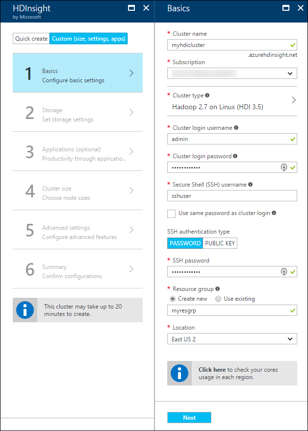
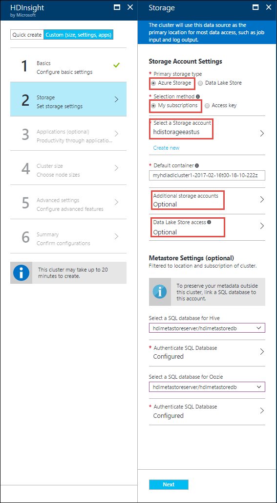
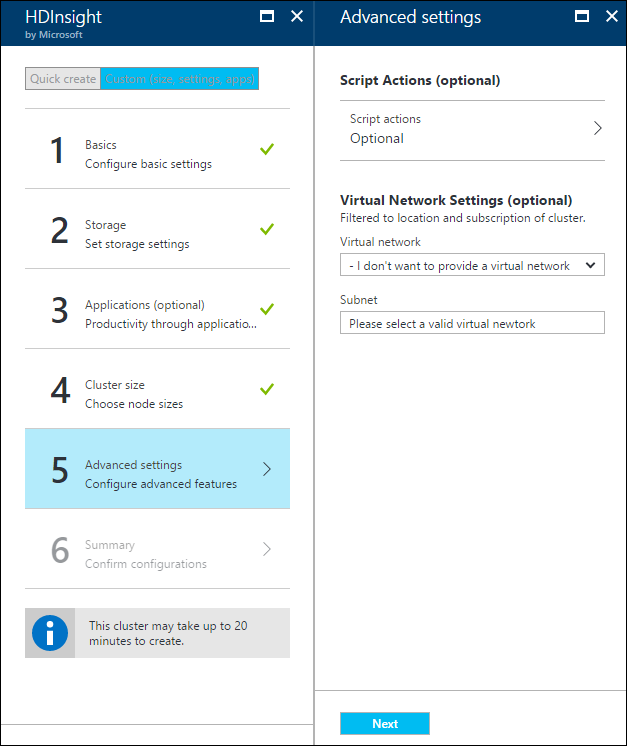
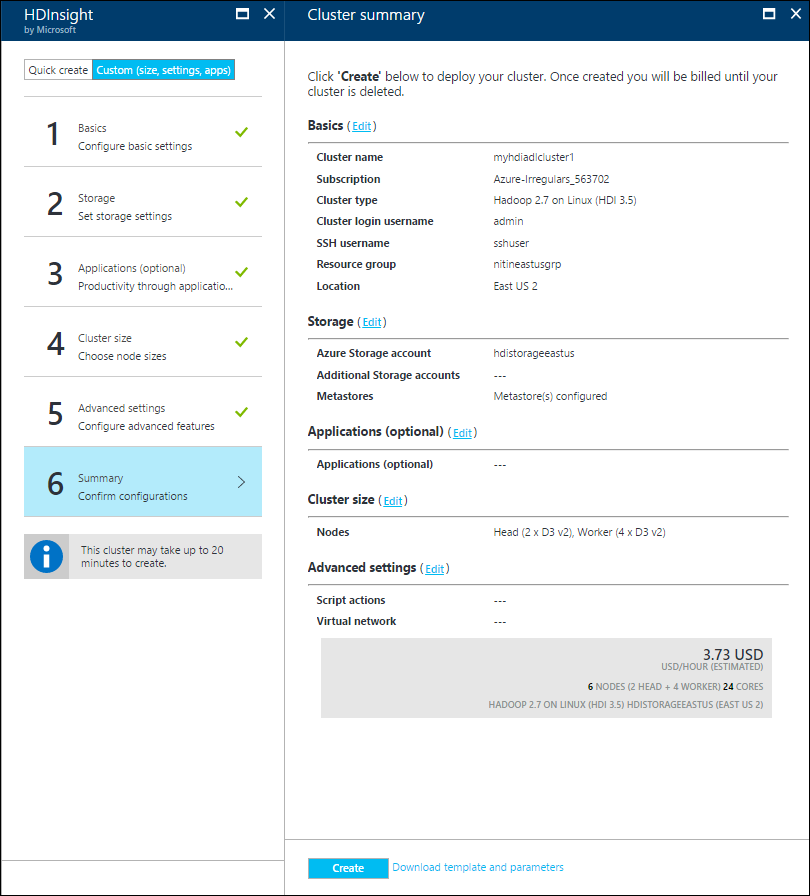
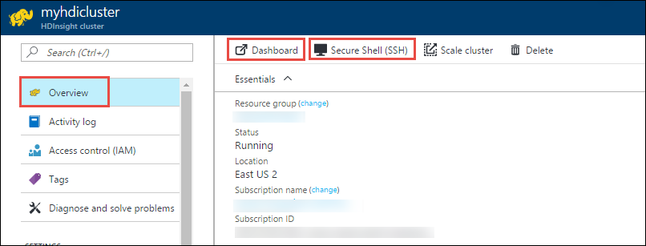

# Create Linux-based clusters in HDInsight using the Azure portal
[!INCLUDE [selector](../../includes/hdinsight-create-linux-cluster-selector.md)]

The Azure portal is a web-based management tool for services and resources hosted in the Microsoft Azure cloud. In this article you will learn how to create Linux-based HDInsight clusters using the portal.

## Prerequisites
[!INCLUDE [delete-cluster-warning](../../includes/hdinsight-delete-cluster-warning.md)]

* **An Azure subscription**. See [Get Azure free trial](https://azure.microsoft.com/documentation/videos/get-azure-free-trial-for-testing-hadoop-in-hdinsight/).
* **A modern web browser**. The Azure  portal uses HTML5 and Javascript, and may not function correctly in older web browsers.

## Create clusters
The Azure portal exposes most of the cluster properties. Using Azure Resource Manager template, you can hide a lot of details. For more information, see [Create Linux-based Hadoop clusters in HDInsight using Azure Resource Manager templates](hdinsight-hadoop-create-linux-clusters-arm-templates.md).

1. Sign in to the [Azure  portal](https://portal.azure.com).
2. Click **+**, click **Intelligence + Analytics**, and then click **HDInsight**.
   
    

3. In the **HDInsight** blade, click **Custom (size, settings, apps)**, click **Basics**, and then enter the following information.

	

	* Enter **Cluster Name**: This name must be globally unique.

	* From the **Subscription** drop-down, select the Azure subscription that will be used for the cluster.

	* Click **Cluster type**, and then select:
   
		* **Cluster Type**: If you don't know what to choose, select **Hadoop**. It is the most popular cluster type.
     
 			> [!IMPORTANT]
     		> HDInsight clusters come in a variety of types, which correspond to the workload or technology that the cluster is tuned for. There is no supported method to create a cluster that combines multiple types, such as Storm and HBase on one cluster. 
     		> 
     		> 
		
		* **Operating System**: Select **Linux**.
		
		* **Version**: Use the default version if you don't know what to choose. For more information, see [HDInsight cluster versions](hdinsight-component-versioning.md).
		* **Cluster Tier**: Azure HDInsight provides the big data cloud offerings in two categories: Standard tier and Premium tier. For more information, see [Cluster tiers](hdinsight-hadoop-provision-linux-clusters.md#cluster-tiers).

	* For **Cluster login username** and **Cluster login password**, provide the username and password for the admin user.

	* Enter an **SSH Username** and if you want to have the SSH password same as the admin password you specified earlier, select the **Use same password as cluster login** check box. If not, provide either a **PASSWORD** or **PUBLIC KEY**, which will be used to authenticate the SSH user. Using a public key is the recommended approach. Click **Select** at the bottom to save the credentials configuration.
   
		For information, see [Use SSH with HDInsight](hdinsight-hadoop-linux-use-ssh-unix.md).

	* For **Resource group**, specify whether you want to create a new resource group or use an existing one.

	* Specify a data center **location** where the cluster will be created.

	* Click **Next**.

4. On the **Storage** blade, specify whether you want Azure Storage (WASB) or Data Lake Store as your default storage. Look at the table below for more information.

	

	| Storage                                      | Description |
	|----------------------------------------------|-------------|
	| **Azure Storage Blobs as default storage**   | <ul><li>For **Primary Storage type**, select **Azure Storage**. After that, for **Selection method**, you can choose **My subscriptions** if you want to specify a storage account that is part of your Azure subscription and then select the storage account. Otherwise, click **Access key** and provide the information for the storage account that you want to choose from outside your Azure subscription.</li><li>For **Default container**, you can choose to go with the default container name suggested by the portal or specify your own.</li><li>If you are using WASB as default storage, you can (optionally) click **Additional Storage Accounts** to specify additional storage accounts to associate with the cluster. In the **Azure Storage Keys** blade, click **Add a storage key**, and then you can provide a storage account from your Azure subscriptions or from other subscriptions (by providing the storage account access key).</li><li>If you are using WASB as default storage, you can (optionally) click **Data Lake Store access** to specify Azure Data Lake Store as additional storage. For more information, see [Create an HDInsight cluster with Data Lake Store using Azure Portal](../data-lake-store/data-lake-store-hdinsight-hadoop-use-portal.md).</li></ul> |
	| **Azure Data Lake Store as default storage** | For **Primary storage type**, select **Data Lake Store** and then refer to the article [Create an HDInsight cluster with Data Lake Store using Azure Portal](../data-lake-store/data-lake-store-hdinsight-hadoop-use-portal.md) for instructions. |
	| **External metastores**                      | Optionally, you can specify a SQL database to save Hive and Oozie metadata associated with the cluster. For **Select a SQL database for Hive** select a SQL database, and then provide the username/password for the database. Repeat these steps for Oozie metadata.  Some considerations while using Azure SQL database for metastores. <ul><li>The Azure SQL database used for the metastore must allow connectivity to other Azure services, including Azure HDInsight. On the Azure SQL database dashboard, on the right side, click the server name. This is the server on which the SQL database instance is running. Once you are on the server view, click **Configure**, and then for **Azure Services**, click **Yes**, and then click **Save**.</li><li>When creating a metastore, do not use a database name that contains dashes or hyphens, as this can cause the cluster creation process to fail.</li></ul>                                                                                                                                                                       |

	Click **Next**. 

	> [!WARNING]
	> Using an additional storage account in a different location than the HDInsight cluster is not supported.

5. Optionally, click **Applications** to install applications that work with HDInsight clusters. These applications can be developed by Microsoft, independent software vendors (ISV) or by yourself. For more information, see [Install HDInsight applications](hdinsight-apps-install-applications.md#install-applications-during-cluster-creation).

6. Click **Cluster size** to display information about the nodes that will be created for this cluster. Set the number of worker nodes that you need for the cluster. The estimated cost of the cluster will be shown within the blade.
   
    
   
   > [!IMPORTANT]
   > If you plan on more than 32 worker nodes, either at cluster creation or by scaling the cluster after creation, then you must select a head node size with at least 8 cores and 14GB ram.
   > 
   > For more information on node sizes and associated costs, see [HDInsight pricing](https://azure.microsoft.com/pricing/details/hdinsight/).
   > 
   > 
   
   Click **Next** to save the node pricing configuration.

7. Click **Advanced settings** to configure other optional settings such as using **Script Actions** to customize a cluster to install custom components or joining a **Virtual Network**. Look at the table below for more information.

	

	| Option | Description |
	|--------|-------------|
	| **Script Actions** | Use this option if you want to use a custom script to customize a cluster, as the cluster is being created. For more information about script actions, see [Customize HDInsight clusters using Script Action](hdinsight-hadoop-customize-cluster-linux.md). |
	| **Virtual Network** | Select an Azure virtual network and the subnet if you want to place the cluster into a virtual network. For information on using HDInsight with a Virtual Network, including specific configuration requirements for the Virtual Network, see [Extend HDInsight capabilities by using an Azure Virtual Network](hdinsight-extend-hadoop-virtual-network.md). |

	Click **Next**.

8. On the **Summary** blade, verify the information you entered earlier and then click **Create**.

	
    
    > [!NOTE]
    > It will take some time for the cluster to be created, usually around 15 minutes. Use the tile on the Startboard, or the **Notifications** entry on the left of the page to check on the provisioning process.
    > 
    > 
12. Once the creation process completes, click the tile for the cluster from the Startboard to launch the cluster blade. The cluster blade provides the following information.
    
    
    
    Use the following to understand the icons at the top of this blade.
    
    * **Overview** tab provides all the essential information about the cluster such as the name, the resource group it belongs to, the location, the operating system, URL for the cluster dashboard, etc.
    * **Dashboard** directs you to the Ambari portal associated with the cluster.
    * **Secure Shell**: Information needed to access the cluster using SSH.
    * **Scale cluster** lets you increase the number of worker nodes associated with the cluster.
	* **Delete**: Deletes the HDInsight cluster.
    

## Customize clusters
* See [Customize HDInsight clusters using Bootstrap](hdinsight-hadoop-customize-cluster-bootstrap.md).
* See [Customize HDInsight clusters using Script Action](hdinsight-hadoop-customize-cluster-linux.md).

## Delete the cluster
[!INCLUDE [delete-cluster-warning](../../includes/hdinsight-delete-cluster-warning.md)]

## Troubleshoot

If you run into issues with creating HDInsight clusters, see [access control requirements](hdinsight-administer-use-portal-linux.md#create-clusters).

## Next steps
Now that you have successfully created an HDInsight cluster, use the following to learn how to work with your cluster:

### Hadoop clusters
* [Use Hive with HDInsight](hdinsight-use-hive.md)
* [Use Pig with HDInsight](hdinsight-use-pig.md)
* [Use MapReduce with HDInsight](hdinsight-use-mapreduce.md)

### HBase clusters
* [Get started with HBase on HDInsight](hdinsight-hbase-tutorial-get-started-linux.md)
* [Develop Java applications for HBase on HDInsight](hdinsight-hbase-build-java-maven-linux.md)

### Storm clusters
* [Develop Java topologies for Storm on HDInsight](hdinsight-storm-develop-java-topology.md)
* [Use Python components in Storm on HDInsight](hdinsight-storm-develop-python-topology.md)
* [Deploy and monitor topologies with Storm on HDInsight](hdinsight-storm-deploy-monitor-topology-linux.md)

### Spark clusters
* [Create a standalone application using Scala](hdinsight-apache-spark-create-standalone-application.md)
* [Run jobs remotely on a Spark cluster using Livy](hdinsight-apache-spark-livy-rest-interface.md)
* [Spark with BI: Perform interactive data analysis using Spark in HDInsight with BI tools](hdinsight-apache-spark-use-bi-tools.md)
* [Spark with Machine Learning: Use Spark in HDInsight to predict food inspection results](hdinsight-apache-spark-machine-learning-mllib-ipython.md)
* [Spark Streaming: Use Spark in HDInsight for building real-time streaming applications](hdinsight-apache-spark-eventhub-streaming.md)

