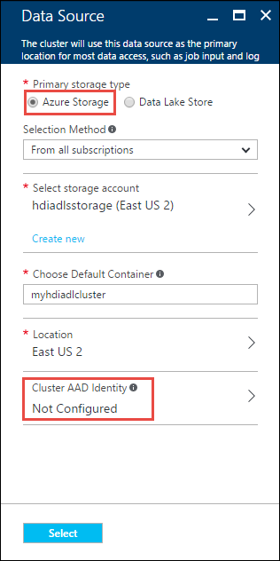

# Create Linux-based clusters in HDInsight using the Azure portal
[!INCLUDE [selector](../../includes/hdinsight-create-linux-cluster-selector.md)]

The Azure portal is a web-based management tool for services and resources hosted in the Microsoft Azure cloud. In this article you will learn how to create Linux-based HDInsight clusters using the portal.

## Prerequisites
[!INCLUDE [delete-cluster-warning](../../includes/hdinsight-delete-cluster-warning.md)]

* **An Azure subscription**. See [Get Azure free trial](https://azure.microsoft.com/documentation/videos/get-azure-free-trial-for-testing-hadoop-in-hdinsight/).
* **A modern web browser**. The Azure  portal uses HTML5 and Javascript, and may not function correctly in older web browsers.

### Access control requirements
[!INCLUDE [access-control](../../includes/hdinsight-access-control-requirements.md)]

## Create clusters
The Azure portal exposes most of the cluster properties. Using Azure Resource Manager template, you can hide a lot of details. For more information, see [Create Linux-based Hadoop clusters in HDInsight using Azure Resource Manager templates](hdinsight-hadoop-create-linux-clusters-arm-templates.md).

1. Sign in to the [Azure  portal](https://portal.azure.com).
2. Click **NEW**, Click **Data Analytics**, and then click **HDInsight**.
   
    

3. Enter **Cluster Name**: This name must be globally unique.

4. From the **Subscription** drop-down, select the Azure subscription that will be used for the cluster.

5. Click **Cluster configuration**, and then select:
   
   * **Cluster Type**: If you don't know what to choose, select **Hadoop**. It is the most popular cluster type.
     
     > [!IMPORTANT]
     > HDInsight clusters come in a variety of types, which correspond to the workload or technology that the cluster is tuned for. There is no supported method to create a cluster that combines multiple types, such as Storm and HBase on one cluster. 
     > 
     > 
   * **Operating System**: Select **Linux**.
   * **Version**: Use the default version if you don't know what to choose. For more information, see [HDInsight cluster versions](hdinsight-component-versioning.md).
   * **Cluster Tier**: Azure HDInsight provides the big data cloud offerings in two categories: Standard tier and Premium tier. For more information, see [Cluster tiers](hdinsight-hadoop-provision-linux-clusters.md#cluster-tiers).
     
     

6. Click **Applications** to install applications that work with HDInsight clusters. These applications can be developed by Microsoft, independent software vendors (ISV) or by yourself. For more information, see [Install HDInsight applications](hdinsight-apps-install-applications.md#install-applications-during-cluster-creation). 

7. Click **Credentials** and then enter a password for the admin user. You must also enter an **SSH Username** and either a **PASSWORD** or **PUBLIC KEY**, which will be used to authenticate the SSH user. Using a public key is the recommended approach. Click **Select** at the bottom to save the credentials configuration.
   
    
   
    For more information on using SSH with HDInsight, see one of the following articles:
   
   * [Use SSH with Hadoop on HDInsight from Linux, Unix, or OS X](hdinsight-hadoop-linux-use-ssh-unix.md)
   * [Use SSH with Hadoop on HDInsight from Windows](hdinsight-hadoop-linux-use-ssh-windows.md)

8. On the **Data Source** blade, specify whether you want Azure Storage (WASB) or Data Lake Store as your default storage.  

	* **Azure Storage Blobs as default storage**

		For **Primary Storage Type**, click **Azure Storage**. Specify the details for the storage account and storage container, specify a location, and then click **Cluster AAD Identity**.

		

	  >[!NOTE]
	  > Cluster AAD Identity is used to make the cluster accessible to the Azure Data Lake stores based on the AAD configuration. You will use this option if you want to use a Data Lake Store account as an additional storage associated with the cluster.
	  > 
	  >

		Click **Select** to save the data source configuration.

	* **Azure Data Lake Store as default storage**

		For instructions on how to create an HDInsight cluster with Data Lake Store as default storage, see [Create an HDInsight cluster with Data Lake Store using Azure Portal](../data-lake-store/data-lake-store-hdinsight-hadoop-use-portal.md).

		Click **Select** to save the data source configuration.

9. Click **Node Pricing Tiers** to display information about the nodes that will be created for this cluster. Set the number of worker nodes that you need for the cluster. The estimated cost of the cluster will be shown within the blade.
   
    
   
   > [!IMPORTANT]
   > If you plan on more than 32 worker nodes, either at cluster creation or by scaling the cluster after creation, then you must select a head node size with at least 8 cores and 14GB ram.
   > 
   > For more information on node sizes and associated costs, see [HDInsight pricing](https://azure.microsoft.com/pricing/details/hdinsight/).
   > 
   > 
   
   Click **Select** to save the node pricing configuration.

10. Click **Advanced Configuration** to configure other optional settings such as joining a **Virtual Network**, setting up an **External Metastore** to hold data for Hive and Oozie, use **Script Actions** to customize a cluster to install custom components, or use **Additional storage accounts** with the cluster.

    * **Virtual Network**: Select an Azure virtual network and the subnet if you want to place the cluster into a virtual network.  
      
        
      
        For information on using HDInsight with a Virtual Network, including specific configuration requirements for the Virtual Network, see [Extend HDInsight capabilities by using an Azure Virtual Network](hdinsight-extend-hadoop-virtual-network.md).

	* Click **External Metastores** to specify SQL database that you want to use to save Hive and Oozie metadata associated with the cluster.
      
      > [!NOTE]
      > Metastore configuration is not available for HBase cluster types.
      > 
      > 
      
        
      
        For **Use an existing SQL DB for Hive** metadata, click **Yes**, select a SQL database, and then provide the username/password for the database. Repeat these steps if you want to **Use an existing SQL DB for Oozie metadata**. Click **Select** till you are back on the **Optional Configuration** blade.
      
      > [!NOTE]
      > The Azure SQL database used for the metastore must allow connectivity to other Azure services, including Azure HDInsight. On the Azure SQL database dashboard, on the right side, click the server name. This is the server on which the SQL database instance is running. Once you are on the server view, click **Configure**, and then for **Azure Services**, click **Yes**, and then click **Save**.
      > 
      > 
      
        &nbsp;
      
      > [!IMPORTANT]
      > When creating a metastore, do not use a database name that contains dashes or hyphens, as this can cause the cluster creation process to fail.
      > 
      > 

	* **Script Actions** if you want to use a custom script to customize a cluster, as the cluster is being created. For more information about script actions, see [Customize HDInsight clusters using Script Action](hdinsight-hadoop-customize-cluster-linux.md). On the Script Actions blade provide the details as shown in the screen capture.
      
        

	* Click **Additional Storage Accounts** to specify additional storage accounts to associate with the cluster. In the **Azure Storage Keys** blade, click **Add a storage key**, and then select an existing storage account or create a new account.
      
        
      
        You can also add additional storage accounts after a cluster has been created.  See [Customize Linux-based HDInsight clusters using Script Action](hdinsight-hadoop-customize-cluster-linux.md).
      
        Click **Select** till you are back on the **New HDInsight cluster** blade.
      
        In addition to Blob storage account, you can also link Azure Data Lake stores. The configuration can be done by configure AAD from Data Source where you configured the default storage account and default container.

11. On the **New HDInsight Cluster** blade, ensure that **Pin to Startboard** is selected, and then click **Create**. This will create the cluster and add a tile for it to the Startboard of your Azure portal. The icon will indicate that the cluster is provisioning, and will change to display the HDInsight icon once provisioning has completed.
    
    | While provisioning | Provisioning complete |
    | --- | --- |
    |  | |
    
    > [!NOTE]
    > It will take some time for the cluster to be created, usually around 15 minutes. Use the tile on the Startboard, or the **Notifications** entry on the left of the page to check on the provisioning process.
    > 
    > 
12. Once the creation process completes, click the tile for the cluster from the Startboard to launch the cluster blade. The cluster blade provides essential information about the cluster such as the name, the resource group it belongs to, the location, the operating system, URL for the cluster dashboard, etc.
    
    
    
    Use the following to understand the icons at the top of this blade, and in the **Essentials** section:
    
    * **Settings** and **All Settings**: Displays the **Settings** blade for the cluster, which allows you to access detailed configuration information for the cluster.
    * **Dashboard**, **Cluster Dashboard**, and **URL**: These are all ways to access the cluster dashboard, which is a Web portal to run jobs on the cluster.
    * **Secure Shell**: Information needed to access the cluster using SSH.
    * **Delete**: Deletes the HDInsight cluster.
    * **Quickstart** (): Displays information that will help you get started using HDInsight.
    * **Users** (): Allows you to set permissions for *portal management* of this cluster for other users on your Azure subscription.
      
      > [!IMPORTANT]
      > This *only* affects access and permissions to this cluster in the Azure portal, and has no effect on who can connect to or submit jobs to the HDInsight cluster.
      > 
      > 
    * **Tags** (): Tags allows you to set key/value pairs to define a custom taxonomy of your cloud services. For example, you may create a key named **project**, and then use a common value for all services associated with a specific project.

## Customize clusters
* See [Customize HDInsight clusters using Bootstrap](hdinsight-hadoop-customize-cluster-bootstrap.md).
* See [Customize HDInsight clusters using Script Action](hdinsight-hadoop-customize-cluster-linux.md).

## Delete the cluster
[!INCLUDE [delete-cluster-warning](../../includes/hdinsight-delete-cluster-warning.md)]

## Next steps
Now that you have successfully created an HDInsight cluster, use the following to learn how to work with your cluster:

### Hadoop clusters
* [Use Hive with HDInsight](hdinsight-use-hive.md)
* [Use Pig with HDInsight](hdinsight-use-pig.md)
* [Use MapReduce with HDInsight](hdinsight-use-mapreduce.md)

### HBase clusters
* [Get started with HBase on HDInsight](hdinsight-hbase-tutorial-get-started-linux.md)
* [Develop Java applications for HBase on HDInsight](hdinsight-hbase-build-java-maven-linux.md)

### Storm clusters
* [Develop Java topologies for Storm on HDInsight](hdinsight-storm-develop-java-topology.md)
* [Use Python components in Storm on HDInsight](hdinsight-storm-develop-python-topology.md)
* [Deploy and monitor topologies with Storm on HDInsight](hdinsight-storm-deploy-monitor-topology-linux.md)

### Spark clusters
* [Create a standalone application using Scala](hdinsight-apache-spark-create-standalone-application.md)
* [Run jobs remotely on a Spark cluster using Livy](hdinsight-apache-spark-livy-rest-interface.md)
* [Spark with BI: Perform interactive data analysis using Spark in HDInsight with BI tools](hdinsight-apache-spark-use-bi-tools.md)
* [Spark with Machine Learning: Use Spark in HDInsight to predict food inspection results](hdinsight-apache-spark-machine-learning-mllib-ipython.md)
* [Spark Streaming: Use Spark in HDInsight for building real-time streaming applications](hdinsight-apache-spark-eventhub-streaming.md)

