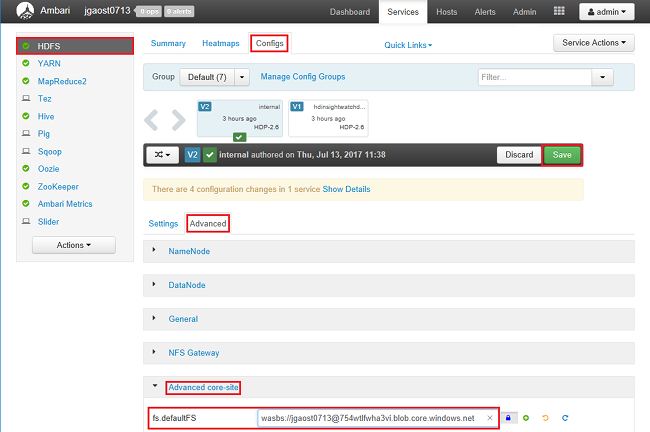

# Create Hadoop cluster with secure transfer storage accounts in Azure HDInsight

The [Secure transfer required](../storage/storage-require-secure-transfer.md) feature enhances the security of your Azure Storage account by enforcing all requests to your account through a secure connection. This feature and the wasbs scheme are only supported by HDInsight cluster version 3.6 or newer. 
[!INCLUDE [delete-cluster-warning](../../includes/hdinsight-delete-cluster-warning.md)]

## Prerequisites
Before you begin this tutorial, you must have:

* **Azure subscription**: To create a free one-month trial account, browse to [azure.microsoft.com/free](https://azure.microsoft.com/free).
* **Azure Storage account with secure transfer enabled**.  See [Create a stroage account](../storage/storage-create-storage-account.md#create-a-storage-account) and [Require secure transfer](../storage/storage-require-secure-transfer.md).

## Create cluster

In this section, you create a Hadoop cluster in HDInsight using an [Azure Resource Manager template](../azure-resource-manager/resource-group-template-deploy.md). Only HDInsight cluster version 3.6 or newer supports the secure transfer enabled storage accounts. Resource Manager template experience is not required for following this tutorial. For other cluster creation methods and understanding the properties used in this tutorial, see [Create HDInsight clusters](hdinsight-hadoop-provision-linux-clusters.md).

The Resource Manager template used in this tutorial is located in [GitHub](https://azure.microsoft.com/resources/templates/101-hdinsight-linux-ssh-password/). 

1. Click the following image to sign in to Azure and open the Resource Manager template in the Azure portal. 
   
    

2. Follow the instructions to create the cluster.  For the detailed instructions, see [Create cluster](./hdinsight-hadoop-linux-tutorial-get-started.md#create-cluster). The template creates a version 3.6 cluster.

## Enable secure transfer for the storage accounts

Currently, you can enable secure transfer for the storage accounts only after the HDInsight cluster has been created.  For the instructions for enabling secure transfer, see [Require secure transfer for an existing storage account](../storage/storage-require-secure-transfer.md).

## Configure the defaultFS setting

The following procedure is required only if you use a secure transfer enabled storage account as the default storage account. You must restart all the related services.

**To configure the defaultFS setting**

1. Sign in to the Ambari Web UI.  See [Connectivity](./hdinsight-hadoop-manage-ambari.md#connectivity).

     

2. From the left menu, click **HDFS**.
3. Click the **Configs** tab.
4. Click the **Advanced** tab.
5. Expand the **Advanced core-site** section.
6. Update **fs.defaultFS** to use **wasbs://** instead of **wasb://**.
7. Click **Save**.
8. Add a note, and then click **Save**.
9. Click **OK**.
10. Click **Proceed Anyway**.
11. Click **OK**.
12. Click **Restart**, and then click **Restart All Affected**.
13. Click **Confirm Restart All**.
14. Click **OK** to close the dialog.

The following procedure is only required for Spark clusters:

**To configure the default storage account for Spark clusters:**

1. Sign in to the Ambari Web UI.  See [Connectivity](./hdinsight-hadoop-manage-ambari.md#connectivity).
2. Click **Spark2** from the left menu.
3. Click the **Configs** tab.
4. Click **Advanced spark2-defaults** to expand the node.
5. Update the scheme to **wasb://** for the following fields:

    - spark.eventLog.dir, 
    - spark.history.fs.logDirectory
6. Click **Advanced spark2-thrift-sparkconf** to expand the node.
7. Update the scheme to **wasb://** for the following fields: 

    - spark.eventLog.dir, 
    - spark.history.fs.logDirectory
7. Click **Save**.
8. Add a note, and then click **Save**.
9. Click **OK**.
10. Click **Proceed Anyway**.
11. Click **OK**.
12. Click **Restart** to restart the affected services.

## Add additional storage accounts

You can use script action to add additional secure transfer enabled storage accounts to a HDInsight cluster.  For more information, see [Add additional storage accounts to HDInsight](hdinsight-hadoop-add-storage.md).

## Next steps
In this tutorial, you have learned how to create a HDInsight cluster, and enable secure transfer to the storage accounts.

To learn more about analyzing data with HDInsight, see the following articles:

* To learn more about using Hive with HDInsight, including how to perform Hive queries from Visual Studio, see [Use Hive with HDInsight][hdinsight-use-hive].
* To learn about Pig, a language used to transform data, see [Use Pig with HDInsight][hdinsight-use-pig].
* To learn about MapReduce, a way to write programs that process data on Hadoop, see [Use MapReduce with HDInsight][hdinsight-use-mapreduce].
* To learn about using the HDInsight Tools for Visual Studio to analyze data on HDInsight, see [Get started using Visual Studio Hadoop tools for HDInsight](hdinsight-hadoop-visual-studio-tools-get-started.md).

If you're ready to start working with your own data and need to know more about how HDInsight stores data or how to get data into HDInsight, see the following articles:

* For information on how HDInsight uses Azure Storage, see [Use Azure Storage with HDInsight](hdinsight-hadoop-use-blob-storage.md).
* For information on how to upload data to HDInsight, see [Upload data to HDInsight][hdinsight-upload-data].

If you'd like to learn more about creating or managing an HDInsight cluster, see the following articles:

* To learn about managing your Linux-based HDInsight cluster, see [Manage HDInsight clusters using Ambari](hdinsight-hadoop-manage-ambari.md).
* To learn more about the options you can select when creating an HDInsight cluster, see [Creating HDInsight on Linux using custom options](hdinsight-hadoop-provision-linux-clusters.md).
* If you are familiar with Linux, and Hadoop, but want to know specifics about Hadoop on the HDInsight, see [Working with HDInsight on Linux](hdinsight-hadoop-linux-information.md). This article provides information such as:
  
  * URLs for services hosted on the cluster, such as Ambari and WebHCat
  * The location of Hadoop files and examples on the local file system
  * The use of Azure Storage (WASB) instead of HDFS as the default data store

[1]: ../HDInsight/hdinsight-hadoop-visual-studio-tools-get-started.md

[hdinsight-provision]: hdinsight-provision-linux-clusters.md
[hdinsight-upload-data]: hdinsight-upload-data.md
[hdinsight-use-mapreduce]: hdinsight-use-mapreduce.md
[hdinsight-use-hive]: hdinsight-use-hive.md
[hdinsight-use-pig]: hdinsight-use-pig.md

