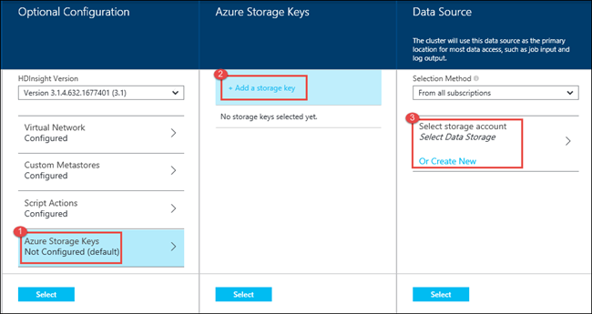
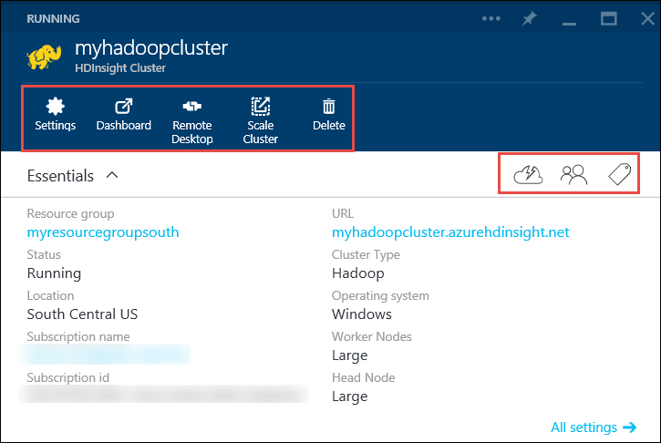

<properties
   pageTitle="Create Hadoop clusters in HDInsight | Microsoft Azure"
   	description="Learn how to create clusters for Azure HDInsight by using the Azure Portal."
   services="hdinsight"
   documentationCenter=""
   tags="azure-portal"
   authors="mumian"
   manager="paulettm"
   editor="cgronlun"/>

<tags
   ms.service="hdinsight"
   ms.devlang="na"
   ms.topic="article"
   ms.tgt_pltfrm="na"
   ms.workload="big-data"
   ms.date="06/10/2016"
   ms.author="jgao"/>

# Create Windows-based Hadoop clusters in HDInsight using the Azure Portal

[AZURE.INCLUDE [selector](../../includes/hdinsight-selector-create-clusters.md)]

Learn how to create an Hadoop cluster in HDInsight using Azure Portal. The Microsoft [Azure portal](../azure-portal-overview.md) is a central place where you can provision and manage your Azure resources. Azure Portal is one of the tools you can use to create either Linux-based or Windows-based Hadoop cluster in HDInsight. For other cluster creation tools and features click the tab select on the top of this page or see [Cluster creation methods](hdinsight-provision-clusters.md#cluster-creation-methods).

##Prerequisites:

[AZURE.INCLUDE [delete-cluster-warning](../../includes/hdinsight-delete-cluster-warning.md)]

Before you begin the instructions in this article, you must have the following:

- An Azure subscription. See [Get Azure free trial](https://azure.microsoft.com/documentation/videos/get-azure-free-trial-for-testing-hadoop-in-hdinsight/).

## Create clusters

**To create an HDInsight cluster**

1. Sign in to the [Azure Portal](https://portal.azure.com).
2. Click **NEW**, Click **Data Analytics**, and then click **HDInsight**.

    

3. Type or select the following values:

  * **Cluster Name**: Enter a name for the cluster. A green check will appear beside the cluster name if the name is available.
  * **Cluster Type**: Select **Hadoop**. Other options inclue **HBase**, **Storm**, and **Spark**.
  * **Cluster Operating System**: Select **Windows**. To create a Linux-base cluster, select **Linux**.
  * **Version**: See [HDInsight versions](hdinsight-component-versioning.md).
  * **Subscription**: Select the Azure subscription that will be used for creating this cluster.
  * **Resource Group**: Select an existing or create a new resource group. This entry will default to one of your existing resource groups, if any are available.
  * **Credentials**: Configure the username and the password for the Hadoop user (HTTP user). If you enable remote desktop for the cluster, you will need to configure the remote desktop user username and password, and an account expiration date. Click **Select** at the bottom to save the changes.

	   	

  * **Data Source**: Create a new or select an existing Azure Storage account to be used as the default file system for the cluster.

   		

  		* **Selection Method**: Set this to **From all subscriptions** to enable browsing of storage accounts from all your subscriptions. Set this to **Access Key** if you want to enter the **Storage Name** and **Access Key** of an existing storage account.
  		* **Select storage account / Create New**: Click **Select storage account** to browse and select an existing storage account you want to associate with the cluster. Or, click **Create New** to create a new storage account. Use the field that appears to enter the name of the storage account. A green check will appear if the name is available.
  		* **Choose Default Container**: Use this to enter the name of the default container to use for the cluster. While you can enter any name here, we recommend using the same name as the cluster so that you can easily recognize that the container is used for this specific cluster.
  		* **Location**: The geographic region that the storage account is in, or will be created in. This location will determine the cluster location.  The cluster and its default storage account must co-locate in the same Azure data center.
  	
  * **Node Pricing Tiers**: Set the number of worker nodes that you need for the cluster. The estimated cost of the cluster will be shown within the blade.
  

		

  * **Optional Configuration** to select the cluster version, as well as configure other optional settings such as joining a **Virtual Network**, setting up an **External Metastore** to hold data for Hive and Oozie, use Script Actions to customize a cluster to install custom components, or use additional storage accounts with the cluster.

  		* **HDInsight Version**: Select the version you want to use for the cluster. For more information, see [HDInsight cluster versions](hdinsight-component-versioning.md).
  		* **Virtual Network**: Select an Azure virtual network and the subnet if you want to place the cluster into a virtual network.  

			

			For information on using HDInsight with a Virtual Network, including specific configuration requirements for the Virtual Network, see [Extend HDInsight capbilities by using an Azure Virtual Network](hdinsight-extend-hadoop-virtual-network.md).
  

  		
		* **External Metastores**: Specify an Azure SQL database to store Hive and Oozie metadata associated with the cluster.
 
            > [AZURE.NOTE] Metastore configuration is not available for HBase cluster types.

			

			For **Use an existing SQL DB for Hive** metadata, click **Yes**, select a SQL database, and then provide the username/password for the database. Repeat these steps if you want to **Use an existing SQL DB for Oozie metadata**. Click **Select** till you are back on the **Optional Configuration** blade.

			>[AZURE.NOTE] The Azure SQL database used for the metastore must allow connectivity to other Azure services, including Azure HDInsight. On the Azure SQL database dashboard, on the right side, click the server name. This is the server on which the SQL database instance is running. Once you are on the server view, click **Configure**, and then for **Azure Services**, click **Yes**, and then click **Save**.

            &nbsp;

            > [AZURE.IMPORTANT] When creating a metastore, do not use a database name that contains dashes or hyphens, as this can cause the cluster creation process to fail.
		
  		* **Script Actions** if you want to use a custom script to customize a cluster, as the cluster is being created. For more information about script actions, see [Customize HDInsight clusters using Script Action](hdinsight-hadoop-customize-cluster.md). On the Script Actions blade provide the details as shown in the screen capture.
  	

			

    	* **Azure Storage Keys**: Specify additional storage accounts to associate with the cluster. In the **Azure Storage Keys** blade, click **Add a storage key**, and then select an existing storage account or create a new account.
    

			

4. Click **Create**. Selecting **Pin to Startboard** will add a tile for cluster to the Startboard of your Portal. The icon will indicate that the cluster is being created, and will change to display the HDInsight icon once creation has completed.
	
    It will take some time for the cluster to be created, usually around 15 minutes. Use the tile on the Startboard, or the **Notifications** entry on the left of the page to check on the provisioning process.
	

5. Once the creation completes, click the tile for the cluster from the Startboard to launch the cluster blade. The cluster blade provides essential information about the cluster such as the name, the resource group it belongs to, the location, the operating system, URL for the cluster dashboard, etc.

	

	Use the following to understand the icons at the top of this blade, and in the **Essentials** section:

	* **Settings** and **All Settings**: Displays the **Settings** blade for the cluster, which allows you to access detailed configuration information for the cluster.
	* **Dashboard**, **Cluster Dashboard**, and **URL**: These are all ways to access the cluster dashboard, which is a Web portal to run jobs on the cluster.
	* **Remote Desktop**: Enables you to enable/disable remote desktop on the cluster nodes.
	* **Scale Cluster**: Allows you to change the number of worker nodes for this cluster.
	* **Delete**: Deletes the HDInsight cluster.
	* **Quickstart** (): Displays information that will help you get started using HDInsight.
	* **Users** (): Allows you to set permissions for _portal management_ of this cluster for other users on your Azure subscription.
	

		> [AZURE.IMPORTANT] This _only_ affects access and permissions to this cluster in the Portal, and has no effect on who can connect to or submit jobs to the HDInsight cluster.
		
	* **Tags** (): Tags allows you to set key/value pairs to define a custom taxonomy of your cloud services. For example, you may create a key named __project__, and then use a common value for all services associated with a specific project.

##Customize clusters

- See [Customize HDInsight clusters using Bootstrap](hdinsight-hadoop-customize-cluster-bootstrap.md).
- See [Customize Windows-based HDInsight clusters using Script Action](hdinsight-hadoop-customize-cluster.md).

##Next steps
In this article, you have learned several ways to create an HDInsight cluster. To learn more, see the following articles:

* [Get started with Azure HDInsight](hdinsight-hadoop-linux-tutorial-get-started.md) - Learn how to start working with your HDInsight cluster
* [Submit Hadoop jobs programmatically](hdinsight-submit-hadoop-jobs-programmatically.md) - Learn how to programmatically submit jobs to HDInsight
* [Manage Hadoop clusters in HDInsight by using the Azure Portal](hdinsight-administer-use-management-portal.md)

