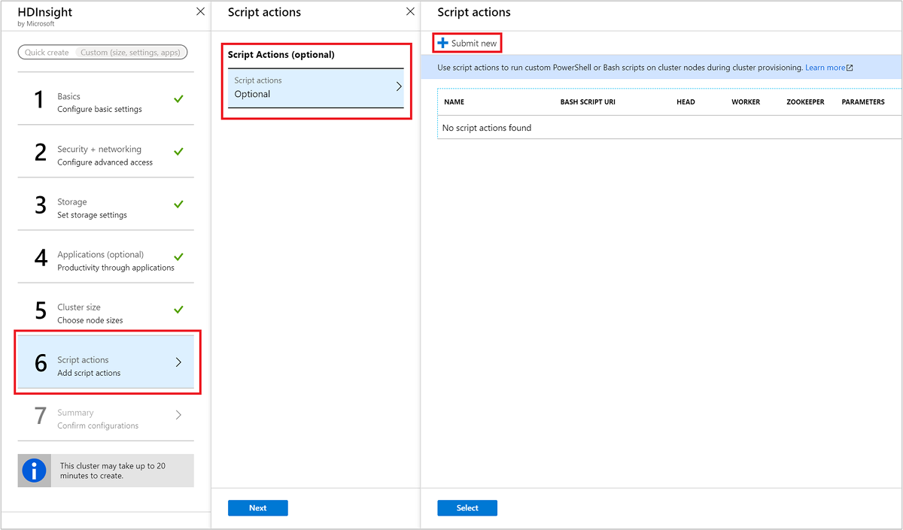

# Customize Azure HDInsight clusters by using script actions

Azure HDInsight provides a configuration method called **script actions** that invokes custom scripts to customize the cluster. These scripts are used to install additional components and change configuration settings. Script actions can be used during or after cluster creation.

Script actions can also be published to the Azure Marketplace as an HDInsight application. For more information on HDInsight applications, see [Publish an HDInsight application in the Azure Marketplace](hdinsight-apps-publish-applications.md).

## Permissions

For a domain-joined HDInsight cluster, there are two Apache Ambari permissions that are required when you use script actions with the cluster:

* **AMBARI.RUN\_CUSTOM\_COMMAND**. The Ambari Administrator role has this permission by default.
* **CLUSTER.RUN\_CUSTOM\_COMMAND**. Both the HDInsight Cluster Administrator and Ambari Administrator have this permission by default.

For more information on working with permissions with domain-joined HDInsight, see [Manage HDInsight clusters with Enterprise Security Package](./domain-joined/apache-domain-joined-manage.md).

## Access control

If you aren't the administrator or owner of your Azure subscription, your account must have at least Contributor access to the resource group that contains the HDInsight cluster.

If you create an HDInsight cluster, someone with at least Contributor access to the Azure subscription must have previously registered the provider for HDInsight. Provider registration happens when a user with Contributor access to the subscription creates a resource for the first time on the subscription. It can also be done without creating a resource if you [register a provider by using REST](https://msdn.microsoft.com/library/azure/dn790548.aspx).

Get more information on working with access management:

* [Get started with access management in the Azure portal](../role-based-access-control/overview.md)
* [Use role assignments to manage access to your Azure subscription resources](../role-based-access-control/role-assignments-portal.md)

## Understand script actions

A script action is Bash script that runs on the nodes in an HDInsight cluster. Characteristics and features of script actions are as follows:

* Must be stored on a URI that's accessible from the HDInsight cluster. The following are possible storage locations:

    * For regular clusters:

      * ADLS Gen1: The service principal HDInsight uses to access Data Lake Storage must have read access to the script. The URI format for scripts stored in Data Lake Storage Gen1 is 
      `adl://DATALAKESTOREACCOUNTNAME.azuredatalakestore.net/path_to_file`.

      * A blob in an Azure Storage account that's either the primary or additional storage account for the HDInsight cluster. HDInsight is granted access to both of these types of storage accounts during cluster creation.

        > [!IMPORTANT]  
        > Do not rotate the storage key on this Azure Storage account, as it will cause subsequent script actions with scripts stored there to fail.

      * A public file-sharing service accessible through http:// paths. Examples are Azure Blob, GitHub, OneDrive.

        For example URIs, see [Example script action scripts](#example-script-action-scripts).

     * For clusters with ESP:

         * The wasb:// or wasbs:// or http[s]:// URIs are supported.

* Can be restricted to run on only certain node types. Examples are head nodes or worker nodes.

* Can be persisted or ad hoc.

    Persisted scripts are used to customize new worker nodes added to the cluster through scaling operations. A persisted script might also apply changes to another node type when scaling operations occur. An example is a head node.

  > [!IMPORTANT]  
  > Persisted script actions must have a unique name.

    Ad hoc scripts aren't persisted. They aren't applied to worker nodes added to the cluster after the script has run. Then you can promote an ad hoc script to a persisted script or demote a persisted script to an ad hoc script.

  > [!IMPORTANT]  
  > Script actions used during cluster creation are automatically persisted.
  >
  > Scripts that fail aren't persisted, even if you specifically indicate that they should be.

* Can accept parameters that are used by the script during execution.

* Run with root-level privileges on the cluster nodes.

* Can be used through the Azure portal, Azure PowerShell, the Azure classic CLI, or the HDInsight .NET SDK.

The cluster keeps a history of all scripts that have been run. The history helps when you need to find the ID of a script for promotion or demotion operations.

> [!IMPORTANT]  
> There's no automatic way to undo the changes made by a script action. Either manually reverse the changes or provide a script that reverses them.

### Script action in the cluster creation process

Script actions used during cluster creation are slightly different from script actions run on an existing cluster:

* The script is automatically persisted.

* A failure in the script can cause the cluster creation process to fail.

The following diagram illustrates when script action runs during the creation process:

![HDInsight cluster customization and stages during cluster creation][img-hdi-cluster-states]

The script runs while HDInsight is being configured. The script runs in parallel on all the specified nodes in the cluster. It runs with root privileges on the nodes.

> [!NOTE]  
> You can perform operations like stopping and starting services, including Apache Hadoop-related services. If you stop services, make sure that the Ambari service and other Hadoop-related services are running before the script finishes. These services are required to successfully determine the health and state of the cluster while it's being created.

During cluster creation, you can use many script actions at once. These scripts are invoked in the order in which they were specified.

> [!IMPORTANT]  
> Script actions must finish within 60 minutes, or they time out. During cluster provisioning, the script runs concurrently with other setup and configuration processes. Competition for resources such as CPU time or network bandwidth might cause the script to take longer to finish than it does in your development environment.
>
> To minimize the time it takes to run the script, avoid tasks like downloading and compiling applications from the source. Precompile applications and store the binary in Azure Storage.

### Script action on a running cluster

A failure in a script run on an already running cluster doesn't automatically cause the cluster to change to a failed state. After a script finishes, the cluster should return to a running state.

> [!IMPORTANT]  
> Even if the cluster has a running state, the failed script might have broken things. For example, a script might delete files needed by the cluster.
>
> Scripts actions run with root privileges. Make sure that you understand what a script does before you apply it to your cluster.

When you apply a script to a cluster, the cluster state changes from **Running** to **Accepted**. Then it changes to **HDInsight configuration** and, finally, back to **Running** for successful scripts. The script status is logged in the script action history. This information tells you whether the script succeeded or failed. For example, the `Get-AzHDInsightScriptActionHistory` PowerShell cmdlet shows the status of a script. It returns information similar to the following text:

    ScriptExecutionId : 635918532516474303
    StartTime         : 8/14/2017 7:40:55 PM
    EndTime           : 8/14/2017 7:41:05 PM
    Status            : Succeeded

> [!IMPORTANT]  
> If you change the cluster user, admin, password after the cluster is created, script actions run against this cluster might fail. If you have any persisted script actions that target worker nodes, these scripts might fail when you scale the cluster.

## Example script action scripts

Script action scripts can be used through the following utilities:

* The Azure portal
* Azure PowerShell
* The Azure classic CLI
* An HDInsight .NET SDK

HDInsight provides scripts to install the following components on HDInsight clusters:

| Name | Script |
| --- | --- |
| Add an Azure Storage account |`https://hdiconfigactions.blob.core.windows.net/linuxaddstorageaccountv01/add-storage-account-v01.sh`. See [Add additional storage accounts to HDInsight](hdinsight-hadoop-add-storage.md). |
| Install Hue |`https://hdiconfigactions.blob.core.windows.net/linuxhueconfigactionv02/install-hue-uber-v02.sh`. See [Install and use Hue on HDInsight Hadoop clusters](hdinsight-hadoop-hue-linux.md). |
| Preload Hive libraries |`https://hdiconfigactions.blob.core.windows.net/linuxsetupcustomhivelibsv01/setup-customhivelibs-v01.sh`. See [Add custom Apache Hive libraries when creating your HDInsight cluster](hdinsight-hadoop-add-hive-libraries.md). |

## Use a script action during cluster creation

This section explains the different ways you can use script actions when you create an HDInsight cluster.

### Use a script action during cluster creation from the Azure portal

1. Start to create a cluster as described in [Create Linux-based clusters in HDInsight by using the Azure portal](hdinsight-hadoop-create-linux-clusters-portal.md). During cluster creation, you arrive at step 6, **Script actions**. Navigate to **Optional** > **+ Submit new**.

    

1. Use the __Select a script__ entry to select a premade script. To use a custom script, select __Custom__. Then provide the __Name__ and __Bash script URI__ for your script.

    

    The following table describes the elements on the form:

    | Property | Value |
    | --- | --- |
    | Select a script | To use your own script, select __Custom__. Otherwise, select one of the provided scripts. |
    | Name |Specify a name for the script action. |
    | Bash script URI |Specify the URI of the script. |
    | Head/Worker/ZooKeeper |Specify the nodes on which the script is run: **Head**, **Worker**, or **ZooKeeper**. |
    | Parameters |Specify the parameters, if required by the script. |

    Use the __Persist this script action__ entry to make sure that the script is applied during scaling operations.

1. Select __Create__ to save the script. Then you can use __+ Submit new__ to add another script.

    

    When you're done adding scripts, select the __Select__ button and then the __Next__ button to continue to the __Cluster summary__ section.

1. To create the cluster, select __Create__ from the __Cluster summary__ selection.

### Use a script action from Azure Resource Manager templates

Script actions can be used with Azure Resource Manager templates. For an example, see [Create HDInsight Linux Cluster and run a script action](https://azure.microsoft.com/resources/templates/hdinsight-linux-run-script-action/).

In this example, the script action is added by using the following code:

```json
"scriptActions": [
    {
        "name": "setenvironmentvariable",
        "uri": "[parameters('scriptActionUri')]",
        "parameters": "headnode"
    }
]
```

Get more information on how to deploy a template:

* [Deploy resources with Resource Manager templates and Azure PowerShell](https://docs.microsoft.com/azure/azure-resource-manager/resource-group-template-deploy)

* [Deploy resources with Resource Manager templates and the Azure CLI](https://docs.microsoft.com/azure/azure-resource-manager/resource-group-template-deploy-cli)

### Use a script action during cluster creation from Azure PowerShell

In this section, you use the [Add-AzHDInsightScriptAction](https://docs.microsoft.com/powershell/module/az.hdinsight/add-azhdinsightscriptaction) cmdlet to invoke scripts to customize a cluster. Before you start, make sure you install and configure Azure PowerShell. To use these PowerShell commands, you need the [AZ Module](https://docs.microsoft.com/powershell/azure/overview).

[!INCLUDE [updated-for-az](../../includes/updated-for-az.md)]

The following script shows how to apply a script action when you create a cluster by using PowerShell:

[!code-powershell[main](../../powershell_scripts/hdinsight/use-script-action/use-script-action.ps1?range=5-90)]

It can take several minutes before the cluster is created.

### Use a script action during cluster creation from the HDInsight .NET SDK

The HDInsight .NET SDK provides client libraries that make it easier to work with HDInsight from a .NET application. For a code sample, see [Script Actions](https://docs.microsoft.com/dotnet/api/overview/azure/hdinsight?view=azure-dotnet#script-actions).

## Apply a script action to a running cluster

This section explains how to apply script actions to a running cluster.

### Apply a script action to a running cluster from the Azure portal

Go to the [Azure portal](https://portal.azure.com):

1. From the left menu, navigate to **All services** >  **Analytics** > **HDInsight clusters**.

1. Select your cluster from the list, which opens the default view.

1. From the default view, under **Settings**, select **Script actions**.

1. From the top of the **Script actions** page, select **+ Submit new**.

    

1. Use the __Select a script__ entry to select a premade script. To use a custom script, select __Custom__. Then provide the __Name__ and __Bash script URI__ for your script.

    

    The following table describes the elements on the form:

    | Property | Value |
    | --- | --- |
    | Select a script | To use your own script, select __custom__. Otherwise, select a provided script. |
    | Name |Specify a name for the script action. |
    | Bash script URI |Specify the URI of the script. |
    | Head/Worker/Zookeeper |Specify the nodes on which the script is run: **Head**, **Worker**, or **ZooKeeper**. |
    | Parameters |Specify the parameters, if required by the script. |

    Use the __Persist this script action__ entry to make sure the script is applied during scaling operations.

1. Finally, select the **Create** button to apply the script to the cluster.

### Apply a script action to a running cluster from Azure PowerShell

To use these PowerShell commands, you need the [AZ Module](https://docs.microsoft.com/powershell/azure/overview).

The following example shows how to apply a script action to a running cluster:

[!code-powershell[main](../../powershell_scripts/hdinsight/use-script-action/use-script-action.ps1?range=105-117)]

After the operation finishes, you receive information similar to the following text:

    OperationState  : Succeeded
    ErrorMessage    :
    Name            : Giraph
    Uri             : https://hdiconfigactions.blob.core.windows.net/linuxgiraphconfigactionv01/giraph-installer-v01.sh
    Parameters      :
    NodeTypes       : {HeadNode, WorkerNode}

### Apply a script action to a running cluster from the Azure CLI

Before you start, make sure you install and configure the Azure CLI. For more information, see [Install the Azure classic CLI](https://docs.microsoft.com/cli/azure/install-classic-cli?view=azure-cli-latest).

[!INCLUDE [classic-cli-warning](../../includes/requires-classic-cli.md)]

1. Switch to Azure Resource Manager mode:

    ```bash
    azure config mode arm
    ```

2. Authenticate to your Azure subscription:

    ```bash
    azure login
    ```

3. Apply a script action to a running cluster:

    ```bash
    azure hdinsight script-action create <clustername> -g <resourcegroupname> -n <scriptname> -u <scriptURI> -t <nodetypes>
    ```

    If you omit parameters for this command, you're prompted for them. If the script you specify with `-u` accepts parameters, you can specify them by using the `-p` parameter.

    Valid node types are `headnode`, `workernode`, and `zookeeper`. If the script should be applied to several node types, specify the types separated by a semicolon `;`. For example, `-n headnode;workernode`.

    To persist the script, add `--persistOnSuccess`. You can also persist the script later by using `azure hdinsight script-action persisted set`.

    After the job finishes, you get output like the following text:

        info:    Executing command hdinsight script-action create
        + Executing Script Action on HDInsight cluster
        data:    Operation Info
        data:    ---------------
        data:    Operation status:
        data:    Operation ID:  b707b10e-e633-45c0-baa9-8aed3d348c13
        info:    hdinsight script-action create command OK

### Apply a script action to a running cluster by using REST API

See [Cluster REST API in Azure HDInsight](https://msdn.microsoft.com/library/azure/mt668441.aspx).

### Apply a script action to a running cluster from the HDInsight .NET SDK

For an example of using the .NET SDK to apply scripts to a cluster, see [Apply a Script Action against a running Linux-based HDInsight cluster](https://github.com/Azure-Samples/hdinsight-dotnet-script-action).

## View history and promote and demote script actions

### The Azure portal

1. Sign in to the [Azure portal](https://portal.azure.com).

1. From the left menu, navigate to  **All services** > **Analytics** > **HDInsight clusters**.

1. Select your cluster from the list, which opens the default view.

1. From the default view, under **Settings**, select **Script actions**.

1. A history of scripts for this cluster displays on the script actions section. This information includes a list of persisted scripts. The following screenshot shows that the Solr script has been run on this cluster. The screenshot doesn't show any persisted scripts.

    

1. Select a script from the history to display the **Properties** section for this script. From the top of the screen, you can rerun the script or promote it.

    

1. You can also select the ellipsis, **...**, to the right of entries on the script actions section to perform actions.

    

### Azure PowerShell

| cmdlet | Function |
| --- | --- |
| `Get-AzHDInsightPersistedScriptAction` |Retrieve information on persisted script actions. |
| `Get-AzHDInsightScriptActionHistory` |Retrieve a history of script actions applied to the cluster or details for a specific script. |
| `Set-AzHDInsightPersistedScriptAction` |Promote an ad hoc script action to a persisted script action. |
| `Remove-AzHDInsightPersistedScriptAction` |Demote a persisted script action to an ad hoc action. |

> [!IMPORTANT]  
> `Remove-AzHDInsightPersistedScriptAction` doesn't undo the actions performed by a script. This cmdlet only removes the persisted flag.

The following example script demonstrates using the cmdlets to promote and then demote a script.

[!code-powershell[main](../../powershell_scripts/hdinsight/use-script-action/use-script-action.ps1?range=123-140)]

### The Azure classic CLI

| cmdlet | Function |
| --- | --- |
| `azure hdinsight script-action persisted list <clustername>` |Retrieve a list of persisted script actions. |
| `azure hdinsight script-action persisted show <clustername> <scriptname>` |Retrieve information on a specific persisted script action. |
| `azure hdinsight script-action history list <clustername>` |Retrieve a history of script actions applied to the cluster. |
| `azure hdinsight script-action history show <clustername> <scriptname>` |Retrieve information on a specific script action. |
| `azure hdinsight script action persisted set <clustername> <scriptexecutionid>` |Promote an ad hoc script action to a persisted script action. |
| `azure hdinsight script-action persisted delete <clustername> <scriptname>` |Demote a persisted script action to an ad hoc action. |

> [!IMPORTANT]  
> `azure hdinsight script-action persisted delete` doesn't undo the actions performed by a script. This cmdlet only removes the persisted flag.

### The HDInsight .NET SDK

For an example of using the .NET SDK to retrieve script history from a cluster, promote or demote scripts, see [
Apply a Script Action against a running Linux-based HDInsight cluster](https://github.com/Azure-Samples/hdinsight-dotnet-script-action).

> [!NOTE]  
> This example also demonstrates how to install an HDInsight application by using the .NET SDK.

## Support for open-source software used on HDInsight clusters

The Microsoft Azure HDInsight service uses an ecosystem of open-source technologies formed around Apache Hadoop. Microsoft Azure provides a general level of support for open-source technologies. For more information, see the **Support Scope** section of [Azure Support FAQs](https://azure.microsoft.com/support/faq/). The HDInsight service provides an additional level of support for built-in components.

Two types of open-source components are available in the HDInsight service:

* **Built-in components**. These components are preinstalled on HDInsight clusters and provide core functionality of the cluster. The following components belong to this category:

  * [Apache Hadoop YARN](https://hadoop.apache.org/docs/current/hadoop-yarn/hadoop-yarn-site/YARN.html) ResourceManager.
  * The Hive query language [HiveQL](https://cwiki.apache.org/confluence/display/Hive/LanguageManual).
  * [Apache Mahout](https://mahout.apache.org/).

    A full list of cluster components is available in [What are the Apache Hadoop components and versions available with HDInsight?](hdinsight-component-versioning.md)

* **Custom components**. As a user of the cluster, you can install or use in your workload any component available in the community or created by you.

> [!WARNING]  
> Components provided with the HDInsight cluster are fully supported. Microsoft Support helps to isolate and resolve issues related to these components.
>
> Custom components receive commercially reasonable support to help you further troubleshoot the issue. Microsoft Support might be able to resolve the issue. Or they might ask you to engage available channels for the open-source technologies where deep expertise for that technology is found. Many community sites can be used. Examples are [MSDN forum for HDInsight](https://social.msdn.microsoft.com/Forums/azure/home?forum=hdinsight) and [Stack Overflow](https://stackoverflow.com).
>
> Apache projects also have project sites on the [Apache website](https://apache.org). An example is [Hadoop](https://hadoop.apache.org/).

The HDInsight service provides several ways to use custom components. The same level of support applies, no matter how a component is used or installed on the cluster. The following list describes the most common ways that custom components  are used on HDInsight clusters:

1. **Job submission**. Hadoop or other types of jobs that execute or use custom components can be submitted to the cluster.

2. **Cluster customization**. During cluster creation, you can specify additional settings and custom components that are installed on the cluster nodes.

3. **Samples**. For popular custom components, Microsoft and others might provide samples of how these components can be used on HDInsight clusters. These samples are provided without support.

## Troubleshooting

You can use the Ambari web UI to view information logged by script actions. If the script fails during cluster creation, the logs are also available in the default storage account associated with the cluster. This section provides information on how to retrieve the logs by using both these options.

### The Apache Ambari web UI

1. In your browser, go to `https://CLUSTERNAME.azurehdinsight.net`. Replace **CLUSTERNAME** with the name of your HDInsight cluster.

    When prompted, enter the admin account name, **admin**, and password for the cluster. You might have to reenter the admin credentials in a web form.

2. From the bar at the top of the page, select the **ops** entry. A list displays current and previous operations done on the cluster through Ambari.

    

3. Find the entries that have **run\_customscriptaction** in the **Operations** column. These entries are created when the script actions run.

    

    To view the **STDOUT** and **STDERR** output, select the **run\customscriptaction** entry and drill down through the links. This output is generated when the script runs and might have useful information.

### Access logs from the default storage account

If cluster creation fails because of a script error, the logs are kept in the cluster storage account.

* The storage logs are available at `\STORAGE_ACCOUNT_NAME\DEFAULT_CONTAINER_NAME\custom-scriptaction-logs\CLUSTER_NAME\DATE`.

    

    Under this directory, the logs are organized separately for **headnode**, **worker node**, and **zookeeper node**. See the following examples:

    * **Headnode**: `<ACTIVE-HEADNODE-NAME>.cloudapp.net`

    * **Worker node**: `<ACTIVE-WORKERNODE-NAME>.cloudapp.net`

    * **Zookeeper node**: `<ACTIVE-ZOOKEEPERNODE-NAME>.cloudapp.net`

* All **stdout** and **stderr** of the corresponding host is uploaded to the storage account. There's one **output-\*.txt** and **errors-\*.txt** for each script action. The **output-*.txt** file contains information about the URI of the script that was run on the host. The following text is an example of this information:

        'Start downloading script locally: ', u'https://hdiconfigactions.blob.core.windows.net/linuxrconfigactionv01/r-installer-v01.sh'

* It's possible that you repeatedly create a script action cluster with the same name. In that case, you can distinguish the relevant logs based on the **DATE** folder name. For example, the folder structure for a cluster, **mycluster**, created on different dates appears similar to the following log entries:

    `\STORAGE_ACCOUNT_NAME\DEFAULT_CONTAINER_NAME\custom-scriptaction-logs\mycluster\2015-10-04`
    `\STORAGE_ACCOUNT_NAME\DEFAULT_CONTAINER_NAME\custom-scriptaction-logs\mycluster\2015-10-05`

* If you create a script action cluster with the same name on the same day, you can use the unique prefix to identify the relevant log files.

* If you create a cluster near 12:00 AM, midnight, it's possible that the log files span across two days. In that case, you see two different date folders for the same cluster.

* Uploading log files to the default container can take up to five minutes, especially for large clusters. So if you want to access the logs, you shouldn't immediately delete the cluster if a script action fails.

### Ambari watchdog

> [!WARNING]  
> Don't change the password for the Ambari watchdog, hdinsightwatchdog, on your Linux-based HDInsight cluster. Changing the password for this account breaks the ability to run new script actions on the HDInsight cluster.

### Can't import name BlobService

__Symptoms__. The script action fails. Text similar to the following error displays when you view the operation in Ambari:

```
Traceback (most recent call list):
  File "/var/lib/ambari-agent/cache/custom_actions/scripts/run_customscriptaction.py", line 21, in <module>
    from azure.storage.blob import BlobService
ImportError: cannot import name BlobService
```

__Cause__. This error occurs if you upgrade the Python Azure Storage client that's included with the HDInsight cluster. HDInsight expects Azure Storage client 0.20.0.

__Resolution__. To resolve this error, manually connect to each cluster node by using `ssh`. Run the following command to reinstall the correct storage client version:

```bash
sudo pip install azure-storage==0.20.0
```

For information on connecting to the cluster with SSH, see [Connect to HDInsight (Apache Hadoop) by using SSH](hdinsight-hadoop-linux-use-ssh-unix.md).

### History doesn't show the scripts used during cluster creation

If your cluster was created before March 15, 2016, you might not see an entry in script action history. Resizing the cluster causes the scripts to appear in script action history.

There are two exceptions:

* Your cluster was created before September 1, 2015. This date is when script actions were introduced. Any cluster created before this date couldn't have used script actions for cluster creation.

* You used multiple script actions during cluster creation. Or you used the same name for multiple scripts or the same name, same URI, but different parameters for multiple scripts. In these cases, you get the following error:

    No new script actions can be run on this cluster because of conflicting script names in existing scripts. Script names provided at cluster creation must be all unique. Existing scripts are run on resize.

## Next steps

* [Develop script action scripts for HDInsight](hdinsight-hadoop-script-actions-linux.md)
* [Add additional storage to an HDInsight cluster](hdinsight-hadoop-add-storage.md)

[img-hdi-cluster-states]: ./media/hdinsight-hadoop-customize-cluster-linux/cluster-provisioning-states.png "Stages during cluster creation"
