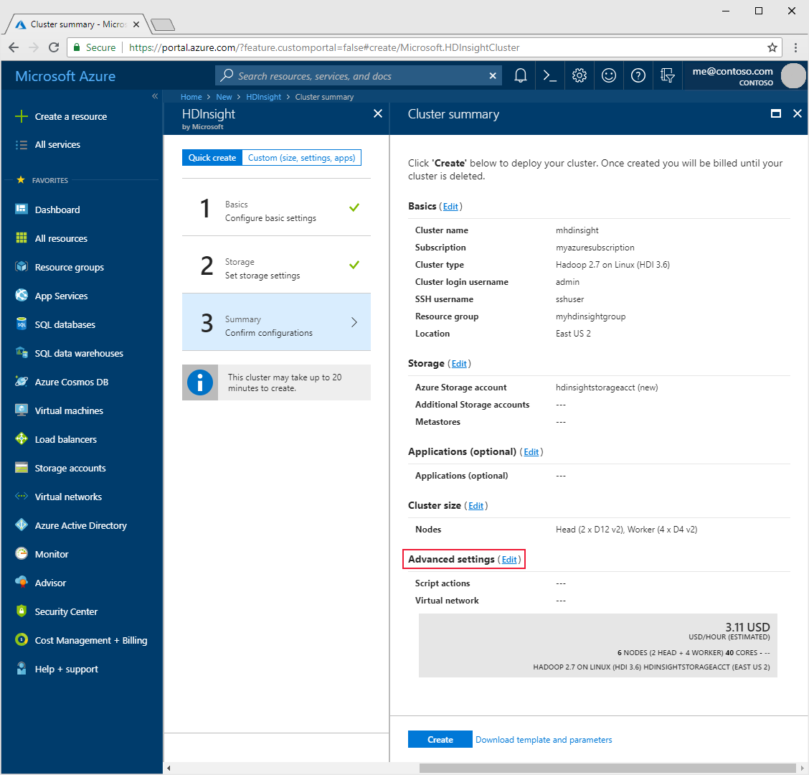
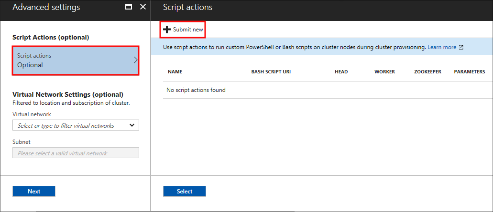
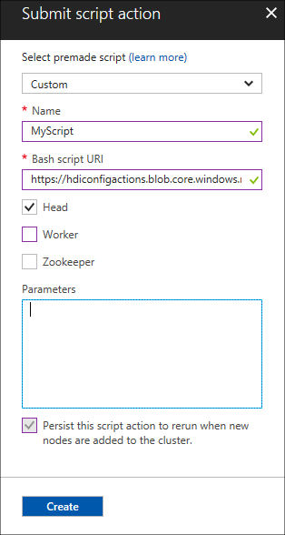
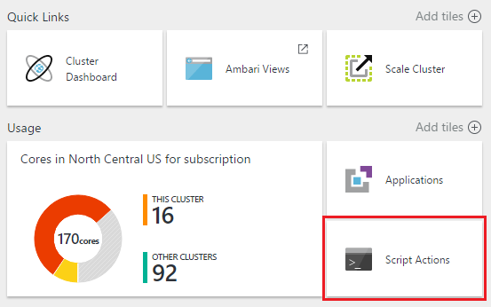
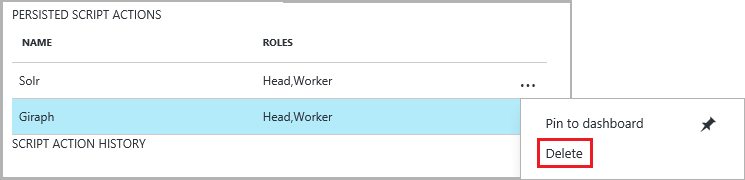
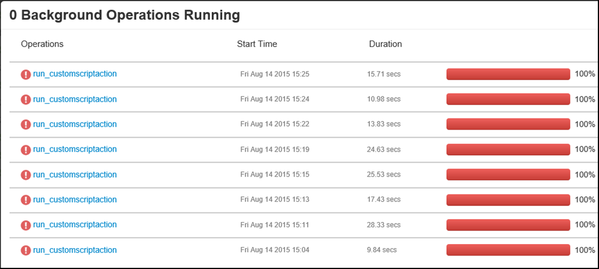
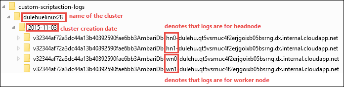

# Customize Linux-based HDInsight clusters using script actions

HDInsight provides a configuration method called **script actions** that invokes custom scripts to customize the cluster. These scripts are used to install additional components and change configuration settings. Script actions can be used during or after cluster creation.

> [!IMPORTANT]
> The ability to use script actions on an already running cluster is only available for Linux-based HDInsight clusters.
>
> Linux is the only operating system used on HDInsight version 3.4 or greater. For more information, see [HDInsight retirement on Windows](hdinsight-component-versioning.md#hdinsight-windows-retirement).

Script actions can also be published to the Azure Marketplace as an HDInsight application. For more information on HDInsight applications, see [Publish HDInsight applications into the Azure Marketplace](hdinsight-apps-publish-applications.md).

## Permissions

If you are using a domain-joined HDInsight cluster, there are two Ambari permissions that are required when using script actions with the cluster:

* **AMBARI.RUN\_CUSTOM\_COMMAND**: The Ambari Administrator role has this permission by default.
* **CLUSTER.RUN\_CUSTOM\_COMMAND**: Both the HDInsight Cluster Administrator and Ambari Administrator have this permission by default.

For more information on working with permissions with domain-joined HDInsight, see [Manage domain-joined HDInsight clusters](./domain-joined/apache-domain-joined-manage.md).

## Access control

If you are not the administrator/owner of your Azure subscription, your account must have at least **Contributor** access to the resource group that contains the HDInsight cluster.

Additionally, if you are creating an HDInsight cluster, someone with at least **Contributor** access to the Azure subscription must have previously registered the provider for HDInsight. Provider registration happens when a user with Contributor access to the subscription creates a resource for the first time on the subscription. It can also be accomplished without creating a resource by [registering a provider using REST](https://msdn.microsoft.com/library/azure/dn790548.aspx).

For more information on working with access management, see the following documents:

* [Get started with access management in the Azure portal](../role-based-access-control/overview.md)
* [Use role assignments to manage access to your Azure subscription resources](../role-based-access-control/role-assignments-portal.md)

## Understanding script actions

A script action is Bash script that runs on the nodes in an HDInsight cluster. The following are characteristics and features of script actions.

* Must be stored on a URI that is accessible from the HDInsight cluster. The following are possible storage locations:

    * An **Azure Data Lake Store** account that is accessible by the HDInsight cluster. For information on using Azure Data Lake Store with HDInsight, see [Quickstart: Set up clusters in HDInsight](../storage/data-lake-storage/quickstart-create-connect-hdi-cluster.md).

        When using a script stored in Data Lake Store, the URI format is `adl://DATALAKESTOREACCOUNTNAME.azuredatalakestore.net/path_to_file`.

        > [!NOTE]
        > The service principal HDInsight uses to access Data Lake Store must have read access to the script.

    * A blob in an **Azure Storage account** that is either the primary or additional storage account for the HDInsight cluster. HDInsight is granted access to both of these types of storage accounts during cluster creation.

    * A public file sharing service such as Azure Blob, GitHub, OneDrive, Dropbox, etc.

        For example URIs, see the [Example script action scripts](#example-script-action-scripts) section.

        > [!WARNING]
        > HDInsight only supports __General-purpose__ Azure Storage accounts. It does not currently support the __Blob storage__ account type.

* Can be restricted to **run on only certain node types**, for example head nodes or worker nodes.

* Can be **persisted** or **ad hoc**.

    **Persisted** scripts are used to customize new worker nodes added to the cluster through scaling operations. A persisted script might also apply changes to another node type, such as a head node, when scaling operations occur.

  > [!IMPORTANT]
  > Persisted script actions must have a unique name.

    **Ad hoc** scripts are not persisted. They are not applied to worker nodes added to the cluster after the script has ran. You can subsequently promote an ad hoc script to a persisted script, or demote a persisted script to an ad hoc script.

  > [!IMPORTANT]
  > Script actions used during cluster creation are automatically persisted.
  >
  > Scripts that fail are not persisted, even if you specifically indicate that they should be.

* Can accept **parameters** that are used by the script during execution.

* Run with **root level privileges** on the cluster nodes.

* Can be used through the **Azure portal**, **Azure PowerShell**, **Azure Classic CLI**, or **HDInsight .NET SDK**

The cluster keeps a history of all scripts that have been ran. The history is useful when you need to find the ID of a script for promotion or demotion operations.

> [!IMPORTANT]
> There is no automatic way to undo the changes made by a script action. Either manually reverse the changes or provide a script that reverses them.

### Script action in the cluster creation process

Script actions used during cluster creation are slightly different from script actions ran on an existing cluster:

* The script is **automatically persisted**.

* A **failure** in the script can cause the cluster creation process to fail.

The following diagram illustrates when script action is executed during the creation process:

![HDInsight cluster customization and stages during cluster creation][img-hdi-cluster-states]

The script runs while HDInsight is being configured. The script runs in parallel on all the specified nodes in the cluster, and runs with root privileges on the nodes.

> [!NOTE]
> You can perform operations like stopping and starting services, including Hadoop-related services. If you stop services, you must ensure that the Ambari service and other Hadoop-related services running before the script completes. These services are required to successfully determine the health and state of the cluster while it is being created.


During cluster creation, you can use multiple script actions at once. These scripts are invoked in the order in which they were specified.

> [!IMPORTANT]
> Script actions must complete within 60 minutes, or timeout. During cluster provisioning, the script runs concurrently with other setup and configuration processes. Competition for resources such as CPU time or network bandwidth may cause the script to take longer to finish than it does in your development environment.
>
> To minimize the time it takes to run the script, avoid tasks such as downloading and compiling applications from source. Pre-compile applications and store the binary in Azure Storage.


### Script action on a running cluster

A failure in a script ran on an already running cluster does not automatically cause the cluster to change to a failed state. Once a script completes, the cluster should return to a "running" state.

> [!IMPORTANT]
> Even if the cluster has a 'running' state, the failed script may have broken things. For example, a script could delete files needed by the cluster.
>
> Scripts actions run with root privileges. Make sure that you understand what a script does before applying it to your cluster.

When applying a script to a cluster, the cluster state changes from **Running** to **Accepted**, then **HDInsight configuration**, and finally back to **Running** for successful scripts. The script status is logged in the script action history, and you can use this information to determine whether the script succeeded or failed. For example, the `Get-AzureRmHDInsightScriptActionHistory` PowerShell cmdlet can be used to view the status of a script. It returns information similar to the following text:

    ScriptExecutionId : 635918532516474303
    StartTime         : 8/14/2017 7:40:55 PM
    EndTime           : 8/14/2017 7:41:05 PM
    Status            : Succeeded

> [!IMPORTANT]
> If you have changed the cluster user (admin) password after the cluster was created, script actions ran against this cluster may fail. If you have any persisted script actions that target worker nodes, these scripts may fail when you scale the cluster.

## Example script action scripts

Script action scripts can be used through the following utilities:

* Azure portal
* Azure PowerShell
* Azure Classic CLI
* HDInsight .NET SDK

HDInsight provides scripts to install the following components on HDInsight clusters:

| Name | Script |
| --- | --- |
| **Add an Azure Storage account** |https://hdiconfigactions.blob.core.windows.net/linuxaddstorageaccountv01/add-storage-account-v01.sh. See [Add additional storage to an HDInsight cluster](hdinsight-hadoop-add-storage.md). |
| **Install Hue** |https://hdiconfigactions.blob.core.windows.net/linuxhueconfigactionv02/install-hue-uber-v02.sh. See [Install and use Hue on HDInsight clusters](hdinsight-hadoop-hue-linux.md). |
| **Install Presto** |https://raw.githubusercontent.com/hdinsight/presto-hdinsight/master/installpresto.sh. See [Install and use Presto on HDInsight clusters](hdinsight-hadoop-install-presto.md). |
| **Install Solr** |https://hdiconfigactions.blob.core.windows.net/linuxsolrconfigactionv01/solr-installer-v01.sh. See [Install and use Solr on HDInsight clusters](hdinsight-hadoop-solr-install-linux.md). |
| **Install Giraph** |https://hdiconfigactions.blob.core.windows.net/linuxgiraphconfigactionv01/giraph-installer-v01.sh. See [Install and use Giraph on HDInsight clusters](hdinsight-hadoop-giraph-install-linux.md). |
| **Pre-load Hive libraries** |https://hdiconfigactions.blob.core.windows.net/linuxsetupcustomhivelibsv01/setup-customhivelibs-v01.sh. See [Add Hive libraries on HDInsight clusters](hdinsight-hadoop-add-hive-libraries.md). |
| **Install or update Mono** | https://hdiconfigactions.blob.core.windows.net/install-mono/install-mono.bash. See [Install or update Mono on HDInsight](hdinsight-hadoop-install-mono.md). |

## Use a script action during cluster creation

This section provides examples on the different ways you can use script actions when creating an HDInsight cluster.

### Use a script action during cluster creation from the Azure portal

1. Start creating a cluster as described at [Create Hadoop clusters in HDInsight](hdinsight-hadoop-provision-linux-clusters.md). During cluster creation, you will arrive at a __Cluster summary__ page. From the __Cluster summary__ page, select the __edit__ link for __Advanced settings__.

    

3. From the __Advanced settings__ section, select __Script actions__. From the __Script actions__ section, select __+ Submit new__

    

4. Use the __Select a script__ entry to select a pre-made script. To use a custom script, select __Custom__ and then provide the __Name__ and __Bash script URI__ for your script.

    

    The following table describes the elements on the form:

    | Property | Value |
    | --- | --- |
    | Select a script | To use your own script, select __Custom__. Otherwise, select one of the provided scripts. |
    | Name |Specify a name for the script action. |
    | Bash script URI |Specify the URI of the script. |
    | Head/Worker/Zookeeper |Specify the nodes (**Head**, **Worker**, or **ZooKeeper**) on which the script is run. |
    | Parameters |Specify the parameters, if required by the script. |

    Use the __Persist this script action__ entry to ensure that the script is applied during scaling operations.

5. Select __Create__ to save the script. You can then use __+ Submit new__ to add another script.

    

    When you are done adding scripts, use the __Select__ button, and then the __Next__ button to return to the __Cluster summary__ section.

3. To create the cluster, select __Create__ from the __Cluster summary__ selection.

### Use a script action from Azure Resource Manager templates

Script actions can be used with Azure Resource Manager templates. For an example, see [https://azure.microsoft.com/resources/templates/hdinsight-linux-run-script-action/](https://azure.microsoft.com/resources/templates/hdinsight-linux-run-script-action/).

In this example, the script action is added using the following code:

```json
"scriptActions": [
    {
        "name": "setenvironmentvariable",
        "uri": "[parameters('scriptActionUri')]",
        "parameters": "headnode"
    }
]
```

For information on how to deploy a template, see the following documents:

* [Deploy resources with templates and Azure PowerShell](https://docs.microsoft.com/azure/azure-resource-manager/resource-group-template-deploy)

* [Deploy resources with templates and Azure CLI](https://docs.microsoft.com/azure/azure-resource-manager/resource-group-template-deploy-cli)

### Use a script action during cluster creation from Azure PowerShell

In this section, you use the [Add-AzureRmHDInsightScriptAction](https://docs.microsoft.com/powershell/module/azurerm.hdinsight/add-azurermhdinsightscriptaction) cmdlet to invoke scripts to customize a cluster. Before proceeding, make sure you have installed and configured Azure PowerShell. For information about configuring a workstation to run HDInsight PowerShell cmdlets, see [Install and configure Azure PowerShell](/powershell/azure/overview).

The following script demonstrates how to apply a script action when creating a cluster using PowerShell:

[!code-powershell[main](../../powershell_scripts/hdinsight/use-script-action/use-script-action.ps1?range=5-90)]

It can take several minutes before the cluster is created.

### Use a script action during cluster creation from the HDInsight .NET SDK

The HDInsight .NET SDK provides client libraries that makes it easier to work with HDInsight from a .NET application. For a code sample, see [Create Linux-based clusters in HDInsight using the .NET SDK](hdinsight-hadoop-create-linux-clusters-dotnet-sdk.md#use-script-action).

## Apply a script action to a running cluster

In this section, learn how to apply script actions to a running cluster.

### Apply a script action to a running cluster from the Azure portal

1. From the [Azure portal](https://portal.azure.com), select your HDInsight cluster.

2. From the HDInsight cluster overview, select the **Script Actions** tile.

    

   > [!NOTE]
   > You can also select **All settings** and then select **Script Actions** from the Settings section.

3. From the top of the script actions section, select **Submit new**.

    

4. Use the __Select a script__ entry to select a pre-made script. To use a custom script, select __Custom__ and then provide the __Name__ and __Bash script URI__ for your script.

    

    The following table describes the elements on the form:

    | Property | Value |
    | --- | --- |
    | Select a script | To use your own script, select __custom__. Otherwise, select a provided script. |
    | Name |Specify a name for the script action. |
    | Bash script URI |Specify the URI of the script. |
    | Head/Worker/Zookeeper |Specify the nodes (**Head**, **Worker**, or **ZooKeeper**) on which the script is run. |
    | Parameters |Specify the parameters, if required by the script. |

    Use the __Persist this script action__ entry to make sure the script is applied during scaling operations.

5. Finally, use the **Create** button to apply the script to the cluster.

### Apply a script action to a running cluster from Azure PowerShell

Before proceeding, make sure you have installed and configured Azure PowerShell. For information about configuring a workstation to run HDInsight PowerShell cmdlets, see [Install and configure Azure PowerShell](/powershell/azure/overview).

The following example demonstrates how to apply a script action to a running cluster:

[!code-powershell[main](../../powershell_scripts/hdinsight/use-script-action/use-script-action.ps1?range=105-117)]

Once the operation completes, you receive information similar to the following text:

    OperationState  : Succeeded
    ErrorMessage    :
    Name            : Giraph
    Uri             : https://hdiconfigactions.blob.core.windows.net/linuxgiraphconfigactionv01/giraph-installer-v01.sh
    Parameters      :
    NodeTypes       : {HeadNode, WorkerNode}

### Apply a script action to a running cluster from the Azure CLI

Before proceeding, make sure you have installed and configured the Azure CLI. For more information, see [Install the Azure Classic CLI](../cli-install-nodejs.md).

[!INCLUDE [classic-cli-warning](../../includes/requires-classic-cli.md)]

1. To switch to Azure Resource Manager mode, use the following command at the command line:

    ```bash
    azure config mode arm
    ```

2. Use the following to authenticate to your Azure subscription.

    ```bash
    azure login
    ```

3. Use the following command to apply a script action to a running cluster

    ```bash
    azure hdinsight script-action create <clustername> -g <resourcegroupname> -n <scriptname> -u <scriptURI> -t <nodetypes>
    ```

    If you omit parameters for this command, you are prompted for them. If the script you specify with `-u` accepts parameters, you can specify them using the `-p` parameter.

    Valid node types are `headnode`, `workernode`, and `zookeeper`. If the script should be applied to multiple node types, specify the types separated by a ';'. For example, `-n headnode;workernode`.

    To persist the script, add the `--persistOnSuccess`. You can also persist the script later by using `azure hdinsight script-action persisted set`.

    Once the job completes, you receive output similar to the following text:

        info:    Executing command hdinsight script-action create
        + Executing Script Action on HDInsight cluster
        data:    Operation Info
        data:    ---------------
        data:    Operation status:
        data:    Operation ID:  b707b10e-e633-45c0-baa9-8aed3d348c13
        info:    hdinsight script-action create command OK

### Apply a script action to a running cluster using REST API

See [Run script actions on a running cluster](https://msdn.microsoft.com/library/azure/mt668441.aspx).

### Apply a script action to a running cluster from the HDInsight .NET SDK

For an example of using the .NET SDK to apply scripts to a cluster, see [https://github.com/Azure-Samples/hdinsight-dotnet-script-action](https://github.com/Azure-Samples/hdinsight-dotnet-script-action).

## View history, promote, and demote script actions

### Using the Azure portal

1. From the [Azure portal](https://portal.azure.com), select your HDInsight cluster.

2. From the HDInsight cluster overview, select the **Script Actions** tile.

    

   > [!NOTE]
   > You can also select **All settings** and then select **Script Actions** from the Settings section.

4. A history of scripts for this cluster is displayed on the script actions section. This information includes a list of persisted scripts. In the screenshot below, you can see that the Solr script has been ran on this cluster. The screenshot does not show any persisted scripts.

    

5. Selecting a script from the history displays the Properties section for this script. From the top of the screen, you can rerun the script or promote it.

    

6. You can also use the **...** to the right of entries on the script actions section to perform actions.

    

### Using Azure PowerShell

| Use the following... | To ... |
| --- | --- |
| Get-AzureRmHDInsightPersistedScriptAction |Retrieve information on persisted script actions |
| Get-AzureRmHDInsightScriptActionHistory |Retrieve a history of script actions applied to the cluster, or details for a specific script |
| Set-AzureRmHDInsightPersistedScriptAction |Promotes an ad hoc script action to a persisted script action |
| Remove-AzureRmHDInsightPersistedScriptAction |Demotes a persisted script action to an ad hoc action |

> [!IMPORTANT]
> Using `Remove-AzureRmHDInsightPersistedScriptAction` does not undo the actions performed by a script. This cmdlet only removes the persisted flag.

The following example script demonstrates using the cmdlets to promote, then demote a script.

[!code-powershell[main](../../powershell_scripts/hdinsight/use-script-action/use-script-action.ps1?range=123-140)]

### Using the Azure Classic CLI

| Use the following... | To ... |
| --- | --- |
| `azure hdinsight script-action persisted list <clustername>` |Retrieve a list of persisted script actions |
| `azure hdinsight script-action persisted show <clustername> <scriptname>` |Retrieve information on a specific persisted script action |
| `azure hdinsight script-action history list <clustername>` |Retrieve a history of script actions applied to the cluster |
| `azure hdinsight script-action history show <clustername> <scriptname>` |Retrieve information on a specific script action |
| `azure hdinsight script action persisted set <clustername> <scriptexecutionid>` |Promotes an ad hoc script action to a persisted script action |
| `azure hdinsight script-action persisted delete <clustername> <scriptname>` |Demotes a persisted script action to an ad hoc action |

> [!IMPORTANT]
> Using `azure hdinsight script-action persisted delete` does not undo the actions performed by a script. This cmdlet only removes the persisted flag.

### Using the HDInsight .NET SDK

For an example of using the .NET SDK to retrieve script history from a cluster, promote or demote scripts, see [https://github.com/Azure-Samples/hdinsight-dotnet-script-action](https://github.com/Azure-Samples/hdinsight-dotnet-script-action).

> [!NOTE]
> This example also demonstrates how to install an HDInsight application using the .NET SDK.

## Support for open-source software used on HDInsight clusters

The Microsoft Azure HDInsight service uses an ecosystem of open-source technologies formed around Hadoop. Microsoft Azure provides a general level of support for open-source technologies. For more information, see the **Support Scope** section of the [Azure Support FAQ website](https://azure.microsoft.com/support/faq/). The HDInsight service provides an additional level of support for built-in components.

There are two types of open-source components that are available in the HDInsight service:

* **Built-in components** - These components are pre-installed on HDInsight clusters and provide core functionality of the cluster. For example, YARN ResourceManager, the Hive query language (HiveQL), and the Mahout library belong to this category. A full list of cluster components is available in [What's new in the Hadoop cluster versions provided by HDInsight](hdinsight-component-versioning.md).
* **Custom components** - You, as a user of the cluster, can install or use in your workload any component available in the community or created by you.

> [!WARNING]
> Components provided with the HDInsight cluster are fully supported. Microsoft Support helps to isolate and resolve issues related to these components.
>
> Custom components receive commercially reasonable support to help you to further troubleshoot the issue. Microsoft support may be able to resolve the issue OR they may ask you to engage available channels for the open source technologies where deep expertise for that technology is found. For example, there are many community sites that can be used, like: [MSDN forum for HDInsight](https://social.msdn.microsoft.com/Forums/azure/home?forum=hdinsight), [http://stackoverflow.com](http://stackoverflow.com). Also Apache projects have project sites on [http://apache.org](http://apache.org), for example: [Hadoop](http://hadoop.apache.org/).

The HDInsight service provides several ways to use custom components. The same level of support applies, regardless of how a component is used or installed on the cluster. The following list describes the most common ways that custom components can be used on HDInsight clusters:

1. Job submission - Hadoop or other types of jobs that execute or use custom components can be submitted to the cluster.

2. Cluster customization - During cluster creation, you can specify additional settings and custom components that are installed on the cluster nodes.

3. Samples - For popular custom components, Microsoft and others may provide samples of how these components can be used on the HDInsight clusters. These samples are provided without support.

## Troubleshooting

You can use Ambari web UI to view information logged by script actions. If the script fails during cluster creation, the logs are also available in the default storage account associated with the cluster. This section provides information on how to retrieve the logs using both these options.

### Using the Ambari Web UI

1. In your browser, navigate to https://CLUSTERNAME.azurehdinsight.net. Replace CLUSTERNAME with the name of your HDInsight cluster.

    When prompted, enter the admin account name (admin) and password for the cluster. You may have to reenter the admin credentials in a web form.

2. From the bar at the top of the page, select the **ops** entry. A list of current and previous operations performed on the cluster through Ambari is displayed.

    

3. Find the entries that have **run\_customscriptaction** in the **Operations** column. These entries are created when the script actions run.

    

    To view the STDOUT and STDERR output, select the run\customscriptaction entry and drill down through the links. This output is generated when the script runs, and may contain useful information.

### Access logs from the default storage account

If cluster creation fails due to a script error, the logs are kept in the cluster storage account.

* The storage logs are available at `\STORAGE_ACCOUNT_NAME\DEFAULT_CONTAINER_NAME\custom-scriptaction-logs\CLUSTER_NAME\DATE`.

    

    Under this directory, the logs are organized separately for headnode, workernode, and zookeeper nodes. Some examples are:

    * **Headnode** - `<uniqueidentifier>AmbariDb-hn0-<generated_value>.cloudapp.net`

    * **Worker node** - `<uniqueidentifier>AmbariDb-wn0-<generated_value>.cloudapp.net`

    * **Zookeeper node** - `<uniqueidentifier>AmbariDb-zk0-<generated_value>.cloudapp.net`

* All stdout and stderr of the corresponding host is uploaded to the storage account. There is one **output-\*.txt** and **errors-\*.txt** for each script action. The output-*.txt file contains information about the URI of the script that got run on the host. The following text is an example of this information:

        'Start downloading script locally: ', u'https://hdiconfigactions.blob.core.windows.net/linuxrconfigactionv01/r-installer-v01.sh'

* It's possible that you repeatedly create a script action cluster with the same name. In such case, you can distinguish the relevant logs based on the DATE folder name. For example, the folder structure for a cluster (mycluster) created on different dates appears similar to the following log entries:

    `\STORAGE_ACCOUNT_NAME\DEFAULT_CONTAINER_NAME\custom-scriptaction-logs\mycluster\2015-10-04`
    `\STORAGE_ACCOUNT_NAME\DEFAULT_CONTAINER_NAME\custom-scriptaction-logs\mycluster\2015-10-05`

* If you create a script action cluster with the same name on the same day, you can use the unique prefix to identify the relevant log files.

* If you create a cluster near 12:00AM (midnight), it's possible that the log files span across two days. In such cases, you see two different date folders for the same cluster.

* Uploading log files to the default container can take up to 5 mins, especially for large clusters. So, if you want to access the logs, you should not immediately delete the cluster if a script action fails.

### Ambari watchdog

> [!WARNING]
> Do not change the password for the Ambari Watchdog (hdinsightwatchdog) on your Linux-based HDInsight cluster. Changing the password for this account breaks the ability to run new script actions on the HDInsight cluster.

### Can't import name BlobService

__Symptoms__: The script action fails. Text similar to the following error is displayed when you view the operation in Ambari:

```
Traceback (most recent call list):
  File "/var/lib/ambari-agent/cache/custom_actions/scripts/run_customscriptaction.py", line 21, in <module>
    from azure.storage.blob import BlobService
ImportError: cannot import name BlobService
```

__Cause__: This error occurs if you upgrade the Python Azure Storage client that is included with the HDInsight cluster. HDInsight expects Azure Storage client 0.20.0.

__Resolution__: To resolve this error, manually connect to each cluster node using `ssh` and use the following command to reinstall the correct storage client version:

```bash
sudo pip install azure-storage==0.20.0
```

For information on connecting to the cluster with SSH, see [Use SSH with HDInsight](hdinsight-hadoop-linux-use-ssh-unix.md).

### History doesn't show scripts used during cluster creation

If your cluster was created before March 15, 2016, you may not see an entry in script action history. Resizing the cluster causes the scripts to appear in script action history.

There are two exceptions:

* If your cluster was created before September 1, 2015. This date is when script actions were introduced. Any cluster created before this date could not have used script actions for cluster creation.

* If you used multiple script actions during cluster creation, and used the same name for multiple scripts, or the same name, same URI, but different parameters for multiple scripts. In these cases, you receive the following error:

    No new script actions can be ran on this cluster due to conflicting script names in existing scripts. Script names provided at cluster create must be all unique. Existing scripts are ran on resize.

## Next steps

* [Develop script action scripts for HDInsight](hdinsight-hadoop-script-actions-linux.md)
* [Install and use Solr on HDInsight clusters](hdinsight-hadoop-solr-install-linux.md)
* [Install and use Giraph on HDInsight clusters](hdinsight-hadoop-giraph-install-linux.md)
* [Add additional storage to an HDInsight cluster](hdinsight-hadoop-add-storage.md)

[img-hdi-cluster-states]: ./media/hdinsight-hadoop-customize-cluster-linux/HDI-Cluster-state.png "Stages during cluster creation"
